# 一、实现一个简单的SpringBean容器

## 1. 容器是什么

Spring Bean容器包含并管理应用对象的配置和生命周期，从这个意义上来讲，它是一种用于承载对象的容器，开发者可以设置每个Bean对象是如何创建的，以及它们是如何互相关联、构建和使用的。使用这些bean对象可以创建一个单独的实例，或者在需要时生成一个新的实例。如果将一个Bean对象交给Spring Bean容器管理，则这个Bean对象会以类似零件的方式被拆解，然后存储到Spring Bean容器的定义中，便于Spring Bean容器管理，这相当于把对象解耦，当一个Bean对象被定义和存储后，会由Spring Bean容器统一进行分配，这个过程包括Bean对象的初始化和属性填充。最终，我们可以完整地使用一个被实例化后的Bean对象。

## 2. 容器设计

我们将可以存储数据的数据结构称为容器，如ArrayList、LinkedList等。在SpringBean容器中我们需要使用对象名称对Bean进行检索，所以这里我们选择使用HashMap作为Bean的存储容器。实现一个SpringBean容器，需要3个部分

- 定义

BeanDefinition是Spring源码中的一个类，我们实现只需要定义一个Object类型用于存储任意类型的对象

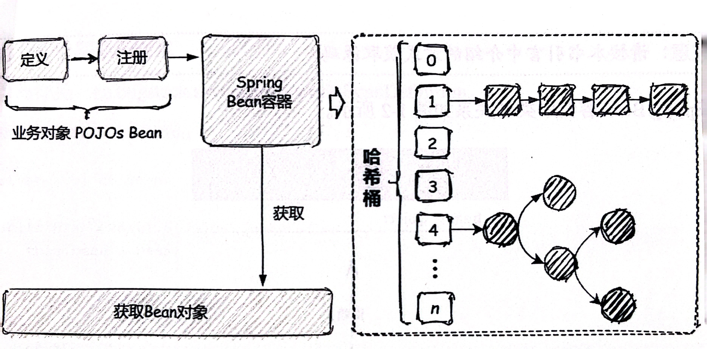

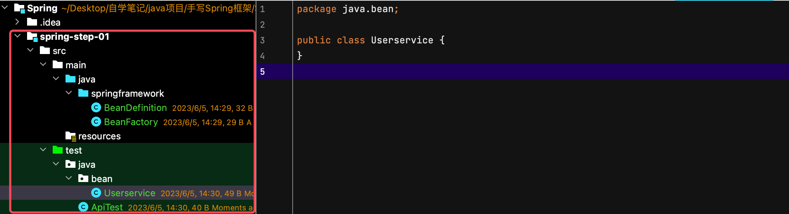 


> 工厂模式：
>
> > **简单工厂模式**：它有一个工厂类，可以根据传入的参数动态决定创建哪种产品类的实例。它的主要问题是，每次需要添加新的产品类时，都需要修改工厂类的代码。
> >
> > ```java
> > public class SimpleFactory {
> >     public static Product createProduct(String type){
> >         if ("A".equals(type)) {
> >             return new ProductA();
> >         } else if ("B".equals(type)) {
> >             return new ProductB();
> >         }
> >         return null;
> >     }
> > }
> > 
> > ```
>
> > **工厂方法模式**：它把实际创建对象的工作推迟到子类中。这样的话，工厂类就成了抽象类，包含了一些抽象方法，这些抽象方法就是工厂方法。每一个子类都会覆盖这个工厂方法，用于创建具体的产品
> >
> > ```java
> > public abstract class AbstractFactory {
> >     public abstract Product createProduct();
> > }
> > 
> > public class ConcreteFactoryA extends AbstractFactory {
> >     @Override
> >     public Product createProduct() {
> >         return new ProductA();
> >     }
> > }
> > 
> > public class ConcreteFactoryB extends AbstractFactory {
> >     @Override
> >     public Product createProduct() {
> >         return new ProductB();
> >     }
> > }
> > 
> > ```

**实现bean对象的定义**

```java
public class BeanDefinition {
    //定义为Object是因为Object是任何类的父类，可以存储任何类型的对象
    private Object bean;
    public BeanDefinition(Object bean){
        this.bean=bean;
    }
    public Object getBean(){
        return bean;
    }
}
```

**实现BeanFactory的定义**

BeanFactory类是用于生成和使用对象的Bean工厂，BeanFactory类的实现过程包括Bean对象的注册和获取，这里注册的是Bean对象的定义信息。

```java
public class BeanFactory {
    //ConcurrentHashMap是线程安全的
    private Map<String, BeanDefinition> beanDefinitionMap=new ConcurrentHashMap<>();
    
    public Object getBean(String name){
        return  beanDefinitionMap.get(name).getBean();
    }
    public void registerBeanDefinition(String name,BeanDefinition beanDefinition){
        beanDefinitionMap.put(name, beanDefinition);
    }
}
```

**测试**

> 定义userservice

```java
public class Userservice {
    public void queryUerInfo(){
        System.out.println("查询用户信息");
    }
}
```

> 定义测试类

```java
public class ApiTest {
    @Test
    public void test_BeanFactory(){
        //初始化BeanFactory
        BeanFactory beanFactory=new BeanFactory();

        //注册Bean对象
        BeanDefinition beanDefinition=new BeanDefinition(new Userservice());
        beanFactory.registerBeanDefinition("userservice",beanDefinition);

        //获取bean对象
        Userservice userservice= (Userservice) beanFactory.getBean("userservice");
        userservice.queryUerInfo();
    }
}
```


# 二、实现Bean对象的定义、注册和获取


## 1. 本节重点

我们使用AbstractBeanFactory抽象类，运用模版模式拆分功能，解耦Spring Bean容器，处理界限上下文关系，完成BeanFactory接口的实现。

## 2. 容器的思考

首先、应该通过SpringBean容器创建Bean对象，而不是在调用时传递一个完成了实例化Bean对象，然后，还需要考虑单例对象，在二次获取对象时，可以从内存中获取。此外，不仅要实现功能，还需要完善基础容器框架的类结构体，否则很难讲其他的功能添加进去。下面使用设计模式来开发Spring Bean容器的功能结构，安装类的功能拆分出不同的接口和实现类

## 3. 完善容器的设计

需要先完善Spring Bean容器。在注册Bean对象时，只注册一个类信息，而不直接将实例化信息注册到SpringBean容器中。这里首先需要将BeanDefinition类中的Object属性修改为Class类，然后在获取Bean对象时进行Bean对象的实例化，以及判断当前实例对象在容器中是否已经被缓存。

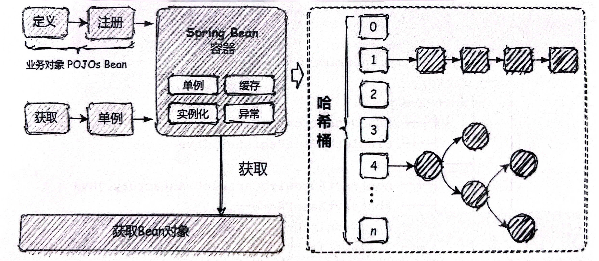

下面时项目结构

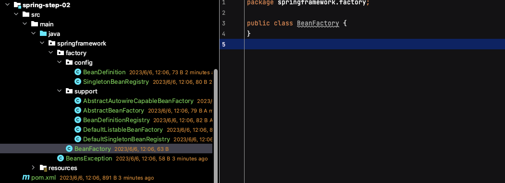

- BeanFacactory：是通过AbstractBeanFactory抽象类实现的getBean方法来定义的
- AbstractBeanFactory：该抽象类继承了SinletonBeanRegistry接口的DefaultSingletonBeanRegistry类，所以AbstractFactory抽象类就具备了单例bean对象的注册功能
- AbstractBeanFactory定义了两个抽象方法-getBeanDefinition(Stirng beanName)和createBean(String beanName,BeanDefinition)，它们分别由DefaultListableBeanFactory类和AbstractAutowireCapableBeanFactory类实现
- 最终，DefaultListableBeanFactory类还会继承抽象类AbstractAutowireCapabelBeanFactory，因此可以调用该抽象类中的creatBean方法


**BeanDefinition类的定义**

```java
public class BeanDefinition {
    private Class beanClass;

    public BeanDefinition(Class beanClass) {
        this.beanClass = beanClass;
    }

    public Class getBeanClass() {
        return beanClass;
    }

    public void setBeanClass(Class beanClass) {
        this.beanClass = beanClass;
    }
}
```

> 在对Bean对象定义类中，将原来的ObjectBean替换为Class，这样就可以将Bean对象的实例化放在容器中处理


**单例对象注册接口的定义和实现**

```java
public interface SingletonBeanRegistry {
    //根据名称获得单例bean
    Object getSingleton(String Name);
    //注册单例bean的方法
    void registerSinleton(String beanName , Object singletonObject)
    
}
```

> 主要用于定义一个注册和获取单例bean的接口

```java
public class DefaultSingletonBeanRegistry implements SingletonBeanRegistry {
    //用来存储单例bean的集合
    private Map<String,Object> singletonObjects=new HashMap<>();

    @Override
    public Object getSingleton(String Name) {
        return singletonObjects.get(Name);
    }

    @Override
    public void registerSinleton(String beanName, Object singletonObject) {
        singletonObjects.put(beanName,singletonObject);
    }
}
```

> 该类主要实现获取单例对象的方法和注册单例对象的方法，这两个方法都可以被继承此类的其他类调用


**抽象类定义模版**

```java
public abstract class AbstractBeanFactory extends DefaultSingletonBeanRegistry implements BeanFactory {


    @Override
    public Object getBean(String Name) throws BeansException {
        Object bean = getSingleton(Name);
        if (bean != null){
            return bean;
        }
        BeanDefinition beanDefinition=getBeanDefinition(Name);
        return createBean(Name,beanDefinition);
    }
    //抽象方法交给子类区实现
    protected abstract BeanDefinition getBeanDefinition(String beanName)throws BeansException;
    protected abstract Object createBean(String beanName ,BeanDefinition beanDefinition)throws BeansException;
}

```

> 上述代码运用模版式定义了一个流程标准的用户获取对象的的AbstractBeanFactory抽象类，并采用职责分类的结构设计，继承DefaultSingletonBeanRegistry类，使用其提供的单例对象注册和获取功能，通过BeanFactory接口提供一个功能单一的方法，屏蔽了内部实现的细节。这里的BeanFactory接口提供了一个获取对象的方法getBean，然后由抽象类实现细节。在getBean方法中可以看到，它主要用于获取单例Bean对象，以及在无法获取Bean对象时做出相应的Bean对象实例化。getBean自身并没有实现这些方法，只是定义了调用过程并提供了抽象方法，由此实现抽象类中其它方法的相应功能。

**实例化bean对象（AbstractAutowireCapaleBeanFactory）**

```java
public abstract class AbstractAutowireCapableBeanFactory extends AbstractBeanFactory{
    //该方法用于创建单例bean并返回创建的bean
    @Override
    protected Object createBean(String beanName, BeanDefinition beanDefinition) throws BeansException {
        Object bean=null;
        try{
            bean=beanDefinition.getBeanClass().newInstance();
        } catch (InstantiationException  |  IllegalAccessException e) {
            throw new BeansException("Instatiation of bean",e);
        }
        registerSinleton(beanName,bean);
        return bean;
    }
}
```

> 继续细分功能职责，AbstractAutowireCapaleBeanFactory抽象类继承AbstractBeanFactory类，用于实现创建对象的具体功能。因为它是一个抽象类，所以可以只实现其中的部分抽象类的接口。另外，用于实现Bean对象实例化的newInstance方法中存在着一个问题，如果对象中含有带入参信息的构造函数，该如何处理。在完成Bean对象的实例化后，可以直接调用registerSinleton方法，将单例对象存储在缓冲中。

**核心类实现（DefaultListableBeanFactory）**

```java

public class DefaultListableBeanFactory extends AbstractAutowireCapableBeanFactory implements BeanDefinitionRegistry {
    private Map<String, BeanDefinition> beanDefinitionMap =new HashMap<>();
    @Override
    public void registerBeanDefinition(String beanName, BeanDefinition beanDefinition) {
        beanDefinitionMap.put(beanName,beanDefinition);
    }

    @Override
    protected BeanDefinition getBeanDefinition(String beanName) throws BeansException {
        BeanDefinition beanDefinition=beanDefinitionMap.get(beanName);
        if(beanDefinition==null){
            throw new BeansException("No bean named '"+beanName+"' is defined");
        }
        return beanDefinition;
    }
}
```

**Bean生命周期测试**


> 定义userservice

```java
public class Userservice {
    public void queryUerInfo(){
        System.out.println("查询用户信息");
    }
}
```

> 定义测试类

```java
public class ApiTest {
    @Test
    public void test_BeanFactory() throws BeansException {
        //1. 初始化BeanFactory接口
        DefaultListableBeanFactory beanFactory=new DefaultListableBeanFactory();
        //2. 注册bean对象
        BeanDefinition beanDefinition=new BeanDefinition(Userservice.class);
        beanFactory.registerBeanDefinition("userService",beanDefinition);
        //3. 获取bean对象
        Userservice userservice= (Userservice) beanFactory.getBean("userService");
        userservice.queryUserInfo();
        //4.再次获取和调用对象
        Userservice userservice_singleton=(Userservice) beanFactory.getBean("userService");
        userservice_singleton.queryUserInfo();
        System.out.println("两个bean是否为同一个bean："+(userservice_singleton.equals(userservice)));
        System.out.println("userservice："+userservice.hashCode());
        System.out.println("userservice_singleton："+userservice_singleton.hashCode());
    }
}
```


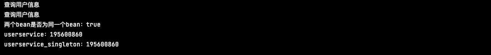

 上面结果中第一次获取bean是创建的，第二次是从缓存中获取的


> 对于SpringBean容器的实现类，重点关注类之间的职责和关系，几乎所有的程序的功能设计都离不开接口、抽象类的实现和继承。使用这些特性不同的e

# 三、基于Cglib实现含构造函数的类实例化策略

## 1. 本节重点

前面介绍了Spring Bean容器的功能，可以把实例化对象交给容器进行统一处理。但是在实例化对象的代码中，并没有考虑类中是否含有带入参信息的构造函数。

## 2. 实例化策略设计

解决上述问题主要考虑两个方面，一方面是如何将构造函数的入参信息合理地传递到实例化中，另一方面是如何将含有入参信息的构造函数的类实例化。

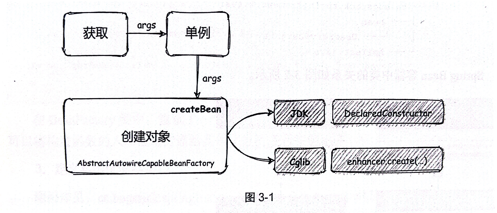

参考Spring Bean容器的源码实现方式，在BeanFactory类中添加Object getBean(String name,Object...args)接口，这样就可以在获取Bean对象时将构造函数的入参信息传递进去。那么使用什么方式可以创建包含构造函数的Bean对象呢？这里有两种方式可以选择，一种是基于Java本身自带的方法DeclaredConstructor，另一种是使用Cglib动态创建Bean对象，因为Cglib本身是基于ASM字节码框架实现的，所以可以直接通过ASM指令码来创建对象

## 3. 实例化策略代码实现

代码的目录结构如下：

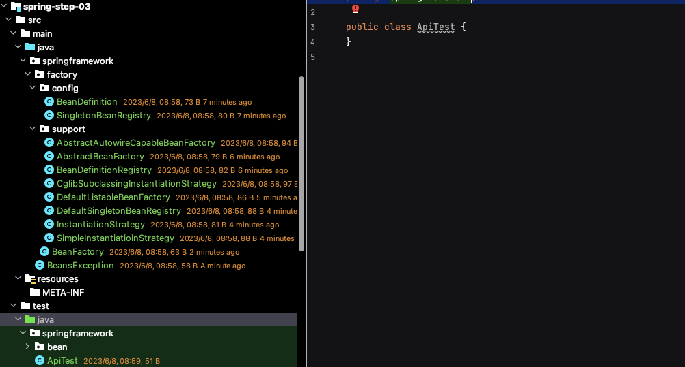

本节的核心是在现有工程中添加InstantiationStrategy实例化策略接口、开发对应的JDK和cglib实例化方式，以及补充相应的含有带入参信息的getBean构造函数。当进行外部调用时，可以传递构造函数的入参信息并进行实例化

**新增getBean接口**

```java
public interface BeanFactory {
    //不带构造函数获取bean
    Object getBean(String name) throws BeansException ;
    //带构造函数获取bena
    Object getBean(String name,Object... args)throws BeansException;
}
```

**定义实例化策略接口**

```java
public interface InstantiationStrategy {
    Object instatiate(BeanDefinition beanDefinition, String beanName , Constructor ctor, Object[] args);
}
```

**JDK实例化**

```java
public class SimpleInstantiatioinStrategy implements InstantiationStrategy{

    @Override
    public Object instatiate(BeanDefinition beanDefinition, String beanName, Constructor ctor, Object[] args) throws BeansException {
        Class clazz=beanDefinition.getBeanClass();
        try{
            //如果构造函数不为空
            if(ctor !=null){
                //直接使用反射创建代理对象
                return clazz.getDeclaredConstructor(ctor.getParameterTypes()).newInstance(args);
            }else {
                //构造函数为空则使用默认无参构造函数创建bean实例
                return clazz.getDeclaredConstructor().newInstance();
            }
        } catch (InvocationTargetException | InstantiationException | IllegalAccessException | NoSuchMethodException e) {
            throw new BeansException("Failed to instantiate  ["+ clazz.getName()+"]");
        }
    }
}
```

**Cglib实例化**

```java
public class CglibSubclassingInstantiationStrategy implements InstantiationStrategy {

    @Override
    public Object instatiate(BeanDefinition beanDefinition, String beanName, Constructor ctor, Object[] args) throws BeansException {
        //定义增强器
        Enhancer enhancer=new Enhancer();
        //定义代理类所继承的父类
        enhancer.setSuperclass(beanDefinition.getBeanClass());
        //这段代码的作用是创建一个名为"enhancer"的对象，并为其设置一个回调函数（callback），
        // 该回调函数被命名为"NoOp"。在这个回调函数中，重写了hashCode()方法，但是没有实际的实现。
        // 这个回调函数的作用是在enhancer对象执行某些操作时被调用，但是它并不会对操作产生任何影响。
        enhancer.setCallback(new NoOp() {
            @Override
            public int hashCode() {
                return super.hashCode();
            }
        });
        if(null==ctor){
            //创建目标类的增加实例
            return enhancer.create();
        }
        //有参构造
        return enhancer.create(ctor.getParameterTypes(),args);
    }
}
```

**创建策略调用**

```java
public abstract class AbstractAutowireCapableBeanFactory extends AbstractBeanFactory{
    //这里使用cglib的代理方法创建bean实例
    private InstantiationStrategy instantiationStrategy=new CglibSubclassingInstantiationStrategy();
    //用来床架bean的函数
    @Override
    protected Object createBean(String beanName, BeanDefinition beanDefinition,Object[] args) throws BeansException {
        Object bean=null;
        try{
            bean=ctreatBeanInstance(beanDefinition,beanName,args);
        }catch (Exception e){
            throw new BeansException("Instantiation of bean failed",e);
        }
        registerSinleton(beanName,bean);
        return bean;
    }

    protected Object ctreatBeanInstance(BeanDefinition beanDefinition,String beanName,Object[] args) throws BeansException {
        //创建构造函数对象
        Constructor constructorTOuser=null;
        //获得BeanDefinition的类型
        Class<?> beanClass=beanDefinition.getBeanClass();
        //获得Bean的所有构造函数
        Constructor<?>[] declaredConstructors=beanClass.getDeclaredConstructors();
        for (Constructor<?> declaredConstructor : declaredConstructors) {
            //按照提供的参数类型获得指定的构造函数
            if(args!=null && declaredConstructor.getParameterTypes().length==args.length){
                constructorTOuser=declaredConstructor;
                break;
            }
        }
        return instantiationStrategy.instatiate(beanDefinition,beanName,constructorTOuser,args);
    }
}
```

**测试**

> 准备Userservice

```java
public class Userservice {
    private String name;
    public Userservice(String name){
        this.name=name;
    }
    public void queryUserInfo(){
        System.out.println("查询用户信息："+name);
    }
    @Override
    public String toString(){
        final StringBuilder sb=new StringBuilder("");
        sb.append("").append(name);
        return sb.toString();
    }
}
```

> 准备测试类

```java
public class Userservice {
    private String name;
    public Userservice(String name){
        this.name=name;
    }
    public void queryUserInfo(){
        System.out.println("查询用户信息："+name);
    }
    @Override
    public String toString(){
        final StringBuilder sb=new StringBuilder("");
        sb.append("").append(name);
        return sb.toString();
    }
}
```

> 测试结果


****

## 4. Spring相应源码解析

- BeanFactory

> BeanFactory是一个核心接口，它是Spring框架中的一个重要组件。它的作用是创建和管理Bean对象，这些Bean对象是应用程序中的组件，可以在运行时动态地创建和销毁。BeanFactory提供了一种简单的方式来管理应用程序中的对象，它可以自动装配对象之间的依赖关系，从而使应用程序更加灵活和可扩展。

```java
public interface BeanFactory {   
  Object getBean(String name) throws BeansException;

	//返回指定类型的bean，如果不是参数中所指定的类型的bean，Spring 将尝试进行类型转换，如果无法转换，将会抛出一个异常
	<T> T getBean(String name, Class<T> requiredType) throws BeansException;

	//该方法用于从 Spring IoC 容器中获取一个特定名称的 Bean，并且可以提供构造参数或工厂方法参数以在获取 Bean 的同时进行实例化
	Object getBean(String name, Object... args) throws BeansException;

	//不提供bean的名称，获得指定的类型的bean
	<T> T getBean(Class<T> requiredType) throws BeansException;
    //带构造参数创建bean，之所以带构造参数，是因为如果我们获取bean时，可以根据参数创建（主要是用于bean懒加载的时候）
	<T> T getBean(Class<T> requiredType, Object... args) throws BeansException;
}
```

- AbstractBeanFactory

```java
public abstract class AbstractBeanFactory extends FactoryBeanRegistrySupport implements ConfigurableBeanFactory {
  
  //根据bean的名称获取bean
	@Override
	public Object getBean(String name) throws BeansException {
		return doGetBean(name, null, null, false);
	}
    //获得指定类型的bean
	@Override
	public <T> T getBean(String name, Class<T> requiredType) throws BeansException {
		return doGetBean(name, requiredType, null, false);
	}
    //获得指定名称的bean，并传入构造函数参数
	@Override
	public Object getBean(String name, Object... args) throws BeansException {
		return doGetBean(name, null, args, false);
	}
   //超着指定类型的bean，并传入指定的构造函数
	public <T> T getBean(String name, @Nullable Class<T> requiredType, @Nullable Object... args)
			throws BeansException {

		return doGetBean(name, requiredType, args, false);
	}
  //这个方法是BeanFactory接口中的一个方法，用于获取Bean实例。它接收四个参数：Bean的名称或ID、Bean的类型、构造函数参数数组和一个标志，用于指示是否只检查Bean是否存在。如果指定的Bean存在，则返回Bean对象；如果不存在，则返回null。如果要获取指定类型的Bean，则可以使用 requiredType 参数；如果要传递构造函数参数，则可以使用 args 参数
  protected <T> T doGetBean(
			String name, @Nullable Class<T> requiredType, @Nullable Object[] args, boolean typeCheckOnly)
			throws BeansException {
    //在 Spring 中，Bean 名称可以包含特殊字符，比如点号（.）和斜杠（/），这些特殊字符在 Bean 的定义中具有特殊的含义。
		// 为了避免这些特殊字符带来的问题，Spring 使用了一个默认的分隔符（默认为点号），将 Bean 名称中的特殊字符替换成默认分隔符。
		String beanName = transformedBeanName(name);
		Object bean;

		//调用DefaultSingletonBeanRegistry的getSingleton方法，如果是单例就直接获取（单例bean从缓存中获取）
		Object sharedInstance = getSingleton(beanName);
		//如果获取到了单例bean，且传入的构造函数为空
		if (sharedInstance != null && args == null) {
			//判断是否开启类Trace级别的日志记录
			if (logger.isTraceEnabled()) {
				//判断该单例对象是否正在创建
				if (isSingletonCurrentlyInCreation(beanName)) {
					//记录日志（提示该bean是一个早期引用还没被初始化）
					logger.trace("Returning eagerly cached instance of singleton bean '" + beanName +
							"' that is not fully initialized yet - a consequence of a circular reference");
				}
				else {
					//提示该bean是一个缓冲实例（已经被初始化类）
					logger.trace("Returning cached instance of singleton bean '" + beanName + "'");
				}
			}
			//getObjectForBeanInstance  方法是 AbstractAutowireCapableBeanFactory 类的一个私有方法，
			// 用于从 Bean 实例中获取对应的 Bean 对象。
			bean = getObjectForBeanInstance(sharedInstance, name, beanName, null);
		}
		//如果没有找到指定的单例bean对象或存在构造参数
		else {
			//它首先检查指定名称的Bean单例实例是否正在创建中，如果是，则抛出BeanCurrentlyInCreationException异常。
			// 这是为了避免在Bean实例创建期间发生循环依赖或重复创建的情况
			if (isPrototypeCurrentlyInCreation(beanName)) {
				throw new BeanCurrentlyInCreationException(beanName);
			}
      // getParentBeanFactory() 是BeanFactory接口中的一个方法，用于获取当前BeanFactory的父级BeanFactory。在Spring应用程序中，可能会有多个 BeanFactory ，每个BeanFactory都有自己的一组Bean定义。如果当前BeanFactory 无法找到所需的Bean定义，则可以委托给其父级BeanFactory进行查找。通过使用 getParentBeanFactory()方法，可以获取当前BeanFactory的父级BeanFactory ，从而实现Bean定义的继承和重用。
			BeanFactory parentBeanFactory = getParentBeanFactory();
			//如果父工厂不为空，且工厂中有该Bean
			if (parentBeanFactory != null && !containsBeanDefinition(beanName)) {
				//转换Bean的名称
				String nameToLookup = originalBeanName(name);
				//如果父工厂的类型是AbstractBeanFactory或是其子类
				if (parentBeanFactory instanceof AbstractBeanFactory) {
					//调用父工厂的doGetBean方法
					return ((AbstractBeanFactory) parentBeanFactory).doGetBean(
							nameToLookup, requiredType, args, typeCheckOnly);
				}
				else if (args != null) {
					return (T) parentBeanFactory.getBean(nameToLookup, args);
				}
				else if (requiredType != null) {
					// 没有参数就会调用默认的getBean的方法
					return parentBeanFactory.getBean(nameToLookup, requiredType);
				}
				else {
					//如果父类工厂不是AbstractBeanFactory或其子类，就会调用这个工厂的getBean方法
					return (T) parentBeanFactory.getBean(nameToLookup);
				}
			}
      //如果不是只检查当前bean是否存在
      if (!typeCheckOnly) {
        //markBeanAsCreated(beanName) 方法用于在当前 BeanFactory 中标记一个Bean已经创建。该方法在Bean创建时由 BeanFactory 内部调用。它以Bean的名称作为参数，并更新内部数据结构以指示该Bean已经被创建。这个方法的作用是防止Bean之间出现循环依赖。当一个Bean被创建时，它可能依赖于其他尚未创建的Bean。 BeanFactory 使用这个方法来跟踪已经创建的Bean，以便正确地解决循环依赖问题。
				markBeanAsCreated(beanName);
			}
      //创建一个 StartupStep 实例，这是Spring的新特性，用于监控应用的启动过程，可以帮助我们更好地理解和优化应用的启动过程
			StartupStep beanCreation = this.applicationStartup.start("spring.beans.instantiate")
					.tag("beanName", name);
			try {
				if (requiredType != null) {
					beanCreation.tag("beanType", requiredType::toString);
				}
				//通过 getMergedLocalBeanDefinition(beanName) 获取Bean的合并后的定义信息，即 RootBeanDefinition
				RootBeanDefinition mbd = getMergedLocalBeanDefinition(beanName);
				//检查获取的 RootBeanDefinition。如果bean定义的信息有问题，比如说定义的类不能被实例化，那么这个方法会抛出异常
				checkMergedBeanDefinition(mbd, beanName, args);
				//获取该beam所依赖的bean
				String[] dependsOn = mbd.getDependsOn();
				if (dependsOn != null) {
					for (String dep : dependsOn) {
						//存在循环依赖的问题，抛出异常
						if (isDependent(beanName, dep)) {
							throw new BeanCreationException(mbd.getResourceDescription(), beanName,
									"Circular depends-on relationship between '" + beanName + "' and '" + dep + "'");
						}
						//将这些依赖关系注册到依赖管理的数据结构中（通过 registerDependentBean(dep, beanName)）
						registerDependentBean(dep, beanName);
						try {
							//获取Bean
							getBean(dep);
						}
						catch (NoSuchBeanDefinitionException ex) {
							throw new BeanCreationException(mbd.getResourceDescription(), beanName,
									"'" + beanName + "' depends on missing bean '" + dep + "'", ex);
						}
					}
				}
                //判断是不是单例bean
				// Create bean instance.
				if (mbd.isSingleton()) {
					sharedInstance = getSingleton(beanName, () -> {
						try {
							//创建bean
							return createBean(beanName, mbd, args);
						}
						catch (BeansException ex) {
							// Explicitly remove instance from singleton cache: It might have been put there
							// eagerly by the creation process, to allow for circular reference resolution.
							// Also remove any beans that received a temporary reference to the bean.
							destroySingleton(beanName);
							throw ex;
						}
					});
					//将新创建的单例对象赋值给bean
					bean = getObjectForBeanInstance(sharedInstance, name, beanName, mbd);
				}
                 //如果是原型作用域
				else if (mbd.isPrototype()) {
					// It's a prototype -> create a new instance.
					Object prototypeInstance = null;
					try {
						//beforePrototypeCreation(beanName) 和 afterPrototypeCreation(beanName) 是在Bean创建前后的扩展点，
						// 用于执行一些自定义的逻辑。
						beforePrototypeCreation(beanName);
						//创建原型bean
						prototypeInstance = createBean(beanName, mbd, args);
					}
					finally {
						afterPrototypeCreation(beanName);
					}
					//将创建的原型bean赋值给bean
					bean = getObjectForBeanInstance(prototypeInstance, name, beanName, mbd);
				}
                //处理自定义作用域
				else {
					//获得作用域
					String scopeName = mbd.getScope();
					//判断Scope是否为空
					if (!StringUtils.hasLength(scopeName)) {
						throw new IllegalStateException("No scope name defined for bean ´" + beanName + "'");
					}
					//获得作用域的名称
					Scope scope = this.scopes.get(scopeName);
					if (scope == null) {
						throw new IllegalStateException("No Scope registered for scope name '" + scopeName + "'");
					}
					try {
						//这个get方法是scope.java中的一个方法，这里用lamda表达式实现了生成该bean的工厂
						Object scopedInstance = scope.get(beanName, () -> {
							//Bean创建前的扩展点
							beforePrototypeCreation(beanName);
							try {
								//创建Bean
								return createBean(beanName, mbd, args);
							}
							finally {
								//Bean创建后的扩展点
								afterPrototypeCreation(beanName);
							}
						});
						//将生成的Bean赋值给bean
						bean = getObjectForBeanInstance(scopedInstance, name, beanName, mbd);
					}
					catch (IllegalStateException ex) {
						throw new ScopeNotActiveException(beanName, scopeName, ex);
					}
				}
			}
			catch (BeansException ex) {
				beanCreation.tag("exception", ex.getClass().toString());
				beanCreation.tag("message", String.valueOf(ex.getMessage()));
				cleanupAfterBeanCreationFailure(beanName);
				throw ex;
			}
			finally {
				//标记创建bean完成
				beanCreation.end();
			}
		}
        //这段代码处理的是返回Bean的类型转换。当用户在获取Bean时指定了目标类型，Spring会确保返回的Bean是指定类型或者可以转换为指定类型的实例
		if (requiredType != null && !requiredType.isInstance(bean)) {
			//检查Bean是否是指定的类型以及用户是有指定了类型
			try {
				//如果不是指定的类型，则尝试进行类型转换。这是通过 getTypeConverter().convertIfNecessary(bean, requiredType) 方法完成的，
				// 其中 getTypeConverter() 返回Bean工厂使用的类型转换器，convertIfNecessary 尝试将Bean转换为目标类型。
				T convertedBean = getTypeConverter().convertIfNecessary(bean, requiredType);
				if (convertedBean == null) {
					//如果类型转换成功，返回转换后的Bean。如果转换失败或者转换后的Bean为null，抛出 BeanNotOfRequiredTypeException 异常。
					throw new BeanNotOfRequiredTypeException(name, requiredType, bean.getClass());
				}
				return convertedBean;
			}
			catch (TypeMismatchException ex) {
				if (logger.isTraceEnabled()) {
					logger.trace("Failed to convert bean '" + name + "' to required type '" +
							ClassUtils.getQualifiedName(requiredType) + "'", ex);
				}
				throw new BeanNotOfRequiredTypeException(name, requiredType, bean.getClass());
			}
		}
		//返回bean
		return (T) bean;
	}
}
```


- SingletonBeanRegistry

> SingletonBeanRegistry是Spring框架中的一个接口，主要用于管理单例Bean的注册。它提供了一种机制，可以在运行时将预先实例化的对象（单例对象）注册到Spring容器中，这些对象可以在之后被应用程序中的其他部分获取和使用。在Spring的IoC（控制反转）容器中，这个接口主要被用于管理那些不由容器本身创建的对象，例如由用户手动创建的对象，或者是由其他框架或工厂方法创建的对象。

```java
public interface SingletonBeanRegistry {
    // 这个方法用于向注册表中注册一个新的单例Bean。参数beanName是Bean的名称，而singletonObject则是要注册的单例对象。
	void registerSingleton(String beanName, Object singletonObject);
	//根据单例bean的名称获取这个单例bean
	@Nullable
	Object getSingleton(String beanName);
     //判断是不是包含指定名称的单例bean
	boolean containsSingleton(String beanName);
	 //这个方法返回注册表中所有已经注册的单例Bean的名称。返回的是一个字符串数组
	String[] getSingletonNames();
     //这个方法返回注册表中单例bean的数量
	int getSingletonCount();
     //单例模式下带来的最严重的问题就是线程安全问题，
	 //getSingletonMutex() 方法在 SingletonBeanRegistry 接口中返回一个mutex（互斥锁）对象，该对象用于单例Bean的外部同步。
	 // 当你需要自定义的同步逻辑或者在进行某些需要线程安全保障的操作时，你可以使用这个返回的mutex对象来进行同步控制。
	Object getSingletonMutex();
}

```


- DefaultSingletonBeanRegistry

> Spring 框架中一个非常重要的类，主要用于提供单例 bean 的缓存和注册服务。这个类实现了 SingletonBeanRegistry 接口，并定义了一些管理单例 bean 的核心方法


```java
public class DefaultSingletonBeanRegistry extends SimpleAliasRegistry implements SingletonBeanRegistry {
  //用来缓存单例bean的容器
  private final Map<String, Object> singletonObjects = new ConcurrentHashMap<>(256);
  
  
  	//该方法用于添加新的单例bean
	protected void addSingleton(String beanName, Object singletonObject) {
		synchronized (this.singletonObjects) {
			//向singletonObjects这个map中添加新的单例的键值对
			this.singletonObjects.put(beanName, singletonObject);
			//singletonFactories保存一个单例bean被创建但未初始化，加入到singletonObjects意味着这个单例bean被创建了，所以需要从移除这个信息
			this.singletonFactories.remove(beanName);
			//和上面同样的道理
			this.earlySingletonObjects.remove(beanName);
			//registeredSingletons存储已经被实例化的单例bean的名称，这里将新创建的单例bean的名称保存到set集合中
			this.registeredSingletons.add(beanName);
		}
  public Object getSingleton(String beanName) {
		return getSingleton(beanName, true);
	}
	//主要目的是获取指定名称的单例对象。如果需要，它还会创建这个单例对象的早期引用，这段代码的作用是获取给定bean名称的单例实例。
	// 它首先尝试从singletonObjects映射中获取完全初始化的单例实例。如果无法获取，则检查该bean是否正在创建中，如果是，则尝
	// 试从earlySingletonObjects映射中获取已实例化但未完全初始化的单例实例。如果仍然无法获取，则根据allowEarlyReference
	// 参数的值，决定是否创建早期引用（解决循环依赖问题）。如果允许创建早期引用，则尝试从singletonFactories映射中获取bean工
	// 厂，并使用该工厂创建早期引用。最后，将创建的单例实例存储在singletonObjects或earlySingletonObjects映射中，以便后续使用。
	@Nullable
	protected Object getSingleton(String beanName, boolean allowEarlyReference) {
		//尝试从singletonObjects映射（已经完全初始化的单例对象映射）中获取bean实例
		Object singletonObject = this.singletonObjects.get(beanName);
		//如果在singletonObjects中找不到对应的实例，且该bean当前正在创建中（通过isSingletonCurrentlyInCreation(beanName)检查），则进入下一步
		if (singletonObject == null && isSingletonCurrentlyInCreation(beanName)) {
			//尝试从earlySingletonObjects映射（已实例化但未完全初始化的对象映射）中获取bean实例
			singletonObject = this.earlySingletonObjects.get(beanName);
			//如果在earlySingletonObjects中也找不到，且参数allowEarlyReference为true，表示允许创建早期引用(主要是解决循环依赖问题)，则进入下一步
			if (singletonObject == null && allowEarlyReference) {
				synchronized (this.singletonObjects) {
					// 在singletonObjects上同步，确保线程安全，然后再次尝试从singletonObjects和earlySingletonObjects映射中获取bean实例
					singletonObject = this.singletonObjects.get(beanName);
					if (singletonObject == null) {
						singletonObject = this.earlySingletonObjects.get(beanName);
						if (singletonObject == null) {
							//如果以上尝试都未能获取到bean实例，那么尝试从singletonFactories映射（存储bean工厂的映射）中获取对应的bean工厂
							ObjectFactory<?> singletonFactory = this.singletonFactories.get(beanName);
							if (singletonFactory != null) {
								//如果获取到了bean工厂，就用它来创建bean实例（早期引用），然后将这个早期引用存储在earlySingletonObjects映射中，并从singletonFactories映射中移除对应的bean工厂
								singletonObject = singletonFactory.getObject();
								this.earlySingletonObjects.put(beanName, singletonObject);
								this.singletonFactories.remove(beanName);
							}
						}
					}
				}
			}
		}
		return singletonObject;
	}
}
```


- AbstractAutowireCapableBeanFactory

>  `AbstractAutowireCapableBeanFactory`  是 Spring Framework 中的一个类，它提供了  `AutowireCapableBeanFactory`  接口的实现。它是  `DefaultListableBeanFactory`  的父类，实现了大部分的 Bean 创建和依赖注入的逻辑。 `AbstractAutowireCapableBeanFactory`  中的方法可以用于创建 Bean 实例、对 Bean 进行依赖注入、应用 BeanPostProcessor 等。此外，它还提供了一些扩展点，可以让子类对 Bean 创建和依赖注入的过程进行定制化。总的来说， `AbstractAutowireCapableBeanFactory`  是 Spring 中 Bean 工厂的核心实现之一。

```java
public abstract class AbstractAutowireCapableBeanFactory extends AbstractBeanFactory
		implements AutowireCapableBeanFactory {
  @Override
	protected Object createBean(String beanName, RootBeanDefinition mbd, @Nullable Object[] args)
			throws BeanCreationException {
    //是否开启了Trace级别的日志
		if (logger.isTraceEnabled()) {
			logger.trace("Creating instance of bean '" + beanName + "'");
		}
		//创建RooteBenaDefinition对象mbdToduse
		RootBeanDefinition mbdToUse = mbd;
		//用来解析类名（这是父类AbstractBeanFactory中实现的方法）它尝试解析给定的类名并返回Class对象
		Class<?> resolvedClass = resolveBeanClass(mbd, beanName);
		if (resolvedClass != null && !mbd.hasBeanClass() && mbd.getBeanClassName() != null) {
		  //如果mbd（Bean定义）还没有类对象，并且mbd的类名不为null，则创建一个新的RootBeanDefinition对象，并设置其类
			mbdToUse = new RootBeanDefinition(mbd);
			mbdToUse.setBeanClass(resolvedClass);
		}
    //准备方法覆盖
		//这一步调用mbdToUse的prepareMethodOverrides方法，用于验证和准备覆盖的方法。如果验证失败，则抛出一个异常
		try {
		//prepareMethodOverrides是RootBeanDefinition 的一个方法，主要用于处理和验证Bean定义中的方法覆盖（method overrides）设置。
		//这个设置主要用于在 Spring IoC容器中覆盖或者替换Spring管理的 Bean 中的某个方法的行为，这样在后续创建 Bean 实例时，就可以根据这些设置来确定方法的行为。
			mbdToUse.prepareMethodOverrides();
		}
		catch (BeanDefinitionValidationException ex) {
			throw new BeanDefinitionStoreException(mbdToUse.getResourceDescription(),
					beanName, "Validation of method overrides failed", ex);
		}
		try {
			//在实例化 Bean 之前，给 BeanPostProcessors 一个机会返回一个代理实例而不是目标 Bean 实例。如果这个步骤返回的Bean不为null，那么就直接返回这个 Bean。如果在这个步骤出现异常，则抛出一个异常
			Object bean = resolveBeforeInstantiation(beanName, mbdToUse);
			if (bean != null) {
				return bean;
			}
		}
		catch (Throwable ex) {
			throw new BeanCreationException(mbdToUse.getResourceDescription(), beanName,
					"BeanPostProcessor before instantiation of bean failed", ex);
		}

		try {
			//这里开始创建真正的bean实例
			Object beanInstance = doCreateBean(beanName, mbdToUse, args);
			if (logger.isTraceEnabled()) {
				logger.trace("Finished creating instance of bean '" + beanName + "'");
			}
			return beanInstance;
		}
		catch (BeanCreationException | ImplicitlyAppearedSingletonException ex) {
			// A previously detected exception with proper bean creation context already,
			// or illegal singleton state to be communicated up to DefaultSingletonBeanRegistry.
			throw ex;
		}
		catch (Throwable ex) {
			throw new BeanCreationException(
					mbdToUse.getResourceDescription(), beanName, "Unexpected exception during bean creation", ex);
		}
	}
protected Object doCreateBean(String beanName, RootBeanDefinition mbd, @Nullable Object[] args)
			throws BeanCreationException {
		//在Spring框架中，BeanWrapper接口是用于处理Bean属性的主要接口。BeanWrapper的作用是设置和获取属性值（单个或批量），获取属性描述符，以及查询设置属性值的能力。
		//BeanWrapper扩展了PropertyAccessor，这是所有Spring的属性访问器实现的基本接口，包括BeanWrapper。 BeanWrapper也提供了分析和管理的方法，以处理嵌套的路径和类型转换。
		//当创建一个新的Bean实例并对其进行填充（例如，从XML配置文件中读取的属性值）时，Spring使用BeanWrapper。同样，当Spring需要读取或修改现有Bean实例的属性时，也会使用BeanWrapper。
		BeanWrapper instanceWrapper = null;
		//判断RootbeanDefinition对象的类型
		if (mbd.isSingleton()) {
      //factoryBeanInstanceCache这个集合中，一个bean的名称对应一个BeanWrapper，如果是单例模式我们就删除这对映射关系
			instanceWrapper = this.factoryBeanInstanceCache.remove(beanName);
		}
		//表示不是单例模式
		if (instanceWrapper == null) {
			// 使用 createBeanInstance 方法实例化 Bean。这个过程可能会调用构造函数或工厂方法，或者在特殊情况下，例如对于 FactoryBean 或者通过CGLIB创建的 Bean，可能会使用特定的实例化策略(cglib是一种动态创建类的过程)
			instanceWrapper = createBeanInstance(beanName, mbd, args);
		}
		//由BeanWrapper获得Bean对象
		Object bean = instanceWrapper.getWrappedInstance();
		//获得该bean的类型（即对应的class对象）
		Class<?> beanType = instanceWrapper.getWrappedClass();
		if (beanType != NullBean.class) {
			mbd.resolvedTargetType = beanType;
		}

		//用于在应用程序上下文中创建bean时执行后处理程序。具体来说，它确保应用所有合并的bean定义的后处理程序，并且只在第一次创建bean时执行。如果在后处理程序期间发生异常，则会抛出BeanCreationException
		synchronized (mbd.postProcessingLock) {
			//这段代码的作用是确保在创建应用程序上下文中的bean时，应用所有合并的bean定义的后处理程序，并且只在第一次创建bean时执行。如果在后处理程序期间发生异常，则会抛出BeanCreationException
			if (!mbd.postProcessed) {
				try {
					//调用applyMergedBeanDefinitionPostProcessors方法，该方法用于应用所有已注册的MergedBeanDefinitionPostProcessor对象，
					// 以修改BeanDefinition对象的属性值
					applyMergedBeanDefinitionPostProcessors(mbd, beanType, beanName);
				}
				catch (Throwable ex) {
					throw new BeanCreationException(mbd.getResourceDescription(), beanName,
							"Post-processing of merged bean definition failed", ex);
				}
				//将BeanDefinition对象的postProcessed属性设置为true，表示已经完成了所有的后处理操作。
				mbd.postProcessed = true;
			}
		}
    //检查BeanDefinition对象的isSingleton方法是否返回true，检查是否允许循环引用，以及检查当前单例对象是否正在创建中
		// 用于检查是否允许在创建Bean对象时提前曝光一个单例对象（这里设置提前曝光，且这个bean本身是运行循环依赖的，且该bena还正在创建中，注意如果该bean已经创建好的话就不是循环依赖的问题了，所以，这句语句的作用就是来解决循环依赖问题的）
		boolean earlySingletonExposure = (mbd.isSingleton() && this.allowCircularReferences &&
				isSingletonCurrentlyInCreation(beanName));
		if (earlySingletonExposure) {
			if (logger.isTraceEnabled()) {
				logger.trace("Eagerly caching bean '" + beanName +
						"' to allow for resolving potential circular references");
			}
			//将当前对象添加到一个单例工厂
			addSingletonFactory(beanName, () -> getEarlyBeanReference(beanName, mbd, bean));
		}
    //上面都几乎是在解决bean的循环依赖问题，下面才是真正的开始创建bean
		//初始化bean实例
		Object exposedObject = bean;
		try {
			//调用 populateBean 方法，该方法用于填充 Bean 的属性值。
			populateBean(beanName, mbd, instanceWrapper);
			//调用 initializeBean 方法，该方法用于初始化 Bean，并返回一个可公开的 Bean 对象
			exposedObject = initializeBean(beanName, exposedObject, mbd);
		}
		catch (Throwable ex) {
			if (ex instanceof BeanCreationException && beanName.equals(((BeanCreationException) ex).getBeanName())) {
				throw (BeanCreationException) ex;
			}
			else {
				throw new BeanCreationException(
						mbd.getResourceDescription(), beanName, "Initialization of bean failed", ex);
			}
		}
        //检查是够需要提前暴露单例bean，以避免循环引用问题
		if (earlySingletonExposure) {
			//根据bean的名称获得这个单例bean
			Object earlySingletonReference = getSingleton(beanName, false);
			if (earlySingletonReference != null) {
				if (exposedObject == bean) {//如果Bean实例是集合BeanWrapper获得的，则将其替换为提前暴露的单例 Bean 实例（类型检查）
					exposedObject = earlySingletonReference;
				}
				//这段代码的作用是在检查循环依赖时，如果某个 Bean 的依赖中存在“原始”版本的 Bean，则抛出异常。具体来说，它会检查当前 Bean 是否存在依赖关系，
				// 如果存在，则遍历依赖关系中的每个 Bean，如果该 Bean 不是仅用于类型检查，则将其添加到 actualDependentBeans 集合中。如果 actualDependentBeans
				// 不为空，则抛出 BeanCurrentlyInCreationException 异常，该异常表示当前 Bean 正在创建过程中，但其依赖的其他 Bean 已经使用了它的“原始”版本，
				// 而不是最终版本。这通常是类型匹配过于“热切”的结果，可以通过关闭 allowEagerInit 标志来解决。
				else if (!this.allowRawInjectionDespiteWrapping && hasDependentBean(beanName)) {
					String[] dependentBeans = getDependentBeans(beanName);
					Set<String> actualDependentBeans = new LinkedHashSet<>(dependentBeans.length);
					//遍历每一依赖的bean
					for (String dependentBean : dependentBeans) {
						//如果一个单例 Bean 只是为了类型检查而被创建，就从单例缓存中移除该 Bean。
						//在 Spring 容器中，当一个 Bean 的依赖被注入时，Spring 会检查这些依赖的类型是否匹配。如果依赖的类型不匹配，Spring 会抛出异常。
						// 为了避免这种情况，Spring 会在创建 Bean 实例之前，先创建一个“原型” Bean 实例，用来检查依赖的类型是否正确。如果类型匹配，再创
						// 建真正的 Bean 实例。这个“原型” Bean 实例就是为了类型检查而被创建的。
						if (!removeSingletonIfCreatedForTypeCheckOnly(dependentBean)) {
							// actualDependentBeans.add(dependentBean) 的作用是将dependentBean添加到
							// `actualDependentBeans`  集合中。在这段代码中，它的作用是将当前 Bean 的依赖中不是仅用于
							// 类型检查的 Bean 添加到  `actualDependentBeans`  集合中，以便后续判断是否存在循环依赖。
							actualDependentBeans.add(dependentBean);
						}
					}
					//"类型匹配过于热切" 是指在 Spring 容器中，当容器在创建 Bean 的时候，会尝试去匹配该 Bean 所依赖的其他 Bean 的类型。
					// 如果匹配成功，就会将这些依赖注入到该 Bean 中。但是有时候，容器会过于热切地去匹配这些依赖，导致匹配出来的 Bean 并不
					// 是最终的 Bean 实例，而是用于类型检查的“原型” Bean 实例。这样就可能会导致循环依赖等问题。因此，建议在使用类型匹配时，
					// 要谨慎使用，避免出现这种情况。
					if (!actualDependentBeans.isEmpty()) {
						throw new BeanCurrentlyInCreationException(beanName,
								"Bean with name '" + beanName + "' has been injected into other beans [" +
								StringUtils.collectionToCommaDelimitedString(actualDependentBeans) +
								"] in its raw version as part of a circular reference, but has eventually been " +
								"wrapped. This means that said other beans do not use the final version of the " +
								"bean. This is often the result of over-eager type matching - consider using " +
								"'getBeanNamesForType' with the 'allowEagerInit' flag turned off, for example.");
					}
				}
			}
		}

		// Register bean as disposable.
		try {
			registerDisposableBeanIfNecessary(beanName, bean, mbd);
		}
		catch (BeanDefinitionValidationException ex) {
			throw new BeanCreationException(
					mbd.getResourceDescription(), beanName, "Invalid destruction signature", ex);
		}

		return exposedObject;
	}
}
```

- InstantiationStrategy

>  `InstantiationStrategy`  是 Spring Framework 中的一个接口，它定义了 Bean 实例化策略的规范。Bean 实例化是创建 Bean 实例的过程， `InstantiationStrategy`  定义了如何创建 Bean 实例的方法。它提供了两个方法： `instantiate()`  和  `instantiateWithMethodInjection()` 。 `instantiate()`  方法用于创建 Bean 实例， `instantiateWithMethodInjection()`  方法用于创建 Bean 实例并注入依赖。 `InstantiationStrategy`  接口的实现类可以根据具体的需求来实现 Bean 实例化的逻辑，例如使用反射、CGLIB 或者其他技术来创建 Bean 实例。总的来说， `InstantiationStrategy`  接口提供了一种灵活的方式来创建 Bean 实例，可以根据具体的需求进行定制化。

```java
public interface InstantiationStrategy {
	/**
	 * 这个方法主要是用来实例化具体的Bean
	 * @param bd 这是一个 Spring BeanDefinition 对象，它是 Spring 对 Bean 配置信息的内部表示。这个对象包含了 Bean 的类名、
	 *           Bean 的作用域、Bean 的属性值、Bean 是否懒加载、Bean 的初始化方法、Bean 的销毁方法等信息
	 * @param beanName   要实例化的bean的名称
	 * @param owner     这是一个 BeanFactory 对象，它是所有 BeanFactory 类型的根接口。在 Spring 中，BeanFactory 是一个创建、
	 *                  配置和管理 Bean 的工厂
	 * @return   我们实例化后的bean对象
	 * @throws BeansException
	 */
	Object instantiate(RootBeanDefinition bd, @Nullable String beanName, BeanFactory owner)
			throws BeansException;

	/**
	 * 与上一个 instantiate 方法的不同之处在于它允许你指定一个特定的构造函数和相应的参数来创建这个 Bean。
	 * @param bd
	 * @param beanName
	 * @param owner
	 * @param ctor 这是要用于实例化 Bean 的 Java 构造函数。这个参数允许你控制用哪个构造函数来创建 Bean
	 * @param args  这是传递给构造函数的参数。这个参数列表应该与你在 ctor 中指定的构造函数的参数列表匹配
	 * @return
	 * @throws BeansException
	 */
	Object instantiate(RootBeanDefinition bd, @Nullable String beanName, BeanFactory owner,
			Constructor<?> ctor, Object... args) throws BeansException;

	/**
	 * 这是要调用工厂方法的 Bean 实例。如果工厂方法是静态的，那么这个参数可以为空
	 * @param bd
	 * @param beanName
	 * @param owner
	 * @param factoryBean 这是要调用工厂方法的 Bean 实例。如果工厂方法是静态的，那么这个参数可以为空
	 * @param factoryMethod 这是工厂方法，用于创建新的 Bean 实例。这个方法的返回类型应该与我们想要创建的 Bean 的类型相匹配
	 * @param args 这是传递给工厂方法的参数。这个参数列表应该与你在 factoryMethod 中指定的工厂方法的参数列表匹配
	 * @return
	 * @throws BeansException
	 */
	Object instantiate(RootBeanDefinition bd, @Nullable String beanName, BeanFactory owner,
			@Nullable Object factoryBean, Method factoryMethod, Object... args)
			throws BeansException;

}
```

- SimpleInstantiationStrategy

> `SimpleInstantiationStrategy` 是 Spring Framework 中的一个类，它是 `InstantiationStrategy` 接口的一个实现。这个接口定义了实例化 Spring Bean 的策略。`SimpleInstantiationStrategy` 提供了一种简单直接的方式来实例化 Spring Beans。当实例化一个 Bean 时，它首先会尝试使用反射 API 来直接调用 Bean 的默认（无参）构造方法。如果这个 Bean 没有默认的构造方法，或者调用默认构造方法失败，那么它会抛出一个异常。`SimpleInstantiationStrategy` 也支持使用工厂方法和带参数的构造方法来实例化 Beans。它可以调用指定的静态或者非静态的工厂方法，或者使用反射 API 来调用带参数的构造方法。

```java
public class SimpleInstantiationStrategy implements InstantiationStrategy {
  @Override
	public Object instantiate(RootBeanDefinition bd, @Nullable String beanName, BeanFactory owner,
			final Constructor<?> ctor, Object... args) {
     //判断bean的方法有没有被重写
		if (!bd.hasMethodOverrides()) {
			if (System.getSecurityManager() != null) {
				// use own privileged to change accessibility (when security is on)
				AccessController.doPrivileged((PrivilegedAction<Object>) () -> {
          //关闭java的安全检查，这样所有的构造函数就可以通过反射访问了，不管是proteted方法还是private方法
					ReflectionUtils.makeAccessible(ctor);
					return null;
				});
			}
      //直接调用BeanUtils.instantiateClass方法，通过反射机制实例化Bean
			return BeanUtils.instantiateClass(ctor, args);
		}
		else {
      //如果有方法覆写，那么会调用instantiateWithMethodInjection方法，通过方法注入的方式实例化Bean。然而，你可以看到instantiateWithMethodInjection方法内部直接抛出了UnsupportedOperationException，表示不支持方法注入。这一般是因为这是一个简单的实例化策略，如果需要支持方法注入，可能需要使用CGLIB等更复杂的实例化策略
			return instantiateWithMethodInjection(bd, beanName, owner, ctor, args);
		}
	}
	protected Object instantiateWithMethodInjection(RootBeanDefinition bd, @Nullable String beanName,
			BeanFactory owner, @Nullable Constructor<?> ctor, Object... args) {
		throw new UnsupportedOperationException("Method Injection not supported in SimpleInstantiationStrategy");
	}
}
```

> 在Spring框架中，有两种特殊的方法覆盖机制：lookup-method和replaced-method，它们都是在Bean定义时进行配置的。这两种机制都涉及到动态改变Spring Bean行为，因此处理起来要比普通的实例化复杂。
>
> 1. `lookup-method`: 这是一种方法注入的方式，允许在Spring容器的Bean中注入其他Bean的新实例。它通常用于注入原型Bean到单例Bean中，因为普通的注入方式只会在初始化时注入一次，无法获取到原型Bean的新实例。
> 2. `replaced-method`: 这是一种替换方法的方式，允许在运行时用新的方法替换Spring容器的Bean中的已有方法。这是一种AOP的应用，可以用于插入日志、事务等额外的行为。
>
> 上述两种方法都需要使用CGLIB库来生成Bean的子类，并在子类中覆盖这些方法，所以处理起来相对复杂。
>
> 而当Bean定义中没有这些方法覆盖时，Spring就可以采用简单的实例化策略，直接通过反射API调用构造函数或工厂方法来创建Bean实例，这种方式效率更高，也更简单。所以，`instantiate`方法中会先判断是否存在方法覆盖，如果不存在，就采用简单的方式来实例化Bean。

- CglibSubclassingInstantiationStrategy

> CglibSubclassingInstantiationStrategy是一个类，它是Spring Framework中的一个实例化策略。它的作用是使用CGLIB库生成子类来实例化对象，以便在运行时对目标对象进行增强和代理。它通常用于AOP和事务管理等方面。


```java
public class CglibSubclassingInstantiationStrategy extends SimpleInstantiationStrategy {
  public Object instantiate(@Nullable Constructor<?> ctor, Object... args) {
    //返回值为bean
			Class<?> subclass = createEnhancedSubclass(this.beanDefinition);
			Object instance;
      /// 这部分代码是用来创建增强子类的实例。如果没有指定构造函数（ctor为null），那么就使用默认的无参构造函数来创建实例。如果指定了构造函数，那么就通过反射API找到增强子类中相应的构造函数，并使用给定的参数来创建实例。
			if (ctor == null) {
				instance = BeanUtils.instantiateClass(subclass);
			}
			else {
				try {
					Constructor<?> enhancedSubclassConstructor = subclass.getConstructor(ctor.getParameterTypes());
					instance = enhancedSubclassConstructor.newInstance(args);
				}
				catch (Exception ex) {
					throw new BeanInstantiationException(this.beanDefinition.getBeanClass(),
							"Failed to invoke constructor for CGLIB enhanced subclass [" + subclass.getName() + "]", ex);
				}
			}
			//  这部分代码是用来设置增强子类的回调函数。这里使用了CGLIB的Factory接口，该接口定义了一个setCallbacks方法，可以用来设置回调函数。每个回调函数对应一个覆盖的方法，当调用该方法时，就会执行相应的回调函数。这里设置了两种回调函数：LookupOverrideMethodInterceptor和ReplaceOverrideMethodInterceptor，分别对应lookup-method和replaced-method。
			Factory factory = (Factory) instance;
			factory.setCallbacks(new Callback[] {NoOp.INSTANCE,
					new LookupOverrideMethodInterceptor(this.beanDefinition, this.owner),
					new ReplaceOverrideMethodInterceptor(this.beanDefinition, this.owner)});
    //返回创建的实例
			return instance;
		} 
  private Class<?> createEnhancedSubclass(RootBeanDefinition beanDefinition) {
			//使用CGLIB框架生成目标类的子类（代理类）实现增强
			Enhancer enhancer = new Enhancer();
			//设置代理类的父类为要实例化的Bean
			enhancer.setSuperclass(beanDefinition.getBeanClass());
			//这段代码的作用是设置CGLIB Enhancer对象的命名策略。它使用SpringNamingPolicy.INSTANCE命名策略，该策略在生成类名时使用Spring的命名约定。
			// 这样做可以确保生成的类名与Spring应用程序的其他部分保持一致，从而提高代码的可读性和可维护性。
			enhancer.setNamingPolicy(SpringNamingPolicy.INSTANCE);
			//这段代码的作用是检查当前对象的所有者(owner)是否是ConfigurableBeanFactory类的实例。如果是，那么会根据这个条件执行一些逻辑。
			// ConfigurableBeanFactory接口是Spring框架的一部分，提供了在Spring应用程序上下文中配置和管理bean的方法。
			if (this.owner instanceof ConfigurableBeanFactory) {
				//获得工厂的类加载器
				ClassLoader cl = ((ConfigurableBeanFactory) this.owner).getBeanClassLoader();
				//这段代码的作用是设置CGLIB Enhancer对象的生成策略。它使用ClassLoaderAwareGeneratorStrategy类作为生成策略，
				// 并将ClassLoaderAwareGeneratorStrategy的实例化对象作为参数传递给setStrategy()方法。
				// ClassLoaderAwareGeneratorStrategy是CGLIB库的一个类，它提供了一种生成类的方式，
				// 它可以使用指定的类加载器来加载生成的类。这样做可以确保生成的类可以被正确地加载和使用，从而提高应用程序的可靠性和稳定性。
				enhancer.setStrategy(new ClassLoaderAwareGeneratorStrategy(cl));
			}
			//这段代码的作用是为CGLIB Enhancer对象设置回调过滤器。它使用MethodOverrideCallbackFilter类作为回调过滤器，
			// 并将一个bean定义对象作为参数传递给MethodOverrideCallbackFilter类的构造函数。MethodOverrideCallbackFilter
			// 是一个类，它可以过滤掉需要被代理的方法，以便在运行时对目标对象进行增强和代理。这样做可以提高应用程序的性能和可扩展性。
			enhancer.setCallbackFilter(new MethodOverrideCallbackFilter(beanDefinition));
			enhancer.setCallbackTypes(CALLBACK_TYPES);
			//返回值为代理对象
			return enhancer.createClass();
		}
  
}
```

- DefaultListableBeanFactory

```java
public class DefaultListableBeanFactory extends AbstractAutowireCapableBeanFactory
		implements ConfigurableListableBeanFactory, BeanDefinitionRegistry, Serializable {
  //这是一个映射，键是bean的名称，值是对应的bean定义
	private final Map<String, BeanDefinition> beanDefinitionMap = new ConcurrentHashMap<>(256);
  @Override
	public void registerBeanDefinition(String beanName, BeanDefinition beanDefinition)
			throws BeanDefinitionStoreException {
		Assert.hasText(beanName, "Bean name must not be empty");
		Assert.notNull(beanDefinition, "BeanDefinition must not be null");
        //判断beanDefinition的类型是不是AbstractBeanDefinition
		if (beanDefinition instanceof AbstractBeanDefinition) {
			try {
				/**
				 * validate方法是AbstractBeanDefinition的一个方法，它用于验证bean定义的内容是否有效。具体来说，它会检查如下几个方面：
				 * 1. bean的类名是否已经设置，或者至少factory bean的名称和工厂方法已经设置
				 * 2. 如果bean是单例，那么它不能同时是抽象的和lazy-init的
				 * 3. bean的方法覆盖是否有效
				 * 4. 如果bean有父bean，那么父bean必须已经存在
				 * 5. 其他一些基本的合法性检查
				 */
				((AbstractBeanDefinition) beanDefinition).validate();
			}
			catch (BeanDefinitionValidationException ex) {
				throw new BeanDefinitionStoreException(beanDefinition.getResourceDescription(), beanName,
						"Validation of bean definition failed", ex);
			}
		}
        //查看当前的bean是否已经存在beanDefinition了
		BeanDefinition existingDefinition = this.beanDefinitionMap.get(beanName);
		if (existingDefinition != null) {
			//isAllowBeanDefinitionOverriding方法是DefaultListableBeanFactory类的一个方法，它返回一个布尔值，用来判断是否允许覆盖同名的Bean定义。
			//如果isAllowBeanDefinitionOverriding返回true，那么可以用新的Bean定义覆盖旧的Bean定义。
			//如果返回false，则不允许覆盖。如果尝试覆盖，将抛出BeanDefinitionOverrideException异常。
			if (!isAllowBeanDefinitionOverriding()) {
				throw new BeanDefinitionOverrideException(beanName, beanDefinition, existingDefinition);
			}
			//现在已经存在的beanDefinition的role和新的beanDefinition的定义
			else if (existingDefinition.getRole() < beanDefinition.getRole()) {
				// e.g. was ROLE_APPLICATION, now overriding with ROLE_SUPPORT or ROLE_INFRASTRUCTURE
				if (logger.isInfoEnabled()) {
					logger.info("Overriding user-defined bean definition for bean '" + beanName +
							"' with a framework-generated bean definition: replacing [" +
							existingDefinition + "] with [" + beanDefinition + "]");
				}
			}
			else if (!beanDefinition.equals(existingDefinition)) {
				if (logger.isDebugEnabled()) {
					logger.debug("Overriding bean definition for bean '" + beanName +
							"' with a different definition: replacing [" + existingDefinition +
							"] with [" + beanDefinition + "]");
				}
			}
			else {
				if (logger.isTraceEnabled()) {
					logger.trace("Overriding bean definition for bean '" + beanName +
							"' with an equivalent definition: replacing [" + existingDefinition +
							"] with [" + beanDefinition + "]");
				}
			}
			//将新的beanDefinition加入到beanDefinitionMap中，替换到原来的定义
			this.beanDefinitionMap.put(beanName, beanDefinition);
		}
		//如果当前的集合中不存在指定bean名称的BeanDefinition
		else {
			//用于检查当前 BeanFactory 是否已经开始创建bean
			if (hasBeanCreationStarted()) {
				synchronized (this.beanDefinitionMap) {
					//将新的BeanDefinition添加到map中
					this.beanDefinitionMap.put(beanName, beanDefinition);
					//BeadDefinition的数量+1
					List<String> updatedDefinitions = new ArrayList<>(this.beanDefinitionNames.size() + 1);
					//将原来的beanDefinition的名称都添加到新的集合
					updatedDefinitions.addAll(this.beanDefinitionNames);
					updatedDefinitions.add(beanName);
					this.beanDefinitionNames = updatedDefinitions;
					//在 Spring 中，通常情况下，Bean 的创建和注册是由 Spring 容器自动完成的。但在某些情况下，你可能需要手动创建和注册 Bean。比如，
					// 在编程式地使用 Spring 容器时，或者在需要动态地创建和注册 Bean 时。
					//
					//当你手动注册了一个单例 Bean 时，Spring 容器会把这个 Bean 的名称添加到一个特定的列表中，这个列表用于存储所有手动注册的单例
					// Bean 的名称。removeManualSingletonName 方法就是用于从这个列表中移除指定的 Bean 名称
					removeManualSingletonName(beanName);
					//这样做的原因主要是考虑到线程安全性和不可变性。在多线程环境下，如果有多个线程同时读写 beanDefinitionNames 列表，那么可能会出现数据不一致的情况。
					// 为了避免这种情况，我们在修改列表之前，先创建一个新的列表，然后再进行修改。修改完成之后，再将新的列表赋值给 beanDefinitionNames。这样可以保证
					// 在任何时刻，其他线程看到的 beanDefinitionNames 列表都是一个完整且一致的列表，而不会出现中间状态。
				}
			}
			else {
				// Still in startup registration phase
				this.beanDefinitionMap.put(beanName, beanDefinition);
				this.beanDefinitionNames.add(beanName);
				removeManualSingletonName(beanName);
			}
			this.frozenBeanDefinitionNames = null;
		}
        //如果新的beanDefinition是一个单例
		if (existingDefinition != null || containsSingleton(beanName)) {
			//resetBeanDefinition 方法是 Spring DefaultListableBeanFactory 类中的一个方法，
			// 主要功能是清除 Bean 定义缓存，以及所有关联的 Bean 的相关信息
			resetBeanDefinition(beanName);
		}
		else if (isConfigurationFrozen()) {
			clearByTypeCache();
		}
	}
  @Override
	public BeanDefinition getBeanDefinition(String beanName) throws NoSuchBeanDefinitionException {
		BeanDefinition bd = this.beanDefinitionMap.get(beanName);
		if (bd == null) {
			if (logger.isTraceEnabled()) {
				logger.trace("No bean named '" + beanName + "' found in " + this);
			}
			throw new NoSuchBeanDefinitionException(beanName);
		}
		return bd;
	}
}
  
```

# 四、注入属性和依赖对象

## 1. Bean对象拆解思考

前面我们介绍了容器、定义和注册Bean对象、将Bean对象实例化、按照是否包含带入参的构造函数实现不同的实例化策略。但是，在创建对象的实例化细节拆解过程中，其实我们还没有思考关于“类中是否有属性”的问题，如果类中包含属性，那么在实例化过程中就需要填充属性信息，这样才能创建一个完整的对象。创建对象过程所需填充的属性不只是int、long、Double等基本类型，还包括可能没有实例化的对象属性，这些都需要在创建Bean对象时填充。

## 2. 属性填充设计

因为属性填充是在使用newInstance或者Cglib创建Bean对象后开始执行的，所以可以在AbstractAutowireCapableBeanFactory类的createBean方法中添加属性填充操作applyPropertyValues，如下图所示：

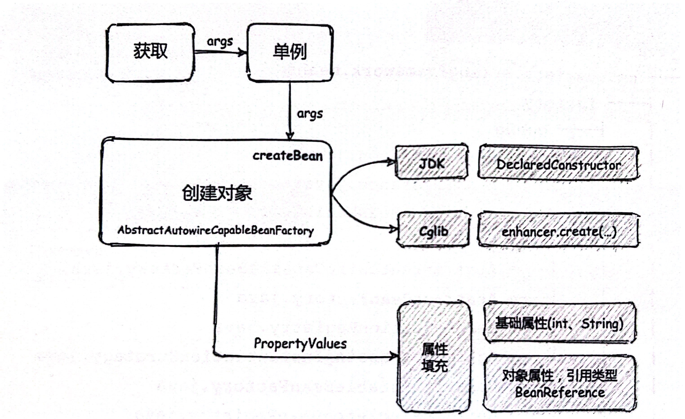

由于在创建bean对象时要执行属性填充操作，所以要在定义Bean对象的BeanDefinition类中添加对象创建时所需要的PropertyValues属性集合。填充的信息还包括Bean对象的类型，即需要再定义一个BeanReference对象（相当于借壳），里面只是一个简单的Bean对象名称，在具体实例化时进行递归创建和填充，与Spring源码中的实现一样

## 3. 属性填充实现

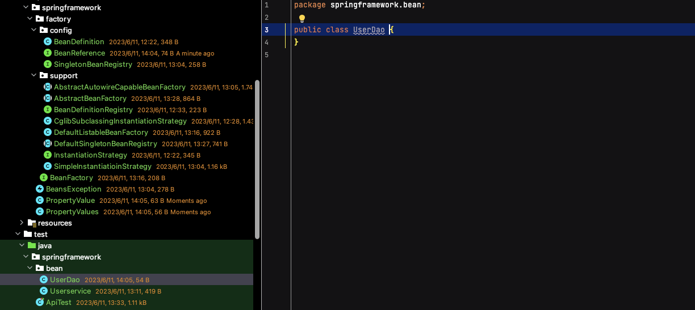

本节需要增加3个类：BeanReference（类引用）、PropertyValue（属性值）、PropertyValues（属性集合）。分别用于类和其他类型属性填充

**定义属性**

```java
public class PropertyValue {
    private final String name;
    private final Object value;
    public PropertyValue(String name,Object value){
        this.name=name;
        this.value=value;
    }

    public String getName() {
        return name;
    }

    public Object getValue() {
        return value;
    }
}
```

```java
public class PropertyValues {
    //这个是存放Bean的属性的List集合
    private final List<PropertyValue> propertyValueList=new ArrayList<>();
    
    public void addPropertyValue(PropertyValue pv){
        propertyValueList.add(pv);
    }
    //toArray()是Java中的一个方法，它可以将一个列表转换为一个数组。
    //在这里，我们使用了一个空数组作为参数，以告诉Java我们想要将列表转换为一个新的数组
    public PropertyValue[] getPropertyValues(){
        return this.propertyValueList.toArray(new PropertyValue[0]);
    }
    public PropertyValue getPropertyValue(String propertyName){
        for(PropertyValue pv:this.propertyValueList){
            if(pv.getName().equals(propertyName)){
                return pv;
            }
        }
        return null;
    }
}
```

PropertyValue和PropertyValues这两个类的作用就是传递Bean对象创建过程中所要的属性信息，因为可能会有很多个属性，所以需要定义一个PropertyValues类进行属性集合的包装

**补全Bean对象定义**

```java
public class BeanDefinition {
    private Class beanClass;
    private PropertyValues propertyValues;

    public BeanDefinition(Class beanClass) {
        this.beanClass = beanClass;
        this.propertyValues=new PropertyValues();
    }
    public BeanDefinition(Class beanClass ,PropertyValues propertyValues){
        this.beanClass=beanClass;
       this.propertyValues=propertyValues !=null ? propertyValues: new PropertyValues();
    }

    public Class getBeanClass() {
        return beanClass;
    }

    public void setBeanClass(Class beanClass) {
        this.beanClass = beanClass;
    }

    public PropertyValues getPropertyValues() {
        return propertyValues;
    }

    public void setPropertyValues(PropertyValues propertyValues) {
        this.propertyValues = propertyValues;
    }
}
```

**Bean对象的属性填充**

```java
public abstract class AbstractAutowireCapableBeanFactory extends AbstractBeanFactory{
    //这里使用cglib的代理方法创建bean实例
    private InstantiationStrategy instantiationStrategy=new CglibSubclassingInstantiationStrategy();
    private PropertyValues propertyValues;

    //用来床架bean的函数
    @Override
    protected Object createBean(String beanName, BeanDefinition beanDefinition,Object[] args) throws BeansException {
        Object bean=null;
        try{
            bean=ctreatBeanInstance(beanDefinition,beanName,args);
            //给bean对象填充属性
            applyPropertyValues(beanName,bean,beanDefinition);
        }catch (Exception e){
            throw new BeansException("Instantiation of bean failed",e);
        }
        registerSinleton(beanName,bean);
        return bean;
    }

    protected Object ctreatBeanInstance(BeanDefinition beanDefinition,String beanName,Object[] args) throws BeansException {
        Constructor constructorToUser=null;
        Class<?> beanClass=beanDefinition.getBeanClass();
        Constructor<?>[] declaredConstructors=beanClass.getDeclaredConstructors();
        for (Constructor<?> declaredConstructor : declaredConstructors) {
            if(args!=null && declaredConstructor.getParameterTypes().length==args.length)
            {
                constructorToUser=declaredConstructor;
                break;
            }
        }
        return  getInstantiationStrategy().instatiate(beanDefinition,beanName,constructorToUser,args);
    }
    //该方法用于给Bean对象填充属性
    protected  void applyPropertyValues(String beanName, Object bean , BeanDefinition beanDefinition){
        try{
            //或的bean的属性集合
            PropertyValues propertyValues = beanDefinition.getPropertyValues();
            for (PropertyValue propertyValue : propertyValues.getPropertyValues()) {
                //取出属性名和属性值
                String name=propertyValue.getName();
                Object value=propertyValue.getValue();
                if(value instanceof BeanReference){
                    //例如A依赖B，获取B的实例化对象
                    BeanReference beanReference=(BeanReference) value;
                    value=getBean(beanReference.getBeanName());
                }
                //属性填充
                BeanUtil.setFieldValue(bean,name,value);
            }
        } catch (Exception | BeansException e) {
            throw new BeanException("Error setting property values："+beanName);
        }
    }
    public InstantiationStrategy getInstantiationStrategy(){
        return instantiationStrategy;
    }
    public void setInstantiationStrategy(InstantiationStrategy instantiationStrategy){
        this.instantiationStrategy=instantiationStrategy;
    }
}
```

**测试**

> 事先准备

```java
public class UserDao {
    private static Map<String,String> hashmap=new HashMap<>();
    static {
        hashmap.put("10001","张三");
        hashmap.put("10002","李四");
        hashmap.put("10003","王五");
    }
    public String queryUserName(String uId){
        return hashmap.get(uId);
    }
}
```

```java
public class Userservice {
    private String uId;
    private UserDao userDao;
    public void queryUserInfo(){
        System.out.println("查询用户信息："+userDao.queryUserName(uId));
    }
}
```

Dao、Service是开发时经常使用的场景，如果在UserService中注册UserDao，就体现出了Bean对象的依赖关系

> 测试实例

```java
public class ApiTest {
    @Test
    public void test_BeanFactory() throws BeansException {
        //初始化BeanFactory接口
        DefaultListableBeanFactory beanFactory=new DefaultListableBeanFactory();
        //注册UserDao
        beanFactory.registerBeanDefinition("userDao",new BeanDefinition(UserDao.class));
        //使用UserService填充属性
        PropertyValues propertyValues=new PropertyValues();
        propertyValues.addPropertyValue(new PropertyValue("uId","10001"));
        propertyValues.addPropertyValue(new PropertyValue("userDao",new BeanReference("userDao")));
        //使用UserService注册Bean对象
        BeanDefinition beanDefinition=new BeanDefinition(Userservice.class,propertyValues);
        beanFactory.registerBeanDefinition("userService",beanDefinition);
        //使用UserServices获取Bean对象
        Userservice userservice=(Userservice) beanFactory.getBean("userService");
        userservice.queryUserInfo();
    }
}
```

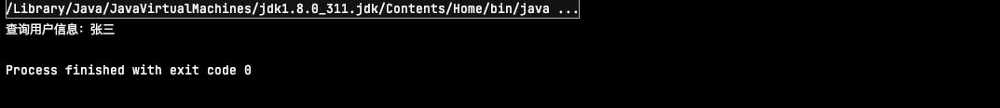

## 4. Spring相关源码解析

**BeanDefinition**

```java
public interface BeanDefinition extends AttributeAccessor, BeanMetadataElement {
  //该方法用于获取 Bean 的属性值。
	//当 Spring 容器创建一个 Bean 时，它会根据你在 BeanDefinition 中定义的属性值来配置这个 Bean。这些属性值可以是其他的 Beans，也可以是基本类型的值。
	//MutablePropertyValues 是一个持有这些属性值的类。每个 PropertyValue 对象都持有一个属性名和一个属性值。getPropertyValues() 方法返回一个
	// MutablePropertyValues 对象，该对象包含了所有的属性值。
	//这个方法主要在 Spring 内部使用，当 Spring 容器创建一个 Bean 的时候，它会调用这个方法来获取属性值。在你的应用代码中，通常不需要直接使用这个方法
	MutablePropertyValues getPropertyValues();
	//判断这个类是否有任何属性
	default boolean hasPropertyValues() {
		return !getPropertyValues().isEmpty();
	}
}
```

**PropertyValue**

> PropertyValue类是Spring框架中的一个类，它用于表示bean的属性值。它通常用于将属性值注入到bean中。PropertyValue类包含属性名和属性值两个属性，它们可以通过构造函数或setter方法进行设置。在Spring中，PropertyValue对象通常被封装在PropertyValues对象中，以便在bean实例化时进行属性注入。通过使用PropertyValue对象，可以实现灵活的属性注入，从而提高应用程序的可扩展性和可维护性

```java
public class PropertyValue extends BeanMetadataAttributeAccessor implements Serializable {
  //属性名
  private final String name;
  //属性值
	@Nullable
	private final Object value;
  //构造函数
  public PropertyValue(String name, @Nullable Object value) {
		Assert.notNull(name, "Name must not be null");
		this.name = name;
		this.value = value;
	}
}
```

**PropertyValues**

> PropertyValues是Spring框架中的一个类，它用于表示bean的属性集合。它通常用于将多个属性值注入到bean中。PropertyValues对象包含多个PropertyValue对象，每个PropertyValue对象表示一个属性的名称和值。在Spring中，PropertyValues对象通常被封装在BeanDefinition对象中，以便在bean实例化时进行属性注入。通过使用PropertyValues对象，可以实现灵活的属性注入，从而提高应用程序的可扩展性和可维护性。

```java
public interface PropertyValues extends Iterable<PropertyValue> {
  //获得Bean数组的迭代器
	@Override
	default Iterator<PropertyValue> iterator() {
		return Arrays.asList(getPropertyValues()).iterator();
	}
  //这段代码是Java代码，它实现了Iterable接口中的spliterator()方法。这个方法返回一个Spliterator对象，它可以遍历PropertyValue对象的集合。具体来说，这个方法会调用getPropertyValues()方法获取PropertyValue对象的集合，然后使用Spliterators.spliterator()方法将这个集合转换为一个Spliterator对象。最后，这个Spliterator对象被返回给调用者。在Spring中，这段代码通常用于实现属性注入的功能。它可以遍历PropertyValue对象的集合，将属性值注入到bean中。通过实现Iterable接口和spliterator()方法，可以实现对属性集合的灵活遍历和处理。
	@Override
	default Spliterator<PropertyValue> spliterator() {
		return Spliterators.spliterator(getPropertyValues(), 0);
	}
	default Stream<PropertyValue> stream() {
		return StreamSupport.stream(spliterator(), false);
	}
	PropertyValue[] getPropertyValues();
	@Nullable
	PropertyValue getPropertyValue(String propertyName);
	PropertyValues changesSince(PropertyValues old);
	boolean contains(String propertyName);
	boolean isEmpty();
}
```

> spliterator和iterator的区别?
>
> Spliterator和Iterator都是Java中用于遍历集合的接口。它们的主要区别在于Spliterator是Java 8中新引入的接口，它支持并行遍历集合，而Iterator只支持单线程遍历集合。具体来说，Iterator接口只有hasNext()和next()两个方法，它们用于检查集合中是否还有下一个元素，并返回下一个元素。而Spliterator接口除了具有hasNext()和next()方法外，还有tryAdvance()和forEachRemaining()方法，它们用于支持并行遍历集合。tryAdvance()方法用于尝试获取下一个元素，如果成功获取，则返回true；否则返回false。forEachRemaining()方法用于对剩余的元素执行指定的操作。另外，Spliterator还有一些其他的方法，如estimateSize()和characteristics()等，用于获取集合的大小和特征等信息，以便更好地支持并行遍历。总的来说，Iterator主要用于单线程遍历集合，而Spliterator则更适用于并行遍历集合。

**BeanReference**

> BeanReference是Spring框架中的一个类，它用于表示对其他bean的引用。在Spring中，bean之间可以相互依赖，一个bean可以引用另一个bean，这个被引用的bean可以是同一个容器中的另一个bean，也可以是另一个容器中的bean。BeanReference对象就是用来表示这种引用关系的。BeanReference对象包含一个bean名称属性，它指定了被引用的bean的名称。在Spring容器启动时，当需要引用这个bean时，Spring会根据这个名称从容器中获取对应的bean实例，并将它注入到当前bean中。通过使用BeanReference对象，可以实现bean之间的依赖注入，从而提高应用程序的可扩展性和可维护性。

```java
public interface BeanReference extends BeanMetadataElement {

	/**
	 * Return the target bean name that this reference points to (never {@code null}).
	 */
	String getBeanName();

}
```

**AbstractAutowireCapableBeanFactory**

```java
public abstract class AbstractAutowireCapableBeanFactory extends AbstractBeanFactory
		implements AutowireCapableBeanFactory {
  //bean实例化的策略
  private InstantiationStrategy instantiationStrategy;
  //返回创建bean的实例化策略
  protected InstantiationStrategy getInstantiationStrategy() {
		return this.instantiationStrategy;
	}
  @Override
	public void applyBeanPropertyValues(Object existingBean, String beanName) throws BeansException {
    //这段代码是Spring框架中的一个方法调用。 `markBeanAsCreated(beanName)` 方法用于标记一个bean已经在当前的bean创建过程中被创建。这个方法通常在bean创建过程中被Spring框架调用，在bean被实例化之后、属性被设置之前进行调用。通过调用 `markBeanAsCreated(beanName)` 方法，可以确保在bean的创建过程中不会出现循环依赖，从而保证应用程序的正常运行。
		markBeanAsCreated(beanName);
    //获得RootBeandefinition
		BeanDefinition bd = getMergedBeanDefinition(beanName);
    //获得BeanWrapper对象
		BeanWrapper bw = new BeanWrapperImpl(existingBean);
    //初始化BeanWrapper对象
    //BeanWrapper对象是Spring框架中的一个类，它用于包装JavaBean对象，提供了对JavaBean属性的访问和修改方法。通过BeanWrapper对象，可以方便地访问和修改JavaBean对象的属性，而不需要直接访问JavaBean对象的属性。BeanWrapper对象可以用于获取和设置JavaBean对象的属性值，以及对JavaBean对象进行类型转换等操作。在Spring中，BeanWrapper对象通常被用于实现数据绑定和属性编辑器等功能，从而提高应用程序的灵活性和可维护性。
		initBeanWrapper(bw);
    //填充Bean的属性
		applyPropertyValues(beanName, bd, bw, bd.getPropertyValues());
	}
  protected void applyPropertyValues(String beanName, BeanDefinition mbd, BeanWrapper bw, PropertyValues pvs) {
    //判断bean的属性列表是不是为空
		if (pvs.isEmpty()) {
			return;
		}
    //安全问题处理
		if (System.getSecurityManager() != null && bw instanceof BeanWrapperImpl) {
			((BeanWrapperImpl) bw).setSecurityContext(getAccessControlContext());
		}
    
		MutablePropertyValues mpvs = null;
		List<PropertyValue> original;
 //这段代码是Spring框架中的一个方法，它用于获取bean的属性值，并将其设置到BeanWrapper对象中。首先，它通过判断传入的属性值（pvs）是否为MutablePropertyValues对象来进行不同的处理。如果是MutablePropertyValues对象，则将其转换为MutablePropertyValues类型，并判断是否已经进行了类型转换。如果已经进行了类型转换，则直接将转换后的属性值设置到BeanWrapper对象中，如果设置失败，则抛出BeanCreationException异常。如果还没有进行类型转换，则获取原始的属性值列表，并将其设置到BeanWrapper对象中。如果传入的属性值不是MutablePropertyValues对象，则将其转换为PropertyValue数组，并将其设置到BeanWrapper对象中。通过这段代码，可以方便地获取bean的属性值，并将其设置到BeanWrapper对象中，从而实现对JavaBean对象属性的访问和修改。
		if (pvs instanceof MutablePropertyValues) {
			mpvs = (MutablePropertyValues) pvs;
			if (mpvs.isConverted()) {
				// Shortcut: use the pre-converted values as-is.
				try {
          //设置属性值
					bw.setPropertyValues(mpvs);
					return;
				}
				catch (BeansException ex) {
					throw new BeanCreationException(
							mbd.getResourceDescription(), beanName, "Error setting property values", ex);
				}
			}
			original = mpvs.getPropertyValueList();
		}
		else {
			original = Arrays.asList(pvs.getPropertyValues());
		}
   //这段代码是Spring框架中的一个方法，它用于获取类型转换器（TypeConverter）对象，并将其设置到BeanDefinitionValueResolver对象中。首先，它通过调用getCustomTypeConverter()方法来获取自定义的类型转换器（如果有的话），如果没有自定义的类型转换器，则使用BeanWrapper对象（bw）作为类型转换器。然后，它创建一个BeanDefinitionValueResolver对象，并将当前bean的名称（beanName）、BeanDefinition对象（mbd）、以及获取到的类型转换器（converter）作为参数传递给该对象。通过这段代码，可以方便地获取类型转换器，并将其设置到BeanDefinitionValueResolver对象中，从而实现对JavaBean对象属性的类型转换。d
		TypeConverter converter = getCustomTypeConverter();
		if (converter == null) {
			converter = bw;
		}
		BeanDefinitionValueResolver valueResolver = new BeanDefinitionValueResolver(this, beanName, mbd, converter);

		// Create a deep copy, resolving any references for values.
		List<PropertyValue> deepCopy = new ArrayList<>(original.size());
		boolean resolveNecessary = false;
		for (PropertyValue pv : original) {
			if (pv.isConverted()) {
        //如果属性转换成功直接添加到deepCopy集合中
				deepCopy.add(pv);
			}
			else {
				String propertyName = pv.getName();
				Object originalValue = pv.getValue();
        //AutowiredPropertyMarker.INSTANCE 常量的作用是标记一个属性已经被自动注入过，避免重复注入或死循环等问题的发生。
				if (originalValue == AutowiredPropertyMarker.INSTANCE) {
          //这段代码是Spring框架中的一个方法调用，它用于获取JavaBean对象中指定属性的写方法。首先，它通过BeanWrapper对象的 `getPropertyDescriptor(propertyName)` 方法获取指定属性的属性描述符(PropertyDescriptor)对象，然后通过属性描述符对象的 `getWriteMethod()` 方法获取该属性对应的写方法(Write Method)。通过这个写方法，可以方便地对JavaBean对象的属性进行赋值操作，从而实现对JavaBean对象的属性修改。
					Method writeMethod = bw.getPropertyDescriptor(propertyName).getWriteMethod();
					if (writeMethod == null) {
						throw new IllegalArgumentException("Autowire marker for property without write method: " + pv);
					}
          //这段代码的作用是创建一个DependencyDescriptor对象，用于描述一个依赖项的信息。它通过传入一个MethodParameter对象和一个boolean类型的标志位来创建DependencyDescriptor对象。其中，MethodParameter对象表示一个方法参数，它包含了方法参数的类型、名称、索引等信息。在这里，MethodParameter对象的构造方法中传入了一个写方法(writeMethod)和一个参数索引(0)，表示该依赖项对应的方法参数是写方法的第一个参数。而boolean类型的标志位则表示是否允许依赖项的值为null。通过创建DependencyDescriptor对象，可以方便地获取依赖项的信息，从而实现对依赖项的注入和管理。
					originalValue = new DependencyDescriptor(new MethodParameter(writeMethod, 0), true);
				}
				Object resolvedValue = valueResolver.resolveValueIfNecessary(pv, originalValue);
				Object convertedValue = resolvedValue;
				boolean convertible = bw.isWritableProperty(propertyName) &&
						!PropertyAccessorUtils.isNestedOrIndexedProperty(propertyName);
				if (convertible) {
          //转换属性
					convertedValue = convertForProperty(resolvedValue, propertyName, bw, converter);
				}
				// Possibly store converted value in merged bean definition,
				// in order to avoid re-conversion for every created bean instance.
				if (resolvedValue == originalValue) {
					if (convertible) {
						pv.setConvertedValue(convertedValue);
					}
					deepCopy.add(pv);
				}
				else if (convertible && originalValue instanceof TypedStringValue &&
						!((TypedStringValue) originalValue).isDynamic() &&
						!(convertedValue instanceof Collection || ObjectUtils.isArray(convertedValue))) {
					pv.setConvertedValue(convertedValue);
					deepCopy.add(pv);
				}
				else {
					resolveNecessary = true;
					deepCopy.add(new PropertyValue(pv, convertedValue));
				}
			}
		}
		if (mpvs != null && !resolveNecessary) {
			mpvs.setConverted();
		}

		// Set our (possibly massaged) deep copy.
		try {
			bw.setPropertyValues(new MutablePropertyValues(deepCopy));
		}
		catch (BeansException ex) {
			throw new BeanCreationException(
					mbd.getResourceDescription(), beanName, "Error setting property values", ex);
		}
	}
}
```

# 五、资源加载器解析文件注册对象

## 1. 本节重点

定义用于解析XML文件的XmlBeanDefinitionReader类，处理用于配置在XML文件中的Bean对象信息，完成自动配置和注册Bean对象

## 2. 对象创建问题

在完成Spring框架的雏形后，我们可以通过单元测试，手动完成Bean对象的定义、注册和属性填充，以及获取对象调用的方法。但在实际的使用过程中，是不太可能让用户通过手动创建对象的，而是通过Spring配置文件来简化创建过程，具体需要完成下面动作 。首先我们需要将步骤2、步骤3、步骤4整合到Spring框架中，通过Spring配置文件将Bean对象实例化。然后在现在的Spring框架中添加能实现Spring配置文件的读取、解析和Bean对象注册。

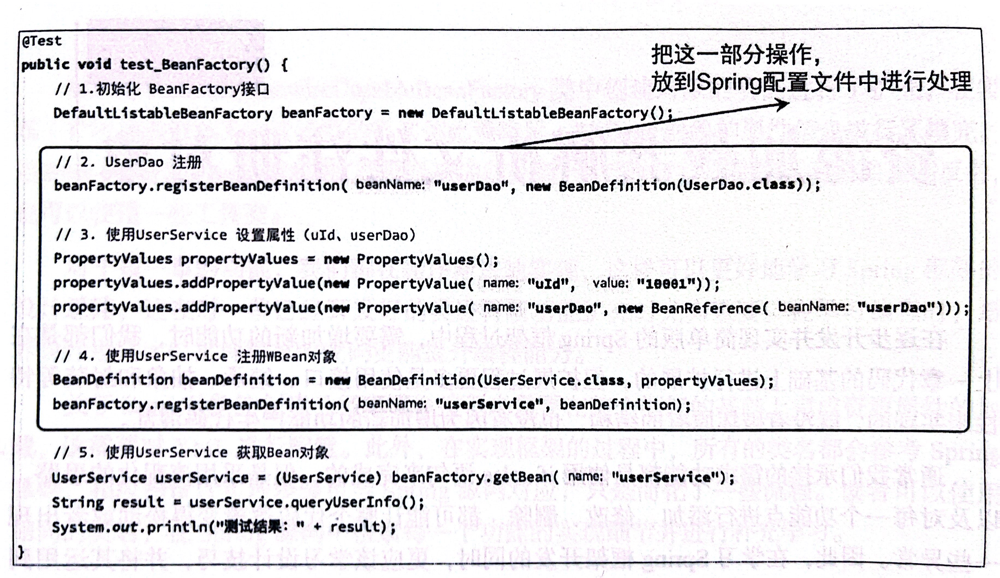

## 3. 资源加载和解析设计

我们需要在现有的Spring框架中添加一个资源加载器，用于读取ClassPath、本地文件和远程云文件（HTTP）的配置内容。这些配置内容包括Bean对象的描述信息和属性信息，当读取配置文件中的内容后，就可以先见配置文件中的Bean描述信息解析再注册，将bean对象注册到Spring Bean容器中。整体设计架构如下图所示：


- 资源加载器属于相对独立的部分，位于Spring框架核心包下，主要用于读取ClassPath、本地文件（File）和远程云文件（HTTP文件）
- 资源加载后，接下来就是将Bean对象解析并注册到Spring框架中，这部分需要和DefaultListableBeanFactory核心类结合起来实现，因为所有解析后的注册动作，都会将Bean对象的定义信息放入到DefaultListableBeanFactopry类中。
- 在实现时，需要设计好接口的层级关系，包括对Bean对象的读取接口BeanDefinitionReader的定义，以及设计好对应的实现类，在实现类中完成对Bean对象的解析和注册

## 4. 资源加载和解析设计实现

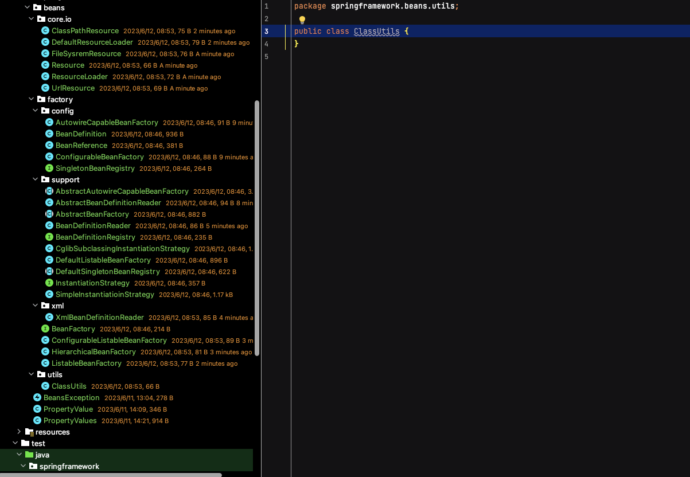

为了将Bean对象的定义、注册和初始化交给Spring.xml配置文件进行处理，需要实现两部分—资源加载器、XML资源处理类。其实现过程主要是对Resource接口、ResourceLoader接口的实现，此外BeanDefinitionReader接口是对资源的具体使用，其功能是将配置信息注册到SpringBean容器中。在Resource资源加载器的实现中，包括ClassPath、本地文件（File）、远程云文件（HTTP文件），这3部分于Spring源码中的设计和实现保持基本一致，最终都会在DefaultResourceLoader中调用。BeanDefinitionReader接口、AbstractBeanDefinitionReader抽象类、XmlBeanDefinitionReader实现类合理、清晰地处理了资源读取后Bean对象的操作。BeanFactory是已经存在的Bean工厂接口 ，用于获取Bean对象，并增加了按照类型获取Bean对象的方法`<T> T getBean(String name, Class<T> requiredType)`。ListableBeanFactory是一个接口，其功能是扩展Bean工厂接口，该接口中新增了`getBeansOfType()`方法、`getBeanDefinitionNames()`方法。在Spring源码中，HierarchicalBeanFacotry是一个扩展Bean工厂层次的子接口，提供了可以获取父类BeanFacotry的方法。AutowireCapableBeanFactory是一个自动化处理Bean工厂配置的接口，目前在实际中还没有完成相应的实现，后续还会逐步完善。ConfigurableBeanFactory是一个可以获取BeanPostProcessor、BeanClassLoader等方法的配置化接口。ConfigurableListableBeanFactory是一个提供分析和修改Bean对象与预先的接口，不过目前我们只实现了getBeanFactory方法。

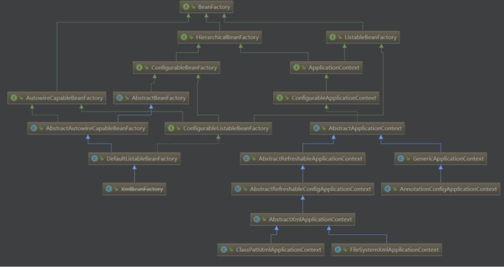 

**资源加载接口的实现和定义**

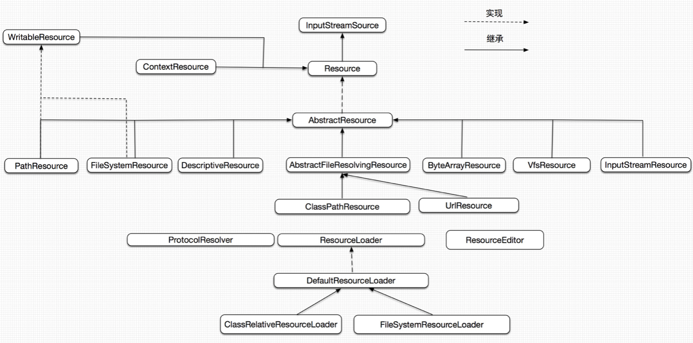

```java
public interface Resource {
    InputStream getInputStream() throws IOException;
}
```

在Spring框架下的core.io核心包，主要用于处理资源加载流，首先先定义了Resource接口，提供获取InputStream流的方法，然后分别实现3种不同的流文件—ClassPath、FileSystem和URL

```java
public class ClassPathResource implements Resource{
    //把资源的路径信息定义为常量
    private final String path;
    //定义类加载器
    private ClassLoader classLoader;

    public ClassPathResource(String path) {
        this(path,(ClassLoader)null);
    }

    public ClassPathResource(String path, ClassLoader classLoader) {
        //判断路径参数是否为空
        Assert.notNull(path,"Path must not be null");
        this.path=path;
        this.classLoader=(classLoader !=null ? classLoader: ClassUtils.getDefaultClassLoader());
    }

    @Override
    public InputStream getInputStream() throws IOException {
        //使用类加载器加载资源（转换为流）
        InputStream is=classLoader.getResourceAsStream(path);
        if(is ==null){
            throw new FileNotFoundException(
                    this.path+" connot be opened because it does not exist"
            );
        }
        return is;
    }
}
```

这部分是通过ClassLoader读取ClassPath中的文件信息实现的，具体的读取命令是classLoader.getResourceAsStream(path)

```java
public class FileSystemResource implements Resource {
    //定义一个文件对象
    private final File file;
    //定义文件路径
    private final String path;

    public FileSystemResource(File file){
        this.file=file;
        this.path=file.getPath();
    }
    public FileSystemResource(String path){
        this.file=new File(path);
        this.path=path;
    }
    public final String getPath(){
        return this.path;
    }
    @Override
    public InputStream getInputStream() throws IOException {
        return new FileInputStream(this.file);
    }
}
```

通过指定文件的路径的方式读取文件信息时会读取到一些TXT文件和Excel文件，将这些文件输出到控制台

```java
public class UrlResource implements Resource{
    private final URL url;
    
    public UrlResource(URL url){
        Assert.notNull(url,"URL must bot be null");
        this.url=url;
    }
    @Override
    public InputStream getInputStream() throws IOException {
        //与指定的URL资源建立TCP连接
        URLConnection con=this.url.openConnection();
        try{
            //打开流，获取文件内容
            return con.getInputStream();
        }catch (IOException ex){
            if(con instanceof HttpURLConnection){
                //断开连接
                ((HttpURLConnection)con).disconnect();
            }
            throw ex;
        }
    }
}
```

可以通过HTTP 读取远程文件（HTTP文件），也可以将配置文件放到github或gitee平台中获取

**包装资源加载器**

资源加载的方式有多种，资源加载器可以将这些方式放到统一的类服务下进行处理，外部用户只需要传递资源地址

```java
public interface ResourceLoader {
    //文件资源位置标识的前缀
    String CLASSPATH_URL_PREFIX="classpath:";
    //获取资源
    Resource getResource(String location);
}
```

定义获取资源的接口，在接口中传递资源地址

```java
public class DefaultResourceLoader implements ResourceLoader{
    @Override
    public Resource getResource(String location) {
        Assert.notNull(location,"Location must bot be null");
        //如果地址是以我们指定的前缀开头的
        if(location.startsWith(CLASSPATH_URL_PREFIX)){
            //使用ClassPathResource对象来解析Classpath类型的资源
            return new ClassPathResource(location.substring(CLASSPATH_URL_PREFIX.length()));
        }else{
            try {
                //如果locatino不是ClassPath，则为网络资源
                URL url=new URL(location);
                return new UrlResource(url);
            } catch (MalformedURLException e) {
                //如果两者都不是就是系统文件资源
                return new FileSystemResource(location);
            }
        }
    }
}
```

在获取资源的过程中，主要对3种不同类型的资源处理方式，分别判断为ClassPath、FileSystem或URL文件。DefaultResourceLoader类的实现很简单，不会让外部调用方知道过多的细节，仅仅关心调用结果即可

**Bean对象定义读取接口**

```java
public interface BeanDefinitionReader {
    //获得BeanDefinitionRegistry用来注册BeanDefinition
    BeanDefinitionRegistry getRegistry();
    //获取ResourceLoader用来加载资源
    ResourceLoader getResourceLoader();
    //这三个方法都是用来加载Bean定义的。其中，第一个方法通过Resource对象来加载Bean定义，
    // 第二个方法通过Resource数组来加载Bean定义，第三个方法通过字符串类型的资源位置来加载Bean定义。
    // 如果加载Bean定义时出现问题，会抛出BeansException异常。
    void loadBeanDefinitions(Resource resource)throws BeansException;
    void loadBeanDefinitions(Resource... resources)throws BeansException;
    void loadBeanDefinitions(String location)throws BeansException;
}
```

这是一个用于读取Bean对象定义的接口，其中定义了几个方法，如getRegistry方法、getResourceLoader方法以及3个加载Bean对象定义的方法。这里需要注意的是getRegistry方法，getResourceLoader方法，它们都为加载Bean对象定义的方法提供了工具，这两个方法的实现会被包装到抽象类中，以免与具体的接口实现方法产生冲突。

**Bean定义抽象类实现**

```java
public abstract class AbstractBeanDefinitionReader implements BeanDefinitionReader {
    private final BeanDefinitionRegistry beanDefinitionRegistry;
    private ResourceLoader resourceLoader;
    
    protected AbstractBeanDefinitionReader(BeanDefinitionRegistry registry){
        this(registry,new DefaultResourceLoader());
    }
    public AbstractBeanDefinitionReader(BeanDefinitionRegistry registry,ResourceLoader resourceLoader){
        this.beanDefinitionRegistry=registry;
        this.resourceLoader=resourceLoader;
    }

    @Override
    public BeanDefinitionRegistry getRegistry() {
        return beanDefinitionRegistry;
    }

    @Override
    public ResourceLoader getResourceLoader() {
        return resourceLoader;
    }
}
```

抽象类实现了BeanDefinitionReader接口的前两个方法，并提供了构造函数。此时外部调用将Bean对象的定义注入并传递到类中。这样在BeanDefinitionReader接口的具体实现类中，就可以将解析后的XML文件中的Bean对象信息注册到Spring Bean容器中。在之前的单元测试中，我们通过调用BeanDefinitionRegistry完成了Bean对象的注册，现在可以放到XML文件中了

**解析XML处理Bean注册**

```java
public class XmlBeanDefinitionReader extends AbstractBeanDefinitionReader {
    public XmlBeanDefinitionReader(BeanDefinitionRegistry registry){
        super(registry);
    }
    public XmlBeanDefinitionReader(BeanDefinitionRegistry registry, ResourceLoader resourceLoader){
        super(registry,resourceLoader);
    }

    @Override
    public void loadBeanDefinitions(Resource resource) throws BeansException {
        try {
            try (InputStream inputStream=resource.getInputStream()){
                //注册beanDefition
               doLoadBeanDefinitions(inputStream);
            }
        }catch(IOException | ClassNotFoundException | ParserConfigurationException | SAXException e){
            throw  new BeansException("IOException parsing XML document form"+resource,e);
        }
    }

    @Override
    public void loadBeanDefinitions(Resource... resources) throws BeansException {
        for(Resource resource: resources){
            loadBeanDefinitions(resource);
        }
    }

    @Override
    public void loadBeanDefinitions(String location) throws BeansException {
        ResourceLoader resourceLoader=getResourceLoader();
        Resource resource=resourceLoader.getResource(location);
        loadBeanDefinitions(resource);

    }
    public void doLoadBeanDefinitions(InputStream inputStream)
            throws ParserConfigurationException, SAXException, IOException, ClassNotFoundException, BeansException {
        DocumentBuilderFactory factory = DocumentBuilderFactory.newInstance();
        DocumentBuilder builder = factory.newDocumentBuilder();
        Document doc = builder.parse(inputStream);

        NodeList beanNodes = doc.getElementsByTagName("bean");
        for (int i = 0; i < beanNodes.getLength(); i++) {
            Node beanNode = beanNodes.item(i);
            if (beanNode.getNodeType() == Node.ELEMENT_NODE) {
                Element beanElement = (Element) beanNode;
                String id = beanElement.getAttribute("id");
                String name = beanElement.getAttribute("name");
                String className = beanElement.getAttribute("class");
                Class<?> clazz = Class.forName(className);

                String beanName = id.isEmpty() ? name : id;
                if (beanName.isEmpty()) {
                    beanName = Character.toLowerCase(clazz.getSimpleName().charAt(0)) + clazz.getSimpleName().substring(1);
                }

                BeanDefinition beanDefinition = new BeanDefinition(clazz);
                NodeList propertyNodes = beanElement.getElementsByTagName("property");
                for (int j = 0; j < propertyNodes.getLength(); j++) {
                    Node propertyNode = propertyNodes.item(j);
                    if (propertyNode.getNodeType() == Node.ELEMENT_NODE) {
                        Element propertyElement = (Element) propertyNode;
                        String attrName = propertyElement.getAttribute("name");
                        String attrValue = propertyElement.getAttribute("value");
                        String attrRef = propertyElement.getAttribute("ref");
                        Object value = attrRef.isEmpty() ? attrValue : new BeanReference(attrRef);
                        PropertyValue propertyValue = new PropertyValue(attrName, value);
                        beanDefinition.getPropertyValues().addPropertyValue(propertyValue);
                    }
                }
                if (getRegistry().containsBeanDefinition(beanName)) {
                    throw new BeansException("Duplicate beanName[" + beanName + "] is not allowed");
                }
                getRegistry().registerBeanDefinition(beanName, beanDefinition);
            }
        }
    }
}
```

XmlBeanDefinitionReader类最核心的内容就是对XML文件的解析，通过解析XML文件，自动注册的方式来实现。loadBeanDefinitions方法用于处理资源加载。这里新增来一个内部方法，doLoadBeanDefinitions，其主要功能就是解析Xml文件。doLoadBeanDefinitions方法主要是对XML文件进行读取和对Element元素进行解析。在解析的过程中，我们循环获取Bean对象的配置，以及配置中的id、name、class和ref信息。先将读取出来的配置信息创建成BeanDefinition及PropertyValues，再将完整的Bean定义内容注册到Spring Bean容器中。

**测试**

> 实现准备

```java
public class UserDao {
    private static Map<String,String> hashmap=new HashMap<>();
    static {
        hashmap.put("10001","张三");
        hashmap.put("10002","李四");
        hashmap.put("10003","王五");
    }
    public String queryUserName(String uId){
        return hashmap.get(uId);
    }
}

```

```java
public class Userservice {
    private String uId;
    private UserDao userDao;
    public void queryUserInfo(){
        System.out.println("查询用户信息："+userDao.queryUserName(uId));
    }

    public String getuId() {
        return uId;
    }

    public void setuId(String uId) {
        this.uId = uId;
    }

    public UserDao getUserDao() {
        return userDao;
    }

    public void setUserDao(UserDao userDao) {
        this.userDao = userDao;
    }
}
```

Dao和service是开发时经常会用到的类，在UserService中注入UserDao，就能体现出Bean属性的依赖

> 配置文件

```properties
#filename：important.properties
# config File
system.key=OLpj9823dZ
```

```xml
<?xml version="1.0" encoding="UTF-8" ?>
<beans>
    <bean id="userDao" class="springframework.bean.UserDao"/>
    <bean id="userservice" class="springframework.bean.Userservice">
        <property name="uId" value="10001"></property>
        <property name="userDao" ref="userDao"></property>
    </bean>
</beans>
```

> 单元测试（资源加载）

```java
public class ApiTest {
    private DefaultResourceLoader resourceLoader;
    @Before
    public void init(){
        resourceLoader=new DefaultResourceLoader();
    }
    @Test
    public void test_classpath()throws IOException{
        Resource resource=resourceLoader.getResource("classpath:important.properties");
        InputStream inputStream=resource.getInputStream();
        String content= IoUtil.readUtf8(inputStream);
        System.out.println(content);
    }
    @Test
    public void test_url()throws IOException{
        Resource resource=resourceLoader.getResource("github地址");
        InputStream inputStream=resource.getInputStream();
        String content=IoUtil.readUtf8(inputStream);
        System.out.println(content);
    }
    @Test
    public void test_file() throws IOException{
        Resource resource=resourceLoader.getResource("src/test/resources/important.properties");
        InputStream inputStream=resource.getInputStream();
        String content=IoUtil.readUtf8(inputStream);
        System.out.println(content);
    }
}
```


> 单元测试（读取配置文件并加载bean）

```java
public class ApiTest {
    @Test
    public void test_xml() throws BeansException {
        //初始化BeanFactory接口
        DefaultListableBeanFactory beanFactory=new DefaultListableBeanFactory();

        //读取配置文件注册bean对象
        XmlBeanDefinitionReader reader=new XmlBeanDefinitionReader(beanFactory);
        reader.loadBeanDefinitions("classpath:spring.xml");

        //获取bean对象的调用方法
        Userservice userservice= (Userservice) beanFactory.getBean("userservice",Userservice.class);
        userservice.queryUserInfo();
    }
}
```

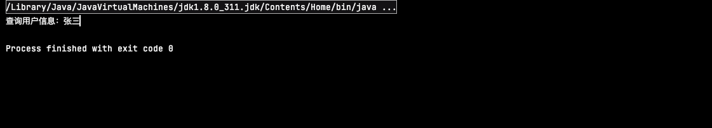

## 5. Spring相关源码解析

**Resource**

```java
public interface Resource extends InputStreamSource {
  //确定此资源是否以物理形式实际存在
	boolean exists();
  //这段代码的作用是返回一个布尔值，用于判断当前对象是否可读。如果该对象存在，则返回true，否则返回false
	default boolean isReadable() {
		return exists();
	}
  //返回一个布尔值判断文件是否可以打开
	default boolean isOpen() {
		return false;
	}
  //判断指定的资源是否是一个文件资源
	default boolean isFile() {
		return false;
	}
  //获得统一资源定位符
	URL getURL() throws IOException;
  //统一资源标识符
	URI getURI() throws IOException;
  //获得文件
	File getFile() throws IOException;
	default ReadableByteChannel readableChannel() throws IOException {
		return Channels.newChannel(getInputStream());
	}
  //获得资源文件的长度
	long contentLength() throws IOException;
  //获得资源文件的上一次修改时间
	long lastModified() throws IOException;
  //该方法的目的是创建一个新的 Resource 对象，该对象表示相对于当前资源的资源。 relativePath 参数指定了新资源相对于当前资源的路径
	Resource createRelative(String relativePath) throws IOException;
	@Nullable
  //获得文件名
	String getFilename();
  //获得文件的描述信息
	String getDescription();

}
```

**ClassPathResource**

```java
public class ClassPathResource extends AbstractFileResolvingResource {
  private final String path;
	@Nullable
	private ClassLoader classLoader;
  
  public ClassPathResource(String path) {
		this(path, (ClassLoader) null);
	}
  
  public ClassPathResource(String path, @Nullable ClassLoader classLoader) {
		Assert.notNull(path, "Path must not be null");
		String pathToUse = StringUtils.cleanPath(path);
		if (pathToUse.startsWith("/")) {
			pathToUse = pathToUse.substring(1);
		}
		this.path = pathToUse;
    //这段代码的作用是初始化一个类加载器（ClassLoader）对象。如果传入的classLoader不为空，则使用传入的类加载器对象；否则，使用 ClassUtils.getDefaultClassLoader()方法获取默认的类加载器对象。该类加载器对象可以用于加载指定类的字节码文件，以便在程序中使用该类。
		this.classLoader = (classLoader != null ? classLoader : ClassUtils.getDefaultClassLoader());
	}
  public final String getPath() {
		return this.path;
	}
  @Nullable
	public final ClassLoader getClassLoader() {
		return (this.clazz != null ? this.clazz.getClassLoader() : this.classLoader);
	}
  @Override
	public boolean exists() {
		return (resolveURL() != null);
	}
	@Nullable
	protected URL resolveURL() {
		if (this.clazz != null) {
			return this.clazz.getResource(this.path);
		}
		else if (this.classLoader != null) {
			return this.classLoader.getResource(this.path);
		}
		else {
			return ClassLoader.getSystemResource(this.path);
		}
	}
  @Override
	public InputStream getInputStream() throws IOException {
		InputStream is;
		if (this.clazz != null) {
			is = this.clazz.getResourceAsStream(this.path);
		}
		else if (this.classLoader != null) {
			is = this.classLoader.getResourceAsStream(this.path);
		}
		else {
			is = ClassLoader.getSystemResourceAsStream(this.path);
		}
		if (is == null) {
			throw new FileNotFoundException(getDescription() + " cannot be opened because it does not exist");
		}
		return is;
	}
}
```

**FileSysremResource**

```java
public class FileSystemResource extends AbstractResource implements WritableResource {
  private final String path;
	@Nullable
	private final File file;
	private final Path filePath;
  public FileSystemResource(String path) {
		Assert.notNull(path, "Path must not be null");
		this.path = StringUtils.cleanPath(path);
		this.file = new File(path);
		this.filePath = this.file.toPath();
	}
  @Override
	public InputStream getInputStream() throws IOException {
		try {
			return Files.newInputStream(this.filePath);
		}
		catch (NoSuchFileException ex) {
			throw new FileNotFoundException(ex.getMessage());
		}
	}
}
```

**UrlResource**

```java
public class UrlResource extends AbstractFileResolvingResource {
  @Nullable
	private final URI uri;
  private final URL url;
  	public UrlResource(URI uri) throws MalformedURLException {
		Assert.notNull(uri, "URI must not be null");
		this.uri = uri;
		this.url = uri.toURL();
	}
  @Override
	public InputStream getInputStream() throws IOException {
		URLConnection con = this.url.openConnection();
		ResourceUtils.useCachesIfNecessary(con);
		try {
			return con.getInputStream();
		}
		catch (IOException ex) {
			// Close the HTTP connection (if applicable).
			if (con instanceof HttpURLConnection) {
				((HttpURLConnection) con).disconnect();
			}
			throw ex;
		}
	}
}
```

**ResourceLoader**

```java
public interface ResourceLoader {
  String CLASSPATH_URL_PREFIX = ResourceUtils.CLASSPATH_URL_PREFIX;
  Resource getResource(String location);
  //获得类加载器
  @Nullable
	ClassLoader getClassLoader();
}
```

**DefaultResourceLoader**

```java
public class DefaultResourceLoader implements ResourceLoader {
  //如果没有找到 Resource 对象，则继续判断 location 参数的前缀，如果以 / 开头，则调用 getResourceByPath 方法来获取 Resource 对象。如果以 classpath: 开头，则使用 ClassPathResource 来获取 Resource 对象。如果以上两种情况都不满足，则尝试将 location 参数解析为URL，并使用 FileUrlResource 或 UrlResource 来获取 Resource 对象。 
  @Override
	public Resource getResource(String location) {
		Assert.notNull(location, "Location must not be null");
    // `ProtocolResolver` 是一个接口，用于解析指定协议的资源。它定义了一个方法 `resolve` ，该方法接受一个资源位置和一个 `ResourceLoader` 对象，并返回一个 `Resource` 对象，表示指定位置的资源。 `ProtocolResolver` 的实现类可以解析各种协议的资源，例如 `http` 、 `ftp` 、 `file` 等。在 `DefaultResourceLoader` 类中，会遍历所有注册的 `ProtocolResolver` 实现类，通过调用 `resolve` 方法来解析指定位置的资源。
		for (ProtocolResolver protocolResolver : getProtocolResolvers()) {
			Resource resource = protocolResolver.resolve(location, this);
			if (resource != null) {
				return resource;
			}
		}

		if (location.startsWith("/")) {
			return getResourceByPath(location);
		}
		else if (location.startsWith(CLASSPATH_URL_PREFIX)) {
			return new ClassPathResource(location.substring(CLASSPATH_URL_PREFIX.length()), getClassLoader());
		}
		else {
			try {
				// Try to parse the location as a URL...
				URL url = new URL(location);
				return (ResourceUtils.isFileURL(url) ? new FileUrlResource(url) : new UrlResource(url));
			}
			catch (MalformedURLException ex) {
				// No URL -> resolve as resource path.
				return getResourceByPath(location);
			}
		}
	}
  
}
```

**BeanDefinitionReader**

```java
public interface BeanDefinitionReader {
  BeanDefinitionRegistry getRegistry();
  @Nullable
	ResourceLoader getResourceLoader();
  //该方法用于生成bean的名称（为匿名bean）
  BeanNameGenerator getBeanNameGenerator();
  //从特定的资源加载bean的定义（返回值是加载到的beanDefinition的数量）
  int loadBeanDefinitions(Resource resource) throws BeanDefinitionStoreException;
  //从多个特定的资源加载bean（返回值是加载到的beanDefinition的数量）
  int loadBeanDefinitions(Resource... resources) throws BeanDefinitionStoreException;
  //从指定资源的位置加载beanDefinition（返回值是加载到的beanDefinition的数量）
  int loadBeanDefinitions(String location) throws BeanDefinitionStoreException;
  //从多个指定资源的位置加载beanDefinition（返回值是加载到的beanDefinition的数量）
  int loadBeanDefinitions(String... locations) throws BeanDefinitionStoreException;
  
}
```

**AbstractBeanDefinitionReader**

> AbstractBeanDefinitionReader是一个抽象类，它是用来读取和解析Bean定义的。它提供了一些通用的方法和属性，用于从不同的资源（比如XML文件）中读取Bean定义，并将它们解析成BeanDefinition对象。它的具体实现类可以根据需要来选择，比如XmlBeanDefinitionReader用于读取XML文件中的Bean定义，而PropertiesBeanDefinitionReader用于读取Properties文件中的Bean定义等。

```java
public abstract class AbstractBeanDefinitionReader implements BeanDefinitionReader, EnvironmentCapable {
  private final BeanDefinitionRegistry registry;
  @Nullable
	private ResourceLoader resourceLoader;
  //  beanClassLoader ：表示当前类的类加载器对象。该变量的类型为 ClassLoader ，并且可以为 null ，即如果未指定，则默认为 null 。该变量的作用是加载该类所依赖的其他类的字节码文件。
  @Nullable
	private ClassLoader beanClassLoader;
//environment ：表示当前类的运行环境。该变量的类型为 Environment ，并且可以为 null ，即如果未指定，则默认为 null 。该变量的作用是提供当前类的配置信息，例如配置文件中的属性值。 
	private Environment environment;
//beanNameGenerator ：表示当前类的Bean名称生成器。该变量的类型为 BeanNameGenerator ，并且默认为 DefaultBeanNameGenerator.INSTANCE ，即使用默认的Bean名称生成器。该变量的作用是自动生成Bean的名称，以便在应用程序中使用。
	private BeanNameGenerator beanNameGenerator = DefaultBeanNameGenerator.INSTANCE;
  
  //构造函数
  protected AbstractBeanDefinitionReader(BeanDefinitionRegistry registry) {
		Assert.notNull(registry, "BeanDefinitionRegistry must not be null");
		this.registry = registry;
		// Determine ResourceLoader to use.
    //代码判断 registry 对象是否实现了 ResourceLoader 接口。如果是，则将 registry 对象强制转换为 ResourceLoader 类型，并将其赋值给该类的成员变量 resourceLoader
		if (this.registry instanceof ResourceLoader) {
			this.resourceLoader = (ResourceLoader) this.registry;
		}
		else {
      //创建一个 PathMatchingResourcePatternResolver 对象，并将其赋值给 resourceLoader 变量。 PathMatchingResourcePatternResolver 是一个用于解析资源路径的类。 
			this.resourceLoader = new PathMatchingResourcePatternResolver();
		}
     //代码判断 registry 对象是否实现了 EnvironmentCapable 接口。如果是，则调用 getEnvironment 方法获取其环境对象，并将其赋值给该类的成员变量 environment 。如果不是，则创建一个 StandardEnvironment 对象，并将其赋值给 environment 变量。 StandardEnvironment 是一个用于表示标准环境的类
		if (this.registry instanceof EnvironmentCapable) {
			this.environment = ((EnvironmentCapable) this.registry).getEnvironment();
		}
		else {
			this.environment = new StandardEnvironment();
		}
	}
  @Override
	public final BeanDefinitionRegistry getRegistry() {
		return this.registry;
	}
  @Override
	@Nullable
	public ResourceLoader getResourceLoader() {
		return this.resourceLoader;
	}
}
```

**XmlBeanDefinitionReader**

```java
public class XmlBeanDefinitionReader extends AbstractBeanDefinitionReader {
  //这行代码定义了一个成员变量 `documentReaderClass` ，它是一个 `Class` 对象，表示用于读取Bean定义文档的类。该变量的类型为 `Class<? extends BeanDefinitionDocumentReader>` ，即它是一个泛型类，泛型参数是 `BeanDefinitionDocumentReader` 的子类。默认情况下， `documentReaderClass` 的值是 `DefaultBeanDefinitionDocumentReader.class` ,即使用默认的Bean定义文档读取器类。可以通过更改该变量的值来指定自定义的Bean定义文档读取器类。
 private Class<? extends BeanDefinitionDocumentReader> documentReaderClass =
			DefaultBeanDefinitionDocumentReader.class; 
  public XmlBeanDefinitionReader(BeanDefinitionRegistry registry) {
		super(registry);
	}
  //这段代码是一个方法 `setValidating` ，该方法接受一个布尔类型的参数 `validating` ，用于设置XML文档是否进行验证。如果 `validating` 为 `true` ，则将该类的成员变量 `validationMode` 设置为 `VALIDATION_AUTO` ，否则设置为 `VALIDATION_NONE` 。 `VALIDATION_AUTO` 和 `VALIDATION_NONE` 是该类的常量，分别表示自动验证和不验证。同时，将该类的成员变量 `namespaceAware` 设置为 `!validating` ，即如果进行验证，则启用命名空间感知，否则禁用命名空间感知。
  public void setValidating(boolean validating) {
		this.validationMode = (validating ? VALIDATION_AUTO : VALIDATION_NONE);
		this.namespaceAware = !validating;
	}
  	protected int doLoadBeanDefinitions(InputSource inputSource, Resource resource)
			throws BeanDefinitionStoreException {

		try {
			Document doc = doLoadDocument(inputSource, resource);
			int count = registerBeanDefinitions(doc, resource);
			if (logger.isDebugEnabled()) {
				logger.debug("Loaded " + count + " bean definitions from " + resource);
			}
			return count;
		}
		catch (BeanDefinitionStoreException ex) {
			throw ex;
		}
		catch (SAXParseException ex) {
			throw new XmlBeanDefinitionStoreException(resource.getDescription(),
					"Line " + ex.getLineNumber() + " in XML document from " + resource + " is invalid", ex);
		}
		catch (SAXException ex) {
			throw new XmlBeanDefinitionStoreException(resource.getDescription(),
					"XML document from " + resource + " is invalid", ex);
		}
		catch (ParserConfigurationException ex) {
			throw new BeanDefinitionStoreException(resource.getDescription(),
					"Parser configuration exception parsing XML from " + resource, ex);
		}
		catch (IOException ex) {
			throw new BeanDefinitionStoreException(resource.getDescription(),
					"IOException parsing XML document from " + resource, ex);
		}
		catch (Throwable ex) {
			throw new BeanDefinitionStoreException(resource.getDescription(),
					"Unexpected exception parsing XML document from " + resource, ex);
		}
}
```

# 六、实现应用上下文

## 1. 本节重点

随着对Spring框架的深入学习，我们开始接触核心的流程设计和处理部分，其难度与我们把控一个具有复杂需求的研发设计和实现过程是类似的。解决这类复杂场景的设计主要分为—分治、抽象和知识3个方面，运用架构和设计模式的知识，在分治层面将一个大问题分为若干个子问题，而问题越小就越容易被理解和处理。本节将在Spring框架中继续扩展新的功能。例如对一个Bean对象进行定义和实例化的过程中，是否可以满足自定义扩展需求，此时需要引入什么样子的界限上下文，对bean对象执行修改、记录和替换等动作呢？（引入应用上下文，进行资源扫描与加载，为bean对象实例化过程添加扩展机制，运行加载Bean对象和在其实例化前后进行修改和扩展。

## 2. 分治Bean对象功能

如果在工作中开发过基于Spring的技术组件，或者学习过关于SpringBoot中间件的设计和开发等内容，那么一定做过以下内容：继承或者实现了Spring对外暴露的类或接口，在接口的实现中获取BeanFactory及Bean对象等内容，如修改Bean的信息、添加日志打印、处理数据库路由对数据源进行切换、给RFC服务连接注册中心等。在对Bean对象进行实例化的过程中，不仅需要添加扩展机制，还需要优化Spring.xml配置文件的初始化和加载策略（因为不能将面向Spring本身开发的DefaultListableBeanFactory服务直接给用户使用）

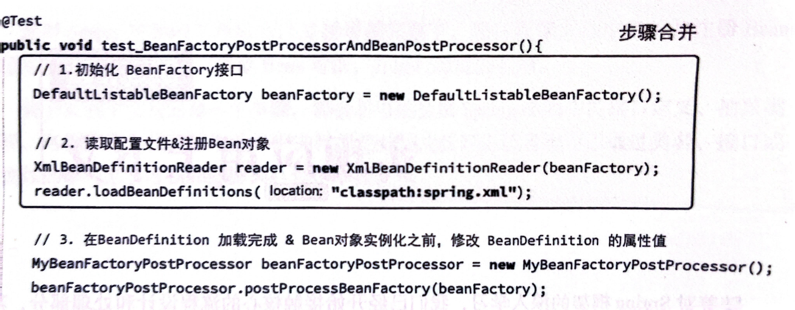

在目前的Spring框架中，DefaultListableBeanFactory、XmlBeanDefinitionReader是我们对于服务功能进行测试时使用的方法。它们能很好的体现出Spring框架是如何加载XML文件以及注册Bean对象的，但这种方法是面向Spring框架本身的，不具备一定的扩展性，就像需要在Bean初始化过程中完成对Bean的扩展，但是很难做到自动化处理，所以我们需要要将Bean对象的扩展机制功能和对Spring扩展上下文的包装进行整合，一提供完整的服务。

> Spring框架上下文是指Spring框架中的一个容器，它负责管理应用程序中的所有对象。这个容器包含了应用程序中所有的Bean对象，以及它们之间的依赖关系。这样，当应用程序需要使用某个Bean对象时，Spring框架就可以从上下文中获取它，并将它注入到需要它的地方。因此，Spring框架上下文是Spring框架中非常重要的一个概念。

## 3. Bean对象扩展和上下文设计

为了在Bean对象从注入到实例化的过程中执行用户的自定义操作，需要在Bean的定义和初始化过程中插入接口类，这个接口类再由外部实现自己需要的服务事项。再结合Spring框架上下文的应用，就可以满足我们的目标需求。整体架构设计如下图所示：

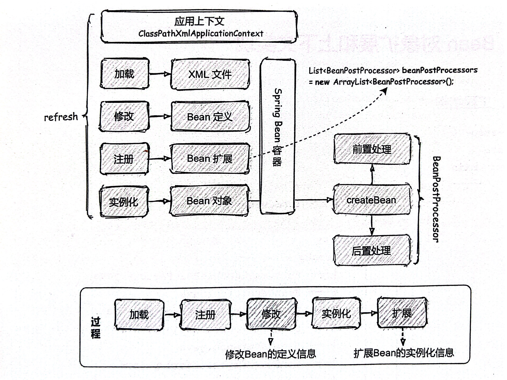

满足Bean对象扩展的BeanFactoryPostProcessor和BeanPostProcessor是Spring框架非常重量级的两个接口，也是使用Spring框架新增开发组建需求的两个必备接口。BeanFactoryPostProcessor接口是由Spring框架组件提供的容器扩展机制，允许在定Bean对象注册后、未实例化之前，修改Bean对象的定义信息BeanDefinition。BeanPostProcessor接口也是Spring提供的扩展机制，不同的是BeanPostProcessor接口是在Bean对象执行初始化方法前后，对Bean对象进行修改、记录和替换。这部分扩展功能与后面AOP的实现有着密切的关系。如果只添加BeanFactoryPostProcessor和BeanPostProcessor这两个接口，不做任何包装，那么使用是非常困难的。我们的目的是开发Spring的上下文类，将相应的XML文件的加载、注册和实例化以及新增的修改和扩展功能全部融合起来，使Spring可以自动扫描到新增的服务，便于用户使用。

## 4. Bean对象扩展和上下文实现


**定义BeanFactoryPostProcessor接口**

```java
public interface BeanFactoryPostProcessor {
    //在所有BeanDefinition加载后，且将Bean对象实例化之前，提供修改BeanDefinition属性的机制
    void postProcessBeanFactory(ConfigurableBeanFactory beanFactory)throws BeansException;
}
```

**定义BeanPostProcessor接口**

```java
public interface BeanPostProcessor {
    //在Bean对象执行初始化方法之前，执行此方法
    Object postProcessBeforeInitialization(Object bean, String beanName)throws BeansException;
    //在Bean对象执行初始化方法之后，执行此方法
    Object postProcessAfterInitialization(Object bean, String name)throws  BeansException;
}
```

**定义上下文接口**

```java
public interface ApplicationContext extends ListableBeanFactory {
}
```

context是为本次实现应用上下文功能实现而新增的服务包，ApplicationContext继承于ListableBeanFactory，即继承了关于BeanFactory方法getBean的一些方法，由于ApplicationContext本身是接口，但目前不需要添加获取ID和父类上下文的方法，所以暂时没有该接口方法的定义。

```java
public interface ConfigurableApplicationContext extends ApplicationContext{
    //刷新容器
    void refresh() throws BeansException;
}
```

ConfigurableApplicationContext继承于ApplicationContext，并提供了核心方法refresh。接下来也需要在上下文的实现过程中刷新容器。

**应用上下文抽象类实现**

```java
public abstract class AbstractApplicationContext extends DefaultResourceLoader implements ConfigurableApplicationContext {
    @Override
    public void refresh() throws BeansException {
        //1. 创建BeanFactory，并加载BeanDefinition
         refreshBeanFactory();
        //2. 获取BeanFactory
         ConfigurableListableBeanFactory beanFactory=getBeanFactory();
        //3. 在将Bean对象实例化执行之前，执行BeanFactoryPostProcessor操作
        invokeBeanFactoryPostProcessor(beanFactory);
        //4. BeanPostProcessor需要将Bean对象实例化之前注册
        registerBeanPostProcessor(beanFactory);
        //5. 提前实例化单例Bean对象
        beanFactory.preInstantiateSingletons();
    }
    protected abstract void refreshBeanFactory() throws BeansException;
    protected abstract ConfigurableListableBeanFactory getBeanFactory();

    private void invokeBeanFactoryPostProcessor(ConfigurableListableBeanFactory beanFactory) throws BeansException {
        Map<String, BeanFactoryPostProcessor> beanFactoryPostProcessorMap=beanFactory.getBeansOfType(BeanFactoryPostProcessor.class);
        for(BeanFactoryPostProcessor beanFactoryPostProcessor:beanFactoryPostProcessorMap.values()){
            beanFactoryPostProcessor.postProcessBeanFactory(beanFactory);
        }
    }

    private void registerBeanPostProcessor(ConfigurableListableBeanFactory beanFactory) throws BeansException {
        Map<String, BeanPostProcessor> beanPostProcessorMap=beanFactory.getBeansOfType(BeanPostProcessor.class);
        for(BeanPostProcessor beanPostProcessor: beanPostProcessorMap.values()){
            beanFactory.addBeanPostProcessor(beanPostProcessor);
        }
    }
    @Override
    public <T> Map<String, T> getBeansOfType(Class<T> type) throws BeansException {
        return getBeanFactory().getBeansOfType(type);
    }

    @Override
    public Object getBean(String name, Object... args) throws BeansException {
        return null;
    }

    @Override
    public Object getBean(String name) throws BeansException {
        return null;
    }

    @Override
    public <T> T getBean(String name, Class<T> requiredType) throws BeansException {
        return null;
    }

    @Override
    public String[] getBeanDefinitionNames() {
        return new String[0];
    }
}
```

AbstractApplicationContext继承DefaultResourceLoader接口是为了处理spring.xml文件中配置资源的加载，refresh方法的定义及实现过程如下：

- 创建BeanFactory，并加载BeanDefinition
- 获取BeanFactory
- 在将Bean对象实例化之前，执行BeanFactoryPostProcessor方法
- BeanPostProcessor需要在将Bean对象实例化之前注册
- 提前实例化单例对象
- 将定义的抽象方法refreshBeanFactory和getBeanFactory由继承此抽象类的其他抽象类来实现

**获取Bean工厂和加载资源**

```java
public abstract class AbstractRefreshableApplicationContext extends AbstractApplicationContext {
    private DefaultListableBeanFactory beanFactory;

    
    @Override
    protected  void refreshBeanFactory() throws BeansException{
        //创建工厂
        DefaultListableBeanFactory beanFactory=createBeanFactory();
        //加载BeanDefinition
        loadBeanDefinitions(beanFactory);
        this.beanFactory=beanFactory;
    }
    private DefaultListableBeanFactory createBeanFactory(){
        return new DefaultListableBeanFactory();
    }
    protected abstract void loadBeanDefinitions(DefaultListableBeanFactory beanFactory);
    @Override
    protected ConfigurableListableBeanFactory getBeanFactory() {
        return beanFactory;
    }
}
```

使用refreshBeanFactory抽象方法可以获取DefaultListableBeanFactory的实例化，以及对资源配置的加载loadBeanDefinitions(BeanFactory)，在加载完成后即可完成对Spring.xml文件中的Bean对象的定义和注册，也实现了BeanFactoryPostProcessor接口、BeanPostProcessor接口对Bean信息的配置。此时的资源加载只定义了一个抽象方法loadBeanDefinitions(BeanFactory)，其余步骤由其它抽象类实现。

**上下文对配置信息的加载**

```java
public abstract class AbstractXmlApplicationContext extends AbstractRefreshableApplicationContext{

    //DefaultListableBeanFactory继承了BeanDefinitionRegistry接口
    @Override
    protected void loadBeanDefinitions(DefaultListableBeanFactory beanFactory) throws BeansException {
        XmlBeanDefinitionReader beanDefinitionReader=new XmlBeanDefinitionReader(beanFactory,this);
        String[] configLocations=getConfigLocations();
        if(null!=configLocations){
            beanDefinitionReader.loadBeanDefinitions(configLocations);
        }

    }
    protected abstract String[] getConfigLocations();
}
```

在AbstractXmlApplicationContext抽象类的loadDefinitions方法中，使用XmlBeanDefinitionReader类来处理XML文件中的配置信息。同时这里又有一个抽象方法getConfigLocations，此方法是为了从入口上下文类中取得配置信息的地址。

**应用上下文实现类（ClasPathXmlApplicationContext）**

```java
public class ClassPathXmlApplicationContext extends  AbstractXmlApplicationContext{
    private String[] configLocations;
    @Override
    protected String[] getConfigLocations() {
        return configLocations;
    }
    public ClassPathXmlApplicationContext(String configLocations) throws BeansException {
        this(new String[]{configLocations});
    }
    public  ClassPathXmlApplicationContext(){
    }
    public ClassPathXmlApplicationContext(String[] configLocations)throws BeansException{
        this.configLocations=configLocations;
        refresh();
    }
}
```

ClassPathXmlApplicationContext是对外给用户提供的应用上下文类。在继承了AbstractXmlApplicationContext类及多层抽象类功能后，ClassPathXmlApplicationContext类的实现就相对简单了，主要调用了抽象类中的方法和提供了配置文件的地址信息。

**在创建Bean对象时完成前置和后置处理**

```java
public abstract class AbstractAutowireCapableBeanFactory extends AbstractBeanFactory implements AutowireCapableBeanFactory {
    //这里使用cglib的代理方法创建bean实例
    private InstantiationStrategy instantiationStrategy=new CglibSubclassingInstantiationStrategy();
    private PropertyValues propertyValues;

    //用来床架bean的函数
    @Override
    protected Object createBean(String beanName, BeanDefinition beanDefinition, Object[] args) throws BeansException {
        Object bean=null;
        try{
            bean=ctreatBeanInstance(beanDefinition,beanName,args);
            //给bean对象填充属性
            applyPropertyValues(beanName,bean,beanDefinition);
            //执行Beand对象的初始化方法和BeanPostProcessor接口的前置方法和后置处理方法
            bean=initializeBean(beanName,bean,beanDefinition);
        }catch (Exception e){
            throw new BeansException("Instantiation of bean failed",e);
        }
        registerSinleton(beanName,bean);
        return bean;
    }
    private Object initializeBean(String beanName,Object bean, BeanDefinition beanDefinition) throws BeansException {
        //1. 执行BeanPostProcessor Before前置处理
        Object wrappedBean=applyBeanPostProcessorsBeforeInitialization(bean,beanName);
        //2. 待完成的内容
        invokeInitMethods(beanName,wrappedBean,beanDefinition);
        //3. 执行BeanPostProcessor After后置处理
        wrappedBean=applyBeanPostProcessorsAfterInitialization(bean,beanName);
        return wrappedBean;
    }
    private void invokeInitMethods(String beanName,Object wrapperBean, BeanDefinition beanDefinition){

    }

    @Override
    public Object applyBeanPostProcessorsAfterInitialization(Object existingBean, String beanName) throws BeansException {
        Object result=existingBean;
        for(BeanPostProcessor processor :getBeanPostProcessors()){
            Object current=processor.postProcessBeforeInitialization(result,beanName);
            if(null==current) return result;
            result=current;
        }
        return result;
    }

    @Override
    public Object applyBeanPostProcessorsBeforeInitialization(Object existingBean, String beanName) throws BeansException {
        Object result=existingBean;
        for(BeanPostProcessor processor :getBeanPostProcessors()){
            Object current=processor.postProcessAfterInitialization(result,beanName);
            if(null==current) return result;
            result=current;
        }
        return result;
    }

    protected Object ctreatBeanInstance(BeanDefinition beanDefinition, String beanName, Object[] args) throws BeansException {
        Constructor constructorToUser=null;
        Class<?> beanClass=beanDefinition.getBeanClass();
        Constructor<?>[] declaredConstructors=beanClass.getDeclaredConstructors();
        for (Constructor<?> declaredConstructor : declaredConstructors) {
            if(args!=null && declaredConstructor.getParameterTypes().length==args.length)
            {
                constructorToUser=declaredConstructor;
                break;
            }
        }
        return  getInstantiationStrategy().instatiate(beanDefinition,beanName,constructorToUser,args);
    }
    //该方法用于给Bean对象填充属性
    protected  void applyPropertyValues(String beanName, Object bean , BeanDefinition beanDefinition){
        try{
            //或的bean的属性集合
            PropertyValues propertyValues = beanDefinition.getPropertyValues();
            for (PropertyValue propertyValue : propertyValues.getPropertyValues()) {
                //取出属性名和属性值
                String name=propertyValue.getName();
                Object value=propertyValue.getValue();
                if(value instanceof BeanReference){
                    //例如A依赖B，获取B的实例化对象
                    BeanReference beanReference=(BeanReference) value;
                    value=getBean(beanReference.getBeanName());
                }
                //属性填充
                BeanUtil.setFieldValue(bean,name,value);
            }
        } catch (Exception | BeansException e) {
            throw new BeanException("Error setting property values："+beanName);
        }
    }
    public InstantiationStrategy getInstantiationStrategy(){
        return instantiationStrategy;
    }
    public void setInstantiationStrategy(InstantiationStrategy instantiationStrategy){
        this.instantiationStrategy=instantiationStrategy;
    }
}
```

当实现BeanPostProcessor接口后，会涉及两个接口方法—postProcessBeforeInitialization，postProcessorAfterInitialization，分别用于进行Bean对象执行初始化前和初始化后的处理。也就是说在创建Bean对象时，在createBean方法中添加了initializeBean(beanName, bean,BeanDefinition)，而这个操作主要是使用applyBeanPostProcessorBeforeInitialization方法和applyPostPorcessorAfterInitialization方法实现的。此外applyBeanPostProcessorBeforeInitialization方法和applyPostPorcessorAfterInitialization方法是在AutowireCapableBeanFactory接口类中新增的两个方法。

**测试**

- 事先准备

```java
public class UserDao {
    private static Map<String,String> hashmap=new HashMap<>();
    static {
        hashmap.put("10001","张三");
        hashmap.put("10002","李四");
        hashmap.put("10003","王五");
    }
    public String queryUserName(String uId){
        return hashmap.get(uId);
    }
}
```

```java
public class userService {
    private String uId;
    private String company;
    private String location;
    private UserDao userDao;
    public void queryUserInfo(){
        System.out.println("用户姓名："+userDao.queryUserName(uId));
        System.out.println("用户公司："+company);
        System.out.println("用户ID："+uId);
        System.out.println("用户地址："+location);
    }

    public String getuId() {
        return uId;
    }

    public void setuId(String uId) {
        this.uId = uId;
    }

    public UserDao getUserDao() {
        return userDao;
    }

    public void setUserDao(UserDao userDao) {
        this.userDao = userDao;
    }

    public String getCompany() {
        return company;
    }

    public void setCompany(String company) {
        this.company = company;
    }

    public String getLocation() {
        return location;
    }

    public void setLocation(String location) {
        this.location = location;
    }
}
```

这里新增类company和location两个属性信息，用于测试BeanPostProcessor和BeanFactoryPostPorcessor两个接口对Bean属性信息的扩展功能

- 实现BeanPostProcessor类和BeanFactoryPostProcessor类

```java
public class MyBeanPostProcessor implements BeanPostProcessor {

    @Override
    public Object postProcessBeforeInitialization(Object bean, String beanName) throws BeansException {
        if("userService".equals(beanName)){
            userService userService2=(userService) bean;
            userService2.setLocation("改为北京");
        }
        return bean;
    }

    @Override
    public Object postProcessAfterInitialization(Object bean, String name) throws BeansException {
        
        return bean;
    }
}

```

```java
public class MyBeanFactoryPostProcessor implements BeanFactoryPostProcessor {

    @Override
    public void postProcessBeanFactory(ConfigurableListableBeanFactory beanFactory) throws BeansException {
        BeanDefinition beanDefinition=beanFactory.getBeanDefinition("userService");
        PropertyValues propertyValues=beanDefinition.getPropertyValues();
        propertyValues.addPropertyValue(new PropertyValue("company","改为：字节跳动"));
    }
}
```

如果在Spring中进行过一些组件的开发，那么一定非常属性BeanPostProcessor和BeanFactoryPostProcessor这两个类。该测试主要是实现这两个类，并对实例化过程中Bean对象完成某些操作。

- 配置文件

```xml
<?xml version="1.0" encoding="UTF-8" ?>
<beans>
    <bean id="userDao" class="springframework.bean.UserDao"></bean>
    <bean id="userService" class="springframework.bean.userService">
        <property name="uId" value="10001"></property>
        <property name="userDao" ref="userDao"></property>
        <property name="location"  value="深圳"></property>
        <property name="company" value="腾讯"></property>
    </bean>
    <bean class="springframework.common.MyBeanFactoryPostProcessor"></bean>
    <bean class="springframework.common.MyBeanPostProcessor"></bean>
</beans>
```

```xml
<?xml version="1.0" encoding="UTF-8" ?>
<beans>
    <bean id="userDao" class="springframework.bean.UserDao"></bean>
    <bean id="userService" class="springframework.bean.userService">
        <property name="uId" value="10001"></property>
        <property name="userDao" ref="userDao"></property>
        <property name="location"  value="深圳"></property>
        <property name="company" value="腾讯"></property>
    </bean>
</beans>
```

这里提供两个配置文件，一个是不包含BeanFactoryPostProcessor和BeanPostProcessor实现类的基础配置文件，另一个是包含两者的增强配置文件。之所以这样配置，主要是对比验证运用或不运用Spring新增的应用上下文，它们都是怎么实现的

- 不使用应用上下文

```java
public class ApiTest {
    @Test
    public void test_xml() throws BeansException {
        //初始化BeanFactory接口
        DefaultListableBeanFactory beanFactory=new DefaultListableBeanFactory();
        //读取配置文件注册bean对象
        XmlBeanDefinitionReader reader=new XmlBeanDefinitionReader(beanFactory);
        reader.loadBeanDefinitions("classpath:spring2.xml");
        //BeanDefinition加载完成，在将Bean对象实例化之前，修改BeanDefintion的属性值
        MyBeanFactoryPostProcessor beanPostProcessor=new MyBeanFactoryPostProcessor();
        beanPostProcessor.postProcessBeanFactory(beanFactory);
        //获取bean对象的调用方法
        userService userService= (userService) beanFactory.getBean("userService",userService.class);
        userService.queryUserInfo();
    }
}
```


> 可以发现确实使用beanPostProcessor方法对用户的BeanDefinition进行了修改

- 使用应用上下文

```java
  @Test
    public void test_xml2() throws BeansException {
        //初始化BeanFactory接口
        ClassPathXmlApplicationContext applicationContext=new ClassPathXmlApplicationContext("classpath:spring2.xml");
        //获取bean对象的调用方法
        userService userService1= applicationContext.getBean("userService",userService.class);
        userService1.queryUserInfo();
    }
```


从测试结果可以看出来，此次的测试结果与不使用应用上下文的测试结果是一致的，但是，使用该方法更简单。

## 5. Spring相关源码解析

**BeanFactoryPostProcessor**

> `BeanFactoryPostProcessor`是Spring框架中的一个接口，用于在Spring容器**实例化**Bean之前对Bean定义进行修改或处理。其作用是允许开发人员在Spring容器实例化Bean之前，通过自定义的后处理器对Bean的定义进行修改。它可以用于对Bean定义的属性进行修改、添加新的Bean定义或者对现有的Bean定义进行删除

```java
//该注解表示函数式接口，即允许使用lambda表达式
@FunctionalInterface
public interface BeanFactoryPostProcessor {
	void postProcessBeanFactory(ConfigurableListableBeanFactory beanFactory) throws BeansException;
}
```

**BeanPostProcessor**

> `BeanPostProcessor`是Spring框架中的一个接口，用于在Spring容器实例化Bean之后和依赖注入之前对Bean进行自定义的处理或修改,其作用是允许开发人员在Spring容器实例化Bean之后，在Bean的初始化过程中对Bean进行自定义的操作。通过实现`BeanPostProcessor`接口并实现其中的`postProcessBeforeInitialization`和`postProcessAfterInitialization`方法，可以在Bean的初始化过程中插入自定义的逻辑

```java
public interface BeanPostProcessor {
	@Nullable
	default Object postProcessBeforeInitialization(Object bean, String beanName) throws BeansException {
		return bean;
	}
	@Nullable
	default Object postProcessAfterInitialization(Object bean, String beanName) throws BeansException {
		return bean;
	}
}
```

**ConfigurableApplicationContext**

> `ConfigurableApplicationContext`接口是Spring框架中的一个核心接口，它继承自`ApplicationContext`接口，并且提供了一些额外的配置和管理应用上下文的方法。该接口的主要作用是允许应用程序在运行时对应用上下文进行配置和自定义。以下是`ConfigurableApplicationContext`接口的主要功能和作用：
>
> 1. 应用上下文的配置：`ConfigurableApplicationContext`接口允许开发人员在创建应用上下文之前进行一些配置操作。例如，可以通过设置配置文件的位置、设置激活的配置文件或配置文件的属性来自定义应用上下文的行为。
> 2. 生命周期管理：该接口提供了一些方法来管理应用上下文的生命周期。开发人员可以使用这些方法手动启动、停止或刷新应用上下文。例如，可以调用`refresh()`方法来刷新应用上下文，或调用`start()`方法来启动应用上下文中的所有组件。
> 3. Bean工厂访问：`ConfigurableApplicationContext`接口扩展了`ListableBeanFactory`接口，因此它提供了访问应用上下文中的Bean工厂的能力。可以使用该接口提供的方法来获取应用上下文中定义的Bean、获取Bean的数量、按类型查找Bean等。
> 4. 环境配置：应用上下文的环境配置是通过`ConfigurableApplicationContext`接口来实现的。可以使用该接口提供的方法来获取和设置应用上下文的环境属性。例如，可以获取当前环境的活动配置文件、设置默认的配置文件等。
>
> 总之，`ConfigurableApplicationContext`接口提供了一些配置和管理应用上下文的方法，使开发人员能够更灵活地配置和自定义Spring应用程序的上下文环境。

```java
public interface ConfigurableApplicationContext extends ApplicationContext, Lifecycle, Closeable {
  //设置应用程序上下的id
  void setId(String id);
  //设置父应用程序上下文
  void setParent(@Nullable ApplicationContext parent);
  //设置应用程序上下文的环境
  void setEnvironment(ConfigurableEnvironment environment);
  //返回应用程序上下文所在环境的配置
  @Override
	ConfigurableEnvironment getEnvironment();
  //添加BeanDefinition后处理器（用来修改BeanDefinition的定义信息）
  void addBeanFactoryPostProcessor(BeanFactoryPostProcessor postProcessor);
  //刷新应用程序上下文
  void refresh() throws BeansException, IllegalStateException;
}
```

**AbstractApplicationContext**

> `AbstractApplicationContext`是Spring框架中的一个抽象类，它实现了`ConfigurableApplicationContext`接口，并提供了一些通用的功能和默认的实现。该类的作用是作为其他具体应用上下文类的基类，提供了应用上下文的核心功能和生命周期管理。

```java
public abstract class AbstractApplicationContext extends DefaultResourceLoader
		implements ConfigurableApplicationContext {
  @Override
	public void refresh() throws BeansException, IllegalStateException {
    //使用对象级别的锁来确保在多线程环境下只有一个线程可以执行刷新操作
		synchronized (this.startupShutdownMonitor) {
      //这行代码使用Spring的启动步骤跟踪器创建一个新的启动步骤，表示正在进行上下文刷新
			StartupStep contextRefresh = this.applicationStartup.start("spring.context.refresh");
      // 这是一个空方法，用于在实际的刷新操作之前执行一些准备工作
			prepareRefresh();
      //获取一个新的、可配置的Bean工厂。具体实现可能会创建一个新的Bean工厂实例，并加载和解析配置文件中的Bean定义。
			ConfigurableListableBeanFactory beanFactory = obtainFreshBeanFactory();
      //在Bean工厂准备就绪之后，对Bean工厂进行一些必要的预处理操作。例如，设置Bean的类加载器、属性编辑器等
			prepareBeanFactory(beanFactory);
			try {
        //对Bean工厂进行后置处理，允许在实际的Bean实例化之前对Bean工厂进行自定义修改
				postProcessBeanFactory(beanFactory);
        //创建一个新的启动步骤，表示正在执行Bean工厂的后置处理
				StartupStep beanPostProcess = this.applicationStartup.start("spring.context.beans.post-process");
        //调用Bean工厂后置处理器，以允许它们修改Bean工厂的配置和Bean定义。这些处理器可以用于添加、修改或删除Bean定义
				invokeBeanFactoryPostProcessors(beanFactory);
        //注册Bean的后置处理器。在该方法中，注册并初始化Bean后置处理器，用于在Bean实例化和初始化过程中进行拦截和自定义处理
				registerBeanPostProcessors(beanFactory);
        //结束Bean后置处理的启动步骤
				beanPostProcess.end();
        //初始化消息源
				initMessageSource();
        //初始化应用程序事件广播器。在该方法中，初始化应用程序的事件广播器，用于发布和监听应用程序的事件
				initApplicationEventMulticaster();
        //执行刷新操作的回调方法。在该方法中，留给子类进行特定的刷新操作
				onRefresh();
        //注册事件监听器。在该方法中，注册应用程序定义的事件监听器
				registerListeners();
        //完成Bean工厂的初始化。在该方法中，实例化和初始化所有非延迟加载的单例Bean
				finishBeanFactoryInitialization(beanFactory);
        //完成刷新操作。在该方法中，进行一些刷新完成后的清理工作
				finishRefresh();
			}
			catch (BeansException ex) {
				if (logger.isWarnEnabled()) {
					logger.warn("Exception encountered during context initialization - " +
							"cancelling refresh attempt: " + ex);
				}
				destroyBeans();
				cancelRefresh(ex);
				throw ex;
			}
			finally {
        //重置常用缓存。在该方法中，重置一些常用的缓存，以便下一次的刷新操作
				resetCommonCaches();
        //结束应用程序刷新的启动步骤
				contextRefresh.end();
			}
		}
	}
  protected void prepareRefresh() {
		//记录启动的时间
		this.startupDate = System.currentTimeMillis();
		this.closed.set(false);
		this.active.set(true);
		if (logger.isDebugEnabled()) {
			if (logger.isTraceEnabled()) {
				logger.trace("Refreshing " + this);
			}
			else {
				logger.debug("Refreshing " + getDisplayName());
			}
		}
		initPropertySources();
		getEnvironment().validateRequiredProperties();
		if (this.earlyApplicationListeners == null) {
			this.earlyApplicationListeners = new LinkedHashSet<>(this.applicationListeners);
		}
		else {
			this.applicationListeners.clear();
			this.applicationListeners.addAll(this.earlyApplicationListeners);
		}
		this.earlyApplicationEvents = new LinkedHashSet<>();
	}
  //这段代码的主要作用是执行注册的Bean工厂后置处理器，并在必要时为Bean工厂设置临时类加载器以支持加载时织入。后置处理器可以在应用上下文刷新过程中对Bean工厂进行进一步的处理和修改，以满足特定的需求和定制化操作
  protected void invokeBeanFactoryPostProcessors(ConfigurableListableBeanFactory beanFactory) {
    //该方法用于执行所有注册的BeanFactory后置处理器
		PostProcessorRegistrationDelegate.invokeBeanFactoryPostProcessors(beanFactory, getBeanFactoryPostProcessors());
    //判断条件，如果不是在本地镜像环境（即非本地编译环境）并且Bean工厂的临时类加载器为null并且Bean工厂包含名为LOAD_TIME_WEAVER_BEAN_NAME的Bean
		if (!IN_NATIVE_IMAGE && beanFactory.getTempClassLoader() == null && beanFactory.containsBean(LOAD_TIME_WEAVER_BEAN_NAME)) {
			beanFactory.addBeanPostProcessor(new LoadTimeWeaverAwareProcessor(beanFactory));
			beanFactory.setTempClassLoader(new ContextTypeMatchClassLoader(beanFactory.getBeanClassLoader()));
		}
    protected void registerBeanPostProcessors(ConfigurableListableBeanFactory beanFactory) {
		PostProcessorRegistrationDelegate.registerBeanPostProcessors(beanFactory, this);
	}
}
```

**AbstractRefreshableApplicationContext**

> `AbstractRefreshableApplicationContext`类是Spring框架中的一个抽象类，扩展自`AbstractApplicationContext`类，用于创建可刷新的应用上下文。该类提供了应用上下文的刷新和重载能力，并定义了可刷新应用上下文的基本行为

```java
public abstract class AbstractRefreshableApplicationContext extends AbstractApplicationContext {
  //判断是否允许BeanDefinition是否能够重写
  @Nullable
	private Boolean allowBeanDefinitionOverriding;
  //判断是否循环引用
	@Nullable
	private Boolean allowCircularReferences;
  //定义工厂DefaultListableBeanFactory，volatile关键字并不能保证原子性。它只能确保可见性和有序性，但不能解决多个线程同时对变量进行读写导致的竞态条件
	@Nullable
	private volatile DefaultListableBeanFactory beanFactory;
  @Override
	protected final void refreshBeanFactory() throws BeansException {
    //检查当前应用上下文是否已经有了Bean工厂。如果有，表示之前已经刷新过了，需要先销毁原有的Bean工厂和相关的Bean
		if (hasBeanFactory()) {
      //销毁所有的Bean实例。在该方法中，会调用Bean工厂的destroySingletons()方法，销毁所有的单例Bean
			destroyBeans();
      //关闭Bean工厂。在该方法中，会执行一些清理操作，释放Bean工厂相关的资源
			closeBeanFactory();
		}
		try {
      //创建Bean工厂
			DefaultListableBeanFactory beanFactory = createBeanFactory();
      //设置Bean工厂的序列化ID。该ID用于标识当前应用上下文的唯一性
			beanFactory.setSerializationId(getId());
      //自定义Bean工厂。在该方法中，可以根据需要对新创建的Bean工厂进行自定义操作
			customizeBeanFactory(beanFactory);
      //加载Bean定义。在该方法中，会根据配置文件的位置和其他来源加载和解析Bean定义，将它们注册到Bean工厂中
			loadBeanDefinitions(beanFactory);
			this.beanFactory = beanFactory;
		}
		catch (IOException ex) {
			throw new ApplicationContextException("I/O error parsing bean definition source for " + getDisplayName(), ex);
		}
	}
  protected final boolean hasBeanFactory() {
		return (this.beanFactory != null);
	}
  	protected void customizeBeanFactory(DefaultListableBeanFactory beanFactory) {
		if (this.allowBeanDefinitionOverriding != null) {
			beanFactory.setAllowBeanDefinitionOverriding(this.allowBeanDefinitionOverriding);
		}
		if (this.allowCircularReferences != null) {
			beanFactory.setAllowCircularReferences(this.allowCircularReferences);
		}
	}
  protected abstract void loadBeanDefinitions(DefaultListableBeanFactory beanFactory)
			throws BeansException, IOException;
}
}
```

**AbstractXmlApplicationContext**

> `AbstractXmlApplicationContext`是Spring框架中的一个抽象类，用于实现基于XML配置文件的应用上下文。它扩展了`AbstractRefreshableApplicationContext`类，提供了加载和解析XML配置文件的功能，并创建相应的Bean实例

```java
public abstract class AbstractXmlApplicationContext extends AbstractRefreshableConfigApplicationContext {
  @Override
	protected void loadBeanDefinitions(DefaultListableBeanFactory beanFactory) throws BeansException, IOException {
    //创建一个XmlBeanDefinitionReader实例，传入beanFactory作为参数。XmlBeanDefinitionReader是用于读取和解析XML格式的Bean定义的类。
		XmlBeanDefinitionReader beanDefinitionReader = new XmlBeanDefinitionReader(beanFactory);
    //设置XmlBeanDefinitionReader的环境属性
		beanDefinitionReader.setEnvironment(this.getEnvironment());
    //设置XmlBeanDefinitionReader的资源加载器。这里将应用上下文自身作为资源加载器，以便在加载Bean定义时可以使用应用上下文的资源加载能力
		beanDefinitionReader.setResourceLoader(this);
    //设置XmlBeanDefinitionReader的实体解析器
		beanDefinitionReader.setEntityResolver(new ResourceEntityResolver(this));
    //初始化XmlBeanDefinitionReader。在该方法中，可以对XmlBeanDefinitionReader进行进一步的初始化或配置操作，例如设置验证模式、设置XML解析器等
		initBeanDefinitionReader(beanDefinitionReader);
    //使用XmlBeanDefinitionReader加载Bean定义。该方法将使用XmlBeanDefinitionReader从配置的资源中加载和解析Bean定义，并将它们注册到提供的beanFactory中
		loadBeanDefinitions(beanDefinitionReader);
	}
  	protected void initBeanDefinitionReader(XmlBeanDefinitionReader reader) {
		reader.setValidating(this.validating);
	}
  protected void loadBeanDefinitions(XmlBeanDefinitionReader reader) throws BeansException, IOException {
		Resource[] configResources = getConfigResources();
		if (configResources != null) {
			reader.loadBeanDefinitions(configResources);
		}
		String[] configLocations = getConfigLocations();
		if (configLocations != null) {
			reader.loadBeanDefinitions(configLocations);
		}
	}
  @Nullable
	protected Resource[] getConfigResources() {
		return null;
	}
}
```

**ClassPathXmlApplicationContext**

> 它的主要作用是基于类路径下的XML配置文件创建应用上下文，并加载和解析其中的Bean定义。

```java
public class ClassPathXmlApplicationContext extends AbstractXmlApplicationContext {
  //用来记录XML文件的地址
  @Nullable
	private Resource[] configResources;
  public ClassPathXmlApplicationContext() {
	}
  public ClassPathXmlApplicationContext(ApplicationContext parent) {
		super(parent);
	}
  public ClassPathXmlApplicationContext(String configLocation) throws BeansException {
		this(new String[] {configLocation}, true, null);
	}
  public ClassPathXmlApplicationContext(String... configLocations) throws BeansException {
		this(configLocations, true, null);
	}
  public ClassPathXmlApplicationContext(String[] configLocations, @Nullable ApplicationContext parent)
			throws BeansException {

		this(configLocations, true, parent);
	}
  public ClassPathXmlApplicationContext(String[] configLocations, boolean refresh) throws BeansException {
		this(configLocations, refresh, null);
	}
  	public ClassPathXmlApplicationContext(
			String[] configLocations, boolean refresh, @Nullable ApplicationContext parent)
			throws BeansException {

		super(parent);
		setConfigLocations(configLocations);
		if (refresh) {
			refresh();
		}
	}
  public ClassPathXmlApplicationContext(String path, Class<?> clazz) throws BeansException {
		this(new String[] {path}, clazz);
	}
  	public ClassPathXmlApplicationContext(String[] paths, Class<?> clazz, @Nullable ApplicationContext parent)
			throws BeansException {

		super(parent);
		Assert.notNull(paths, "Path array must not be null");
		Assert.notNull(clazz, "Class argument must not be null");
		this.configResources = new Resource[paths.length];
		for (int i = 0; i < paths.length; i++) {
			this.configResources[i] = new ClassPathResource(paths[i], clazz);
		}
		refresh();
	}
	@Override
	@Nullable
	protected Resource[] getConfigResources() {
		return this.configResources;
	}
}
```

# 七. Bean对象的初始化和销毁

## 1. 本节重点

在逐步完善Spring框架的过程中，慢慢的了解到了面向对象开发的特性，如封装、继承、多态等。这些特性通过定义接口、接口继承接口、由抽象类实现接口、类继承 的类实现接口的方法，使程序逻辑做到分层、分区和分块，并将核心逻辑层和功能的使用进行了封装隔离。当功能需要迭代时，只需要在合适的层完成装配即可，不会影响核心逻辑。下面继续完善Bean在SpringBean容器中的生命周期，使Bean对象既可以随着程序的启动在Spring Bean容器中进行初始化，也可以在退出程序时，对Bean对象进行销毁。这时会使用JVM注册钩子的功能，使虚拟机在关闭之前销毁。本节的重点是在XML配置中添加注解init-method、destroy-method，扩展Bean对象在实例化过程中的初始化，以及向虚拟机注册钩子并在退出程序时销毁。

## 2. 容器管理Bean功能

当我们将使用类创建的Bean对象交给Spring Bean容器进行管理后，这个对象就可以被赋予更多的使用功能。就像前面说的，已经为Bean对象的实例化过程，扩展Bean对象未被实例化前的属性修改和完成初始化完成前后的对象处理。对Bean对象的扩展功能，都可以让我们随着系统开发诉求对工厂中的Bean对象做出相应的改变。我们还可以在Bean对象的初始化过程中执行一些其他操作，如加载数据，连接注册中心暴露RFC接口，以及在Web程序关闭时执行断开链接、销毁内存等。如果没有Spring Bean容器，则可以通过构造函数、静态方法以及手动调用的方式实现，但这种处理方式不如将操作都交给Spring Bean容器管理更加合适。此时，我们会看到spring.xml配置文件中有如下操作。

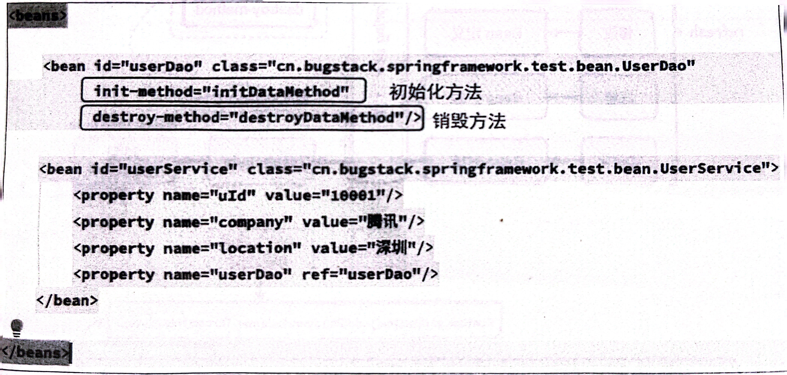

对于满足用户在XML中配置初始化和销毁的方法，也可以通过实现类的方式自行包装处理，如在使用Spring Bean容器时用到的InitializingBean和DisposableBean两个接口。还有一种采用注解的方法实现的初始化，后续再实现。

## 3. 初始化和销毁方法

将对外暴露的接口进行定义使用或者XML配置，完成一系列的扩展，都会让Spring框架看上去很神秘，对于在Spring Bean容器初始化过程中添加的处理方法：一种是通过依赖倒置（依赖倒置是一种面向对象编程中的设计原则，它指的是高层模块不应该依赖于底层模块，而是应该依赖于抽象接口。换句话说，依赖倒置原则要求我们通过抽象来实现模块之间的松耦合关系。这样，当底层模块发生变化时，高层模块不需要做出太大的改动，只需要修改抽象接口即可。这种设计方式可以提高代码的可维护性、可扩展性和可重用性。）的方式预先执行一个定义好的接口方法；第二种是通过反射调用类中的XML方法，最终只要按照接口定义实现，就会由SpringBean容器在处理Bean对象注册的过程中调用。

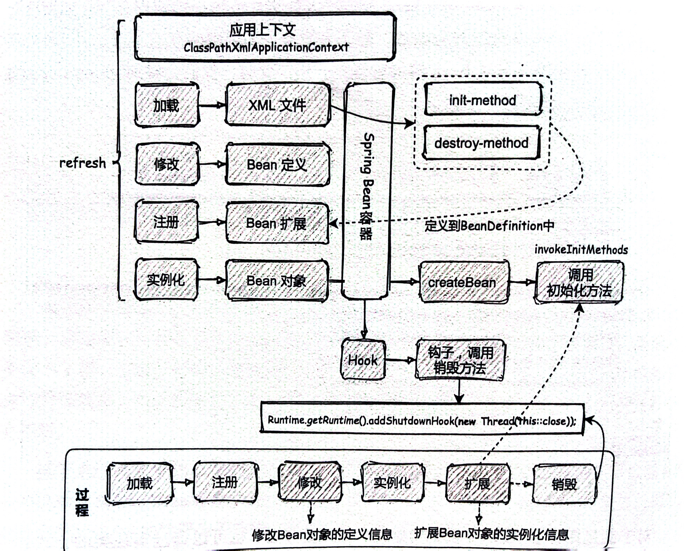

首先，在Spring.xml配置文件中添加init-method和destroy-method两个注解；然后，在加载配置文件的过程中，将注解一并定义到BeanDefinition的属性中。这样在initializeBean初始化过程中，就可以通过反射的方式调用在BeanDefinition属性中配置的初始化和销毁方法。如果采用的是接口实现的方式，则直接可以通过Bean对象调用相应的接口方法`((InitializingBean)bean).afterPropertiesSet`，这两种方法的实现效果是一样的。除了在初始化过程中完成的操作，destroy-method注解和Disposable接口的定义会在Bean对象初始化阶段完成，将注册销毁方法的信息定义到DefaultSingletonBeanRegistry类的disposableBeans属性中，以便后续处理。

## 4. 初始化和销毁实现


整个类图本次新增了Bean实例化过程中的初始化和销毁方法。因为一共实现了两种方式的初始化和销毁方法—XML配置和定义接口—所以这里包括InitializngBea接口、DisposableBean接口，也需使用XmlBeanDefinitionReader类将spring.xml配置文件的信息加载到BeanDefinition中。ConfigureableBeanFactory接口定义了destroySingletons销毁方法，并由AbstractBeanFactory继承的父类DefaultSinletonBeanRegistry实现ConfigureableBeanFactory接口定义的destroySinletongs方法

>虽然大多数程序员没有使用这种设计方式，一般采用谁实现接口谁完成实现类，而不是把实现接口交给继承的父类处理。但这种方式是一种不错的隔离服务粉分层的设计技巧，也可以在一些复杂的业务场景中使用。

关于虚拟机注册钩子，需要在关闭虚拟机之前销毁，即`Runtime.getRuntime().addShutdownHook(new Threads(()->System.out.pringtln("close!")))`

**2. 定义初始化和销毁方法的接口**

```java
public interface InitializingBean {
    /**
     * 在bean对象属性填充后调用
     */
    void afterPropertiesSet() throws  Exception;
}
public interface DisposeableBean {
        void destroy()throws  Exception;
}
```

两个接口方法是比较常用的，在一些需要结合Spring实现的组件中，我们经常使用这两个接口方法对参数进行初始化和销毁，如接口暴露、数据库数据读取、配置文件加载等

**3. bean属性定义新增初始化和销毁**

```java
public class BeanDefinition {
    private Class beanClass;
    private PropertyValues propertyValues;
    private String initMethodName;
    private String destroyMethodName;
    

    public BeanDefinition(Class beanClass) {
        this.beanClass = beanClass;
        this.propertyValues=new PropertyValues();
    }
    public BeanDefinition(Class beanClass ,PropertyValues propertyValues){
        this.beanClass=beanClass;
        this.propertyValues=propertyValues !=null ? propertyValues: new PropertyValues();
    }

    public Class getBeanClass() {
        return beanClass;
    }

    public void setBeanClass(Class beanClass) {
        this.beanClass = beanClass;
    }

    public PropertyValues getPropertyValues() {
        return propertyValues;
    }

    public void setPropertyValues(PropertyValues propertyValues) {
        this.propertyValues = propertyValues;
    }

    public String getInitMethodName() {
        return initMethodName;
    }

    public void setInitMethodName(String initMethodName) {
        this.initMethodName = initMethodName;
    }

    public String getDestroyMethodName() {
        return destroyMethodName;
    }

    public void setDestroyMethodName(String destroyMethodName) {
        this.destroyMethodName = destroyMethodName;
    }
}
```

在BeanDefitnition中新增了两个属性—initMethodName、destroyMethodName，目的是在spring.xml配置文件的Bean对象中可以配置init-Method="initDataMethod" destroy-Method="destroyDataMethod"，最终实现接口的效果是一样的。只不过是直接调用接口方法，另一种是在配置文件中读取方法反射调用。

**执行Bean对象的初始化方法**

```java
public abstract class AbstractAutowireCapableBeanFactory extends AbstractBeanFactory implements AutowireCapableBeanFactory {
    //这里使用cglib的代理方法创建bean实例
    private InstantiationStrategy instantiationStrategy=new CglibSubclassingInstantiationStrategy();
    private PropertyValues propertyValues;

    //用来床架bean的函数
    @Override
    protected Object createBean(String beanName, BeanDefinition beanDefinition, Object[] args) throws BeansException {
        Object bean=null;
        try{
            bean=ctreatBeanInstance(beanDefinition,beanName,args);
            //给bean对象填充属性
            applyPropertyValues(beanName,bean,beanDefinition);
            //执行Beand对象的初始化方法和BeanPostProcessor接口的前置方法和后置处理方法
            bean=initializeBean(beanName,bean,beanDefinition);
        }catch (Exception e){
            throw new BeansException("Instantiation of bean failed",e);
        } 
        registerSinleton(beanName,bean);
        return bean;
    }
    private Object initializeBean(String beanName,Object bean, BeanDefinition beanDefinition) throws BeansException {
        //1. 执行BeanPostProcessor Before前置处理
        Object wrappedBean=applyBeanPostProcessorsBeforeInitialization(bean,beanName);
        //2. 待完成的内容
        try{
            invokeInitMethods(beanName,wrappedBean,beanDefinition);
        }catch (Exception e){
            throw  new BeansException("Invocation of init method of bean ["+beanName+"] failed", e);
        }
       
        //3. 执行BeanPostProcessor After后置处理
        wrappedBean=applyBeanPostProcessorsAfterInitialization(bean,beanName);
        return wrappedBean;
    }
    private void invokeInitMethods(String beanName,Object bean, BeanDefinition beanDefinition) throws Exception, BeansException {
        //1. 实现InitializingBean接口
       if(bean instanceof InitializingBean){
           ((InitializingBean) bean).afterPropertiesSet();
       }
       //2. 配置信息init-method{判断是为了避免二次销毁}
        String initMethodName=beanDefinition.getInitMethodName();
       if(StrUtil.isNotEmpty(initMethodName)){
           Method iniMethod=beanDefinition.getBeanClass().getMethod(initMethodName);
           if(null==iniMethod){
               throw  new BeansException("Cou;d not find an init method named '"+initMethodName+"' on bean with name '"+beanName+"'");
           }
           iniMethod.invoke(bean);
       }
       
    }
    @Override
    public Object applyBeanPostProcessorsAfterInitialization(Object existingBean, String beanName) throws BeansException {
        Object result=existingBean;
        for(BeanPostProcessor processor :getBeanPostProcessors()){
            Object current=processor.postProcessBeforeInitialization(result,beanName);
            if(null==current) return result;
            result=current;
        }
        return result;
    }

    @Override
    public Object applyBeanPostProcessorsBeforeInitialization(Object existingBean, String beanName) throws BeansException {
        Object result=existingBean;
        for(BeanPostProcessor processor :getBeanPostProcessors()){
            Object current=processor.postProcessAfterInitialization(result,beanName);
            if(null==current) return result;
            result=current;
        }
        return result;
    }

    protected Object ctreatBeanInstance(BeanDefinition beanDefinition, String beanName, Object[] args) throws BeansException {
        Constructor constructorToUser=null;
        Class<?> beanClass=beanDefinition.getBeanClass();
        Constructor<?>[] declaredConstructors=beanClass.getDeclaredConstructors();
        for (Constructor<?> declaredConstructor : declaredConstructors) {
            if(args!=null && declaredConstructor.getParameterTypes().length==args.length)
            {
                constructorToUser=declaredConstructor;
                break;
            }
        }
        return  getInstantiationStrategy().instatiate(beanDefinition,beanName,constructorToUser,args);
    }
    //该方法用于给Bean对象填充属性
    protected  void applyPropertyValues(String beanName, Object bean , BeanDefinition beanDefinition){
        try{
            //或的bean的属性集合
            PropertyValues propertyValues = beanDefinition.getPropertyValues();
            for (PropertyValue propertyValue : propertyValues.getPropertyValues()) {
                //取出属性名和属性值
                String name=propertyValue.getName();
                Object value=propertyValue.getValue();
                if(value instanceof BeanReference){
                    //例如A依赖B，获取B的实例化对象
                    BeanReference beanReference=(BeanReference) value;
                    value=getBean(beanReference.getBeanName());
                }
                //属性填充
                BeanUtil.setFieldValue(bean,name,value);
            }
        } catch (Exception | BeansException e) {
            throw new BeanException("Error setting property values："+beanName);
        }
    }
    public InstantiationStrategy getInstantiationStrategy(){
        return instantiationStrategy;
    }
    public void setInstantiationStrategy(InstantiationStrategy instantiationStrategy){
        this.instantiationStrategy=instantiationStrategy;
    }
}
```

AbstractAutowireCapableBeanFactory抽象类中的createBean是用来创建Bean对象的方法。在这个方法中，我们已经扩展了BeanFactoryPostProcessor、BeanPostProcessor，这里继续完善执行Bean对象的初始化方法。在invokeInitMethod方法中，主要分为两个部分实现InitialiizingBean接口，以及处理 afterPropertiesSet方法。然后判断配置信息init-method是否存在，执行反射调用initMethod.invoke(bean)。

**5. 定义销毁方法适配器（接口和配置）**

```java
//"DisposableBeanAdapter" 是一个 Java 编程语言中的类，它实现了 Spring 框架中的 "DisposableBean" 接口，用于在 Bean 销毁时执行一些必要的清理操作。该类的作用是将 "DisposableBean" 接口适配到 Spring 容器中，以便在 Bean 销毁时调用 "destroy" 方法。这个类可以用来扩展 Spring 框架的功能，以满足特定的业务需求。
public class DisposableBeanAdapter implements DisposeableBean {
    private final Object bean;
    private final String beanName;
    private String destroyMethodName;

    public DisposableBeanAdapter(Object bean, String beanName, BeanDefinition beanDefinition) {
        this.bean = bean;
        this.beanName = beanName;
        this.destroyMethodName = beanDefinition.getDestroyMethodName();
    }

    @Override
    public void destroy() throws Exception {
        //实现DisposeableBean接口
        if( bean instanceof DisposeableBean){
            //调用Bean对象的销毁方法
            ((DisposeableBean)bean).destroy();
        }
        //配置信息destroy-method
        if(StrUtil.isNotEmpty(destroyMethodName) && !(bean instanceof DisposeableBean && "destroy".equals(this.destroyMethodName))){
            //放射获得用户配置文件中配置的方法
            Method destroyMethod=bean.getClass().getMethod(destroyMethodName);
            if(null==destroyMethod){
                //没有找到销毁方法就报错
                throw new BeanException("Could`t find a destroy method named '"+
                        destroyMethodName+" ' on bean with name '"+beanName+"'" );
            }
            destroyMethod.invoke(bean);
        }
    }
}
```

使用适配器的类的原因是，销毁方法有两种甚至多种方式，目前有实现接口DisposableBean和配置信息destroy-method两种方式，而这两种方式的销毁是由AbstractApplicationContext向虚拟机注册钩子后、虚拟机关闭前执行的。因为在销毁时，更希望有统一的接口进行销毁，所以这里新增了适配类，进行统一处理。

**6. 创建Bean对象时注册销毁方法**

```java
    @Override
    protected Object createBean(String beanName, BeanDefinition beanDefinition, Object[] args) throws BeansException {
        Object bean=null;
        try{
            bean=ctreatBeanInstance(beanDefinition,beanName,args);
            //给bean对象填充属性
            applyPropertyValues(beanName,bean,beanDefinition);
            //执行Beand对象的初始化方法和BeanPostProcessor接口的前置方法和后置处理方法
            bean=initializeBean(beanName,bean,beanDefinition);
        }catch (Exception e){
            throw new BeansException("Instantiation of bean failed",e);
        }
        //注册实现了DisposeableBean接口的Bean对象
        registerSinleton(beanName,bean);
        return bean;
    }
    protected void registerDisposableBeanIfNeccessary(String beanName,Object bean, BeanDefinition beanDefinition){
        if(bean instanceof DisposeableBean || StrUtil.isNotEmpty(beanDefinition.getDestroyMethodName())){
            registerDisposableBean(beanName,new DisposableBeanAdapter(bean,beanName,beanDefinition));
        }
    }
```

在使用registerDisposableIfNeccessary注册销毁方法时，会根据接口类型和配置类型统一交给DisposableBeanAdapter销毁适配器类进行统一处理。当通过DisposableBeanAdapter#destroy执行销毁方法时，会使用Java的关键字instanceof判断对象类型时否为DisposableBean并调用具体的销毁方法，以及使用反射调用处理XML配置的方法销毁。

**注册、关闭虚拟机钩子的方法**

```java
public interface ConfigurableApplicationContext extends ApplicationContext{
    //刷新容器
    void refresh() throws BeansException;
    //注册虚拟机钩子
    void registerShutdownHook();
    //关闭容器
    void close();
}
```

在ConfigurableApplicationContext接口中定义注册虚拟机钩子的registerShutdownHook方法和手动执行关闭的close方法

```java
public abstract class AbstractApplicationContext extends DefaultResourceLoader implements ConfigurableApplicationContext {
    @Override
    public void refresh() throws BeansException {
        //1. 创建BeanFactory，并加载BeanDefinition
         refreshBeanFactory();
        //2. 获取BeanFactory
         ConfigurableListableBeanFactory beanFactory=getBeanFactory();
        //3. 在将Bean对象实例化执行之前，执行BeanFactoryPostProcessor操作
        invokeBeanFactoryPostProcessor(beanFactory);
        //4. BeanPostProcessor需要将Bean对象实例化之前注册
        registerBeanPostProcessor(beanFactory);
        //5. 提前实例化单例Bean对象
        beanFactory.preInstantiateSingletons();
    }
    protected abstract void refreshBeanFactory() throws BeansException;
    protected abstract ConfigurableListableBeanFactory getBeanFactory();

    private void invokeBeanFactoryPostProcessor(ConfigurableListableBeanFactory beanFactory) throws BeansException {
        Map<String, BeanFactoryPostProcessor> beanFactoryPostProcessorMap=beanFactory.getBeansOfType(BeanFactoryPostProcessor.class);
        for(BeanFactoryPostProcessor beanFactoryPostProcessor:beanFactoryPostProcessorMap.values()){
            beanFactoryPostProcessor.postProcessBeanFactory(beanFactory);
        }
    }

    private void registerBeanPostProcessor(ConfigurableListableBeanFactory beanFactory) throws BeansException {
        Map<String, BeanPostProcessor> beanPostProcessorMap=beanFactory.getBeansOfType(BeanPostProcessor.class);
        for(BeanPostProcessor beanPostProcessor: beanPostProcessorMap.values()){
            beanFactory.addBeanPostProcessor(beanPostProcessor);
        }
    }

    @Override
    public void registerShutdownHook() {
        Runtime.getRuntime().addShutdownHook(new Thread(this::close));
    }

    @Override
    public void close() {
        getBeanFactory().destroySingletons();
    }

    @Override
    public <T> Map<String, T> getBeansOfType(Class<T> var1) throws BeansException {
        return getBeanFactory().getBeansOfType(var1);
    }

    @Override
    public Object getBean(String name, Object... args) throws BeansException {
        return getBeanFactory().getBean(name,args);
    }

    @Override
    public Object getBean(String name) throws BeansException {
        return getBeanFactory().getBean(name);
    }

    @Override
    public <T> T getBean(String name, Class<T> requiredType) throws BeansException {
        return getBeanFactory().getBean(name,requiredType);
    }
    @Override
    public String[] getBeanDefinitionNames() {
        return getBeanFactory().getBeanDefinitionNames();
    }

}
```

这里主要内容是如何实现注册和关闭钩子的方法，用户可以尝试验证上文提到过的Runtime.getRuntime().addShutdownHook()方法。在一些中间件和监控系统的设计中也可以使用这个方法，如监测服务器宕机、备机启动。

**测试**

- 实现准备

```java
public class UserDao {
    private static Map<String,String> hashmap=new HashMap<>();
    
    public void initDataMethod(){
        System.out.println("执行：init-method");
        hashmap.put("10001","张三");
        hashmap.put("10002","李四");
        hashmap.put("10003","王五");
    }
    
    public void destroyDataMethod(){
        System.out.println("执行：destroy-method");
        hashmap.clear();
    }
    public String queryUserName(String uId){
        return hashmap.get(uId);
    }
}
```

```java
public class userService implements InitializingBean, DisposeableBean {
    private String uId;
    private String company;
    private String location;
    private UserDao userDao;
    public void queryUserInfo(){
        System.out.println("用户姓名："+userDao.queryUserName(uId));
        System.out.println("用户公司："+company);
        System.out.println("用户ID："+uId);
        System.out.println("用户地址："+location);
    }

    public String getuId() {
        return uId;
    }

    public void setuId(String uId) {
        this.uId = uId;
    }

    public UserDao getUserDao() {
        return userDao;
    }

    public void setUserDao(UserDao userDao) {
        this.userDao = userDao;
    }

    public String getCompany() {
        return company;
    }

    public void setCompany(String company) {
        this.company = company;
    }

    public String getLocation() {
        return location;
    }

    public void setLocation(String location) {
        this.location = location;
    }

    @Override
    public void destroy() throws Exception {
        System.out.println("执行：UserService.destroy");
    }

    @Override
    public void afterPropertiesSet() throws Exception {
        System.out.println("执行：UserService.afterPropertiesSet");
    }
}
```

UserDao将之前使用Static静态块初始化数据的方式，修改为使用initDataMethod和destroyDataMethod两个更简单的方式来进行处理。使用UserService来实现InitialzingBean接口、DisposableBean接口的destory和afterPropertiesSet两个方法，并进行相应的初始化和销毁

```java
<?xml version="1.0" encoding="UTF-8" ?>
<beans>
    <bean id="userDao" class="springframework.bean.UserDao" 
          init-method="initDateMethod" 
          destroy-method="destroyDataMethod"></bean>
    <bean id="userService" class="springframework.bean.userService">
        <property name="uId" value="10001"></property>
        <property name="userDao" ref="userDao"></property>
        <property name="location"  value="深圳"></property>
        <property name="company" value="腾讯"></property>
    </bean>
</beans>
```

**单元测试**

```java
public class ApiTest {
    @Test
    public void test_xml2() throws BeansException {
        //初始化BeanFactory接口
        ClassPathXmlApplicationContext applicationContext=new ClassPathXmlApplicationContext("classpath:spring.xml");
        applicationContext.registerShutdownHook();
        //获取bean对象的调用方法
        userService userservice=applicationContext.getBean("userService",userService.class);
        userservice.queryUserInfo();
    }
}
```

**测试结果**

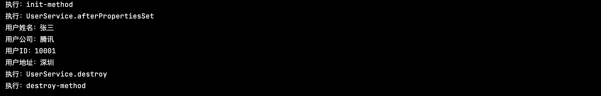

## 5. Spring相关源码解析

**InitializingBean**

```java
public interface InitializingBean {
  //在Bean属性被设置后用于初始化Bean对象
	void afterPropertiesSet() throws Exception;

}
```

**DisposeableBean **

```java
public interface DisposableBean {
  //用户销毁bean对象
	void destroy() throws Exception;

}
```

**BeanDefinition**

```java
//此方法用于设置用于初始化 Bean 的方法的名称。
	//有时候，在 Bean 被实例化和依赖注入之后，你可能需要执行一些初始化逻辑，如设置一些属性或开启一些资源。在这种情况下，你可以定义一个初始化方法，
	// 并通过 setInitMethodName 来告诉 Spring 在创建 Bean 后调用此方法。
	//参数 initMethodName 是初始化方法的名称。Spring 容器将使用反射在 Bean 类中查找并调用这个方法。@Nullable 注解表示 initMethodName 参数可以为 null，如果为 null，则表示没有指定初始化方法
	void setInitMethodName(@Nullable String initMethodName);
	//获得bean的初始化方法的名称
	@Nullable
	String getInitMethodName();
	//此方法用于设置用于销毁 Bean 的方法的名称。
	//在应用程序关闭或 Bean 不再需要时，你可能需要执行一些清理逻辑，例如关闭打开的网络连接或清除临时文件。在这种情况下，你可以定义一个销毁方法，
	// 并通过 setDestroyMethodName 来告诉 Spring 在销毁 Bean 时调用此方法
```

**AbstractAutowireCapableBeanFactory**

```java
	protected Object doCreateBean(String beanName, RootBeanDefinition mbd, @Nullable Object[] args)
			throws BeanCreationException {
		synchronized (mbd.postProcessingLock) {
			if (!mbd.postProcessed) {
				try {
					//调用applyMergedBeanDefinitionPostProcessors方法，该方法用于应用所有已注册的MergedBeanDefinitionPostProcessor对象，
					// 以修改BeanDefinition对象的属性值
					applyMergedBeanDefinitionPostProcessors(mbd, beanType, beanName);
				}
				catch (Throwable ex) {
					throw new BeanCreationException(mbd.getResourceDescription(), beanName,
							"Post-processing of merged bean definition failed", ex);
				}
				//将BeanDefinition对象的postProcessed属性设置为true，表示已经完成了所有的后处理操作。
				mbd.postProcessed = true;
			}
		}
        //检查BeanDefinition对象的isSingleton方法是否返回true，检查是否允许循环引用，以及检查当前单例对象是否正在创建中
		// 用于检查是否允许在创建Bean对象时提前曝光一个单例对象
		boolean earlySingletonExposure = (mbd.isSingleton() && this.allowCircularReferences &&
				isSingletonCurrentlyInCreation(beanName));
		if (earlySingletonExposure) {
			if (logger.isTraceEnabled()) {
				logger.trace("Eagerly caching bean '" + beanName +
						"' to allow for resolving potential circular references");
			}
			//将当前对象添加到一个单例工厂
			addSingletonFactory(beanName, () -> getEarlyBeanReference(beanName, mbd, bean));
		}

		//初始化bean实例
		Object exposedObject = bean;
		try {
			//调用 populateBean 方法，该方法用于填充 Bean 的属性值。
			populateBean(beanName, mbd, instanceWrapper);
			//调用 initializeBean 方法，该方法用于初始化 Bean，并返回一个可公开的 Bean 对象
			exposedObject = initializeBean(beanName, exposedObject, mbd);
		}
		catch (Throwable ex) {
			if (ex instanceof BeanCreationException && beanName.equals(((BeanCreationException) ex).getBeanName())) {
				throw (BeanCreationException) ex;
			}
			else {
				throw new BeanCreationException(
						mbd.getResourceDescription(), beanName, "Initialization of bean failed", ex);
			}
		}
		// Register bean as disposable.
		try {
			registerDisposableBeanIfNecessary(beanName, bean, mbd);
		}
		catch (BeanDefinitionValidationException ex) {
			throw new BeanCreationException(
					mbd.getResourceDescription(), beanName, "Invalid destruction signature", ex);
		}

		return exposedObject;
	}

protected Object initializeBean(String beanName, Object bean, @Nullable RootBeanDefinition mbd) {
		if (System.getSecurityManager() != null) {
			AccessController.doPrivileged((PrivilegedAction<Object>) () -> {
				invokeAwareMethods(beanName, bean);
				return null;
			}, getAccessControlContext());
		}
		else {
          //"invokeAwareMethods" 是一个Java编程语言中的方法，它的作用是在对象实例化时调用一些特定的回调方法，以便在应用程序中进行一些必要的初始化和设置。这些回调方法包括"setBeanFactory"、"setApplicationContext"和"setServletContext"等。 
			invokeAwareMethods(beanName, bean);
		}

		Object wrappedBean = bean;
		if (mbd == null || !mbd.isSynthetic()) {
			wrappedBean = applyBeanPostProcessorsBeforeInitialization(wrappedBean, beanName);
		}

		try {
			invokeInitMethods(beanName, wrappedBean, mbd);
		}
		catch (Throwable ex) {
			throw new BeanCreationException(
					(mbd != null ? mbd.getResourceDescription() : null),
					beanName, "Invocation of init method failed", ex);
		}
		if (mbd == null || !mbd.isSynthetic()) {
			wrappedBean = applyBeanPostProcessorsAfterInitialization(wrappedBean, beanName);
		}

		return wrappedBean;
	}
protected void invokeInitMethods(String beanName, Object bean, @Nullable RootBeanDefinition mbd)
			throws Throwable {
    //判断bean是否需要初始化
		boolean isInitializingBean = (bean instanceof InitializingBean);
		if (isInitializingBean && (mbd == null || !mbd.isExternallyManagedInitMethod("afterPropertiesSet"))) {
			if (logger.isTraceEnabled()) {
				logger.trace("Invoking afterPropertiesSet() on bean with name '" + beanName + "'");
			}
			if (System.getSecurityManager() != null) {
				try {
					AccessController.doPrivileged((PrivilegedExceptionAction<Object>) () -> {
						((InitializingBean) bean).afterPropertiesSet();
						return null;
					}, getAccessControlContext());
				}
				catch (PrivilegedActionException pae) {
					throw pae.getException();
				}
			}
			else {
        //调用初始化方法
				((InitializingBean) bean).afterPropertiesSet();
			}
		}

		if (mbd != null && bean.getClass() != NullBean.class) {
			String initMethodName = mbd.getInitMethodName();
			if (StringUtils.hasLength(initMethodName) &&
					!(isInitializingBean && "afterPropertiesSet".equals(initMethodName)) &&
					!mbd.isExternallyManagedInitMethod(initMethodName)) {
				invokeCustomInitMethod(beanName, bean, mbd);
			}
		}
	}
protected void registerDisposableBeanIfNecessary(String beanName, Object bean, RootBeanDefinition mbd) {
		AccessControlContext acc = (System.getSecurityManager() != null ? getAccessControlContext() : null);
		if (!mbd.isPrototype() && requiresDestruction(bean, mbd)) {
			if (mbd.isSingleton()) {
				registerDisposableBean(beanName, new DisposableBeanAdapter(
						bean, beanName, mbd, getBeanPostProcessorCache().destructionAware, acc));
			}
			else {
				//如果是用户自定义的域值
				Scope scope = this.scopes.get(mbd.getScope());
				if (scope == null) {
					throw new IllegalStateException("No Scope registered for scope name '" + mbd.getScope() + "'");
				}
				scope.registerDestructionCallback(beanName, new DisposableBeanAdapter(
						bean, beanName, mbd, getBeanPostProcessorCache().destructionAware, acc));
			}
		}
	}
```

**DisposableBeanAdapter**

```java
class DisposableBeanAdapter implements DisposableBean, Runnable, Serializable {
  //要销毁的Bean
	private final Object bean;
  //要销毁的Bean的名称
	private final String beanName;
  //是否注册了销毁方法
	private final boolean invokeDisposableBean;
  //Bean销毁时要调用的方法
	@Nullable
	private String destroyMethodName;
  //destroy方法
  //Java语言的关键字，变量修饰符，如果用transient声明一个实例变量，当对象存储时，它的值不需要维持。换句话来说就是，用transient关键字标记的成员变量不参与序列化过程
	@Nullable
	private transient Method destroyMethod;
  //销毁时需要调用的回调处理器
	@Nullable
	private final List<DestructionAwareBeanPostProcessor> beanPostProcessors;
  //构造函数
	public DisposableBeanAdapter(
			Object bean, List<DestructionAwareBeanPostProcessor> postProcessors, AccessControlContext acc) {

		Assert.notNull(bean, "Disposable bean must not be null");
		this.bean = bean;
		this.beanName = bean.getClass().getName();
		this.invokeDisposableBean = (this.bean instanceof DisposableBean);
		this.beanPostProcessors = filterPostProcessors(postProcessors, bean);
	}
  //判断销毁方法是否时必要的
	@Nullable
	private String inferDestroyMethodIfNecessary(Object bean, RootBeanDefinition beanDefinition) {
    //获得销毁方法的名称
		String destroyMethodName = beanDefinition.getDestroyMethodName();
		if (AbstractBeanDefinition.INFER_METHOD.equals(destroyMethodName) ||
				(destroyMethodName == null && bean instanceof AutoCloseable)) {
			if (!(bean instanceof DisposableBean)) {
				try {
					return bean.getClass().getMethod(CLOSE_METHOD_NAME).getName();
				}
				catch (NoSuchMethodException ex) {
					try {
						return bean.getClass().getMethod(SHUTDOWN_METHOD_NAME).getName();
					}
					catch (NoSuchMethodException ex2) {
					}
				}
			}
			return null;
		}
		return (StringUtils.hasLength(destroyMethodName) ? destroyMethodName : null);
	}
  //说明在处理Bean对象销毁时，jvm会开创一个新的线程
	@Override
	public void run() {
		destroy();
	}
	@Override
	public void destroy() {
		if (!CollectionUtils.isEmpty(this.beanPostProcessors)) {
			for (DestructionAwareBeanPostProcessor processor : this.beanPostProcessors) {
        //执行销毁前置方法
				processor.postProcessBeforeDestruction(this.bean, this.beanName);
			}
		}
		if (this.invokeDisposableBean) {
			if (logger.isTraceEnabled()) {
				logger.trace("Invoking destroy() on bean with name '" + this.beanName + "'");
			}
			try {
				if (System.getSecurityManager() != null) {
					AccessController.doPrivileged((PrivilegedExceptionAction<Object>) () -> {
						((DisposableBean) this.bean).destroy();
						return null;
					}, this.acc);
				}
				else {
					((DisposableBean) this.bean).destroy();
				}
			}
			catch (Throwable ex) {
				String msg = "Invocation of destroy method failed on bean with name '" + this.beanName + "'";
				if (logger.isDebugEnabled()) {
					logger.warn(msg, ex);
				}
				else {
					logger.warn(msg + ": " + ex);
				}
			}
		}
   //这段代码是Java中的一段程序，在某些情况下会被调用来销毁对象。具体来说，它首先检查是否存在一个自定义的销毁方法，如果有，则调用该方法来销毁对象。如果不存在，则检查是否存在一个特定的销毁方法名称，并尝试查找该方法。如果找到该方法，则调用该方法来销毁对象。如果没有找到该方法，则不执行任何操作。
		if (this.destroyMethod != null) {
			invokeCustomDestroyMethod(this.destroyMethod);
		}
    //如果指定了销毁方法
		else if (this.destroyMethodName != null) {
			Method methodToInvoke = determineDestroyMethod(this.destroyMethodName);
			if (methodToInvoke != null) {
				invokeCustomDestroyMethod(ClassUtils.getInterfaceMethodIfPossible(methodToInvoke));
			}
		}
	}
}
```

**ConfigurableApplicationContext**

```java
public interface ConfigurableApplicationContext extends ApplicationContext, Lifecycle, Closeable {
  void refresh() throws BeansException, IllegalStateException;
  void registerShutdownHook();
  @Override
	void close();
}
```

# 八. 感知容器对象

## 1. 本节重点

当我们不断地深入学习Spring框架后，可以感受到它带来的强大的扩展功能。例如，可以在对象加载完成未完成初始化时修改对象信息，也可以在对象初始化前后修改属性，还可以获取整个Bean对象生命周期中的名称、容器和上下文等信息。这些强大的扩展功能都来自工程架构和设计原则的运用、解耦系统、降低耦合。本节，仍会通过依赖倒置实现开闭原则的方式，提供感知容器变化的功能，允许用户扩展满足自己的功能需求。通过依赖倒置定义感知容器的标记接口，使Bean对象生命周期中的节点作为接口实现，并在对象实例化后的初始化阶段进行调用，将信息传递给用户。

> 依赖倒置原则（Dependence Inversion Principle）是程序要依赖于抽象接口，不要依赖于具体实现。简单的说就是要求对抽象进行编程，不要对实现进行编程，这样就降低了客户与实现模块间的[耦合](https://baike.baidu.com/item/耦合/2821124?fromModule=lemma_inlink)。


## 2. Spring Bean容器的功能

目前已实现的Spring框架，在Bean对象方面能提供的功能包括：Bean对象的定义和注册，在Bean对象过程中执行BeanFactoryPostProcessor、BeanPostProcessor、InitializingBean、DisposableBean操作，以及在XML中新增初始化和销毁的配置处理，使得Bean对象具有更强的操作性。如果想要对Spring框架提供的BeanFactory、AppicationContext、BeanClassLoader等功能进行扩展，就可以在Spring框架中提供一种能感知容器的接口。如果实现了这个接口，就可以获取接口入参信息中各类对象提供的功能，并进行一些额外逻辑的处理。

## 3. 感知容器设计

如果想要获取Spring框架提供的资源，则要考虑以什么方式获取。对于定义好的获取方式，在Spring框架中应该怎样承接。一旦实现这两项内容，就可以扩展出一些属于Spring框架本身的内容。在Bean对象实例化阶段，我们进行了额外定义、属性、初始化和销毁等。如果想获取Spring框架中的BeanFactory接口、ApplicationContext接口，也可以通过此种设计方法获取。此时只需要定义一个标志性的接口，这个接口不需要使用方法，只起到标记作用。该接口具体的功能由继承此接口的其他功能性接口的定义，此时可以通过Java关键字instanceof判断和调用了。

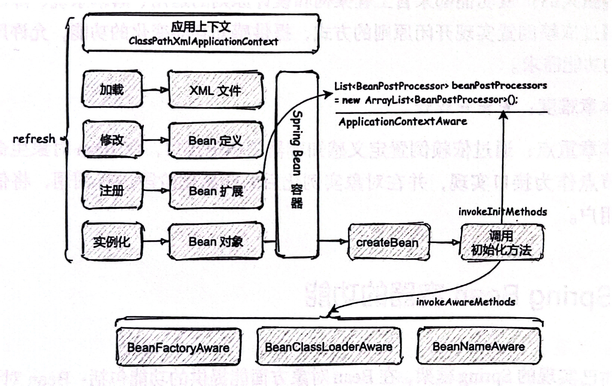

定义Aware接口。在Spring框架中，Aware是一种感知标记性接口，子类的定义和实现能感知容器中的相关对象。即通过Aware接口，可以向具体的实现类中提供容器服务，继承Aware的接口包括BeanFactoryAware、BeanClassLoaderAware、BeanNameAware和ApplicationContextAware。在Spring源码中，还有一些其他关于注解的接口，目前还使用不到。在接口具体的实现过程中可以看到，一部分接口（BeanFactoryAware、BeanClassLoaderAware、BeanNameAware）在Factory的support文件夹中，其余的接口（ApplicationContextAware）在contet的support文件夹中，因为获取不同的内容需要在不同的包下提供，所以，在AbstractApplicationContext的具体实现中后使用向beanFactory中添加BeanPostProcessor内容的ApplicationContextAwareProcessor操作，最后由AbstractAutowireCapableBeanFactory创建createBean是进行相应的调用。

## 4. 感知容器实现

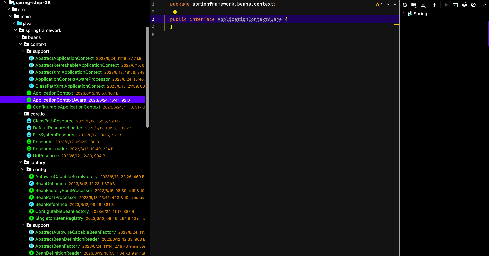


Aware的类有4个用于继承的接口，其他继承接口的目的是继承一个标记，有了标记就可以更加方便地判断类的实现。由于ApplicationContext接口并不是在AbstractAutowireCapableBeanFactory中createBean方法下的内容，所以需要向容器中注册assBeanPostProcessor，当由createBean统一调用applyBeanPostProcessorsBeforeInitialization时执行。

**2. 定义标记接口**

```java
public interface Aware {
}
```

在Spring中，有很多类似这种标记接口的设计方式，它们的存在就像是一种标签，便于统一获取出属于此类接口的实现类。

**3. 容器感知类**

- BeanFactoryAware

```java
public interface BeanFactoryAware extends Aware{
    void setBeanFactory(BeanFactory beanFactory)throws BeansException;
}
```

实现此接口，可以感知到所属的BeanFactory

- BeanClassLoaderAware

```java
public interface BeanClassLoaderAware extends Aware{
    void setBeanClassLoader(ClassLoader classLoader);
}
```

实现此接口，可以感知到所属的ClassLoader类加载器

- BeanNameAware

```java
public interface BeanNameAware extends Aware{
    void setBeanName(String name);
}
```

实现此接口，可以感知到所属的Bean对象的名称

- ApplicationContextAware

```java
public interface ApplicationContextAware extends Aware {
    void setApplicationContext(ApplicationContext applicationContext)throws BeansException;
}
```

实现此接口，可以感知到所属的ApplicationContext应用上下文信息。

**4.包装处理器（ApplicationContextAwareProcessor）**

```java
public class ApplicationContextAwareProcessor implements BeanPostProcessor {
    private final ApplicationContext applicationContext;
    //构造函数获得当前的容器的对象
    public  ApplicationContextAwareProcessor (ApplicationContext applicationContext){
        this.applicationContext=applicationContext;
    }
    @Override
    public Object postProcessBeforeInitialization(Object bean, String beanName) throws BeansException {
        if(bean instanceof ApplicationContextAware){
            //bean可以获取当前的容器对象，这样该bean就可以操作Bean容器对象了
            ((ApplicationContextAware)bean).setApplicationContext(applicationContext);
        }
        return bean;
    }

    @Override
    public Object postProcessAfterInitialization(Object bean, String name) throws BeansException {
        return bean;
    }
}
```

由于并不能直接在创建bean时获取ApplicationContext属性，所以需要在执行refresh时，将ApplicatioContext写入一个包装的BeanPostProcessor类中，再使用AbstractAutowireCapableBeanFactory.applyBeanPostProcessorBeforeInitialization方法调用时获取ApplicationContext属性

**5. 注册BeanPostProcessor**

```java
public abstract class AbstractApplicationContext extends DefaultResourceLoader implements ConfigurableApplicationContext {
    @Override
    public void refresh() throws BeansException {
        //1. 创建BeanFactory，并加载BeanDefinition
         refreshBeanFactory();
        //2. 获取BeanFactory
         ConfigurableListableBeanFactory beanFactory=getBeanFactory();
        //3. 添加ApplicationContextAwareProcessor类，让继承该接口的对象都能感知到所属的ApplicationContext
        beanFactory.addBeanPostProcessor(new ApplicationContextAwareProcessor(this));
        //4. 在将Bean对象实例化执行之前，执行BeanFactoryPostProcessor操作
        invokeBeanFactoryPostProcessor(beanFactory);
        //5. BeanPostProcessor需要将Bean对象实例化之前注册
        registerBeanPostProcessor(beanFactory);
        //6. 提前实例化单例Bean对象
        beanFactory.preInstantiateSingletons();
    }
    protected abstract void refreshBeanFactory() throws BeansException;
    protected abstract ConfigurableListableBeanFactory getBeanFactory();

    private void invokeBeanFactoryPostProcessor(ConfigurableListableBeanFactory beanFactory) throws BeansException {
        Map<String, BeanFactoryPostProcessor> beanFactoryPostProcessorMap=beanFactory.getBeansOfType(BeanFactoryPostProcessor.class);
        for(BeanFactoryPostProcessor beanFactoryPostProcessor:beanFactoryPostProcessorMap.values()){
            beanFactoryPostProcessor.postProcessBeanFactory(beanFactory);
        }
    }

    private void registerBeanPostProcessor(ConfigurableListableBeanFactory beanFactory) throws BeansException {
        Map<String, BeanPostProcessor> beanPostProcessorMap=beanFactory.getBeansOfType(BeanPostProcessor.class);
        for(BeanPostProcessor beanPostProcessor: beanPostProcessorMap.values()){
            beanFactory.addBeanPostProcessor(beanPostProcessor);
        }
    }

    @Override
    public void registerShutdownHook() {
        Runtime.getRuntime().addShutdownHook(new Thread(this::close));
    }

    @Override
    public void close() {
        try {
            getBeanFactory().destroySingletons();
        }catch (Exception e){}

    }

    @Override
    public <T> Map<String, T> getBeansOfType(Class<T> var1) throws BeansException {
        return getBeanFactory().getBeansOfType(var1);
    }

    @Override
    public Object getBean(String name, Object... args) throws BeansException {
        return getBeanFactory().getBean(name,args);
    }

    @Override
    public Object getBean(String name) throws BeansException {
        return getBeanFactory().getBean(name);
    }

    @Override
    public <T> T getBean(String name, Class<T> requiredType) throws BeansException {
        return getBeanFactory().getBean(name,requiredType);
    }
    @Override
    public String[] getBeanDefinitionNames() {
        return getBeanFactory().getBeanDefinitionNames();
    }

}
```

- refresh方法就是整个Spring Bean容器的操作过程，与前面几章对比，本次增加了关于addBeanPostProcessor的操作过程，与前面的章节相比，本次增加了关于addBeanPostProcessor的操作
- 添加ApplicationContextAwareProcessoor类，让继承自AppplicationContextAware接口的Bean对象都能感知到所属的ApplicaitonContext

**6. 感知调用**

 ```java
 package springframework.beans.factory.support;
 
 import cn.hutool.core.bean.BeanException;
 import cn.hutool.core.bean.BeanUtil;
 import cn.hutool.core.util.StrUtil;
 import springframework.BeansException;
 import springframework.PropertyValue;
 import springframework.PropertyValues;
 import springframework.beans.factory.*;
 import springframework.beans.factory.config.AutowireCapableBeanFactory;
 import springframework.beans.factory.config.BeanDefinition;
 import springframework.beans.factory.config.BeanPostProcessor;
 import springframework.beans.factory.config.BeanReference;
 
 import java.lang.reflect.Constructor;
 import java.lang.reflect.Method;
 
 public abstract class AbstractAutowireCapableBeanFactory extends AbstractBeanFactory implements AutowireCapableBeanFactory {
     //这里使用cglib的代理方法创建bean实例
     private InstantiationStrategy instantiationStrategy=new CglibSubclassingInstantiationStrategy();
     private PropertyValues propertyValues;
 
     //用来床架bean的函数
     @Override
     protected Object createBean(String beanName, BeanDefinition beanDefinition, Object[] args) throws BeansException {
         Object bean=null;
         try{
             bean=ctreatBeanInstance(beanDefinition,beanName,args);
             //给bean对象填充属性
             applyPropertyValues(beanName,bean,beanDefinition);
             //执行Beand对象的初始化方法和BeanPostProcessor接口的前置方法和后置处理方法
             bean=initializeBean(beanName,bean,beanDefinition);
         }catch (Exception e){
             throw new BeansException("Instantiation of bean failed",e);
         }
         registerDisposableBeanIfNeccessary(beanName,bean,beanDefinition);
         //注册实现了DisposeableBean接口的Bean对象
         registerSinleton(beanName,bean);
         return bean;
     }
     protected void registerDisposableBeanIfNeccessary(String beanName,Object bean, BeanDefinition beanDefinition){
         if(bean instanceof DisposeableBean || StrUtil.isNotEmpty(beanDefinition.getDestroyMethodName())){
             registerDisposableBean(beanName,new DisposableBeanAdapter(bean,beanName,beanDefinition));
         }
     }
     private Object initializeBean(String beanName,Object bean, BeanDefinition beanDefinition) throws BeansException {
         //如果该bean标记类Aware的接口
         if(bean instanceof Aware){
             if(bean instanceof BeanFactoryAware){
                 ((BeanFactoryAware)bean).setBeanFactory(this);
             }
             if(bean instanceof BeanClassLoaderAware){
                 ((BeanClassLoaderAware)bean).setBeanClassLoader(getBeanClassLoader());
             }
             if(bean instanceof BeanNameAware){
                 ((BeanNameAware)bean).setBeanName(beanName);
             }
         }
         //1. 执行BeanPostProcessor Before前置处理
         Object wrappedBean=applyBeanPostProcessorsBeforeInitialization(bean,beanName);
         //2. 待完成的内容
         try{
             invokeInitMethods(beanName,wrappedBean,beanDefinition);
         }catch (Exception e){
             throw  new BeansException("Invocation of init method of bean ["+beanName+"] failed", e);
         }
 
         //3. 执行BeanPostProcessor After后置处理
         wrappedBean=applyBeanPostProcessorsAfterInitialization(bean,beanName);
         return wrappedBean;
     }
     private void invokeInitMethods(String beanName,Object bean, BeanDefinition beanDefinition) throws Exception, BeansException {
         //1. 实现InitializingBean接口
        if(bean instanceof InitializingBean){
            ((InitializingBean) bean).afterPropertiesSet();
        }
        //2. 配置信息init-method{判断是为了避免二次销毁}
         String initMethodName=beanDefinition.getInitMethodName();
        if(StrUtil.isNotEmpty(initMethodName)){
            Method iniMethod=beanDefinition.getBeanClass().getMethod(initMethodName);
            if(null==iniMethod){
                throw  new BeansException("Cou;d not find an init method named '"+initMethodName+"' on bean with name '"+beanName+"'");
            }
            iniMethod.invoke(bean);
        }
 
     }
     @Override
     public Object applyBeanPostProcessorsAfterInitialization(Object existingBean, String beanName) throws BeansException {
         Object result=existingBean;
         for(BeanPostProcessor processor :getBeanPostProcessors()){
             Object current=processor.postProcessBeforeInitialization(result,beanName);
             if(null==current) return result;
             result=current;
         }
         return result;
     }
 
     @Override
     public Object applyBeanPostProcessorsBeforeInitialization(Object existingBean, String beanName) throws BeansException {
         Object result=existingBean;
         for(BeanPostProcessor processor :getBeanPostProcessors()){
             Object current=processor.postProcessAfterInitialization(result,beanName);
             if(null==current) return result;
             result=current;
         }
         return result;
     }
 
     protected Object ctreatBeanInstance(BeanDefinition beanDefinition, String beanName, Object[] args) throws BeansException {
         Constructor constructorToUser=null;
         Class<?> beanClass=beanDefinition.getBeanClass();
         Constructor<?>[] declaredConstructors=beanClass.getDeclaredConstructors();
         for (Constructor<?> declaredConstructor : declaredConstructors) {
             if(args!=null && declaredConstructor.getParameterTypes().length==args.length)
             {
                 constructorToUser=declaredConstructor;
                 break;
             }
         }
         return  getInstantiationStrategy().instatiate(beanDefinition,beanName,constructorToUser,args);
     }
     //该方法用于给Bean对象填充属性
     protected  void applyPropertyValues(String beanName, Object bean , BeanDefinition beanDefinition){
         try{
             //或的bean的属性集合
             PropertyValues propertyValues = beanDefinition.getPropertyValues();
             for (PropertyValue propertyValue : propertyValues.getPropertyValues()) {
                 //取出属性名和属性值
                 String name=propertyValue.getName();
                 Object value=propertyValue.getValue();
                 if(value instanceof BeanReference){
                     //例如A依赖B，获取B的实例化对象
                     BeanReference beanReference=(BeanReference) value;
                     value=getBean(beanReference.getBeanName());
                 }
                 //属性填充
                 BeanUtil.setFieldValue(bean,name,value);
             }
         } catch (Exception | BeansException e) {
             throw new BeanException("Error setting property values："+beanName);
         }
     }
     public InstantiationStrategy getInstantiationStrategy(){
         return instantiationStrategy;
     }
     public void setInstantiationStrategy(InstantiationStrategy instantiationStrategy){
         this.instantiationStrategy=instantiationStrategy;
     }
 }
 
 ```

在initializeBean接口中，通过判断条件bean instanceof Aware调用类3个接口方法—BeanFactoryAware.setBeanFactory(this)、BeanClassLoaderAware.setBeanClassLoader(getBeanClassLoader())、BeanNameAware.setBeanName(beanName)，这样就能通知已经是心啊initializeBean接口的类。另外还向BeanPostProcessor类中添加了ApplicationContextAwareProcessor方法，此时这个方法也会被调用到具体的实现类中，得到一个APplicationContext属性

**Aware接口的功能测试**

- 实现准备

```java
public class UserDao {
    private static Map<String,String> hashmap=new HashMap<>();

    public void initDataMethod(){
        System.out.println("执行：init-method");
        hashmap.put("10001","张三");
        hashmap.put("10002","李四");
        hashmap.put("10003","王五");
    }

    public void destroyDataMethod(){
        System.out.println("执行：destroy-method");
        hashmap.clear();
    }
    public String queryUserName(String uId){
        return hashmap.get(uId);
    }
}

public class userService implements InitializingBean, DisposeableBean , BeanNameAware, BeanClassLoaderAware, ApplicationContextAware
, BeanFactoryAware {
    private ApplicationContext applicationContext;
    private  BeanFactory beanFactory;
    private String uId;
    private String company;
    private String location;
    private UserDao userDao;
    public void queryUserInfo(){
        System.out.println("用户姓名："+userDao.queryUserName(uId));
        System.out.println("用户公司："+company);
        System.out.println("用户ID："+uId);
        System.out.println("用户地址："+location);
    }

    public String getuId() {
        return uId;
    }

    public void setuId(String uId) {
        this.uId = uId;
    }

    public UserDao getUserDao() {
        return userDao;
    }

    public void setUserDao(UserDao userDao) {
        this.userDao = userDao;
    }

    public String getCompany() {
        return company;
    }

    public void setCompany(String company) {
        this.company = company;
    }

    public String getLocation() {
        return location;
    }

    public void setLocation(String location) {
        this.location = location;
    }

    @Override
    public void destroy() throws Exception {
        System.out.println("执行：UserService.destroy");
    }

    @Override
    public void afterPropertiesSet() throws Exception {
        System.out.println("执行：UserService.afterPropertiesSet");
    }

    @Override
    public void setApplicationContext(ApplicationContext applicationContext) throws BeansException {
        this.applicationContext=applicationContext;
    }

    @Override
    public void setBeanClassLoader(ClassLoader classLoader) {
        System.out.println("classLoader:"+classLoader);
    }

    @Override
    public void setBeanFactory(BeanFactory beanFactory) throws BeansException {
        this.beanFactory=beanFactory;
    }

    @Override
    public void setBeanName(String name) {
        System.out.println("Bean name is:"+name);
    }
}
```

此次UserDao的功能没有改变，还是提供了关于初始化的方法，并在Spring.xml文件中提供了init-method、destroy-method配置信息。

- 配置文件

```xml
<beans>
    <bean id="userDao" class="springframework.bean.UserDao"
          init-method="initDataMethod"
          destroy-method="destroyDataMethod"></bean>
    <bean id="userService" class="springframework.bean.userService">
        <property name="uId" value="10001"></property>
        <property name="userDao" ref="userDao"></property>
        <property name="location"  value="深圳"></property>
        <property name="company" value="腾讯"></property>
    </bean>
</beans>
```

- 单元测试

```java
public class ApiTest {
    @Test
    public void test_xml2() throws BeansException {
        //初始化BeanFactory接口
        ClassPathXmlApplicationContext applicationContext=new ClassPathXmlApplicationContext("classpath:spring.xml");
        applicationContext.registerShutdownHook();
        //获取bean对象的调用方法
        userService userservice=applicationContext.getBean("userService",userService.class);
        userservice.queryUserInfo();
        System.out.println("ApplicaitonContextAware："+userservice.getApplicationContext());
        System.out.println("BeanFactory："+userservice.getBeanFactory());
    }
}
```

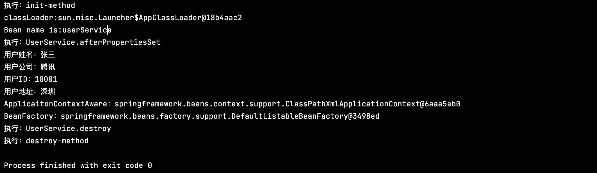

关于Spring框架的实现，某些功能现在已经趋于完整，尤其是Bean对象的生命周期已经有了很多实现。如下：

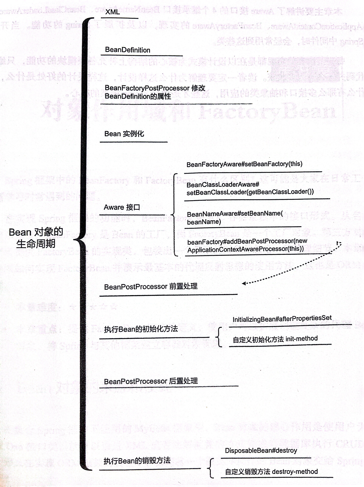

## 5. Spring相关源码解析

**Aware**

```java
public interface Aware {

}
```

**BeanFactoryAware**

`BeanFactoryAware` 是 Spring 框架中的一个接口，它包含 `setBeanFactory()` 方法。当一个类实现了 `BeanFactoryAware` 接口，它表示这个类希望被 Spring 容器通知关于 `BeanFactory` 的信息。方法 `setBeanFactory(BeanFactory beanFactory)` 的作用是注入 `BeanFactory` 实例。这个方法在 bean 创建过程中由 Spring 容器调用，允许 bean 获得对 `BeanFactory` 的访问权限。这样，bean 就可以根据需要查询 `BeanFactory`，查找其他 beans，或者查询其自身的配置元数据。简而言之，`BeanFactoryAware` 和 `setBeanFactory()` 允许一个 bean 了解并与其运行环境（即 Spring 容器）互动。

```java
public interface BeanFactoryAware extends Aware {
	void setBeanFactory(BeanFactory beanFactory) throws BeansException;
}
```

**BeanClassLoaderAware**

`BeanClassLoaderAware` 是 Spring 框架中的一个接口，其包含 `setBeanClassLoader()` 方法。当一个类实现了 `BeanClassLoaderAware` 接口，这意味着这个类想被 Spring 容器告知有关 `ClassLoader` 的信息。`setBeanClassLoader(ClassLoader classLoader)` 方法的目的是注入 `ClassLoader` 实例。在 bean 创建过程中，Spring 容器会调用这个方法，允许 bean 获取对 `ClassLoader` 的访问权限。这意味着，bean 可以在需要时查询 `ClassLoader`，比如用来加载类或资源。总的来说，`BeanClassLoaderAware` 和 `setBeanClassLoader()` 方法允许一个 bean 了解并与其运行环境（即 Spring 容器）中的类加载器进行交互。

```java
public interface BeanClassLoaderAware extends Aware{
    void setBeanClassLoader(ClassLoader classLoader);
}
```

**BeanNameAware**

`BeanNameAware` 是 Spring 框架中的一个接口，包含了 `setBeanName(String name)` 方法。当一个类实现了 `BeanNameAware` 接口，这表明这个类希望被 Spring 容器通知其在 Spring 容器中的 bean 名称。`setBeanName(String name)` 方法的作用是注入当前 bean 在 Spring 容器中的名称。在 bean 创建过程中，Spring 容器会调用这个方法，将 bean 在容器中的名称传递给它。这样，bean 就可以获取并知道其在 Spring 容器中的名称。简单来说，`BeanNameAware` 和 `setBeanName()` 方法使一个 bean 能够获取并知道自己在 Spring 容器中的名称。

```java
public interface BeanNameAware extends Aware {
	void setBeanName(String name);
}
```

**ApplicationContextAware**

`ApplicationContextAware` 是 Spring 框架中的一个接口，包含了 `setApplicationContext(ApplicationContext applicationContext)` 方法。当一个类实现了 `ApplicationContextAware` 接口，这表明这个类希望被 Spring 容器通知关于 `ApplicationContext` 的信息。`setApplicationContext(ApplicationContext applicationContext)` 方法的作用是注入 `ApplicationContext` 实例。在 bean 创建过程中，Spring 容器会调用这个方法，允许 bean 获取对 `ApplicationContext` 的访问权限。这样，bean 就可以根据需要查询 `ApplicationContext`，查找其他 beans，访问应用级别的配置以及进行特定的应用级操作。总的来说，`ApplicationContextAware` 和 `setApplicationContext()` 方法使得一个 bean 能够了解并与其运行环境（即 Spring 容器）进行互动，以便更好地适应其所在的应用上下文。

```java
public interface ApplicationContextAware extends Aware {
	void setApplicationContext(ApplicationContext applicationContext) throws BeansException;
}
```

 

通常情况下，Spring框架中的`ApplicationContextAwareProcessor`类是一个实现了`ApplicationContextAware`接口的处理器类。`ApplicationContextAware`接口是Spring框架提供的一个扩展点，允许在应用程序上下文加载和初始化过程中获取对`ApplicationContext`（应用程序上下文）的引用。通过实现`ApplicationContextAware`接口，类可以获得对应用程序上下文的引用，并在需要时执行特定的操作。这样的处理器类通常在Spring应用程序中用于在应用程序上下文加载完成后执行一些自定义逻辑或操作，例如获取其他Bean的引用，注册自定义Bean等。

```java
class ApplicationContextAwareProcessor implements BeanPostProcessor {

	private final ConfigurableApplicationContext applicationContext;

	private final StringValueResolver embeddedValueResolver;
	public ApplicationContextAwareProcessor(ConfigurableApplicationContext applicationContext) {
		this.applicationContext = applicationContext;
		this.embeddedValueResolver = new EmbeddedValueResolver(applicationContext.getBeanFactory());
	}

	@Override
	@Nullable
	public Object postProcessBeforeInitialization(Object bean, String beanName) throws BeansException {
		if (!(bean instanceof EnvironmentAware || bean instanceof EmbeddedValueResolverAware ||
				bean instanceof ResourceLoaderAware || bean instanceof ApplicationEventPublisherAware ||
				bean instanceof MessageSourceAware || bean instanceof ApplicationContextAware ||
				bean instanceof ApplicationStartupAware)) {
			return bean;
		}

		AccessControlContext acc = null;

		if (System.getSecurityManager() != null) {
			acc = this.applicationContext.getBeanFactory().getAccessControlContext();
		}

		if (acc != null) {
			AccessController.doPrivileged((PrivilegedAction<Object>) () -> {
				invokeAwareInterfaces(bean);
				return null;
			}, acc);
		}
		else {
			invokeAwareInterfaces(bean);
		}

		return bean;
	}
	private void invokeAwareInterfaces(Object bean) {
		if (bean instanceof EnvironmentAware) {
			((EnvironmentAware) bean).setEnvironment(this.applicationContext.getEnvironment());
		}
		if (bean instanceof EmbeddedValueResolverAware) {
			((EmbeddedValueResolverAware) bean).setEmbeddedValueResolver(this.embeddedValueResolver);
		}
		if (bean instanceof ResourceLoaderAware) {
			((ResourceLoaderAware) bean).setResourceLoader(this.applicationContext);
		}
		if (bean instanceof ApplicationEventPublisherAware) {
			((ApplicationEventPublisherAware) bean).setApplicationEventPublisher(this.applicationContext);
		}
		if (bean instanceof MessageSourceAware) {
			((MessageSourceAware) bean).setMessageSource(this.applicationContext);
		}
		if (bean instanceof ApplicationStartupAware) {
			((ApplicationStartupAware) bean).setApplicationStartup(this.applicationContext.getApplicationStartup());
		}
		if (bean instanceof ApplicationContextAware) {
			((ApplicationContextAware) bean).setApplicationContext(this.applicationContext);
		}
	}

}
```

# 九. 对象作用域和FactoryBean

## 1. 本节重点

在实现Spring框架的功能时，BeanFactory是IOC容器最基本的接口形式，从名字上可以知道，BeanFactory是Bean的工厂，而FacotryBean是一个工厂对象。 从第3方对象生产者提供的FactoryBean的实现类，包装出一个复杂的对象并忽略一些处理细节。本章主要介绍如何实现FactoryBean并演示最基本的代理反射思想的使用方法，这也是ORM的雏形。

> FactoryBean是一个接口，它定义了创建和管理其他bean实例的工厂。FactoryBean可以自定义bean的创建逻辑，并在调用`getObject()`方法时返回一个bean实例。FactoryBean接口提供了一种灵活的方式来创建和配置bean，并且可以在创建过程中进行额外的逻辑操作。FactoryBean本身也是一个bean，并由Spring容器管理。BeanFactory是Spring Framework中的一个核心接口，它是一个IoC容器，负责创建、配置和管理bean实例。BeanFactory接口定义了获取和管理bean的方法，它可以从配置文件、注解或其他方式读取bean的定义，并在需要时实例化和提供这些bean。BeanFactory是Spring容器的基础，负责维护bean的生命周期、依赖注入等核心功能。FactoryBean是BeanFactory的一种特殊类型，它实现了BeanFactory接口，并提供了更加灵活和可扩展的bean创建方式。当使用FactoryBean时，Spring容器会将FactoryBean本身作为一个bean进行管理，并在需要时调用FactoryBean的`getObject()`方法来获取由FactoryBean创建的bean实例。

## 2. Bean对象的来源和模式

在集合框架下使用Mybatis框架中，Bean对象的核心作用是使用户无需实现Dao接口类，就可以通过XML或者注解的方式完成对数据库执行CRUD操作。那么在实现ORM框架的过程中，如何将一个数据库操作的Bean对象交给Spring管理呢？

> ORM（对象关系映射）框架是一种用于简化数据库操作的工具，它将对象模型与关系数据库之间进行映射，使得开发者可以使用面向对象的方式进行数据库操作，而无需直接编写SQL语句。ORM框架负责将对象和数据库表之间的映射关系进行管理和维护，从而实现数据的持久化和查询。

 在使用Mybatis框架时，通常不会手动创建任何操作数据库的Bean对象，仅有一个接口定义，而这个接口定义可以被注入其他需要使用Dao的属性中，这个过程需要解决的问题是，如何将复杂且以代理方式动态变化的对象注册到Spring Bean容器中。

## 3. FactoryBean和对象模式设计

提供一个能让用户定义复杂的Bean对象，其意义非常大，这样Spring的生态种子孵化箱就诞生了，任何框架都可以在此标准上接入相应的服务。整个Spring框架在开发过程中就已经提供了各项扩展功能的接口，只需要在合适的为孩子提供一个处理接口调用和相应的功能逻辑。本节的目标是实现一个可以从FacatoryBean的getObject方法中二次获取对象的功能，使所有实现此接口的对象类都可以扩充自己对象的功能。MyBatis就实现了一个MapperFactoryBean类，在getObject方法汇总提供类SqlSession接口并执行CRUD操作。

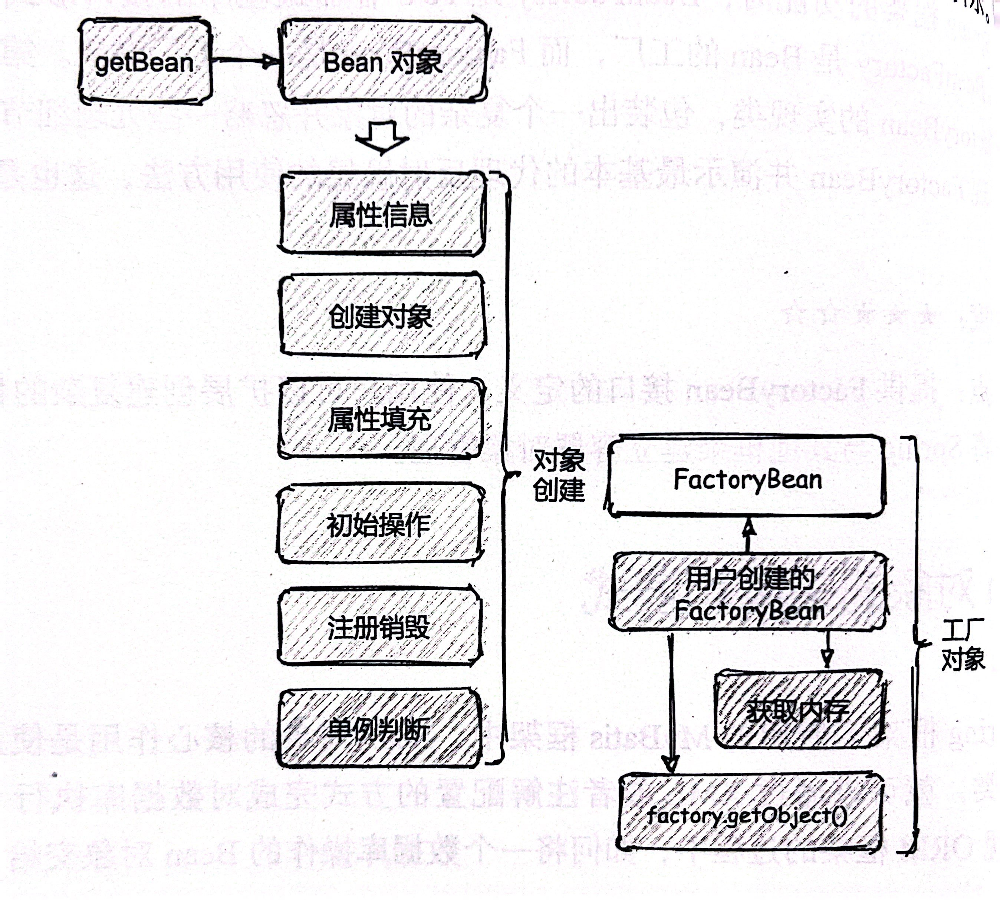

整个实现过程包括两个部分，一部分是实现单例或原型对象，另一部分是实现通过FactoryBean获取具体调用对象的getObject操作。SCOPE_SINGLETON和SCOPE_PROTOTYPE对象的创建与获取方式的主要区别在于，在创建完AbstractAutowireCapableBeanFactory#createBean对象后是否将其存储到内存中，如果没有存储在内存中，则每次获取对象时都会重写创建对象。通过CreateBean执行完对象创建、属性填充、依赖加载、前置后置处理、初始化等操作后，就要开始判断整个对象是否为一个FactoryBean。如果是，则继续执行获取FactoryBean具体对象中的getObject操作。在获取对象的整个过程中会新增一个单例类型的判断语句factory.isSingleton，用于决定是否使用内存来存储对象信息。

## 4. FactoryBean和对象模式实现

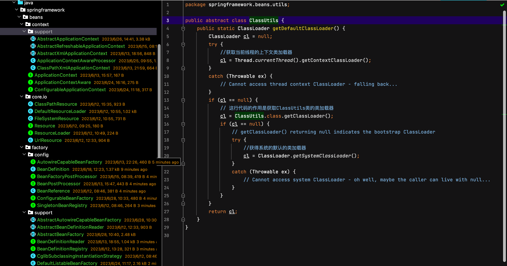

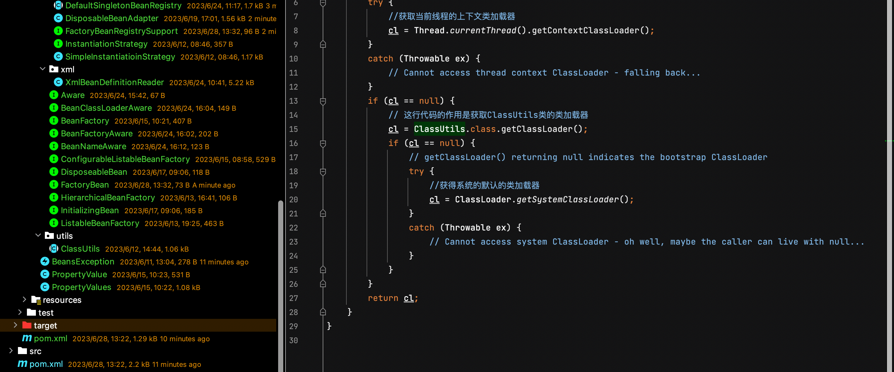

整个实现过程并不复杂，只是在现有的AbstractAutowireCapableBeanFactory类与继承的抽象类AbstractBeanFactory中进行扩展。不过这次在AbstarctBeanFactory继承的DefaultSingletonBeanRegistry类的中间加了一个FactoryBeanRegistrySupport类。它主要为FactoryBean注册提供了支持。

**2.Bean对象的作用范围以及XML解析**

```java
public class BeanDefinition {
    String SCOPE_SINGLETON=ConfigurableBeanFactory.SCOPE_SINGLETON;
    String SCOPE_PROTOTYPE=ConfigurableBeanFactory.SCOPE_PROTOTYPE;
    private Class beanClass;
    private PropertyValues propertyValues;
    private String initMethodName;
    private String destroyMethodName;
    private String scope=SCOPE_SINGLETON;
    //默认是单例模式
    private boolean singleton=true;
    private boolean prototype=false;

    public String getScope() {
        return scope;
    }

    public void setScope(String scope) {
        this.scope = scope;
    }

    public boolean isSingleton() {
        return singleton;
    }

     public void setScope(String scope) {
        this.scope = scope;
        if(scope.equals("prototype")){
            this.singleton=false;
            this.prototype=true;
        }
    }
    public boolean isPrototype() {
        return prototype;
    }

    public void setPrototype(boolean prototype) {
        this.prototype = prototype;
    }

    public BeanDefinition(Class beanClass) {
        this.beanClass = beanClass;
        this.propertyValues=new PropertyValues();
    }
    public BeanDefinition(Class beanClass ,PropertyValues propertyValues){
        this.beanClass=beanClass;
        this.propertyValues=propertyValues !=null ? propertyValues: new PropertyValues();
    }

    public Class getBeanClass() {
        return beanClass;
    }

    public void setBeanClass(Class beanClass) {
        this.beanClass = beanClass;
    }

    public PropertyValues getPropertyValues() {
        return propertyValues;
    }

    public void setPropertyValues(PropertyValues propertyValues) {
        this.propertyValues = propertyValues;
    }

    public String getInitMethodName() {
        return initMethodName;
    }

    public void setInitMethodName(String initMethodName) {
        this.initMethodName = initMethodName;
    }

    public String getDestroyMethodName() {
        return destroyMethodName;
    }

    public void setDestroyMethodName(String destroyMethodName) {
        this.destroyMethodName = destroyMethodName;
    }
}
```

Singletong、prototype是在BeanDefinition类中新增加的两个属性，用于将从Spring.xml配置文件中解析到的Bean对象的作用范围填充到属性中。

```java
public class XmlBeanDefinitionReader extends AbstractBeanDefinitionReader {
    public XmlBeanDefinitionReader(BeanDefinitionRegistry registry){
        super(registry);
    }
    public XmlBeanDefinitionReader(BeanDefinitionRegistry registry, ResourceLoader resourceLoader){
        super(registry,resourceLoader);
    }

    @Override
    public void loadBeanDefinitions(Resource resource) throws BeansException {
        try {
            try (InputStream inputStream=resource.getInputStream()){
                //注册beanDefition
               doLoadBeanDefinitions(inputStream);
            }
        }catch(IOException | ClassNotFoundException | ParserConfigurationException | SAXException e){
            throw  new BeansException("IOException parsing XML document form"+resource,e);
        }
    }

    @Override
    public void loadBeanDefinitions(Resource... resources) throws BeansException {
        for(Resource resource: resources){
            loadBeanDefinitions(resource);
        }
    }

    @Override
    public void loadBeanDefinitions(String location) throws BeansException {
        ResourceLoader resourceLoader=getResourceLoader();
        Resource resource=resourceLoader.getResource(location);
        loadBeanDefinitions(resource);

    }

    @Override
    public void loadBeanDefinitions(String... locations) throws BeansException {
        ResourceLoader resourceLoader=getResourceLoader();
        for(String location: locations){
            Resource resource=resourceLoader.getResource(location);
            loadBeanDefinitions(resource);
        }
    }

    public void doLoadBeanDefinitions(InputStream inputStream)
            throws ParserConfigurationException, SAXException, IOException, ClassNotFoundException, BeansException {
        DocumentBuilderFactory factory = DocumentBuilderFactory.newInstance();
        DocumentBuilder builder = factory.newDocumentBuilder();
        Document doc = builder.parse(inputStream);
        NodeList beanNodes = doc.getElementsByTagName("bean");
        for (int i = 0; i < beanNodes.getLength(); i++) {
            Node beanNode = beanNodes.item(i);
            if (beanNode.getNodeType() == Node.ELEMENT_NODE) {
                Element beanElement = (Element) beanNode;
                String id = beanElement.getAttribute("id");
                String name = beanElement.getAttribute("name");
                String className = beanElement.getAttribute("class");
                String init_method=beanElement.getAttribute("init-method");
                String destroy_method=beanElement.getAttribute("destroy-method");
                String beanScope= beanElement.getAttribute("scope");
                Class<?> clazz = Class.forName(className);

                String beanName = id.isEmpty() ? name : id;
                if (beanName.isEmpty()) {
                    beanName = Character.toLowerCase(clazz.getSimpleName().charAt(0)) + clazz.getSimpleName().substring(1);
                }

                BeanDefinition beanDefinition = new BeanDefinition(clazz);
                beanDefinition.setInitMethodName(init_method);
                beanDefinition.setDestroyMethodName(destroy_method);
                if(StrUtil.isNotEmpty(beanScope)){
                    beanDefinition.setScope(beanScope);
                }
                NodeList propertyNodes = beanElement.getElementsByTagName("property");
                for (int j = 0; j < propertyNodes.getLength(); j++) {
                    Node propertyNode = propertyNodes.item(j);
                    if (propertyNode.getNodeType() == Node.ELEMENT_NODE) {
                        Element propertyElement = (Element) propertyNode;
                        String attrName = propertyElement.getAttribute("name");
                        String attrValue = propertyElement.getAttribute("value");
                        String attrRef = propertyElement.getAttribute("ref");
                        Object value = attrRef.isEmpty() ? attrValue : new BeanReference(attrRef);
                        PropertyValue propertyValue = new PropertyValue(attrName, value);
                        beanDefinition.getPropertyValues().addPropertyValue(propertyValue);
                    }
                }
                if (getRegistry().containsBeanDefinition(beanName)) {
                    throw new BeansException("Duplicate beanName[" + beanName + "] is not allowed");
                }
                getRegistry().registerBeanDefinition(beanName, beanDefinition);
            }
        }
    }
}
```

在解析XML处理类XmlBeanDefinitionReader的过程中，新增了Bean对象配置中对scope的解析，并将这个属性填充到Bean的定义beanDefinition.setScope(beanScope)中。

**在创建和修改对象时，判断单例模式和原型模式**

```java
public abstract class AbstractAutowireCapableBeanFactory extends AbstractBeanFactory implements AutowireCapableBeanFactory {
    //这里使用cglib的代理方法创建bean实例
    private InstantiationStrategy instantiationStrategy=new CglibSubclassingInstantiationStrategy();
    private PropertyValues propertyValues;

    //用来床架bean的函数
    @Override
    protected Object createBean(String beanName, BeanDefinition beanDefinition, Object[] args) throws BeansException {
        Object bean=null;
        try{
            bean=ctreatBeanInstance(beanDefinition,beanName,args);
            //给bean对象填充属性
            applyPropertyValues(beanName,bean,beanDefinition);
            //执行Beand对象的初始化方法和BeanPostProcessor接口的前置方法和后置处理方法
            bean=initializeBean(beanName,bean,beanDefinition);
        }catch (Exception e){
            throw new BeansException("Instantiation of bean failed",e);
        }
        registerDisposableBeanIfNeccessary(beanName,bean,beanDefinition);
        //注册实现了DisposeableBean接口的Bean对象
        if(beanDefinition.isSingleton()){
            registerSinleton(beanName,bean);
        }
        return bean;
    }
    protected void registerDisposableBeanIfNeccessary(String beanName,Object bean, BeanDefinition beanDefinition){
        //非singleton类型的bean对象不必执行销毁方法
        if(!beanDefinition.isSingleton())return;;
        if(bean instanceof DisposeableBean || StrUtil.isNotEmpty(beanDefinition.getDestroyMethodName())){
            registerDisposableBean(beanName,new DisposableBeanAdapter(bean,beanName,beanDefinition));
        }
    }
    private Object initializeBean(String beanName,Object bean, BeanDefinition beanDefinition) throws BeansException {
        //如果该bean标记类Aware的接口
        if(bean instanceof Aware){
            if(bean instanceof BeanFactoryAware){
                ((BeanFactoryAware)bean).setBeanFactory(this);
            }
            if(bean instanceof BeanClassLoaderAware){
                ((BeanClassLoaderAware)bean).setBeanClassLoader(getBeanClassLoader());
            }
            if(bean instanceof BeanNameAware){
                ((BeanNameAware)bean).setBeanName(beanName);
            }
        }
        //1. 执行BeanPostProcessor Before前置处理
        Object wrappedBean=applyBeanPostProcessorsBeforeInitialization(bean,beanName);
        //2. 待完成的内容
        try{
            invokeInitMethods(beanName,wrappedBean,beanDefinition);
        }catch (Exception e){
            throw  new BeansException("Invocation of init method of bean ["+beanName+"] failed", e);
        }

        //3. 执行BeanPostProcessor After后置处理
        wrappedBean=applyBeanPostProcessorsAfterInitialization(bean,beanName);
        return wrappedBean;
    }
    private void invokeInitMethods(String beanName,Object bean, BeanDefinition beanDefinition) throws Exception, BeansException {
        //1. 实现InitializingBean接口
       if(bean instanceof InitializingBean){
           ((InitializingBean) bean).afterPropertiesSet();
       }
       //2. 配置信息init-method{判断是为了避免二次销毁}
        String initMethodName=beanDefinition.getInitMethodName();
       if(StrUtil.isNotEmpty(initMethodName)){
           Method iniMethod=beanDefinition.getBeanClass().getMethod(initMethodName);
           if(null==iniMethod){
               throw  new BeansException("Cou;d not find an init method named '"+initMethodName+"' on bean with name '"+beanName+"'");
           }
           iniMethod.invoke(bean);
       }

    }
    @Override
    public Object applyBeanPostProcessorsAfterInitialization(Object existingBean, String beanName) throws BeansException {
        Object result=existingBean;
        for(BeanPostProcessor processor :getBeanPostProcessors()){
            Object current=processor.postProcessBeforeInitialization(result,beanName);
            if(null==current) return result;
            result=current;
        }
        return result;
    }

    @Override
    public Object applyBeanPostProcessorsBeforeInitialization(Object existingBean, String beanName) throws BeansException {
        Object result=existingBean;
        for(BeanPostProcessor processor :getBeanPostProcessors()){
            Object current=processor.postProcessAfterInitialization(result,beanName);
            if(null==current) return result;
            result=current;
        }
        return result;
    }

    protected Object ctreatBeanInstance(BeanDefinition beanDefinition, String beanName, Object[] args) throws BeansException {
        Constructor constructorToUser=null;
        Class<?> beanClass=beanDefinition.getBeanClass();
        Constructor<?>[] declaredConstructors=beanClass.getDeclaredConstructors();
        for (Constructor<?> declaredConstructor : declaredConstructors) {
            if(args!=null && declaredConstructor.getParameterTypes().length==args.length)
            {
                constructorToUser=declaredConstructor;
                break;
            }
        }
        return  getInstantiationStrategy().instatiate(beanDefinition,beanName,constructorToUser,args);
    }
    //该方法用于给Bean对象填充属性
    protected  void applyPropertyValues(String beanName, Object bean , BeanDefinition beanDefinition){
        try{
            //或的bean的属性集合
            PropertyValues propertyValues = beanDefinition.getPropertyValues();
            for (PropertyValue propertyValue : propertyValues.getPropertyValues()) {
                //取出属性名和属性值
                String name=propertyValue.getName();
                Object value=propertyValue.getValue();
                if(value instanceof BeanReference){
                    //例如A依赖B，获取B的实例化对象
                    BeanReference beanReference=(BeanReference) value;
                    value=getBean(beanReference.getBeanName());
                }
                //属性填充
                BeanUtil.setFieldValue(bean,name,value);
            }
        } catch (Exception | BeansException e) {
            throw new BeanException("Error setting property values："+beanName);
        }
    }
    public InstantiationStrategy getInstantiationStrategy(){
        return instantiationStrategy;
    }
    public void setInstantiationStrategy(InstantiationStrategy instantiationStrategy){
        this.instantiationStrategy=instantiationStrategy;
    }
}
```

单例模式和原型模式的区别为是否将Bean对象存储在内存中。如果是原型模式，就不会将Bean对象存储到内存中，每次获取都需要重新创建对象。非单例模式的Bean不需要执行销毁方法。所以这里的代码有两处修改，一处是在CreateBean中判断是否添加了registerSingleton(beanName,bean)，另一处是在registerDisposableBeanIfNecessary销毁注册中执行判断语句if(!beanDefinition.isSingleton())return。

**4. 定义FactoryBean接口**

```java
public interface FactoryBean<T> {
    T getObkect() throws Exception;
    Class<?> getObjectType();
    boolean isSingleton();
}
```

定义FactoryBean接口需要提供3个方法—获取对象、对象类型以及是否为单例对象。如果是单例对象，将Bean存储在内存中

**5. 实现一个FactoryBean的注册服务**

```java
public abstract class FactoryBeanRegistrySupport extends DefaultSingletonBeanRegistry{
    //这个是用来缓冲单例bean的集合
    private final Map<String,Object> factoryBeanObjectCache=new ConcurrentHashMap<>();
    protected Object getCacheObjectForFactoryBean(String beanName){
        Object object=this.factoryBeanObjectCache.get(beanName);
        return (object !=null ? object :null);
    }

    protected Object getObjectFromFactoryBean(FactoryBean factory,String beanName) throws BeansException {
        if(factory.isSingleton()){
            Object object=this.factoryBeanObjectCache.get(beanName);
            if(object==null){
                object=doGetObjectFromFactoryBean(factory,beanName);
                this.factoryBeanObjectCache.put(beanName,(object!=null?object:null));
            }
            return object;
        }else {
            return doGetObjectFromFactoryBean(factory,beanName);
        }
    }
    private Object doGetObjectFromFactoryBean(final  FactoryBean factory,final String beanName) throws BeansException {
        try {
            return factory.getObject();
        }catch(Exception e){
            throw new BeansException("FactoryBean threw exception on object["+beanName+"] creation",e);
        }
    }
}
```

FactoryBeanRegistrySupport类主要处理关于FactoryBean类对象的注册操作，之所以放到一个单独的类中，是为了不同领域模块下的类只负责各自需要完成的功能，避免扩展导致类膨胀而难以维护。通用这里也定义了缓冲操作factoryBeanObjectCache，用于存储单例类型的对象避免重复创建该对象。在日常使用中，也需要创建单例对象。doGetObjectFromFactoryBean方法是获取factoryBean#getObject的方法，因为既要处理缓冲又要获取对象，所以额外提供了该方法进行逻辑包装。这部分操作方式和日常业务逻辑开发非常相似。如果无法从Redis中获取数据，从其他数据库中获取数据并写入Redis。

**扩展AbstractBeanFactory**

```java
public abstract class AbstractBeanFactory extends FactoryBeanRegistrySupport implements ConfigurableBeanFactory {
    private final List<BeanPostProcessor> beanPostProcessors = new ArrayList<>();
    @Nullable
    private ClassLoader beanClassLoader = ClassUtils.getDefaultClassLoader();
    @Override
    public Object getBean(String Name,Object... args) throws BeansException {
        Object bean = getSingleton(Name);
        if (bean != null){
            return bean;
        }
        return doGetBean(Name,args);
    }
    @Override
    @Nullable
    public ClassLoader getBeanClassLoader() {
        return this.beanClassLoader;
    }

    @Override
    public Object getBean(String name) throws BeansException {
        Object bean=getSingleton(name);
        if (bean != null){
            return bean;
        }
        return doGetBean(name,null);
    }

    @Override
    public <T> T getBean(String name, Class<T> requiredType) throws BeansException {
        Object bean=getSingleton(name);
        if (bean != null && bean.getClass()==requiredType){
            return (T) bean;
        }
        BeanDefinition beanDefinition=getBeanDefinition(name);
        if(beanDefinition.getBeanClass() !=requiredType)
            return null;
        return (T) doGetBean(name,null);
    }


    //抽象方法交给子类区实现
    protected abstract BeanDefinition getBeanDefinition(String beanName) throws BeansException;
    protected abstract Object createBean(String beanName ,BeanDefinition beanDefinition,Object[] args)throws BeansException;
    public List<BeanPostProcessor> getBeanPostProcessors() {
        return this.beanPostProcessors;
    }

    @Override
    public void addBeanPostProcessor(BeanPostProcessor beanPostProcessor) {
        this.beanPostProcessors.remove(beanPostProcessor);
        this.beanPostProcessors.add(beanPostProcessor);
    }
    protected <T>T doGetBean(final String name,final Object[] args) throws BeansException {
        Object sharedInstance=getSingleton(name);
        if(sharedInstance!=null){
            //如果是FactoryBean类，则需要调用FactoryBean#getObject
            return (T) getObjectForBeanInstance(sharedInstance,name);
        }
        BeanDefinition beanDefinition=getBeanDefinition(name);
        Object bean=createBean(name,beanDefinition,args);
        return (T) getObjectForBeanInstance(bean,name);
    }
    private Object getObjectForBeanInstance(Object beanInstance, String beanName) throws BeansException {
        if(!(beanInstance instanceof FactoryBean)){
             return beanInstance;
        }
        Object object=getCacheObjectForFactoryBean(beanName);
        if(object ==null){
            FactoryBean<?> factoryBean =(FactoryBean<?>) beanInstance;
            object=getObjectFromFactoryBean(factoryBean,beanName);
        }
        return object;
    }

}

```

这里将AbstractBeanFactory之前继承的DefaultSingletonBeanRegistry修改为类FactoryBeanRegistrySupport为了扩展出创建FactoryBean的功能，需要在一个链条服务上截出一段来处理额外的业务，再将链条接上。这里新增的功能主要是在doGetBean方法中实现的，通过调用 (T)  getObjectForBeanInstance(sharedInstance,name)方法来获取FactoryBean。在getObjectForBeanInstance方法中执行具体的instanceof判断，并从FactoryBean得缓存中获取对象。如果缓存中不存在对象，则调用FactoryBeanRegistrySupport#getObjectFromFactoryBean，并执行具体的操作。

**代理Bean和对象模式测试**

- 事先准备

```java
public interface UserDao {
    String queryUserName(String uid);
}
```

这里删除了UserDao，定义了一个UserDao接口，这样做是为了通过FactoryBean执行自定义对象的代理操作

```java
public class userService {
     private String uId;
     private String commpany;
     private String location;
     private UserDao userDao;
     public String queryUserInfo(){
         return userDao.queryUserName(uId)+","+commpany+","+location;
     }

    public String getuId() {
        return uId;
    }

    public void setuId(String uId) {
        this.uId = uId;
    }

    public String getCommpany() {
        return commpany;
    }

    public void setCommpany(String commpany) {
        this.commpany = commpany;
    }

    public String getLocation() {
        return location;
    }

    public void setLocation(String location) {
        this.location = location;
    }

    public UserDao getUserDao() {
        return userDao;
    }

    public void setUserDao(UserDao userDao) {
        this.userDao = userDao;
    }
}
```

在UserService中将原来的UserDao属性修改为UserDao接口，后面会给这个属性注册代理对象

- 定义FactoryBean接口

```java
public class ProxyBeanFactory implements FactoryBean<UserDao> {
    @Override
    public UserDao getObject() throws Exception {
        InvocationHandler handler=(proxy,method,args)->{
            Map<String,String> hashmap=new HashMap<>();
            hashmap.put("10001","张三");
            hashmap.put("10002","李四");
            hashmap.put("10003","王五");
            return "你被代理了"+method.getName()+"："+hashmap.get(args[0].toString());
        };
        return (UserDao) Proxy.newProxyInstance(Thread.currentThread().getContextClassLoader(),new Class[]{UserDao.class},handler);
    }

    @Override
    public Class<?> getObjectType() {
        return UserDao.class;
    }

    @Override
    public boolean isSingleton() {
        return true;
    }
}
```

ProxyBeanFactory是一个实现FactoryBean接口的代理类的名称，主要模拟了UserDao的原有功能，类似于MyBatis框架中的代理操作。getObject方法提供了一个InvocationHandler代理对象，当调用getObject方法时，执行了InvecationHandler代理对象的功能。

- 配置文件

```xml
<?xml version="1.0" encoding="UTF-8" ?>
<beans>
    <bean id="userService" class="springframework.bean.userService" scope="prototype">
        <property name="uId" value="10001"></property>
        <property name="userDao" ref="proxyUserDao"></property>
        <property name="location"  value="深圳"></property>
        <property name="company" value="腾讯"></property>
    </bean>
    <bean id="proxyUserDao" class="springframework.ProxyBeanFactory"></bean>
</beans>
```

在配置文件中，将ProxyUserDao代理对象注入到userService的userDao中。这里用代理类替换了UserDao

## 5.  Spring相关源码解析

**BeanDefinition**

```java
public interface BeanDefinition extends AttributeAccessor, BeanMetadataElement {
	//SCOPE_SINGLETON表示单例模式，整个ApplicationContext只有一个该Bean的实例（可能存在线程不安全问题）
	String SCOPE_SINGLETON = ConfigurableBeanFactory.SCOPE_SINGLETON;
	//原型模式，每需要一个实例就创建一个实例
	String SCOPE_PROTOTYPE = ConfigurableBeanFactory.SCOPE_PROTOTYPE;
	//用户自定义的bean
	int ROLE_APPLICATION = 0;
	//来源于配置文件的bean
	int ROLE_SUPPORT = 1;
	//spring内部的bean
	int ROLE_INFRASTRUCTURE = 2;
	//如果该Bean有父bean，则设置父bean的名称
	void setParentName(@Nullable String parentName);
	//如果该Bean有父bean的话，就返回该bean父bean的名字
	@Nullable
	String getParentName();
	//设置父bean的类名
	void setBeanClassName(@Nullable String beanClassName);
	//获得bean的类名
	@Nullable
	String getBeanClassName();
	//覆盖此 Bean 的目标作用域，并指定新的作用域名称，前面说到bean的作用域是单例或者是原型
	void setScope(@Nullable String scope);
	//获得此bean的作用域
	@Nullable
	String getScope();
	//Spring框架的Bean可以配置为懒加载。默认情况下，Spring容器在初始化时会创建并初始化所有singleton作用域的Bean。
	// 然而，如果你的应用有很多Bean，或者有些Bean的初始化需要很长时间或很多资源，那么你可能想把这些Bean配置为懒加载
	void setLazyInit(boolean lazyInit);
	//判断当前bean是不是懒加载
	boolean isLazyInit();
	//设置此bean依赖于其他bean的名称
	void setDependsOn(@Nullable String... dependsOn);
	//获得此bean依赖于其它bean的名称
	@Nullable
	String[] getDependsOn();
	//这个方法用于指定当前 Bean 是否应该被考虑作为其他 Bean 自动装配的候选者
	//自动装配（autowiring）是 Spring 框架的一个特性，它允许 Spring 容器自动解析 Bean 之间的依赖关系。通过设置 autowireCandidate，你可以控制哪些 Bean 应该被用于自动装配
	//假设你有两个实现了同一个接口的 Bean，BeanA 和 BeanB，然后有另一个 BeanC 依赖这个接口。在自动装配的过程中，Spring 容器可能不知道应该将哪个 Bean（BeanA 还是 BeanB）
	// 注入到 BeanC 中。在这种情况下，你可以通过 setAutowireCandidate(false) 来指定不应该自动装配的 Bean
	void setAutowireCandidate(boolean autowireCandidate);
	//判断该bean是否是依赖注入的候选项
	boolean isAutowireCandidate();
	//这个方法用于指定当前Bean是否为其类型的主要候选者。它主要用于在多个Bean可以满足同一依赖的情况下，选择应该被注入的Bean。
	//参数primary是一个布尔值。如果设为true，那么当有多个Bean可以满足同一依赖时，这个Bean将优先被Spring容器选择
	void setPrimary(boolean primary);
	//判断该bean是否为其类型的主要候选者
	boolean isPrimary();
	//这个方法用于设置工厂 Bean 的名称，工厂 Bean 用于产生当前 Bean，如果一个 Bean 不是通过构造函数或简单的工厂方法创建的，而是需要复杂的初始化逻辑或者需要从某些服务获取，
	// 那么通常会使用一个工厂 Bean 来创建这个 Bean。工厂 Bean 是一个普通的 Bean，它的类实现了 org.springframework.beans.factory.FactoryBean 接口。你可以在这个
	// 类中定义如何创建目标 Bean。在这种情况下，你可以使用 setFactoryBeanName(String factoryBeanName) 方法来设置工厂 Bean 的名称。然后，Spring 容器在创建目标 Bean
	// 的时候，会使用指定的工厂 Bean。
	void setFactoryBeanName(@Nullable String factoryBeanName);
	//返回生成该bean的工厂名
	@Nullable
	String getFactoryBeanName();
	//这个方法被用来设置工厂方法的名称，此工厂方法应在指定的工厂Bean中用于创建此Bean
	//在一些情况下，我们可能需要使用特定的方法来创建一个 Bean，这在Bean的创建过程中需要一些特殊的逻辑时尤其有用。在这种情况下，我们可以设置一个工厂方法，这个方法将被Spring容器调用以创建 Bean。
	//通过使用 setFactoryMethodName 方法，我们可以指定工厂方法的名称。Spring容器将使用反射在指定的工厂Bean中查找并调用这个方法
	void setFactoryMethodName(@Nullable String factoryMethodName);
	//获得创建该bean的工厂方法的名称
	@Nullable
	String getFactoryMethodName();
	//在创建 Bean 的时候，Spring 容器可能需要知道 Bean 构造函数的参数，这样才能正确地调用构造函数创建 Bean。这些参数可以是其他的 Bean，也可以是基本类型的值。
	//ConstructorArgumentValues 是一个持有这些构造函数参数的类。每一个 ConstructorArgumentValues.ValueHolder 对象都持有一个构造函数参数的值和它的类型。
	//getConstructorArgumentValues() 方法返回一个 ConstructorArgumentValues 对象，这个对象包含了所有的构造函数参数。
	//这个方法主要在 Spring 内部使用，当 Spring 容器创建一个 Bean 的时候，它会调用这个方法来获取构造函数参数。在你的应用代码中，通常不需要直接使用这个方法
	ConstructorArgumentValues getConstructorArgumentValues();
	//判断是否包含构造函数参数
	default boolean hasConstructorArgumentValues() {
		return !getConstructorArgumentValues().isEmpty();
	}
	//该方法用于获取 Bean 的属性值。
	//当 Spring 容器创建一个 Bean 时，它会根据你在 BeanDefinition 中定义的属性值来配置这个 Bean。这些属性值可以是其他的 Beans，也可以是基本类型的值。
	//MutablePropertyValues 是一个持有这些属性值的类。每个 PropertyValue 对象都持有一个属性名和一个属性值。getPropertyValues() 方法返回一个
	// MutablePropertyValues 对象，该对象包含了所有的属性值。
	//这个方法主要在 Spring 内部使用，当 Spring 容器创建一个 Bean 的时候，它会调用这个方法来获取属性值。在你的应用代码中，通常不需要直接使用这个方法
	MutablePropertyValues getPropertyValues();
	//判断这个类是否有任何属性
	default boolean hasPropertyValues() {
		return !getPropertyValues().isEmpty();
	}
	//此方法用于设置用于初始化 Bean 的方法的名称。
	//有时候，在 Bean 被实例化和依赖注入之后，你可能需要执行一些初始化逻辑，如设置一些属性或开启一些资源。在这种情况下，你可以定义一个初始化方法，
	// 并通过 setInitMethodName 来告诉 Spring 在创建 Bean 后调用此方法。
	//参数 initMethodName 是初始化方法的名称。Spring 容器将使用反射在 Bean 类中查找并调用这个方法。@Nullable 注解表示 initMethodName 参数可以为 null，如果为 null，则表示没有指定初始化方法
	void setInitMethodName(@Nullable String initMethodName);
	//获得bean的初始化方法的名称
	@Nullable
	String getInitMethodName();
	//此方法用于设置用于销毁 Bean 的方法的名称。
	//在应用程序关闭或 Bean 不再需要时，你可能需要执行一些清理逻辑，例如关闭打开的网络连接或清除临时文件。在这种情况下，你可以定义一个销毁方法，
	// 并通过 setDestroyMethodName 来告诉 Spring 在销毁 Bean 时调用此方法
	void setDestroyMethodName(@Nullable String destroyMethodName);
	//获得销毁方法的名称
	@Nullable
	String getDestroyMethodName();
	//设置bean的角色
	void setRole(int role);
	//获得bean的角色
	int getRole();
	//bean的一些描述信息
	void setDescription(@Nullable String description);
	//获得bean的一些描述
	@Nullable
	String getDescription();
	//getResolvableType() 是在 Spring 框架的 BeanDefinition 接口中定义的一个方法。此方法用于获取 Bean 的 ResolvableType 对象。
	//ResolvableType 是 Spring 框架中一个非常重要的类，它用于表示一个可以被解析的类型。ResolvableType 提供了一种可靠的方式来处理和解析 Java 泛型类型。
	// 例如，你可以使用 ResolvableType 来获取一个泛型接口的泛型参数。在 BeanDefinition 中，getResolvableType() 方法用于获取这个 Bean 的类型。这个类型可能是一个具体的类，
	// 也可能是一个带有泛型参数的接口或者类。例如，如果你的 Bean 是一个 List<String>，那么 getResolvableType() 方法将返回一个 ResolvableType 对象，你可以通过这个对象来获取 List 的泛型参数 String
	ResolvableType getResolvableType();
	//Java 的泛型是在编译期实现的，也就是说，当你写下一段使用了泛型的代码后，编译器在编译的时候会进行类型检查，确保你的代码中对泛型的使用是安全的。然后，编译器会将泛型信息删除，
	// 这个过程就是所谓的类型擦除（Type Erasure）。类型擔除的结果就是，当你的代码在运行时，泛型信息已经不存在了，Java 运行时并不知道你的 List<String> 实际上是一个字符串列表。它只知道这是一个 List。
	//ResolvableType 提供的功能，就是在运行时对这些泛型类型进行解析。它可以捕获编译时期的泛型信息，并且提供了方法来查询这些信息。比如你有一个字段定义为 List<String>，
	// 通过 ResolvableType，你可以获取到这个字段的泛型类型 String。这是如何做到的呢？原因在于，虽然类型擦除会移除大部分的泛型类型信息，但并非所有的信息都会被移除。在某些情况下，比如字段、方法参数和
	// 返回类型、类扩展和接口实现，泛型信息会被保留在 Java 的类文件中，然后在运行时通过反射 API 可以查询到。ResolvableType 正是使用了这个特性来获取泛型信息。这样，开发者就可以在运行时获取和操作这些
	// 泛型信息，这在很多场景下是非常有用的，比如 Spring 框架在进行类型匹配、类型转换、方法参数解析等操作时，就需要用到这些泛型信息

	//判断该bean是不是为单例模式
	boolean isSingleton();
	//判断该bean是不是原型模式
	boolean isPrototype();
	//此方法用于判断一个 Bean 是否被定义为抽象。
	//在 Spring 中，一个 Bean 可以被定义为抽象，意味着它不会被实例化。抽象的 Bean 通常作为模板使用，定义了一些通用的配置，
	// 这些配置可以被其他具体的 Bean 继承。当 Spring 容器启动时，它不会尝试去创建抽象的 Bean
	boolean isAbstract();
	//此方法用于获取 Bean 定义的来源（source）的描述。这个来源通常是 Bean 配置的资源，例如 XML 配置文件，Java 配置类等。
	//getResourceDescription() 返回的字符串可能包含了 Bean 配置资源的全路径名，也可能只包含了资源的简单名称，这主要取决于具体的 BeanDefinition 实现。
	//如果一个 Bean 是在 XML 配置文件中定义的，那么 getResourceDescription() 方法可能返回 XML 文件的全路径名此方法用于获取 Bean 定义的来源（source）的描述。
	// 这个来源通常是 Bean 配置的资源，例如 XML 配置文件，Java 配置类等。getResourceDescription() 返回的字符串可能包含了 Bean 配置资源的全路径名，也可能只包
	// 含了资源的简单名称，这主要取决于具体的 BeanDefinition 实现。如果一个 Bean 是在 XML 配置文件中定义的，那么 getResourceDescription() 方法可能返回 XML 文件的全路径名
	@Nullable
	String getResourceDescription();
	//获得原始的bean的定义
	@Nullable
	BeanDefinition getOriginatingBeanDefinition();

}
```

**AbstractAutowireCapableBeanFactory**

```java
public abstract class AbstractAutowireCapableBeanFactory extends AbstractBeanFactory implements AutowireCapableBeanFactory {
protected Object doCreateBean(String beanName, RootBeanDefinition mbd, @Nullable Object[] args)
			throws BeanCreationException {
		//在Spring框架中，BeanWrapper接口是用于处理Bean属性的主要接口。BeanWrapper的作用是设置和获取属性值（单个或批量），获取属性描述符，以及查询设置属性值的能力。
		//BeanWrapper扩展了 PropertyAccessor，这是所有Spring的属性访问器实现的基本接口，包括 BeanWrapper。 BeanWrapper 也提供了分析和管理的方法，以处理嵌套的路径和类型转换。
		//当创建一个新的Bean实例并对其进行填充（例如，从XML配置文件中读取的属性值）时，Spring使用 BeanWrapper。同样，当Spring需要读取或修改现有Bean实例的属性时，也会使用 BeanWrapper。
		BeanWrapper instanceWrapper = null;
		//判断RootbeanDefinition对象的类型
		if (mbd.isSingleton()) {
            //factoryBeanInstanceCache这个集合中，一个bean的名称对应一个BeanWrapper，如果是当例模式我们就删除这对映射关系
			instanceWrapper = this.factoryBeanInstanceCache.remove(beanName);
		}
		//表示不是单例模式
		if (instanceWrapper == null) {
			// 使用 createBeanInstance 方法实例化 Bean。这个过程可能会调用构造函数或工厂方法，或者在特殊情况下，例如对于 FactoryBean 或者通过 CGLIB 创建的 Bean，可能会使用特定的实例化策略
			instanceWrapper = createBeanInstance(beanName, mbd, args);
		}
		//由BeanWrapper获得Bean对象
		Object bean = instanceWrapper.getWrappedInstance();
		//获得该bean的类型（即对应的class对象）
		Class<?> beanType = instanceWrapper.getWrappedClass();
		if (beanType != NullBean.class) {
			mbd.resolvedTargetType = beanType;
		}
		//用于在应用程序上下文中创建bean时执行后处理程序。具体来说，它确保应用所有合并的bean定义的后处理程序，并且只在第一次创建bean时执行。如果在后处理程序期间发生异常，则会抛出BeanCreationException
		synchronized (mbd.postProcessingLock) {
			//这段代码的作用是确保在创建应用程序上下文中的bean时，应用所有合并的bean定义的后处理程序，并且只在第一次创建bean时执行。如果在后处理程序期间发生异常，则会抛出BeanCreationException
			if (!mbd.postProcessed) {
				try {
					//调用applyMergedBeanDefinitionPostProcessors方法，该方法用于应用所有已注册的MergedBeanDefinitionPostProcessor对象，
					// 以修改BeanDefinition对象的属性值
					applyMergedBeanDefinitionPostProcessors(mbd, beanType, beanName);
				}
				catch (Throwable ex) {
					throw new BeanCreationException(mbd.getResourceDescription(), beanName,
							"Post-processing of merged bean definition failed", ex);
				}
				//将BeanDefinition对象的postProcessed属性设置为true，表示已经完成了所有的后处理操作。
				mbd.postProcessed = true;
			}
		}
        //检查BeanDefinition对象的isSingleton方法是否返回true，检查是否允许循环引用，以及检查当前单例对象是否正在创建中
		// 用于检查是否允许在创建Bean对象时提前曝光一个单例对象
		boolean earlySingletonExposure = (mbd.isSingleton() && this.allowCircularReferences &&
				isSingletonCurrentlyInCreation(beanName));
		if (earlySingletonExposure) {
			if (logger.isTraceEnabled()) {
				logger.trace("Eagerly caching bean '" + beanName +
						"' to allow for resolving potential circular references");
			}
			//将当前对象添加到一个单例工厂
			addSingletonFactory(beanName, () -> getEarlyBeanReference(beanName, mbd, bean));
		}

		//初始化bean实例
		Object exposedObject = bean;
		try {
			//调用 populateBean 方法，该方法用于填充 Bean 的属性值。
			populateBean(beanName, mbd, instanceWrapper);
			//调用 initializeBean 方法，该方法用于初始化 Bean，并返回一个可公开的 Bean 对象
			exposedObject = initializeBean(beanName, exposedObject, mbd);
		}
		catch (Throwable ex) {
			if (ex instanceof BeanCreationException && beanName.equals(((BeanCreationException) ex).getBeanName())) {
				throw (BeanCreationException) ex;
			}
			else {
				throw new BeanCreationException(
						mbd.getResourceDescription(), beanName, "Initialization of bean failed", ex);
			}
		}
        //检查是够需要提前暴露单例bean，以避免循环引用问题
		if (earlySingletonExposure) {
			//根据bean的名称获得这个单例bean
			Object earlySingletonReference = getSingleton(beanName, false);
			if (earlySingletonReference != null) {
				if (exposedObject == bean) {//如果 Bean 实例是集合 BeanWrapper 获得的，则将其替换为提前暴露的单例 Bean 实例（类型检查）
					exposedObject = earlySingletonReference;
				}
				//这段代码的作用是在检查循环依赖时，如果某个 Bean 的依赖中存在“原始”版本的 Bean，则抛出异常。具体来说，它会检查当前 Bean 是否存在依赖关系，
				// 如果存在，则遍历依赖关系中的每个 Bean，如果该 Bean 不是仅用于类型检查，则将其添加到 actualDependentBeans 集合中。如果 actualDependentBeans
				// 不为空，则抛出 BeanCurrentlyInCreationException 异常，该异常表示当前 Bean 正在创建过程中，但其依赖的其他 Bean 已经使用了它的“原始”版本，
				// 而不是最终版本。这通常是类型匹配过于“热切”的结果，可以通过关闭 allowEagerInit 标志来解决。
				else if (!this.allowRawInjectionDespiteWrapping && hasDependentBean(beanName)) {
					String[] dependentBeans = getDependentBeans(beanName);
					Set<String> actualDependentBeans = new LinkedHashSet<>(dependentBeans.length);
					//遍历每一依赖的bean
					for (String dependentBean : dependentBeans) {
						//如果一个单例 Bean 只是为了类型检查而被创建，就从单例缓存中移除该 Bean。
						//在 Spring 容器中，当一个 Bean 的依赖被注入时，Spring 会检查这些依赖的类型是否匹配。如果依赖的类型不匹配，Spring 会抛出异常。
						// 为了避免这种情况，Spring 会在创建 Bean 实例之前，先创建一个“原型” Bean 实例，用来检查依赖的类型是否正确。如果类型匹配，再创
						// 建真正的 Bean 实例。这个“原型” Bean 实例就是为了类型检查而被创建的。
						if (!removeSingletonIfCreatedForTypeCheckOnly(dependentBean)) {
							// actualDependentBeans.add(dependentBean) 的作用是将dependentBean添加到
							// `actualDependentBeans`  集合中。在这段代码中，它的作用是将当前 Bean 的依赖中不是仅用于
							// 类型检查的 Bean 添加到  `actualDependentBeans`  集合中，以便后续判断是否存在循环依赖。
							actualDependentBeans.add(dependentBean);
						}
					}
					//"类型匹配过于热切" 是指在 Spring 容器中，当容器在创建 Bean 的时候，会尝试去匹配该 Bean 所依赖的其他 Bean 的类型。
					// 如果匹配成功，就会将这些依赖注入到该 Bean 中。但是有时候，容器会过于热切地去匹配这些依赖，导致匹配出来的 Bean 并不
					// 是最终的 Bean 实例，而是用于类型检查的“原型” Bean 实例。这样就可能会导致循环依赖等问题。因此，建议在使用类型匹配时，
					// 要谨慎使用，避免出现这种情况。
					if (!actualDependentBeans.isEmpty()) {
						throw new BeanCurrentlyInCreationException(beanName,
								"Bean with name '" + beanName + "' has been injected into other beans [" +
								StringUtils.collectionToCommaDelimitedString(actualDependentBeans) +
								"] in its raw version as part of a circular reference, but has eventually been " +
								"wrapped. This means that said other beans do not use the final version of the " +
								"bean. This is often the result of over-eager type matching - consider using " +
								"'getBeanNamesForType' with the 'allowEagerInit' flag turned off, for example.");
					}
				}
			}
		}

		// Register bean as disposable.
		try {
			registerDisposableBeanIfNecessary(beanName, bean, mbd);
		}
		catch (BeanDefinitionValidationException ex) {
			throw new BeanCreationException(
					mbd.getResourceDescription(), beanName, "Invalid destruction signature", ex);
		}

		return exposedObject;
	}
}
```

**FactoryBean**

> FactoryBean是Spring Framework中的一个接口，用于创建和管理其他bean实例。通过实现FactoryBean接口，可以自定义bean的创建逻辑，并在调用`getObject()`方法时返回一个bean实例。FactoryBean提供了一种灵活和可扩展的方式来创建和配置bean，可以在创建过程中进行额外的逻辑操作。FactoryBean本身也是一个bean，并由Spring容器管理。使用FactoryBean可以将复杂的bean创建过程封装起来，使得配置文件更加简洁和易于管理。

```java
public interface FactoryBean<T> {
	String OBJECT_TYPE_ATTRIBUTE = "factoryBeanObjectType";
	@Nullable
	T getObject() throws Exception;
	@Nullable
	Class<?> getObjectType();
	default boolean isSingleton() {
		return true;
	}

}
```

**FactoryBeanRegistrySupport**

> FactoryBeanRegistrySupport是Spring Framework中的一个类，它实现了FactoryBeanRegistry接口，提供了对FactoryBean的注册和管理功能。FactoryBeanRegistrySupport类是Spring容器的一部分，用于维护FactoryBean实例的注册和获取。通过FactoryBeanRegistrySupport，可以将实现了FactoryBean接口的类注册到Spring容器中，并在需要时获取由FactoryBean创建的bean实例。FactoryBeanRegistrySupport类提供了方法来注册FactoryBean实例，以及通过名称获取FactoryBean创建的bean实例。FactoryBeanRegistrySupport类的作用是扩展Spring容器对FactoryBean的支持，使得可以更方便地注册和管理FactoryBean实例。它在Spring容器的运行时提供了基础设施，用于处理FactoryBean的创建和获取过程。总之，FactoryBeanRegistrySupport是Spring Framework中的一个类，用于注册和管理FactoryBean实例。它扩展了Spring容器对FactoryBean的支持，提供了对FactoryBean的注册和获取的功能。
>

````java
public abstract class FactoryBeanRegistrySupport extends DefaultSingletonBeanRegistry {
  //factorybean缓存
	private final Map<String, Object> factoryBeanObjectCache = new ConcurrentHashMap<>(16);
  //从FactoryBean获取Bean的类型
	@Nullable
	protected Class<?> getTypeForFactoryBean(FactoryBean<?> factoryBean) {
		try {
			if (System.getSecurityManager() != null) {
				return AccessController.doPrivileged(
						(PrivilegedAction<Class<?>>) factoryBean::getObjectType, getAccessControlContext());
			}
			else {
				return factoryBean.getObjectType();
			}
		}
		catch (Throwable ex) {
			logger.info("FactoryBean threw exception from getObjectType, despite the contract saying " +
					"that it should return null if the type of its object cannot be determined yet", ex);
			return null;
		}
	}
  //可能缓存中没有这个bean，所以可能返回空	
	@Nullable
	protected Object getCachedObjectForFactoryBean(String beanName) {
		return this.factoryBeanObjectCache.get(beanName);
	}
	protected Object getObjectFromFactoryBean(FactoryBean<?> factory, String beanName, boolean shouldPostProcess) {    //判断是否是单例bean
		if (factory.isSingleton() && containsSingleton(beanName)) {
			synchronized (getSingletonMutex()) {
        //从缓冲中获取该bean
				Object object = this.factoryBeanObjectCache.get(beanName);
				if (object == null) {
          //如果获取到为空则调用该方法，并加入到缓冲中
					object = doGetObjectFromFactoryBean(factory, beanName);
					Object alreadyThere = this.factoryBeanObjectCache.get(beanName);
					if (alreadyThere != null) {
						object = alreadyThere;
					}
          //如果还是为null
					else {
						if (shouldPostProcess) {
              //如果当前的bean正在创建中
							if (isSingletonCurrentlyInCreation(beanName)) {
                //则返回该对象
								return object;
							}
							beforeSingletonCreation(beanName);
							try {
								object = postProcessObjectFromFactoryBean(object, beanName);
							}
							catch (Throwable ex) {
								throw new BeanCreationException(beanName,
							}
							finally {
								afterSingletonCreation(beanName);
							}
						}
						if (containsSingleton(beanName)) {
							this.factoryBeanObjectCache.put(beanName, object);
						}
					}
				}
				return object;
			}
		}
		else {
			Object object = doGetObjectFromFactoryBean(factory, beanName);
			if (shouldPostProcess) {
				try {
					object = postProcessObjectFromFactoryBean(object, beanName);
				}
				catch (Throwable ex) {
					throw new BeanCreationException(beanName, "Post-processing of FactoryBean's object failed", ex);
				}
			}
			return object;
		}
	}
	private Object doGetObjectFromFactoryBean(FactoryBean<?> factory, String beanName) throws BeanCreationException {
		Object object;
		try {
			if (System.getSecurityManager() != null) {
				AccessControlContext acc = getAccessControlContext();
				try {
					object = AccessController.doPrivileged((PrivilegedExceptionAction<Object>) factory::getObject, acc);
				}
				catch (PrivilegedActionException pae) {
					throw pae.getException();
				}
			}
			else {
				object = factory.getObject();
			}
		}
		catch (FactoryBeanNotInitializedException ex) {
			throw new BeanCurrentlyInCreationException(beanName, ex.toString());
		}
		catch (Throwable ex) {
			throw new BeanCreationException(beanName, "FactoryBean threw exception on object creation", ex);
		}

		// Do not accept a null value for a FactoryBean that's not fully
		// initialized yet: Many FactoryBeans just return null then.
		if (object == null) {
			if (isSingletonCurrentlyInCreation(beanName)) {
				throw new BeanCurrentlyInCreationException(
						beanName, "FactoryBean which is currently in creation returned null from getObject");
			}
			object = new NullBean();
		}
		return object;
	}
	protected Object postProcessObjectFromFactoryBean(Object object, String beanName) throws BeansException {
		return object;
	}
	protected FactoryBean<?> getFactoryBean(String beanName, Object beanInstance) throws BeansException {
		if (!(beanInstance instanceof FactoryBean)) {
			throw new BeanCreationException(beanName,
					"Bean instance of type [" + beanInstance.getClass() + "] is not a FactoryBean");
		}
		return (FactoryBean<?>) beanInstance;
	}
	@Override
	protected void removeSingleton(String beanName) {
		synchronized (getSingletonMutex()) {
			super.removeSingleton(beanName);
			this.factoryBeanObjectCache.remove(beanName);
		}
	}
	@Override
	protected void clearSingletonCache() {
		synchronized (getSingletonMutex()) {
			super.clearSingletonCache();
			this.factoryBeanObjectCache.clear();
		}
	}
	protected AccessControlContext getAccessControlContext() {
		return AccessController.getContext();
	}

}

````

# 十. 容器事件和事件监听器

## 1. 本节重点

在学习编写Spring框架的过程中，你可能体会到它在设计和实现上的复杂性。也体会到每次扩展新增功能都会让原来的程序变的不稳定。其实这些功能扩展的便捷性和易于维护性都来自对设计模式的巧妙使用。无论是单一职责、迪米特法则，还是依赖倒置，都是来保障程序开发过程中的高内聚和低耦合的，确保整个结构的稳定性。本节在实现Spring事件的功能时，会使用观察者模式。这是一种解耦合应用上下文的设计思路。当对象之间存在一对多关系时，可以使用观察者模式。它用于定义对象之间的一对多的依赖关系。当一个对象的状态发生改变时，所有依赖它的对象都会得到通知并且自动更新。事件和事件监听是Spring框架扩展出来的非常重要的功能。它通过继承EventObject实现对应的容器事件，并利用统一的事件处理类，将符合用户发布类型的事件筛选出来并推送到用户监听器中，以此解耦用户业务逻辑。 

## 2.  运用事件机制降低耦合度

在Spring中有一个Event事件功能，它可以通过事件的定义、发布及监听事件的功能，并完成一些自定义操作。例如，定义一个新用户注册的事件，当用户注册完成后，在事件监听中给用户发送一些优惠券和短信提醒，这时可以将属于基本功能的注册和对应的策略服务分开，降低系统的耦合度。当需要扩展注册服务时（如添加风控策略、添加实名认证、判断用户属性等），不会影响依赖注册成功后执行的操作。本节需要使用观察者模式的方式，设计和实现Event的容器事件和事件监听的功能，最终可以在现有的、已经实现的Spring框架中定义、监听和发布自己的事件信息。

## 3. 事件观察者设计

事件的设计本身就是一种观察者模式的实现，它解决的是如何将一个对象的状态改变为其他对象通知的问题，而且要考虑易用性和低耦合，保证高度的协作。首先定义事件类、监听类、发布类，实现这些类的功能需要结合Spring中的中的AbstractApplicationContext#refresh方法，以便执行处理事件初始化和注册时间监听器的操作。

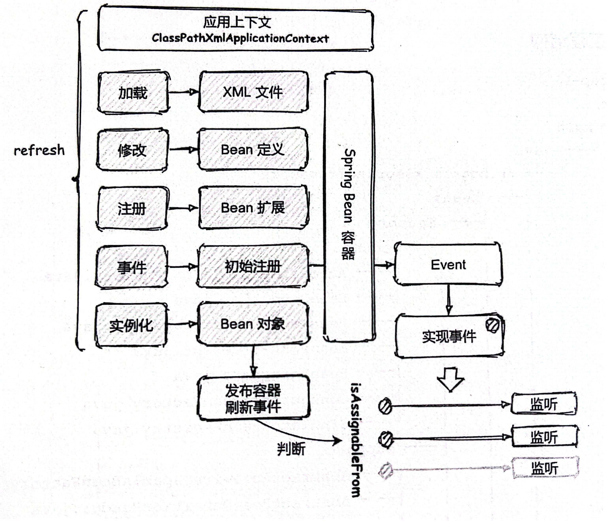

在整个功能的实现过程中，仍然需要在面向用户的应用上下文AbstractApplicationContext中添加相关事件的内容，包括初始化事件发布者、注册事件监听器、发布容器完成刷新事件。在使用观察者模式定义事件类、监听类、发布类后，还需要实现一个广播器的功能当接受事件推送时，对接收者感兴趣的监听事件进行分析，可以使用isAssignableFrom进行判断。isAssignableFrom的功能和instanceof的功能相似。isAssignableFrom用来判断子类和父类的关系，或者接口的实现类和接口的关系。默认所有的类的终极父类都是Object对象。如果A.isAssignableFrom(B)的值为true，则证明B可以转换成A，也就是说，A了哟由B转换过来。

## 4. 事件观察者实现


这部分所有的类都围绕Event的容器事件定义、发布、监听功能来实现，以及使用AbstractApplicationContext#refresh方法对事件的相关内容进行注册和处理。在事件的实现过程中，以扩展Spring的context包为主，在这个包中进行功能扩展。目前所有的实现内容仍然一IOC为主。ApplicationContext容器继承事件发布功能接口ApplicationEventPublisher，并在实现类中提供事件监听功能。发布容器关闭事件需要扩展到AbstractApplicationContext#close方法中，由注册到实现虚拟机的钩子。

**定义和实现事件**

```java
public abstract class ApplicationEvent extends EventObject {
    public ApplicationEvent(Object source){
        super(source);
    }
}
```

继承java.util.EventObject并定义具备事件功能的ApplicationEvent抽象类，后续所有事件的实现类都需要继承ApplicationEvent抽象类。

```java
public class ApplicationContextEvent extends ApplicationEvent {
    public ApplicationContextEvent(Object source) {
        super(source);
    }
    public final ApplicationContext getApplicationContext(){
        return (ApplicationContext) getSource();
    }
}
```

```java
public class ContextClosedEvent extends ApplicationContextEvent{
    public ContextClosedEvent(Object source) {
        super(source);
    }
}
```

```java
public class ContextRefreshedEvent extends ApplicationContextEvent{
    public ContextRefreshedEvent(Object source) {
        super(source);
    }
}
```

ApplicationContextEvent定义事件的抽象类，包括关闭、刷新及用户自己实现的事件，都需要继承这个类。ContextClosedEvent、ContextRefreshedEvent分别是Spring框架实现的两个事件类，可用于监听关闭和刷新。

**事件广播器** 

```java
public interface ApplicationEventMulticaster {
    //添加事件监听器
    void addApplicationListener(ApplicationListener<?> listener);
    
    //移除事件监听器
    void removeApplicationListener(ApplicationListener<?> listener);
    
    void multicastEvent(ApplicationEvent event);
}
```

在事件广播器中，定义类添加和删除监听的方法及一个广播事件的方法multicastEvent，最终通过multicastEvent方法来推送事件消息，决定由谁接收事件。

```java
public class AbstractApplicationEventMulticaster implements ApplicationEventMulticaster, BeanFactoryAware {
    //事件监听器的集合，每个事件监听器绑定一个事件类型
    private final Set<ApplicationListener<ApplicationEvent>> applicationListeners=new LinkedHashSet<>();
    //定义一个Bean工厂
    private BeanFactory beanFactory;
    @Override
    public void addApplicationListener(ApplicationListener<?> listener) {
           applicationListeners.add((ApplicationListener<ApplicationEvent>) listener);
    }

    @Override
    public void removeApplicationListener(ApplicationListener<?> listener) {
           applicationListeners.remove(listener);
    }

    @Override
    public void multicastEvent(ApplicationEvent event) {

    }

    @Override
    public void setBeanFactory(BeanFactory beanFactory) throws BeansException {
          this.beanFactory=beanFactory;
    }
    //获取所有的事件监听器
    protected Collection<ApplicationListener> getApplicationListeners(ApplicationEvent event) throws BeansException {
        //定义一个链表来封装所有的事件监听器
        LinkedList<ApplicationListener> allListeners=new LinkedList<ApplicationListener>();
        for(ApplicationListener<ApplicationEvent> listener: applicationListeners){
            if(supportsEvent(listener,event) ){
                allListeners.add(listener);
            }
        }
        return allListeners;
    }
    //监听器是否对事件感兴趣
    protected boolean supportsEvent(ApplicationListener<ApplicationEvent> applicationListener,ApplicationEvent event) throws BeansException {
        Class<? extends ApplicationListener> listenerClass=applicationListener.getClass();
        //按照cglibSubClassInstantiationStratege和SimpleInstantiationStrategy不同的实例化类型，需要判断后获取目标的class
        /**
         * 这段代码的作用是判断listenerClass是否为CGLIB代理类，如果是，则获取其父类作为目标类（targetClass），如果不是，则直接将listenerClass作为目标类。
         * 在Spring框架中，CGLIB是一种用于生成代理类的库。当使用CGLIB生成代理类时，代理类会继承目标类，而不是实现目标类的接口。因此，如果listenerClass
         * 是CGLIB代理类，我们需要获取它的父类作为目标类，以便后续使用。这段代码中的ClassUtils.isCglibProxyClass(listenerClass)方法用于判断listenerClass
         * 是否为CGLIB代理类。如果是，则通过listenerClass.getSuperclass()方法获取其父类作为目标类；如果不是，则直接将listenerClass作为目标类。
         * 通过这种方式，我们可以确保在处理CGLIB代理类时，获取到正确的目标类。
         */
        Class<?> targetClass= ClassUtils.isCglibProxyClass(listenerClass)? listenerClass.getSuperclass() :listenerClass;
        /**
         * 获取targetClass的泛型接口。 
         * 在Java中，泛型接口是一个使用一个或多个类型参数进行参数化的接口。它允许在运行时使用不同类型的接口。 
         * 在这段代码中，targetClass.getGenericInterfaces()返回一个由targetClass实现的泛型接口数组。[0]用于访问这个数组的第一个元素。 
         * 通过将genericInterface赋值为targetClass.getGenericInterfaces()[0]，代码获取了targetClass实现的第一个泛型接口。
         * 这样可以进一步操作或分析泛型接口，比如提取其类型参数或检查其属性。
         */
        Type genericInterface=targetClass.getGenericInterfaces()[0];
        Type actualTypeArgument=((ParameterizedType)genericInterface).getActualTypeArguments()[0];
        String className=actualTypeArgument.getTypeName();
        Class<?> eventClassName;
        try{
            eventClassName =Class.forName(className);
        }catch (ClassNotFoundException e){
            throw new BeansException("Wrong event class name:"+className);
        }
        //判断此eventClassName对象表示的类或接口与指定的event.getClass参数所表示的类或接口是否相同，或者是否是其超类或超接口，isAssignableFrom
        //用来判断子类和父类的关系，或者接口的实现类和接口的关闭，默认所有类的终极父类都是Object，如果A.isAssignableFrom(B)的值为true，则证明B
        //可以转换成A，也就是说，A可以由B转换而来
        return eventClassName.isAssignableFrom(event.getClass());
    }
}
```

AbstractApplicationEventMulticaster用于对事件广播器的公用方法进行提取，这个类可以实现一些基本功能，避免所有直接实现接口处理细节。这个类除了用于处理addApplicationListener、removeApplicationListener这样的通用方法，还用于处理getApplicationListener放啊否和supportsEvent方法。getApplicaitonListeners方法的作用是选取符合广播事件中的监听处理器，具体的过滤操作在supportsEvent方法中实现。supportsEvent方法主要包括Cglib和Simple不同实例化的类型，通过判断后获取目标Class。通过提取接口和对应的ParameterizedType类和eventClassName类，确认两者是否为子类和父类的关系，以此将事件交给符合的类处理。

**事件发布者的定义和实现**

```java
public interface ApplicationEventPublisher {
    void publishEvent(ApplicationEvent event);
}
```

ApplicationEventPublisher是事件的发布接口，所有的事件都需要从这个接口发布出去

```java
public abstract class AbstractApplicationContext extends DefaultResourceLoader implements ConfigurableApplicationContext {
    public static final  String APPLICATION_EVENT_MULTICASTER_BEAN_NAME="applicationEventMulticaster";
    private ApplicationEventMulticaster applicationEventMulticaster;
    @Override
    public void refresh() throws BeansException {
       //初始化事件发布者
        initApplicationEventMulticaster();
        //注册事件监听器
        registerListeners();
        //发布容器完成刷新事件
        finishRefresh();
    }
    private void initApplicationEventMulticaster(){
        ConfigurableListableBeanFactory beanFactory=getBeanFactory();
        applicationEventMulticaster=new SimpleApplicationEventMulticaster(beanFactory);
        //将事件广播器注册为一个Bean
        beanFactory.registerSinleton(APPLICATION_EVENT_MULTICASTER_BEAN_NAME,applicationEventMulticaster);

    }
    private void registerListeners() throws BeansException {
        Collection<ApplicationListener> applicationListeners=getBeansOfType(ApplicationListener.class).values();
        for(ApplicationListener listener:applicationListeners){
            applicationEventMulticaster.addApplicationListener(listener);
        }
    }
    public void finishRefresh(){
        publishEvent(new ContextRefreshedEvent(this));
    }

    @Override
    public void publishEvent(ApplicationEvent event) {
       applicationEventMulticaster.multicastEvent(event);
    }
    

    protected abstract void refreshBeanFactory() throws BeansException;
    protected abstract ConfigurableListableBeanFactory getBeanFactory();

    private void invokeBeanFactoryPostProcessor(ConfigurableListableBeanFactory beanFactory) throws BeansException {
        Map<String, BeanFactoryPostProcessor> beanFactoryPostProcessorMap=beanFactory.getBeansOfType(BeanFactoryPostProcessor.class);
        for(BeanFactoryPostProcessor beanFactoryPostProcessor:beanFactoryPostProcessorMap.values()){
            beanFactoryPostProcessor.postProcessBeanFactory(beanFactory);
        }
    }

    private void registerBeanPostProcessor(ConfigurableListableBeanFactory beanFactory) throws BeansException {
        Map<String, BeanPostProcessor> beanPostProcessorMap=beanFactory.getBeansOfType(BeanPostProcessor.class);
        for(BeanPostProcessor beanPostProcessor: beanPostProcessorMap.values()){
            beanFactory.addBeanPostProcessor(beanPostProcessor);
        }
    }

    @Override
    public void registerShutdownHook() {
        Runtime.getRuntime().addShutdownHook(new Thread(this::close));
    }

    @Override
    public void close() {
        try {
            publishEvent(new ContextClosedEvent(this));
            getBeanFactory().destroySingletons();
        }catch (Exception e){}

    }

    @Override
    public <T> Map<String, T> getBeansOfType(Class<T> var1) throws BeansException {
        return getBeanFactory().getBeansOfType(var1);
    }

    @Override
    public Object getBean(String name, Object... args) throws BeansException {
        return getBeanFactory().getBean(name,args);
    }

    @Override
    public Object getBean(String name) throws BeansException {
        return getBeanFactory().getBean(name);
    }

    @Override
    public <T> T getBean(String name, Class<T> requiredType) throws BeansException {
        return getBeanFactory().getBean(name,requiredType);
    }
    @Override
    public String[] getBeanDefinitionNames() {
        return getBeanFactory().getBeanDefinitionNames();
    }

}
```

在抽象应用上下文AbstractApplicationContext#refresh中，新增了初始化事件发布者、注册事件监听器、发布容器完成刷新事件，用于处理事件操作。初始化事件发布者（initApplicationEventMulticaster）主要用于实例化一个SimpleApplicationEventMulticaster事件广播器。注册事件监听器（registerLIsteners）通过getBeansOfType方法获取所有从spring.xml配置文件中加载的事件配置Bean对象。发布容器完成刷新事件（finishRefresh）发布了第一个服务器启动完成后的事件，这个事件通过publishEvent方法发布出去，也就是调用了applicationEventMulticaster.multicastEvent(event)方法。close方法新增了一个容器关闭事件publishEvent(new ContextClosedEvent(this))

**事件使用测试**

- 创建一个事件和监听器

```java
public class CUstomEvent extends ApplicationContextEvent {
    private long id;
    private String message;
    
    public CUstomEvent(Object source,Long id,String message) {
        super(source);
        this.id=id;
        this.message=message;
    }
}
```

创建一个自定义事件，在事件类的构造函数中可以添加想要的属性信息。由于CustomEvent这个事件类最终会被完整地输入监听器中，所以添加的属性都会被获取。

```java
public class CUstomEventListener implements ApplicationListener<CUstomEvent> {


    @Override
    public void onApplicationEvent(CUstomEvent event) {
        System.out.println("收到："+event.getSource()+"消息；时间："+new Date());
        System.out.println("消息："+event.getId()+":"+event.getMessage());
    }
    
}
```

这是一个用于监听CustomEvent事件的监听器，可以在用户注册后用于发送优惠券和短信通知等。

- 配置文件

```xml
<?xml version="1.0" encoding="UTF-8" ?>
<beans>
    <bean class="springframework.event.ContextRefreshedEventListener"></bean>

    <bean class="springframework.event.CUstomEventListener"></bean>

    <bean class="springframework.event.ContextRefreshedEventListener"></bean>
</beans>
```

在Spring.xml配置文件中配置了3个事件监听器—监听刷新、监听用户自定义事件、监听关闭事件。

- 单元测试

```java
public class ApiTest {
    @Test
    public void test_prototype() throws BeansException {
        //1. 初始化BeanFactory接口
        ClassPathXmlApplicationContext applicationContext=new ClassPathXmlApplicationContext("classpath:spring.xml");
        applicationContext.publishEvent(new CUstomEvent(applicationContext,120031203021L,"成功了"));
        applicationContext.registerShutdownHook();
    }
}
```

## 5. Spring相关源码解析

**ApplicationEvent**

ApplicationEvent是Spring框架中的一个类，它用于表示应用程序中发生的事件。它是Spring事件模型的核心组件之一。 在Spring框架中，事件是一种用于在应用程序中通知和响应特定动作或状态变化的机制。通过使用ApplicationEvent类，开发人员可以定义自己的事件，并在适当的时候发布这些事件。其他组件可以订阅这些事件，并在事件发生时执行相应的操作。 ApplicationEvent类是一个抽象类，开发人员可以通过继承它来定义自己的具体事件类。通常情况下，开发人员需要重写该类的构造方法，以便在创建事件对象时提供必要的信息。 通过使用ApplicationEventPublisher接口，开发人员可以在应用程序的任何地方发布事件。Spring框架中的许多组件都实现了该接口，因此可以轻松地将事件发布到Spring容器中。 总之，ApplicationEvent类的作用是在Spring应用程序中提供一种机制来定义、发布和订阅事件，以实现组件之间的解耦和灵活性。

```java
public abstract class ApplicationEvent extends EventObject {

	private static final long serialVersionUID = 7099057708183571937L;
	private final long timestamp;
	public ApplicationEvent(Object source) {
		super(source);
		this.timestamp = System.currentTimeMillis();
	}
	public final long getTimestamp() {
		return this.timestamp;
	}

}

```

**ApplicationContextEvent**

ApplicationContextEvent是Spring框架中的一个类，它用于表示与ApplicationContext相关的事件。它是ApplicationEvent的子类，提供了与应用程序上下文事件相关的额外功能。ApplicationContextEvent类负责在应用程序上下文的生命周期中发生特定事件时通知监听器。一些常见的事件包括上下文初始化、上下文刷新、上下文关闭等。通过扩展这个类并重写它的方法，开发人员可以定义自己的自定义应用程序上下文事件。与ApplicationEvent类类似，ApplicationContextEvent也使用ApplicationEventPublisher接口来发布事件。Spring框架提供了多种ApplicationContextEvent类的实现，例如ContextStartedEvent、ContextClosedEvent等，它们代表应用程序上下文生命周期中的特定事件。

```java
public abstract class ApplicationContextEvent extends ApplicationEvent {


	public ApplicationContextEvent(ApplicationContext source) {
		super(source);
	}

	/**
	 * Get the {@code ApplicationContext} that the event was raised for.
	 */
	public final ApplicationContext getApplicationContext() {
		return (ApplicationContext) getSource();
	}

}
```

**ContextClosedEvent**

ContextClosedEvent类是Spring框架中的一个类，表示当一个ApplicationContext被关闭或停止时触发的事件。它是ApplicationContextEvent的子类。当一个应用程序上下文被关闭或停止时，该事件被发布以通知任何已注册的监听器。它允许应用程序中的组件或模块执行必要的清理或最终化操作。

```java
public class ContextClosedEvent extends ApplicationContextEvent {

	/**
	 * Creates a new ContextClosedEvent.
	 * @param source the {@code ApplicationContext} that has been closed
	 * (must not be {@code null})
	 */
	public ContextClosedEvent(ApplicationContext source) {
		super(source);
	}

}
```

**ContextRefreshedEvent**

ContextRefreshedEvent类是Spring框架中的一个类，表示当一个ApplicationContext被刷新或初始化完成时触发的事件。它是ApplicationContextEvent的子类。当一个应用程序上下文被刷新或初始化完成时，该事件被发布以通知任何已注册的监听器。它表示应用程序上下文已经准备好使用，并且所有的bean定义已经被加载和实例化。这个事件通常在应用程序启动过程中非常有用，可以在这个事件中执行一些初始化操作或启动其他相关的任务。

```java
public class ContextRefreshedEvent extends ApplicationContextEvent {

	/**
	 * Create a new ContextRefreshedEvent.
	 * @param source the {@code ApplicationContext} that has been initialized
	 * or refreshed (must not be {@code null})
	 */
	public ContextRefreshedEvent(ApplicationContext source) {
		super(source);
	}

}
```

**ApplicationEventMulticaster**

ApplicationEventMulticaster类是Spring框架中的一个类，用于管理和分发应用程序事件的监听器。它是事件发布和监听机制的核心组件之一。ApplicationEventMulticaster负责将应用程序事件广播给所有已注册的监听器。它提供了将事件分发给多个监听器的功能，以实现事件的多播（multicast）。通过使用该类，开发人员可以方便地将事件发布给订阅者，并确保所有监听器都能接收到相应的事件。
ApplicationEventMulticaster类还提供了一些其他的功能，如添加和移除监听器、设置监听器的执行顺序等。它可以根据需要配置不同的事件广播策略，例如同步或异步地分发事件。总之，ApplicationEventMulticaster类的作用是管理和分发应用程序事件的监听器，确保事件能够准确地传递给所有已注册的监听器。

```java
public interface ApplicationEventMulticaster {

	/**
	 * Add a listener to be notified of all events.
	 * @param listener the listener to add
	 */
	void addApplicationListener(ApplicationListener<?> listener);

	/**
	 * Add a listener bean to be notified of all events.
	 * @param listenerBeanName the name of the listener bean to add
	 */
	void addApplicationListenerBean(String listenerBeanName);

	/**
	 * Remove a listener from the notification list.
	 * @param listener the listener to remove
	 */
	void removeApplicationListener(ApplicationListener<?> listener);

	/**
	 * Remove a listener bean from the notification list.
	 * @param listenerBeanName the name of the listener bean to remove
	 */
	void removeApplicationListenerBean(String listenerBeanName);

	/**
	 * Remove all listeners registered with this multicaster.
	 * <p>After a remove call, the multicaster will perform no action
	 * on event notification until new listeners are registered.
	 */
	void removeAllListeners();

	//将给定的应用程序事件广播给适当的监听器
	void multicastEvent(ApplicationEvent event);

//将给定的应用程序事件广播给适当的监听器
	void multicastEvent(ApplicationEvent event, @Nullable ResolvableType eventType);

}
```

**AbstractApplicationEventMulticaster**

AbstractApplicationEventMulticaster是Spring框架中的一个抽象类，用于管理和分发应用程序事件的监听器。它是ApplicationEventMulticaster接口的默认实现。AbstractApplicationEventMulticaster的主要作用是提供了事件监听器的注册、移除和分发功能。它维护了一个监听器列表，并提供了方法来添加、移除和获取监听器。当有事件需要发布时，AbstractApplicationEventMulticaster会遍历所有注册的监听器，并将事件分发给每个监听器进行处理。此外，AbstractApplicationEventMulticaster还提供了一些其他的功能，如设置监听器的执行顺序、配置异步事件分发等。它是事件发布和监听机制的核心组件之一，可以帮助开发人员更方便地管理和分发应用程序事件。

```java
public abstract class AbstractApplicationEventMulticaster
		implements ApplicationEventMulticaster, BeanClassLoaderAware, BeanFactoryAware {
  	@Nullable
	private ConfigurableBeanFactory beanFactory;
  private final DefaultListenerRetriever defaultRetriever = new DefaultListenerRetriever();
  final Map<ListenerCacheKey, CachedListenerRetriever> retrieverCache = new ConcurrentHashMap<>(64);

  @Override
	public void setBeanFactory(BeanFactory beanFactory) {
		if (!(beanFactory instanceof ConfigurableBeanFactory)) {
			throw new IllegalStateException("Not running in a ConfigurableBeanFactory: " + beanFactory);
		}
		this.beanFactory = (ConfigurableBeanFactory) beanFactory;
		if (this.beanClassLoader == null) {
			this.beanClassLoader = this.beanFactory.getBeanClassLoader();
		}
	}
  @Override
	public void addApplicationListener(ApplicationListener<?> listener) {
		synchronized (this.defaultRetriever) {
			// Explicitly remove target for a proxy, if registered already,
			// in order to avoid double invocations of the same listener.
			Object singletonTarget = AopProxyUtils.getSingletonTarget(listener);
			if (singletonTarget instanceof ApplicationListener) {
				this.defaultRetriever.applicationListeners.remove(singletonTarget);
			}
			this.defaultRetriever.applicationListeners.add(listener);
			this.retrieverCache.clear();
		}
	}
  	@Override
	public void addApplicationListenerBean(String listenerBeanName) {
		synchronized (this.defaultRetriever) {
			this.defaultRetriever.applicationListenerBeans.add(listenerBeanName);
			this.retrieverCache.clear();
		}
	}
  @Override
	public void removeApplicationListener(ApplicationListener<?> listener) {
		synchronized (this.defaultRetriever) {
			this.defaultRetriever.applicationListeners.remove(listener);
			this.retrieverCache.clear();
		}
	}
  @Override
	public void removeApplicationListenerBean(String listenerBeanName) {
		synchronized (this.defaultRetriever) {
			this.defaultRetriever.applicationListenerBeans.remove(listenerBeanName);
			this.retrieverCache.clear();
		}
	}
  	@Override
	public void removeAllListeners() {
		synchronized (this.defaultRetriever) {
			this.defaultRetriever.applicationListeners.clear();
			this.defaultRetriever.applicationListenerBeans.clear();
			this.retrieverCache.clear();
		}
	}
  	protected Collection<ApplicationListener<?>> getApplicationListeners() {
		synchronized (this.defaultRetriever) {
			return this.defaultRetriever.getApplicationListeners();
		}
	}
  protected Collection<ApplicationListener<?>> getApplicationListeners(
			ApplicationEvent event, ResolvableType eventType) {

		Object source = event.getSource();
		Class<?> sourceType = (source != null ? source.getClass() : null);
		ListenerCacheKey cacheKey = new ListenerCacheKey(eventType, sourceType);

		// Potential new retriever to populate
		CachedListenerRetriever newRetriever = null;

		// Quick check for existing entry on ConcurrentHashMap
		CachedListenerRetriever existingRetriever = this.retrieverCache.get(cacheKey);
		if (existingRetriever == null) {
			// Caching a new ListenerRetriever if possible
			if (this.beanClassLoader == null ||
					(ClassUtils.isCacheSafe(event.getClass(), this.beanClassLoader) &&
							(sourceType == null || ClassUtils.isCacheSafe(sourceType, this.beanClassLoader)))) {
				newRetriever = new CachedListenerRetriever();
				existingRetriever = this.retrieverCache.putIfAbsent(cacheKey, newRetriever);
				if (existingRetriever != null) {
					newRetriever = null;  // no need to populate it in retrieveApplicationListeners
				}
			}
		}

		if (existingRetriever != null) {
			Collection<ApplicationListener<?>> result = existingRetriever.getApplicationListeners();
			if (result != null) {
				return result;
			}
			// If result is null, the existing retriever is not fully populated yet by another thread.
			// Proceed like caching wasn't possible for this current local attempt.
		}

		return retrieveApplicationListeners(eventType, sourceType, newRetriever);
	}
  private boolean supportsEvent(
			ConfigurableBeanFactory beanFactory, String listenerBeanName, ResolvableType eventType) {

		Class<?> listenerType = beanFactory.getType(listenerBeanName);
		if (listenerType == null || GenericApplicationListener.class.isAssignableFrom(listenerType) ||
				SmartApplicationListener.class.isAssignableFrom(listenerType)) {
			return true;
		}
		if (!supportsEvent(listenerType, eventType)) {
			return false;
		}
		try {
			BeanDefinition bd = beanFactory.getMergedBeanDefinition(listenerBeanName);
			ResolvableType genericEventType = bd.getResolvableType().as(ApplicationListener.class).getGeneric();
			return (genericEventType == ResolvableType.NONE || genericEventType.isAssignableFrom(eventType));
		}
		catch (NoSuchBeanDefinitionException ex) {
			// Ignore - no need to check resolvable type for manually registered singleton
			return true;
		}
	}
}
```

**ApplicationEventPublisher**

```java
public interface ApplicationEventPublisher {
	default void publishEvent(ApplicationEvent event) {
		publishEvent((Object) event);
	}
	void publishEvent(Object event);
}
```

# 十一. 基于JDK、Cglib实现AOP切面

## 1. 本节重点

Spring包括一纵一横两大思想—IOC和AOP。我没日常使用的功能都离不开它们的支持。在前面介绍的功能开发中，已经基本实现了一个完整的IOC功能结构。那么，有了IOC为什么还需要AOP呢？当为多个不存在继承关系的功能对象类提供一个统一的行为操作时，会有大量的重复代码开发或者反复调用，例如，方法监控、接口管理、日志打印等，都需要在代码块中引入相应的非业务逻辑的同类功能处理，程序代码将越来越难以维护。所以，除了IOC的纵向处理，也需要AOP横向切面进行统一的共性逻辑处理，简化程序的开发过程。本节的重点就是基于类的代理和方法拦截器，为目标对象提供AOP切面处理的统一框架结构。

## 2. 动态代理

下面介绍关于AOP（Aspect-oriented programing，面向切面编程）内容的开发。AOP通过预编译的方式和运行时动态代理，实现程序功能的统一维护。其实。AOP时OOP的延续，是Spring框架中一个非常重要的内容。使用AOP可以对业务逻辑的各个部分进行隔离，从而降低各模块之间业务逻辑的耦合度，提高代码的复用性，也能提高程序的开发效率。AOP的核心技术主要是动态代理的使用，就像对于一个接口的实现类，可以使用代理类的方式将其替换，处理需要的逻辑，例如：

```java
@Test
public void test_proxy_class(){
	IUserService userService=(IUserService)Proxy.newProxyInstance(Thread.currentThread().getContextClassLoader(),new Class[]{IUserService.class},(proxy,method,args)->"你被代理了");
  String result=userService.queryUserInfo();
  System.out.println("测试结果"+result);
}
```

实现代理类后，接下来就需要考虑怎么给方法做代理，而不是代理整个类。如果想要代理类的所有方法，则可以制作一个方法拦截器，给所有被代理的方法添加一个自定义处理，例如输出日志、记录耗时、监控异常等。

## 3. AOP切面设计

在将AOP整个切面融合到Spring框架之前，需要解决两个问题：如果给符合规则的方法做代理？以及做完代理方法的实例后，如何把类的职责拆分出来？这两个功能都是以切面的思想进行设计和开发的。如果不清楚什么是AOP，则可以把切面理解为用刀切韭菜，一根一根切比较慢，如果用手（代理）将韭菜捏成一团，用不同的拦截操作（用菜刀切）来处理，就会达到事半功倍的效果。在程序中也一样，只不过韭菜变成了方法，菜刀变成了拦截方法。就像使用Spring的AOP一样，只处理一些需要拦截的方法。在执行完拦截方法之后，执行方法的扩展操作。首先实现一个可以代理方法的Proxy。代理方法主要是使用方法拦截器类处理方法的调用MethodInterceptor#invokde方法中，而不是直接使用invoke方法中的入参信息Method method执行method.invoke(targetObj,args)操作。除了实现以上核心的功能，还需要使用org.apectj.weaver.tools.PointcutParser处理拦截表达式“execution(* cn.bygstack.springframework.test.bean.IUserService.*(..))”。有了拦截器和处理器就可以设计出一个AOP雏形。 

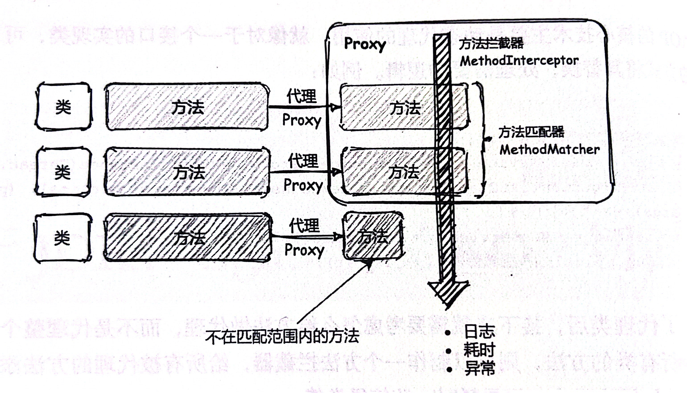

## 4. AOP切面实现


**单元测试**

在实现AOP的核心功能之前，我们先通过一个代理方法的实例了解其全貌，以便更好理解后续拆解各个方法，以及设计具有解耦合功能的AOP实现过程

```java
@Test
    public void test_proxy_method2() {
        // 目标对象(可以替换成任何的目标对象)
        Object targetObj = new UserService();
        // AOP 代理
        IUserService proxy = (IUserService) Proxy.newProxyInstance(Thread.currentThread().getContextClassLoader(), targetObj.getClass().getInterfaces(), new InvocationHandler() {
            // 方法匹配器
            MethodMatcher methodMatcher = new AspectJExpressionPointcut("execution(* springframework.bean.IUserService.*(..))");
            @Override
            public Object invoke(Object proxy, Method method, Object[] args) throws Throwable {
                if (methodMatcher.matches(method, targetObj.getClass())) {
                    // 方法拦截器
                    MethodInterceptor methodInterceptor = invocation -> {
                        long start = System.currentTimeMillis();
                        try {
                            return invocation.proceed();
                        } finally {
                            System.out.println("监控 - Begin By AOP");
                            System.out.println("方法名称：" + invocation.getMethod().getName());
                            System.out.println("方法耗时：" + (System.currentTimeMillis() - start) + "ms");
                            System.out.println("监控 - End\r\n");
                        }
                    };
                    // 反射调用
                    return methodInterceptor.invoke(new ReflectiveMethodInvocation(targetObj, method, args));
                }
                return method.invoke(targetObj, args);
            }
        });
        String result = proxy.queryUserInfo();
        System.out.println("测试结果：" + result);
    }
```

整个实例的目标是将一个UserService作为目标对象，对类中所有方法进行拦截，并添加监控信息，输出打印。实例中有代理对象Proxy.newProxyInstance、方法匹配MethodMatcher、反射调用invoke，以及用户自己实现拦截后的操作。这样就与使用AOP非常类似类，只不过在使用AOP时，框架已经提供了更好的功能，这里是把所有核心过程演示重新展现出来。


**切点表达式**

```java
public interface Pointcut {
    ClassFilter getClassFilter();
    MethodMatcher getMathodMatcher();
}
```

切入点接口Pointcut用于获取ClassFilter和MethodMatcher两个类，它们都是切点表达式提供的内容。

```java

public interface ClassFilter {
    boolean matches(Class<?> clazz);
}

```

ClassFilter接口定义匹配类，用于帮助切点找到给定的接口和目标类

```java
public interface MethodMatcher {
    boolean matches(Method method, Class<?> targetClass);
}
```

方法匹配用于找到表达式范围内匹配的目标类和方法

**实现切点表达时类**

```java
public class AspectJExpressionPointcut implements Pointcut, ClassFilter, MethodMatcher {
  //里定义了一个静态的不可变的集合SUPPORTED_PRIMITIVES，它存储了支持的切点原语
    private static final Set<PointcutPrimitive> SUPPORTED_PRIMITIVES=new HashSet<PointcutPrimitive>();
    static{
      //静态代码块用于在类加载时初始化SUPPORTED_PRIMITIVES集合，并向其中添加EXECUTION切点原语。EXECUTION是AspectJ中用于匹配方法执行的切点原语
        SUPPORTED_PRIMITIVES.add(PointcutPrimitive.EXECUTION);
    }
  //这是一个私有的成员变量pointcutExpression，它存储AspectJ表达式解析后的结果，即一个PointcutExpression对象
    private final PointcutExpression pointcutExpression;
  //这是类的构造函数。它接受一个AspectJ表达式作为参数，并通过解析该表达式，将结果存储在pointcutExpression成员变量中
    public AspectJExpressionPointcut(String expression){
      //这一行代码创建了一个PointcutParser对象，用于解析AspectJ表达式。该解析器在创建时，通过传递SUPPORTED_PRIMITIVES集合和当前类的类加载器作为参数
        PointcutParser pointcutParser=PointcutParser.getPointcutParserSupportingSpecifiedPrimitivesAndUsingSpecifiedClassLoaderForResolution(SUPPORTED_PRIMITIVES
        ,this.getClass().getClassLoader());
      //这一行代码使用上面创建的解析器pointcutParser来解析传入的AspectJ表达式，并将解析后的结果存储在pointcutExpression中
        pointcutExpression=pointcutParser.parsePointcutExpression(expression);
    }
  //这是实现ClassFilter接口的方法。它用于判断给定的类是否匹配切点表达式，即该类是否可能有连接点（JoinPoint）匹配
    @Override
    public boolean matches(Class<?> clazz) {
        return pointcutExpression.couldMatchJoinPointsInType(clazz);
    }
   //这是实现MethodMatcher接口的方法。它用于判断给定的方法是否匹配切点表达式，即该方法是否执行时会成为连接
    @Override
    public boolean matches(Method method, Class<?> targetClass) {
        return pointcutExpression.matchesMethodExecution(method).alwaysMatches();
    }
    //这是实现Pointcut接口的方法。它返回当前对象本身，即该切点类用作类过滤器
    @Override
    public ClassFilter getClassFilter() {
        return this;
    }

    @Override
    public MethodMatcher getMathodMatcher() {
        return this;
    }
}
```

切点表达式实现了Pointcut接口、ClassFilter接口、MethodMatcher接口的定义方法，同时主要使用了aspectJ包提供的表达式校验方法。匹配matches包括pointcutExpression.couldMatchJoinPointsInType(class)方法、pointcutExpression.matchesMethodExecution(method).alwaysMatches方法，这部分内容可以单独进行匹配验证。

> AspectJ是一种面向切面编程（AOP）的扩展，它允许开发者在不修改原有代码的情况下，通过横切关注点（Cross-cutting Concerns）的方式将特定功能（如日志记录、事务管理等）模块化，从而促进代码的可维护性和重用性。在AspectJ中，使用AspectJ表达式来定义切点，然后通过切面（Aspect）将切点和横切逻辑绑定，从而实现特定功能的插入。AspectJ通过在编译期或运行期织入（Weaving）字节码来实现AOP。编译期织入是将AspectJ编绎器（ajc）嵌入到编译过程中，识别切点并将横切逻辑织入到目标类中，生成增强过的字节码。运行期织入则是通过Java的动态代理或字节码操作库，在程序运行时动态地将横切逻辑织入到目标类的方法中。`AspectJExpressionPointcut`类通过解析传入的AspectJ表达式，获取到对应的切点信息，并在`matches()`方法中判断给定的类和方法是否与该切点匹配。在AOP框架中，会利用这些切点信息和横切逻辑，将切面织入到目标代码中，从而实现AOP的功能。

**匹配验证**

```java
    @Test
    public void test_proxy_method() throws NoSuchMethodException {
        AspectJExpressionPointcut pointcut=new AspectJExpressionPointcut("execution(* springframework.bean.UserService.*(..))");
        Class<UserService> clazz=UserService.class;
        Method method=clazz.getDeclaredMethod("queryUserInfo");
        System.out.println(pointcut.matches(clazz));
        System.out.println(pointcut.matches(method,clazz));
    }
```


**包装切面通知信息**

```java
public class AdvisedSupport {
    //被代理的目标对象
    private TargetSource targetSource;
    //方法拦截器
    private MethodInterceptor methodInterceptor;
    //方法匹配器（检查目标方法是否符合通知条件）
    private MethodMatcher methodMatcher;

    public TargetSource getTargetSource() {
        return targetSource;
    }

    public void setTargetSource(TargetSource targetSource) {
        this.targetSource = targetSource;
    }

    public MethodInterceptor getMethodInterceptor() {
        return methodInterceptor;
    }

    public void setMethodInterceptor(MethodInterceptor methodInterceptor) {
        this.methodInterceptor = methodInterceptor;
    }

    public MethodMatcher getMethodMatcher() {
        return methodMatcher;
    }

    public void setMethodMatcher(MethodMatcher methodMatcher) {
        this.methodMatcher = methodMatcher;
    }
}
```

AdvisedSupport将代理、拦截、匹配的各项属性包装到一个类中，方便Proxy实现类中使用，这与业务开发中包装入参是一个道理。TargeSource是一个目标对象在目标对象类汇总提供Object入参属性，以及获取目标类TargetClass的信息。MethodInterceptor是一个具体拦截方法的实现类，由用户实现MethodInterceptor#invoke方法并进行具体的处理。MethodMacher是一个匹配方法的操作，这个对象由AspectJExpressionPointcut提供服务。

**代理抽象实现（JDK&Cglib）**

```java
public interface AopProxy {
    Object getProxy();
}
```

定义一个标准接口，用于获取代理类。因为具体实现代理的方式既可以是JDK方式，也可以是Cglib方式，所以定义接口会更加方便管理实现类。

```java
//InvocationHandler是Java中的一个接口，它用于实现动态代理。当使用Java动态代理创建代理对象时，需要提供一个InvocationHandler对象来处理代理方法的调用。
//InvocationHandler接口定义了一个方法invoke，该方法在代理对象的方法被调用时被触发。invoke方法接收三个参数：proxy（代理对象）、method（被调用的方法）和args（方法的参数）。在invoke方法内部，可以编写自定义的逻辑来处理方法调用，例如在方法调用前后进行一些额外的操作，或者根据特定条件来决定是否执行原始方法。
// 通过实现InvocationHandler接口并提供自定义的invoke方法，可以在不修改原始类的情况下对其方法进行拦截、增强或修改。这种动态代理的机制在很多场景中都非常有用，例如实现日志记录、性能监控、事务管理等。
public class JdkDynamicAopProxy implements AopProxy, InvocationHandler {
    private final AdvisedSupport advised;

    public JdkDynamicAopProxy(AdvisedSupport advised){
        this.advised=advised;
    }


    @Override
    public Object invoke(Object proxy, Method method, Object[] args) throws Throwable {
        if(advised.getMethodMatcher().matches(method,advised.getTargetSource().getTarget().getClass())){
            MethodInterceptor methodInterceptor=advised.getMethodInterceptor();
            return methodInterceptor.invoke(new ReflectiveMethodInvocation(advised.getTargetSource().getTarget(),method,args));
        }
        return method.invoke(advised.getTargetSource().getTarget(),args);
    }

    @Override
    public Object getProxy() {
        return Proxy.newProxyInstance(Thread.currentThread().getContextClassLoader(), advised.getTargetSource().getTarget().getClass().getInterfaces(),this);
    }
}

```

基于JDK实现的代理类需要实现AopProxy接口、InvocationHandler接口，这样就可以将代理对象getProxy和反射调用方法invoke分开进行处理。getProxy方法是代理一个对象的操作，需要系统入参ClassLoader、AdvisedSupport及this类，其中this类提供提供类invoke方法。invoke方法处理完匹配的方法后，利用用户提供的方法实现拦截，并进行了反射调用methodInterceptor.invoke。这里的ReflectionMethodInvocation是一个入参的包装信息，提供了入参对象（目标对象和方法）

```java
public class Cglib2AopProxy implements AopProxy{
    private  final AdvisedSupport advised;

    public Cglib2AopProxy(AdvisedSupport advised){
        this.advised=advised;
    }
    @Override
    public Object getProxy() {
        Enhancer enhancer=new Enhancer();
        enhancer.setSuperclass(advised.getTargetSource().getTarget().getClass());
        System.out.println(advised.getTargetSource().getTarget().getClass());
        enhancer.setInterfaces(advised.getTargetSource().getTarget().getClass().getInterfaces());
        enhancer.setCallback(new DynamicAdvisedInterceptor(advised));
        return enhancer.create();
    }
    private static class DynamicAdvisedInterceptor implements MethodInterceptor{
        private final AdvisedSupport advisedSupport;
        public DynamicAdvisedInterceptor(AdvisedSupport advised) {
            this.advisedSupport=advised;
        }

        @Override
        public Object intercept(Object o, Method method, Object[] objects, MethodProxy methodProxy) throws Throwable {
            CglibMethodInvocation methodInvocation=new CglibMethodInvocation(advisedSupport.getTargetSource().getTarget(),method,objects,methodProxy);
            if(advisedSupport.getMethodMatcher().matches(method,advisedSupport.getTargetSource().getTarget().getClass())){
                return advisedSupport.getMethodInterceptor().invoke(methodInvocation);
            }
            return methodInvocation.proceed();
        }
    }
    private  static class CglibMethodInvocation extends ReflectiveMethodInvocation{

        public CglibMethodInvocation(Object target, Method method, Object[] args, MethodProxy methodProxy) {
            super(target, method, args);
        }

        @Override
        public Object proceed() throws Throwable {
            return this.getMethod().invoke(this.getTarget(),this.getArguments());
        }
    }
}
```

由于基于Cglib使用Enhancer代理的类可以在运行期间为接口使用底层的ASM字节码，来增强技术处理对象生成代理对象的功能，因此被代理类不需要实现任何接口。这里可以看到DynamicAdvisedInterceptor#intercept在匹配方法后进行了相应的反射操作。
**结果测试**

- 实现准备

```java
public class UserService {
    public String queryUserInfo(){
        try{
            Thread.sleep(new Random(1).nextInt(100));
        }catch (InterruptedException e){
            e.printStackTrace();
        }
        return "张三，100001，深圳";
    }
    public String register(String userName){
        try{
            Thread.sleep(new Random(1).nextInt(100));
        }catch (InterruptedException e){
            e.printStackTrace();
        }
        return "注册用户："+userName+" success!";
    }
}
```

UserService提供了两个不同的方法，可以在测试˙中增加新的类。后面的测试过程会为这两个方法添加拦截处理，并输出耗时。

- 自定义拦截方法

```java
public class UserServiceInterceptor  implements MethodInterceptor {

    @Override
    public Object invoke(MethodInvocation methodInvocation) throws Throwable {
        long start=System.currentTimeMillis();
        try{
            return methodInvocation.proceed();
        }finally {
            System.out.println("监控-begin by AOP");
            System.out.println("方法名称："+methodInvocation.getMethod());
            System.out.println("方法耗时"+(System.currentTimeMillis()-start)+"ms");
            System.out.println("监控-END\r");
        }
    }
}
```

当用户自定义拦截方法时需要实现MethodInterceptor接口的invoke方法，其使用方式与Spring框架中的AOP非常相似，也是使用invocation.proceed包装，并在finally中添加监控信息

```java
public class ApiTest {

    @Test
    public void test_dynamic() {
        // 目标对象
        IUserService userService = new UserService();

        // 组装代理信息
        AdvisedSupport advisedSupport = new AdvisedSupport();
        advisedSupport.setTargetSource(new TargetSource(userService));
        advisedSupport.setMethodInterceptor(new UserServiceInterceptor());
        advisedSupport.setMethodMatcher(new AspectJExpressionPointcut("execution(* springframework.bean.IUserService.*(..))"));

        // 代理对象(JdkDynamicAopProxy)
        IUserService proxy_jdk = (IUserService) new JdkDynamicAopProxy(advisedSupport).getProxy();
        // 测试调用
        System.out.println("测试结果：" + proxy_jdk.queryUserInfo());

        // 代理对象(Cglib2AopProxy)
        IUserService proxy_cglib = (IUserService) new Cglib2AopProxy(advisedSupport).getProxy();
        // 测试调用
        System.out.println("测试结果：" + proxy_cglib.register("花花"));
    }

}
```

整个实例测试了AOP与Spring框架结合之前的核心代码，包括什么是目标对象、如何组装代理信息、如何调用代理对象。AdviseSupport包装了目标对象、用户实现的拦截方法及方法匹配表达式。然后分别通过JdkDynamicAopProxy、Cglib2AopProxy两种不同的方法实现代理类，查看是否可以拦截成功。

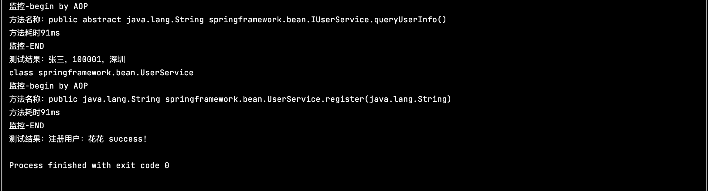

与AOP功能的定义一样，通过这样的代理方式、方法匹配和拦截，用户可以在对应的目标方法下执行拦截操作，并输出监控信息。

## 5. Spring相关源码分析

**Pointcut**

Pointcut接口的作用是定义切点，它用于确定在应用程序中哪些类和方法将会被AOP（面向切面编程）所切入。通过该接口，可以定义一个类过滤器（ClassFilter）用于筛选特定的类，以及一个方法匹配器（MethodMatcher）用于匹配特定的方法。这样，可以在切点上进行精确的控制，只选择需要被切入的类和方法。同时，Pointcut接口还提供了一个TRUE常量，代表一个始终匹配的切点，即所有的类和方法都会被切入。

```java
public interface Pointcut {
  //getClassFilter() 方法返回一个 ClassFilter 对象，用于过滤类。它决定哪些类将会被切入。 
	ClassFilter getClassFilter();
  //getMethodMatcher() 方法返回一个 MethodMatcher 对象，用于匹配方法。它决定哪些方法将会被切入。
	MethodMatcher getMethodMatcher();
  //TRUE 是一个 Pointcut 的实例，它代表一个始终匹配的切点。也就是说，所有的类和方法都会被切入
	Pointcut TRUE = TruePointcut.INSTANCE;

}

```

**ClassFilter**

ClassFilter接口的作用是在AOP（面向切面编程）的上下文中，根据特定的条件对类进行过滤。它定义了一个名为matches()的方法，该方法接受一个Class对象作为参数，并返回一个布尔值。通过实现ClassFilter接口并重写matches()方法，可以根据自定义的条件来判断一个类是否应该被包含在切面中。这样可以实现对类的精确过滤，只选择满足条件的类进行切入操作。

```java
@FunctionalInterface
public interface ClassFilter {

	/**
	 * Should the pointcut apply to the given interface or target class?
	 * @param clazz the candidate target class
	 * @return whether the advice should apply to the given target class
	 */
	boolean matches(Class<?> clazz);


	/**
	 * Canonical instance of a ClassFilter that matches all classes.
	 */
	ClassFilter TRUE = TrueClassFilter.INSTANCE;

}
```

**MathodMaches**

MethodMatcher接口的作用是在AOP（面向切面编程）中，用于匹配方法。它定义了一个名为matches()的方法，该方法接受一个Method对象和一个目标类的Class对象作为参数，并返回一个布尔值。通过实现MethodMatcher接口并重写matches()方法，可以根据自定义的条件来判断一个方法是否应该被包含在切面中。这样可以实现对方法的精确匹配，只选择满足条件的方法进行切入操作。MethodMatcher接口的作用是在AOP中确定哪些方法将会被切入。

```java
public interface MethodMatcher {
	boolean matches(Method method, Class<?> targetClass);
	boolean isRuntime();
	boolean matches(Method method, Class<?> targetClass, Object... args);
	MethodMatcher TRUE = TrueMethodMatcher.INSTANCE;

}
```

**AspectJExpressionPointcut**

```java
public class AspectJExpressionPointcut extends AbstractExpressionPointcut
		implements ClassFilter, IntroductionAwareMethodMatcher, BeanFactoryAware {
  private static final Set<PointcutPrimitive> SUPPORTED_PRIMITIVES = new HashSet<>();

	static {
		SUPPORTED_PRIMITIVES.add(PointcutPrimitive.EXECUTION);
		SUPPORTED_PRIMITIVES.add(PointcutPrimitive.ARGS);
		SUPPORTED_PRIMITIVES.add(PointcutPrimitive.REFERENCE);
		SUPPORTED_PRIMITIVES.add(PointcutPrimitive.THIS);
		SUPPORTED_PRIMITIVES.add(PointcutPrimitive.TARGET);
		SUPPORTED_PRIMITIVES.add(PointcutPrimitive.WITHIN);
		SUPPORTED_PRIMITIVES.add(PointcutPrimitive.AT_ANNOTATION);
		SUPPORTED_PRIMITIVES.add(PointcutPrimitive.AT_WITHIN);
		SUPPORTED_PRIMITIVES.add(PointcutPrimitive.AT_ARGS);
		SUPPORTED_PRIMITIVES.add(PointcutPrimitive.AT_TARGET);
	}
  //用日志记录信息
  private static final Log logger = LogFactory.getLog(AspectJExpressionPointcut.class);

	@Nullable
	private Class<?> pointcutDeclarationScope;

	private String[] pointcutParameterNames = new String[0];

	private Class<?>[] pointcutParameterTypes = new Class<?>[0];

	@Nullable
	private BeanFactory beanFactory;

	@Nullable
	private transient ClassLoader pointcutClassLoader;

	@Nullable
	private transient PointcutExpression pointcutExpression;

	private transient Map<Method, ShadowMatch> shadowMatchCache = new ConcurrentHashMap<>(32);


	/**
	 * Create a new default AspectJExpressionPointcut.
	 */
	public AspectJExpressionPointcut() {
	}
  public AspectJExpressionPointcut(Class<?> declarationScope, String[] paramNames, Class<?>[] paramTypes) {
		this.pointcutDeclarationScope = declarationScope;
		if (paramNames.length != paramTypes.length) {
			throw new IllegalStateException(
					"Number of pointcut parameter names must match number of pointcut parameter types");
		}
		this.pointcutParameterNames = paramNames;
		this.pointcutParameterTypes = paramTypes;
	}
  public void setPointcutDeclarationScope(Class<?> pointcutDeclarationScope) {
		this.pointcutDeclarationScope = pointcutDeclarationScope;
	}

	/**
	 * Set the parameter names for the pointcut.
	 */
	public void setParameterNames(String... names) {
		this.pointcutParameterNames = names;
	}

	/**
	 * Set the parameter types for the pointcut.
	 */
	public void setParameterTypes(Class<?>... types) {
		this.pointcutParameterTypes = types;
	}

	@Override
	public void setBeanFactory(BeanFactory beanFactory) {
		this.beanFactory = beanFactory;
	}


	@Override
	public ClassFilter getClassFilter() {
		obtainPointcutExpression();
		return this;
	}

	@Override
	public MethodMatcher getMethodMatcher() {
		obtainPointcutExpression();
		return this;
	}


	/**
	 * Check whether this pointcut is ready to match,
	 * lazily building the underlying AspectJ pointcut expression.
	 */
	private PointcutExpression obtainPointcutExpression() {
		if (getExpression() == null) {
			throw new IllegalStateException("Must set property 'expression' before attempting to match");
		}
		if (this.pointcutExpression == null) {
			this.pointcutClassLoader = determinePointcutClassLoader();
			this.pointcutExpression = buildPointcutExpression(this.pointcutClassLoader);
		}
		return this.pointcutExpression;
	}

	/**
	 * Determine the ClassLoader to use for pointcut evaluation.
	 */
	@Nullable
	private ClassLoader determinePointcutClassLoader() {
		if (this.beanFactory instanceof ConfigurableBeanFactory) {
			return ((ConfigurableBeanFactory) this.beanFactory).getBeanClassLoader();
		}
		if (this.pointcutDeclarationScope != null) {
			return this.pointcutDeclarationScope.getClassLoader();
		}
		return ClassUtils.getDefaultClassLoader();
	}

	/**
	 * Build the underlying AspectJ pointcut expression.
	 */
	private PointcutExpression buildPointcutExpression(@Nullable ClassLoader classLoader) {
		PointcutParser parser = initializePointcutParser(classLoader);
		PointcutParameter[] pointcutParameters = new PointcutParameter[this.pointcutParameterNames.length];
		for (int i = 0; i < pointcutParameters.length; i++) {
			pointcutParameters[i] = parser.createPointcutParameter(
					this.pointcutParameterNames[i], this.pointcutParameterTypes[i]);
		}
		return parser.parsePointcutExpression(replaceBooleanOperators(resolveExpression()),
				this.pointcutDeclarationScope, pointcutParameters);
	}

	private String resolveExpression() {
		String expression = getExpression();
		Assert.state(expression != null, "No expression set");
		return expression;
	}

	/**
	 * Initialize the underlying AspectJ pointcut parser.
	 */
	private PointcutParser initializePointcutParser(@Nullable ClassLoader classLoader) {
		PointcutParser parser = PointcutParser
				.getPointcutParserSupportingSpecifiedPrimitivesAndUsingSpecifiedClassLoaderForResolution(
						SUPPORTED_PRIMITIVES, classLoader);
		parser.registerPointcutDesignatorHandler(new BeanPointcutDesignatorHandler());
		return parser;
	}
  
}
```

**AopProxy**

AopProxy类用于AOP（面向切面编程）中为目标对象创建动态代理。它负责创建一个代理对象，拦截目标对象的方法调用并应用指定的切面或通知（advice）。AopProxy接口提供了不同代理实现的通用抽象，例如JDK动态代理或CGLIB代理。它允许在运行时动态地创建代理对象，并将切面织入到目标对象的方法调用中。

```java
public interface AopProxy {

	/**
	 * Create a new proxy object.
	 * <p>Uses the AopProxy's default class loader (if necessary for proxy creation):
	 * usually, the thread context class loader.
	 * @return the new proxy object (never {@code null})
	 * @see Thread#getContextClassLoader()
	 */
	Object getProxy();

	/**
	 * Create a new proxy object.
	 * <p>Uses the given class loader (if necessary for proxy creation).
	 * {@code null} will simply be passed down and thus lead to the low-level
	 * proxy facility's default, which is usually different from the default chosen
	 * by the AopProxy implementation's {@link #getProxy()} method.
	 * @param classLoader the class loader to create the proxy with
	 * (or {@code null} for the low-level proxy facility's default)
	 * @return the new proxy object (never {@code null})
	 */
	Object getProxy(@Nullable ClassLoader classLoader);

}
```

**JdkDynamicAopProxy**

JdkDynamicAopProxy类是AOP（面向切面编程）中的一个具体实现类，用于创建基于JDK动态代理的代理对象。它的作用是在运行时动态地创建代理对象，并将切面织入到目标对象的方法调用中。 JdkDynamicAopProxy利用Java的反射机制，在运行时生成一个代理类，该代理类实现了目标对象所实现的接口，并在方法调用前后执行相应的切面逻辑。通过代理对象，可以在目标对象的方法执行前后插入额外的逻辑，例如日志记录、性能监控、事务管理等。 JdkDynamicAopProxy类的使用可以通过配置文件或编程方式进行，通过指定切面和目标对象，它会自动创建代理对象，并将切面逻辑织入到目标对象的方法调用中。这样可以实现对目标对象的增强和控制，而不需要修改目标对象的源代码。

```java
final class JdkDynamicAopProxy implements AopProxy, InvocationHandler, Serializable {
  //序列化号码
	private static final long serialVersionUID = 5531744639992436476L;
  //日志记录
	private static final Log logger = LogFactory.getLog(JdkDynamicAopProxy.class);
  //代理类信息
	private final AdvisedSupport advised;
  //需要代理的接口
	private final Class<?>[] proxiedInterfaces;
	/**
	 * Is the {@link #equals} method defined on the proxied interfaces?
	 */
	private boolean equalsDefined;
	/**
	 * Is the {@link #hashCode} method defined on the proxied interfaces?
	 */
	private boolean hashCodeDefined；
	/**
	 * Construct a new JdkDynamicAopProxy for the given AOP configuration.
	 * @param config the AOP configuration as AdvisedSupport object
	 * @throws AopConfigException if the config is invalid. We try to throw an informative
	 * exception in this case, rather than let a mysterious failure happen later.
	 */
	public JdkDynamicAopProxy(AdvisedSupport config) throws AopConfigException {
		Assert.notNull(config, "AdvisedSupport must not be null");
		if (config.getAdvisors().length == 0 && config.getTargetSource() == AdvisedSupport.EMPTY_TARGET_SOURCE) {
			throw new AopConfigException("No advisors and no TargetSource specified");
		}
		this.advised = config;
		this.proxiedInterfaces = AopProxyUtils.completeProxiedInterfaces(this.advised, true);
		findDefinedEqualsAndHashCodeMethods(this.proxiedInterfaces);
	}
  //获得代理类的方法
	@Override
	public Object getProxy() {
		return getProxy(ClassUtils.getDefaultClassLoader());
	}

	@Override
	public Object getProxy(@Nullable ClassLoader classLoader) {
		if (logger.isTraceEnabled()) {
			logger.trace("Creating JDK dynamic proxy: " + this.advised.getTargetSource());
		}
		return Proxy.newProxyInstance(classLoader, this.proxiedInterfaces, this);
	}
	/**
	 * Finds any {@link #equals} or {@link #hashCode} method that may be defined
	 * on the supplied set of interfaces.
	 * @param proxiedInterfaces the interfaces to introspect
	 */
	private void findDefinedEqualsAndHashCodeMethods(Class<?>[] proxiedInterfaces) {
		for (Class<?> proxiedInterface : proxiedInterfaces) {
			Method[] methods = proxiedInterface.getDeclaredMethods();
			for (Method method : methods) {
				if (AopUtils.isEqualsMethod(method)) {
					this.equalsDefined = true;
				}
				if (AopUtils.isHashCodeMethod(method)) {
					this.hashCodeDefined = true;
				}
				if (this.equalsDefined && this.hashCodeDefined) {
					return;
				}
			}
		}
	}
	/**
	 * Implementation of {@code InvocationHandler.invoke}.
	 * <p>Callers will see exactly the exception thrown by the target,
	 * unless a hook method throws an exception.
	 */
	@Override
	@Nullable
	public Object invoke(Object proxy, Method method, Object[] args) throws Throwable {
		Object oldProxy = null;
		boolean setProxyContext = false;

		TargetSource targetSource = this.advised.targetSource;
		Object target = null;

		try {
			if (!this.equalsDefined && AopUtils.isEqualsMethod(method)) {
				// The target does not implement the equals(Object) method itself.
				return equals(args[0]);
			}
			else if (!this.hashCodeDefined && AopUtils.isHashCodeMethod(method)) {
				// The target does not implement the hashCode() method itself.
				return hashCode();
			}
			else if (method.getDeclaringClass() == DecoratingProxy.class) {
				// There is only getDecoratedClass() declared -> dispatch to proxy config.
				return AopProxyUtils.ultimateTargetClass(this.advised);
			}
			else if (!this.advised.opaque && method.getDeclaringClass().isInterface() &&
					method.getDeclaringClass().isAssignableFrom(Advised.class)) {
				// Service invocations on ProxyConfig with the proxy config...
				return AopUtils.invokeJoinpointUsingReflection(this.advised, method, args);
			}

			Object retVal;

			if (this.advised.exposeProxy) {
				// Make invocation available if necessary.
				oldProxy = AopContext.setCurrentProxy(proxy);
				setProxyContext = true;
			}

			// Get as late as possible to minimize the time we "own" the target,
			// in case it comes from a pool.
			target = targetSource.getTarget();
			Class<?> targetClass = (target != null ? target.getClass() : null);

			// Get the interception chain for this method.
			List<Object> chain = this.advised.getInterceptorsAndDynamicInterceptionAdvice(method, targetClass);

			// Check whether we have any advice. If we don't, we can fallback on direct
			// reflective invocation of the target, and avoid creating a MethodInvocation.
			if (chain.isEmpty()) {
				// We can skip creating a MethodInvocation: just invoke the target directly
				// Note that the final invoker must be an InvokerInterceptor so we know it does
				// nothing but a reflective operation on the target, and no hot swapping or fancy proxying.
				Object[] argsToUse = AopProxyUtils.adaptArgumentsIfNecessary(method, args);
				retVal = AopUtils.invokeJoinpointUsingReflection(target, method, argsToUse);
			}
			else {
				// We need to create a method invocation...
				MethodInvocation invocation =
						new ReflectiveMethodInvocation(proxy, target, method, args, targetClass, chain);
				// Proceed to the joinpoint through the interceptor chain.
				retVal = invocation.proceed();
			}

			// Massage return value if necessary.
			Class<?> returnType = method.getReturnType();
			if (retVal != null && retVal == target &&
					returnType != Object.class && returnType.isInstance(proxy) &&
					!RawTargetAccess.class.isAssignableFrom(method.getDeclaringClass())) {
				// Special case: it returned "this" and the return type of the method
				// is type-compatible. Note that we can't help if the target sets
				// a reference to itself in another returned object.
				retVal = proxy;
			}
			else if (retVal == null && returnType != Void.TYPE && returnType.isPrimitive()) {
				throw new AopInvocationException(
						"Null return value from advice does not match primitive return type for: " + method);
			}
			return retVal;
		}
		finally {
			if (target != null && !targetSource.isStatic()) {
				// Must have come from TargetSource.
				targetSource.releaseTarget(target);
			}
			if (setProxyContext) {
				// Restore old proxy.
				AopContext.setCurrentProxy(oldProxy);
			}
		}
	}


	/**
	 * Equality means interfaces, advisors and TargetSource are equal.
	 * <p>The compared object may be a JdkDynamicAopProxy instance itself
	 * or a dynamic proxy wrapping a JdkDynamicAopProxy instance.
	 */
	@Override
	public boolean equals(@Nullable Object other) {
		if (other == this) {
			return true;
		}
		if (other == null) {
			return false;
		}

		JdkDynamicAopProxy otherProxy;
		if (other instanceof JdkDynamicAopProxy) {
			otherProxy = (JdkDynamicAopProxy) other;
		}
		else if (Proxy.isProxyClass(other.getClass())) {
			InvocationHandler ih = Proxy.getInvocationHandler(other);
			if (!(ih instanceof JdkDynamicAopProxy)) {
				return false;
			}
			otherProxy = (JdkDynamicAopProxy) ih;
		}
		else {
			// Not a valid comparison...
			return false;
		}

		// If we get here, otherProxy is the other AopProxy.
		return AopProxyUtils.equalsInProxy(this.advised, otherProxy.advised);
	}

	/**
	 * Proxy uses the hash code of the TargetSource.
	 */
	@Override
	public int hashCode() {
		return JdkDynamicAopProxy.class.hashCode() * 13 + this.advised.getTargetSource().hashCode();
	}

}
```

**Cglib2AopProxy**

Cglib2AopProxy是Spring框架中的一个类，用于实现基于CGLIB的AOP代理。在Spring框架中，AOP代理可以使用两种方式实现：基于JDK动态代理和基于CGLIB的代理。当目标对象实现了至少一个接口时，Spring会使用基于JDK的代理；否则，Spring会使用基于CGLIB的代理。Cglib2AopProxy就是用于实现基于CGLIB的代理的类之一。 Cglib2AopProxy类继承自AbstractAutoProxyCreator类，实现了AopProxy接口。在Spring框架中，当需要创建基于CGLIB的代理时，Spring会通过Cglib2AopProxy类来实现代理对象的创建。Cglib2AopProxy类内部使用CGLIB库来生成代理类，并将代理逻辑织入到代理类中。通过这种方式，可以在不修改原始类的情况下对其方法进行拦截、增强或修改。总之，Cglib2AopProxy类是Spring框架中实现基于CGLIB的AOP代理的核心类之一，它提供了代理对象的创建和代理逻辑的织入功能，为实现AOP提供了重要的支持。

# 十二. 把AOP融入Bean的生命周期

## 1. 本节重点

在Spring框架的实现方面，随着内容的扩充和深入，会越来越难。本节的重点通过代理工厂、切面拦截调用和切点表达式，借助对象实例化扩展，将代理自动化操作整合到容器中进行管理，以此实现AOP的切面功能。

## 2. AOP与框架整合思想

前面基于Proxy.newProxyInstance代理操作的方法拦截器和方法匹配器，对匹配的对象进行自定义处理。同时，将核心的内容拆解到Spring框架中，用于实现AOP部分。拆分后基本可以明确各个类的职责，包括代理目标对象属性、拦截器属性、方法匹配属性，以及两种不同的代理操作—JDK和Cglib。在实现AOP的核心功能后，我们可以通过单元测试的方式验证切面功能对方法的拦截。一个面向用户使用的功能不太可能让用户的操作变复杂，况且没有与Spring框架接口的AOP也没有太大意义。因此，本章会结合AOP的核心功能与Spring框架，最终实现以Spring框架配置的方式完成切面的操作。

## 3. AOP切面设计

在实现AOP的核心功能后，将AOP切面设计功能融入Spring框架时，需要解决几个问题，如借助BeanPostProcessor把动态代理融入Bean的生命周期中，组装各项切点、拦截、前置的功能和适配对应的代理器。整体架构如下图所示：

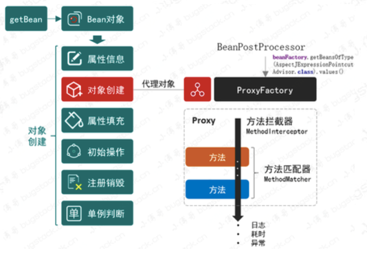

在创建对象的过程中，需要将XML文件中配置的代理对象（切面中的一些类对象）实例化，会用到BeanPostProcessor类提供的方法来修改Bean对象执行初始化前后的扩展信息，但这里需要结合BeanPostProcessor实现新的接口和实现类，这样才能定向获取对应的类信息，与创建之前流程的普通对象不同，代理对象的创建需要优先于其他对象的创建。在实际开发过程中，需要在AbstractAutowireCapableBeanFactory#createBean中优先判断createBean和doCtreateBean方法进行拆分。设计AOP切面需要实现方法拦截器的具体功能，如BeforeAdvice、AfterAdvice，让用户可以更简单地使用切面功能；还需整合包装切面表达式及拦截方法，提供不同类型的代理方法的代理工厂，用来包装切面服务。

## 4. AOP切面实现


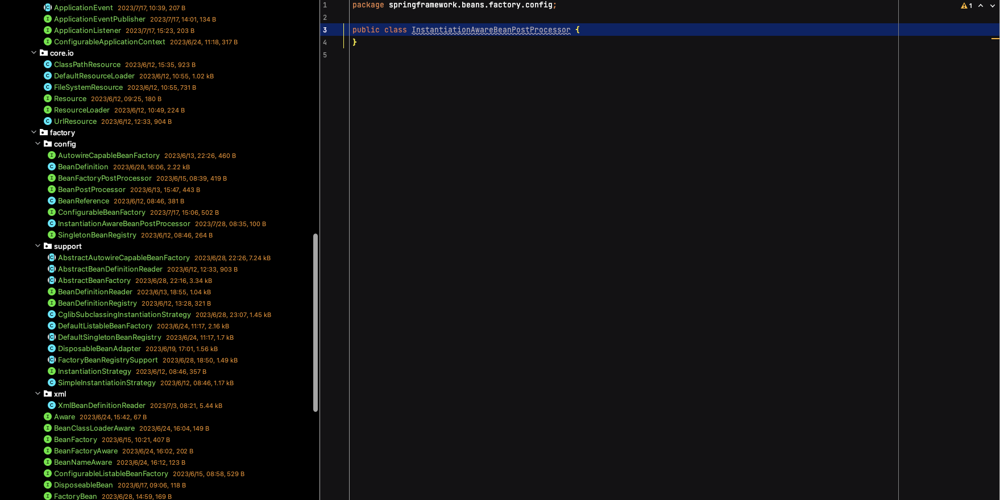


从下面整个类的关系图可以看出，在BeanPostProcessor接口实现继承的InstantiationAwareBeanPostProcessor接口后，创建了一个自动代理的DefaultAdvisorAutoProxyCreator类，这个类负责将整个AOP代理融入Bean的生命周期中。

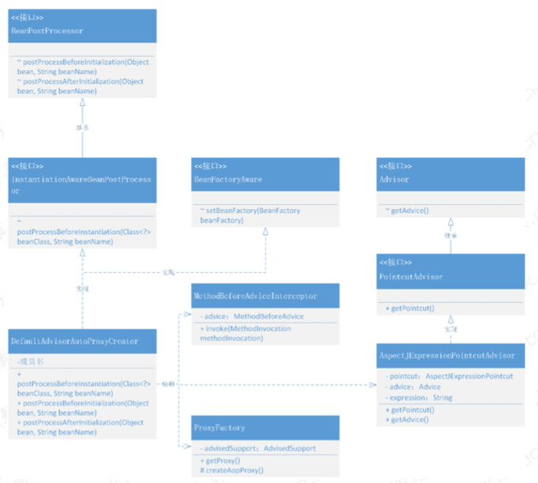

DefaultAdvisorAutoProxyCreator类依赖于拦截器、代理工厂，以及Pointcut与Advisor的包装服务AspectJExpressionPointcutAdvisor，并提供切面、拦截方法和表达式。Spring框架中的AOP吧Advice细化为BeforeAdvice、AfterAdvice、AfterReturing、ThrowsAdvice，在目前的测试实例中我们只使用到了BeforeAdvice。针对这部分内容，用户可以对比Spring的源码进行补充测试。

**定义Advice拦截器链路**

```java
ublic interface BeforeAdvice extends Advice {
}
```

```java
public interface MethodBeforeAdvice extends BeforeAdvice{
    void before(Method method, Object[] args, Object target) throws Throwable;
}
```

在Spring框架中，Advice是通过方法拦截器MethodInterceptor实现的，即围绕Advice做一个类似的拦截器链路—before Advice、After advice等。因为暂时不需要太多接口，所以只定义了一个MethodBeforeAdvice接口。

**定义Advisor访问者**

```java
public interface Advisor {
    Advice getAdvice();
}
```

```java
public interface PointcutAdvisor extends Advisor{
    Pointcut getPointcut();
}
```

Advisor是Pointcut功能和Advice功能的组合。Pointcut用于获取JoinPoint，而Advice取决于JoinPoint执行什么操作

```java
public class AspectJExpressionPointcutAdvisor implements PointcutAdvisor {
    //切面
    private AspectJExpressionPointcut pointcut;
    //具体的拦截方法
    private Advice advice;
    //表达式
    private String expression;
    
    public void setExpression(String expression){
        this.expression=expression;
    }
    @Override
    public Advice getAdvice() {
        return advice;
    }

    @Override
    public Pointcut getPointcut() {
        if(null==pointcut){
            pointcut=new AspectJExpressionPointcut(expression);
        }
        return pointcut;
    }
    public void setAdvice(Advice advice){
        this.advice=advice;
    }
}
```

AspectJExpressionPointcutAdvisor实现了PointcutAdvisor接口，将切面pointcut、拦截方法advice和具体的拦截表达式包装在一起。这样就可以在XML文件的配置中定义一个PointcutAdvisor切面拦截器。

**方法拦截器**

```java
public class MethodBeforeAdviceInterceptor implements MethodInterceptor {
    private MethodBeforeAdvice advice;

    public MethodBeforeAdviceInterceptor(MethodBeforeAdvice advice){
        this.advice=advice;
    }

    @Override
    public Object invoke(MethodInvocation methodInvocation) throws Throwable {
        this.advice.before(methodInvocation.getMethod(),methodInvocation.getArguments(),methodInvocation.getThis());
        return methodInvocation.proceed();
    }
}
```

通过MethodBeforeAdviceInterceptor实现了MethodInterceptor接口，在invoke方阿福汇总调用advice中的before方法，传入对应的参数信息。通过advice.before方法实现MethodBeforeAdvice接口，并进行了相应的处理。可以看到，MethodInterceptor实现类功能与之前是一样的，只不过现在交给了Spring框架来处理。

**代理工厂**

```java
public class ProxyFactory {
    private AdvisedSupport advisedSupport;

    public ProxyFactory(AdvisedSupport advisedSupport){
        this.advisedSupport=advisedSupport;
    }

    public Object getProxy(){
        return createAopProxy().getProxy();
    }

    private AopProxy  createAopProxy(){
        if(advisedSupport.isProxyTargetClass()){
            return new Cglib2AopProxy(advisedSupport);
        }
        return new JdkDynamicAopProxy(advisedSupport);
    }
}
```

这个代理工厂主要解决了选择JDK和Cglib两种代理的问题。有了代理工厂，用户就可以按照不同的创建需求进行控制。

**融入Bean生命周期的自动代理创建者**

```java
public class DefaultAdvisorAutoProxyCreator implements InstantiationAwareBeanPostProcessor, BeanFactoryAware {
    private DefaultListableBeanFactory beanFactory;

    @Override
    public Object postProcessBeforeInstantiation(Class<?> beanClass, String beanName) throws BeansException, springframework.BeansException {
        if(isInfrastructureClass(beanClass)) return null;
        //获得所有切面集合
        Collection<AspectJExpressionPointcutAdvisor> advisors=beanFactory.getBeansOfType(AspectJExpressionPointcutAdvisor.class).values();
        for (AspectJExpressionPointcutAdvisor advisor : advisors) {
            ClassFilter classFilter=advisor.getPointcut().getClassFilter();
            //当不是当前类的类过滤器就过滤掉
            if(!classFilter.matches(beanClass))continue;
            AdvisedSupport advisedSupport=new AdvisedSupport();
            //定义目标资源
            TargetSource targetSource=null;
            try{
                targetSource=new TargetSource(beanClass.getDeclaredConstructor().newInstance());
            }catch (Exception e){
                e.printStackTrace();
            }
            advisedSupport.setTargetSource(targetSource);
            advisedSupport.setMethodInterceptor((MethodInterceptor) advisor.getAdvice());
            advisedSupport.setMethodMatcher(advisor.getPointcut().getMathodMatcher());
            advisedSupport.setProxyTargetClass(false);
            return new ProxyFactory(advisedSupport).getProxy();
        }
        return null;
    }

    private boolean isInfrastructureClass(Class<?> beanClass) {
        return false;
    }

    @Override
    public void setBeanFactory(BeanFactory beanFactory)throws BeansException{
        this.beanFactory=(DefaultListableBeanFactory) beanFactory;
    }
}
```

DefaultAdvisorAutoProxyCreator类的主要核心实现实在postProcessBeforeInstantiation方法中，从beanFactory.getBeansOfType获取AspectJExpressionPointcutAdvisor开始。在获取advisors后，首先遍历相应的AspectJExpressionPointcutAdvisor来填充对应的属性信息（如目标对象、拦截方法、匹配器），然后返回代理对象。现在，调用方获取的Bean对象就是一个已经被切面注入的对象，当调用方法时，其会被按需拦截，处理用户需要的信息。

**测试**

- 事先准备

```java

public class UserService implements IUserService{
    @Override
    public String queryUserInfo(){
        try{
            Thread.sleep(new Random(1).nextInt(100));
        }catch (InterruptedException e){
            e.printStackTrace();
        }
        return "张三，100001，深圳";
    }
    @Override
    public String register(String userName){
        try{
            Thread.sleep(new Random(1).nextInt(100));
        }catch (InterruptedException e){
            e.printStackTrace();
        }
        return "注册用户："+userName+" success!";
    }
}
```

UserService提供了两个不同的方法，还可以增加新的类并将其加入测试。在后面测试过程中吗，会对这两个方法添加切面拦截处理，以及输出方法执行耗时。

- 自定义拦截方法

```java
public class UserServiceBeforeAdvice implements MethodBeforeAdvice {
    @Override
    public void before(Method method, Object[] args, Object target) throws Throwable {
        System.out.println("拦截方法："+method.getName());
    }
}
```

与第11章的拦截方法相比，这里不再是实现MethodInterceptor接口，而是实现MethodBeforeAdvice环绕拦截。在MethodBeforeAdvice方法中，可以获取方法的一些信息。如果还开发了MethodAfterAdvice接口，则可以同时实现MethodInterceptor和MethodAfterAdvice两个接口。

- 在Spring.xml配置文件中配置AOP

```xml
<beans>
    <bean id="userService" class="springframework.bean.UserService"></bean>

    <bean class="springframework.aop.framework.autoproxy.DefaultAdvisorAutoProxyCreator"></bean>

    <bean id="beforeAdvice" class="springframework.aop.framework.adapter.MethodBeforeAdviceInterceptor"></bean>

    <bean id="methodInterceptpr" class="springframework.aop.framework.adapter.MethodBeforeAdviceInterceptor">
        <property name="advice" ref="beforeAdvice"></property>
    </bean>

    <bean id="pointcutAdvisor" class="springframework.aop.aspectj.AspectJExpressionPointcutAdvisor">
        <property name="expression" value="execution(* springframework.bean.IUserService.*(..))"></property>
        <property name="advice" ref="methodInterceptpr"></property>
    </bean>
</beans>
```

用户可以在Spring.xml配置文件中配置AOP，因为已经将AOP的功能融入Bean的生命周期中，所以新增的拦截方法都会被自动处理。

- 单元测试

```java
public class ApiTest {
    @Test
    public void test_aop() throws BeansException {
        ClassPathXmlApplicationContext applicationContext=new ClassPathXmlApplicationContext("classpath:spring.xml");
        IUserService userService=applicationContext.getBean("userService",IUserService.class);
        System.out.println("测试结果:"+userService.queryUserInfo());
    }
}
```

从测试结果可以看出，拦截方法已经生效，不需要用户手动处理切面、拦截方法等。

## 5. Spring相关源码解析

**BeforeAdvice**

BeforeAdvice是AOP（面向切面编程）中的一个接口，用于定义在目标方法执行之前执行的通知（advice）逻辑。它是AOP中的一种切面类型，可以在目标方法执行前执行一些预处理逻辑，例如日志记录、权限验证、参数校验等。BeforeAdvice接口的实现类可以通过实现before()方法来定义具体的逻辑。在目标方法执行之前，AOP框架会自动调用BeforeAdvice的before()方法，执行其中定义的逻辑。通过BeforeAdvice，可以在目标方法执行前进行一些必要的操作，以增强程序的功能和控制流程。总之，BeforeAdvice的作用是在目标方法执行之前执行预处理逻辑，提供了一种在AOP中插入额外逻辑的方式。

```java
public interface BeforeAdvice extends Advice {

}
```

**MethodBeforeAdvice**

 `MethodBeforeAdvice` 的作用是在特定方法被调用之前执行自定义逻辑或执行特定任务。它允许开发人员拦截方法调用并在实际方法执行之前执行日志记录、安全检查或参数验证等操作。

```java
public interface MethodBeforeAdvice extends BeforeAdvice {

	/**
	 * Callback before a given method is invoked.
	 * @param method the method being invoked
	 * @param args the arguments to the method
	 * @param target the target of the method invocation. May be {@code null}.
	 * @throws Throwable if this object wishes to abort the call.
	 * Any exception thrown will be returned to the caller if it's
	 * allowed by the method signature. Otherwise the exception
	 * will be wrapped as a runtime exception.
	 */
	void before(Method method, Object[] args, @Nullable Object target) throws Throwable;

}
```

**Advisor**

Advisor是AOP（面向切面编程）中的一个类，用于定义切面（Aspect）和切入点（Pointcut）的组合。它是一个通用的AOP概念，可以用于实现不同类型的切面，例如BeforeAdvice、AfterAdvice、AroundAdvice等。Advisor类的作用是将切面和切入点组合在一起，形成一个可重用的切面组件。它可以被用于多个目标对象中，提供了一种可配置的方式来实现AOP。Advisor类通常包含一个切入点和一个切面，其中切入点定义了哪些方法需要被代理，切面定义了在这些方法执行前后应该执行的逻辑。在Spring框架中，Advisor类是一个接口，它有多个实现类，例如AspectJExpressionPointcutAdvisor、DefaultPointcutAdvisor等。这些实现类提供了不同的切入点和切面的组合方式，可以根据需要进行选择和配置。

```java
public interface Advisor {
	Advice EMPTY_ADVICE = new Advice() {};
	Advice getAdvice();
	boolean isPerInstance();
}
```

**PointcutAdvisor**

PointcutAdvisor是AOP（面向切面编程）中的一个类，用于定义切入点（Pointcut）和通知（Advice）的组合。它是Advisor接口的一个具体实现。
PointcutAdvisor的作用是将切入点和通知结合起来，形成一个可重用的切面组件。它用于确定在哪些方法上应该应用通知。切入点定义了方法的匹配规则，用于确定哪些方法需要被代理，而通知定义了在这些方法执行前后或异常发生时应该执行的逻辑。PointcutAdvisor类可以通过不同的实现类来创建不同类型的切面。在Spring框架中，常用的PointcutAdvisor实现类有AspectJExpressionPointcutAdvisor和NameMatchMethodPointcutAdvisor等。这些实现类提供了不同的切入点匹配方式和通知类型，可以根据需求进行选择和配置。总之，PointcutAdvisor的作用是将切入点和通知组合在一起，用于定义AOP切面的规则和逻辑。它提供了一种可配置的方式来实现切面的织入。

```java
public interface PointcutAdvisor extends Advisor {

	/**
	 * Get the Pointcut that drives this advisor.
	 */
	Pointcut getPointcut();

}
```

**AspectJExpressionPointcutAdvisor**

AspectJExpressionPointcutAdvisor是Spring框架中的一个类，用于基于AspectJ表达式的切点和通知的组合。AspectJExpressionPointcutAdvisor的作用是通过AspectJ表达式来定义切入点，确定哪些方法需要被代理，并将切入点和通知结合起来形成一个切面。AspectJ表达式是一种强大的语法，可以用来描述方法的匹配规则，例如指定特定的类、方法名、参数类型等。 使用AspectJExpressionPointcutAdvisor，可以根据AspectJ表达式的规则来选择需要被代理的方法，并在这些方法执行前后或异常发生时执行相应的通知逻辑。这样可以实现在特定的方法执行前后织入额外的行为，例如日志记录、性能监控、事务管理等。总之，AspectJExpressionPointcutAdvisor提供了一种基于AspectJ表达式的方式来定义切入点和通知的组合，用于实现更灵活和精确的AOP切面。

```java
public class AspectJExpressionPointcutAdvisor extends AbstractGenericPointcutAdvisor implements BeanFactoryAware {

	private final AspectJExpressionPointcut pointcut = new AspectJExpressionPointcut();


	public void setExpression(@Nullable String expression) {
		this.pointcut.setExpression(expression);
	}

	@Nullable
	public String getExpression() {
		return this.pointcut.getExpression();
	}

	public void setLocation(@Nullable String location) {
		this.pointcut.setLocation(location);
	}

	@Nullable
	public String getLocation() {
		return this.pointcut.getLocation();
	}

	public void setParameterNames(String... names) {
		this.pointcut.setParameterNames(names);
	}

	public void setParameterTypes(Class<?>... types) {
		this.pointcut.setParameterTypes(types);
	}

	@Override
	public void setBeanFactory(BeanFactory beanFactory) {
		this.pointcut.setBeanFactory(beanFactory);
	}

	@Override
	public Pointcut getPointcut() {
		return this.pointcut;
	}

}
```

**MethodBeforeAdviceInterceptor**

MethodBeforeAdviceInterceptor是Spring框架中的一个类，用于在方法调用之前执行一些自定义逻辑或任务。MethodBeforeAdviceInterceptor的作用是实现MethodBeforeAdvice接口，它可以在目标方法被调用之前执行自定义的逻辑或任务。MethodBeforeAdviceInterceptor的构造函数需要传入一个MethodBeforeAdvice类型的对象，用于定义具体的逻辑或任务。在目标方法被调用之前，MethodBeforeAdviceInterceptor会调用MethodBeforeAdvice对象的before()方法，执行定义的逻辑或任务。MethodBeforeAdviceInterceptor通常用于实现AOP切面，用于在目标方法执行之前拦截方法调用并执行额外的逻辑或任务。例如，可以使用MethodBeforeAdviceInterceptor来实现日志记录、参数验证、安全检查等功能。它是AOP编程中的一个重要组件，可以提高代码的可重用性和可维护性。总之，MethodBeforeAdviceInterceptor的作用是在方法调用之前执行自定义逻辑或任务，它是实现AOP切面的重要组件。

```java
public class MethodBeforeAdviceInterceptor implements MethodInterceptor, BeforeAdvice, Serializable {

	private final MethodBeforeAdvice advice;


	/**
	 * Create a new MethodBeforeAdviceInterceptor for the given advice.
	 * @param advice the MethodBeforeAdvice to wrap
	 */
	public MethodBeforeAdviceInterceptor(MethodBeforeAdvice advice) {
		Assert.notNull(advice, "Advice must not be null");
		this.advice = advice;
	}


	@Override
	@Nullable
	public Object invoke(MethodInvocation mi) throws Throwable {
		this.advice.before(mi.getMethod(), mi.getArguments(), mi.getThis());
		return mi.proceed();
	}

}
```

**ProxyFactory**
ProxyFactory是Spring框架中的一个类，用于创建代理对象的工厂。它的作用是简化创建代理对象的过程，提供了一种方便的方式来实现AOP（面向切面编程）的功能。通过ProxyFactory，我们可以将AOP的横切关注点（如日志、事务、安全等）与业务逻辑分离，将这些关注点通过代理对象的方式织入到目标对象的方法中。ProxyFactory提供了一些方法和配置选项，可以指定要代理的目标对象、要应用的拦截器、要使用的代理类型（JDK动态代理或CGLIB代理）等。
 具体来说，ProxyFactory可以帮助我们完成以下任务：

1. 创建代理对象：ProxyFactory可以根据配置和参数创建代理对象，无需手动编写代理类的代码。
2. 配置拦截器：ProxyFactory允许我们指定要应用的拦截器，这些拦截器可以在目标对象的方法执行前后进行拦截和增强。
3. 选择代理类型：ProxyFactory支持JDK动态代理和CGLIB代理两种方式，可以根据目标对象的类型和需求选择合适的代理类型。总之，ProxyFactory是Spring框架中用于创建代理对象的工厂类，通过它可以方便地创建代理对象并实现AOP的功能。

```java
public class ProxyFactory extends ProxyCreatorSupport {
	public ProxyFactory() {
	}
	public ProxyFactory(Object target) {
		setTarget(target);
		setInterfaces(ClassUtils.getAllInterfaces(target));
	}
	public ProxyFactory(Class<?>... proxyInterfaces) {
		setInterfaces(proxyInterfaces);
	}
	public ProxyFactory(Class<?> proxyInterface, Interceptor interceptor) {
		addInterface(proxyInterface);
		addAdvice(interceptor);
	}
	public ProxyFactory(Class<?> proxyInterface, TargetSource targetSource) {
		addInterface(proxyInterface);
		setTargetSource(targetSource);
	}
	public Object getProxy() {
		return createAopProxy().getProxy();
	}
	public Object getProxy(@Nullable ClassLoader classLoader) {
		return createAopProxy().getProxy(classLoader);
	}
	@SuppressWarnings("unchecked")
	public static <T> T getProxy(Class<T> proxyInterface, Interceptor interceptor) {
		return (T) new ProxyFactory(proxyInterface, interceptor).getProxy();
	}
	@SuppressWarnings("unchecked")
	public static <T> T getProxy(Class<T> proxyInterface, TargetSource targetSource) {
		return (T) new ProxyFactory(proxyInterface, targetSource).getProxy();
	}
	public static Object getProxy(TargetSource targetSource) {
		if (targetSource.getTargetClass() == null) {
			throw new IllegalArgumentException("Cannot create class proxy for TargetSource with null target class");
		}
		ProxyFactory proxyFactory = new ProxyFactory();
		proxyFactory.setTargetSource(targetSource);
		proxyFactory.setProxyTargetClass(true);
		return proxyFactory.getProxy();
	}

}
```

# 十三. 自动扫描注册Bean对象

 ## 1. 本节重点

在Spring框架的实现过程中，从产生Spring Bean容器到配置注册Bean对象，可以满足基本的使用需求。但在实际中，需要配置大量的Bean对象。从用户的角度来看，这是一件重复且繁琐的事情，因此需要对注册流程进行优化和完善，提升用户的产品体验。本节重点是定义属性标识、对象的注解方式，当容器扫描XML配置时，提取Bean对象的属性和对象信息，将其注册到Bean对象的定义组中。通过这部分的自动化扫描衔接，优化对象的注册流程。

## 2. 注入对象完善点

本节将介绍IOC和AOP的核心内容。在Spring框架的早期版本中，这些功能需要在Spring.xml配置文件中配置。这与目前实际使用的Spring框架还有很大差别，之后对核心功能逻辑进行完善，利用更少的配置实现更简化的操作，包括包路径扫描、注解配置的使用、占位符属性的填充等。我们的目标就是在目前的核心逻辑上填充一些自动化功能。在此过程中，我们可以学习IOC和AOP的设计和实现，体会代码逻辑的实现过程，积累编程经验。

## 3. 自动扫描注册设计

为了简化Bean对象的配置，使整个Bean对象的注册通过自动扫描完成，需要完善功能，包括：扫描路径入口、XML解析扫描信息、给需要扫描的Bean对象做注解标记、扫描Class类提取Bean对象注册的基本信息、组装注册信息并注册成Bean对象。在可以实现自定义注解和配置扫描路径的情况下，完成Bean对象的注册。此外，还需要解决一个配置中占位符属性的问题，如通过占位符属性值${token}给Bean对象注入属性信息。这个操作需要使用BeanFactoryPostProcessor类，它可以在所有的BeanDefinition加载完成后，将Bean对象实例化之前，提供修改BeanDefinition属性的机制。实现这部分内容是为了后续将此类内容扩展到自动配置处理中。

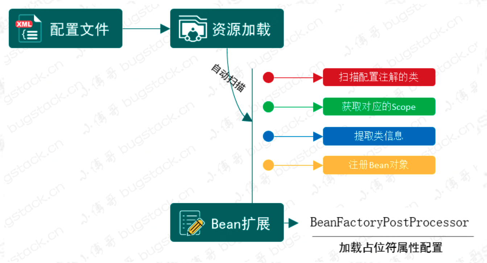

结合Bean对象的生命周期来看，包扫描只不过是扫描特定注解的类，提取类的相关信息并组装成BeanDefinition，注册到容器中。在XMLBeanDefinitionReader类中解析标签，首先扫描类组建BeanDefiition，然后通过ClassPathBeanDefinitionSacnner#doSan方法注册到Spring Bean容器中。自动扫描注册主要是扫描添加了自定义注解的类，在XML加载过程中提取类的信息，组装BeanDefinition并注册到Spring Bean容器中。因此，会使用配置包路径，在XmlBeanDefinitionReader类中解析并作出相应的处理，包括对类的扫描、获取注解信息等，还包括BeanFactoryPostProcessor的使用，因为需要完成对占位符配置信息的加载，所以在加载完成所有的BeanDefinition后，实例化Bean对象之前，使用BeanFactoryPostProcessor来修改BeanDefinition的属性信息。需要注意的是，这部分的实现也是为后续将占位符配置到注解上做准备。

## 4. 自动扫描注册实现


整个类涉及的内容并不多，主要包括XML解析类XmlBeanDefinitionReader对ClassPathBeanDefinitionScanner#doScan方法的使用。首先，在doScan方法中处理所有指定路径下添加的注解类，拆解出类的名称、作用范围等；然后，创建BeanDefinition，以便用与注册Bean对象。目前，PropertyPalceholderConfigurer看上去像单独的内容，后续会把它与自动加载Bean对象进行整合，在注解上使用占位符配置一些配置文件中的属性信息。

**处理占位符配置**

```java
public class PropertyPlaceholderConfigurer  implements BeanFactoryPostProcessor {
    public static final String DEFAULT_PLACEHOLDER_PREFIX="${";
    public static final String DEFAULT_PLACEHOLDER_SUFFIX="}";
    private String location;


    @Override
    public void postProcessBeanFactory(ConfigurableListableBeanFactory beanFactory) throws BeansException {
        //加载属性文件
        try{
            DefaultResourceLoader resourceLoader=new DefaultResourceLoader();
            //获取资源文件
            Resource resource=resourceLoader.getResource(location);
            Properties properties=new Properties();
            properties.load(resource.getInputStream());
            String[] beanDefinitionNames=beanFactory.getBeanDefinitionNames();
            for (String beanDefinitionName : beanDefinitionNames) {
                BeanDefinition beanDefinition=beanFactory.getBeanDefinition(beanDefinitionName);
                PropertyValues propertyValues=beanDefinition.getPropertyValues();
                for (PropertyValue propertyValue : propertyValues.getPropertyValues()) {
                    Object value=propertyValue.getValue();
                    if(!(value instanceof String))continue;
                    String strVal=(String)value;
                    StringBuilder buffer=new StringBuilder(strVal);
                    int startIdx=strVal.indexOf(DEFAULT_PLACEHOLDER_PREFIX);
                    int stopIdx=strVal.indexOf(DEFAULT_PLACEHOLDER_SUFFIX);
                    if(startIdx !=-1 && stopIdx!=-1 && startIdx<stopIdx){
                        String propKey=strVal.substring(startIdx +2,stopIdx);
                        String propVal=properties.getProperty(propKey);
                        buffer.replace(startIdx,startIdx+1,propVal);
                        propertyValues.addPropertyValue(new  PropertyValue(propertyValue.getName(), buffer.toString()));
                    }
                }
            }
        }catch (IOException e){
            throw new BeansException("Could not load propertied",e);
        }
    }
    public void setLocation(String location){
        this.location=location;
    }
}
```

根据BeanFactoryProcessor接口在Bean生命周期中的属性特点，可以在Bean对象实例化之前改变属性信息。这里通过BeanFactoryPostProcessor接口，完成对配置文件的加载，以及获取占位符在属性文件的配置。这样就可以把获取的配置信息放置到属性配置中，即buffer.replace函数，propertyValues.addPropertyValue。

**定义拦截注解**

```java
@Target({ElementType.TYPE,ElementType.METHOD})
@Retention(RetentionPolicy.RUNTIME)
@Documented
public @interface Scope {
    String value() default "singelton";
}
```

自定义注解用于默认作用域，在配置Bean对象注解时，方便获取Bean对象的作用域。需要注意的是，一般使用默认的singleton

```java
@Target(ElementType.TYPE)
@Retention(RetentionPolicy.RUNTIME)
@Documented
public @interface Component {
    String value() default "";
}
```

对于配置Class类，除了使用Component进行自定义注解，还可以使用Service、Controller，它们的处理方式基本一致，这里只介绍Component进行自定义注解方法

**处理对象扫描装配**

```java
public class ClassPathScanningCandidateComponentProvider {
    public Set<BeanDefinition> findCandidateComponents(String basePackage){
        //用来存放BeanDefinition
        Set<BeanDefinition> candidates=new LinkedHashSet<>();
        Set<Class<?>> classes= ClassUtil.scanPackageByAnnotation(basePackage, Component.class);
        for (Class<?> aClass : classes) {
            candidates.add(new BeanDefinition(aClass));
        }
        return candidates;
    }
}
```

首先提供一个可以通过配置路径basePackage解析出classes信息的方法findCandidateComponents，然后通过这个方法就可以扫描所有使用Component注解的Bean对象

```java
public class ClassPathBeanDefinitionScanner extends ClassPathScanningCandidateComponentProvider{
    private BeanDefinitionRegistry registry;

    public ClassPathBeanDefinitionScanner(BeanDefinitionRegistry registry){
        this.registry=registry;
    }

    public void doScan(String... basePackages){
        for(String basePackage : basePackages){
            //扫描指定路径下的注解，并获取所有的Bean定义
            Set<BeanDefinition> candidates=findCandidateComponents(basePackage);
            for (BeanDefinition beanDefinition : candidates) {
                //解析Bean对象作用域Singleton、prototype
                String beanScope=resolveBeanScope(beanDefinition);
                if (StrUtil.isNotEmpty(beanScope)) {
                    beanDefinition.setScope(beanScope);
                }
                registry.registerBeanDefinition(determineBeanName(beanDefinition),beanDefinition);
            }
        }
    }

    private String resolveBeanScope(BeanDefinition beanDefinition){
        Class<?> beanClass=beanDefinition.getBeanClass();
        Scope scope=beanClass.getAnnotation(Scope.class);
        if(null!=scope) return scope.value();
        return StrUtil.EMPTY;
    }

    private String determineBeanName(BeanDefinition beanDefinition){
        Class<?> beanClass=beanDefinition.getBeanClass();
        Component component=beanClass.getAnnotation(Component.class);
        String value= component.value();
        if (StrUtil.isEmpty(value)) {
            value=StrUtil.lowerFirst(beanClass.getSimpleName());
        }
        return value;
    }
}
```

ClassPathBeanDefinitionScanner是继承自ClassPathScanningCandidateComponentProvider的具体扫描包处理的类。在doscan中，除了需要扫描的类信息，还需要获取Bean得作用域和类名。

**解析XML中的调用扫描**

```java
public class XmlBeanDefinitionReader extends AbstractBeanDefinitionReader {
    public XmlBeanDefinitionReader(BeanDefinitionRegistry registry){
        super(registry);
    }
    public XmlBeanDefinitionReader(BeanDefinitionRegistry registry, ResourceLoader resourceLoader){
        super(registry,resourceLoader);
    }

    @Override
    public void loadBeanDefinitions(Resource resource) throws BeansException {
        try {
            try (InputStream inputStream=resource.getInputStream()){
                //注册beanDefition
               doLoadBeanDefinitions(inputStream);
            }
        }catch(IOException | ClassNotFoundException | ParserConfigurationException | SAXException e){
            throw  new BeansException("IOException parsing XML document form"+resource,e);
        }
    }

    @Override
    public void loadBeanDefinitions(Resource... resources) throws BeansException {
        for(Resource resource: resources){
            loadBeanDefinitions(resource);
        }
    }

    @Override
    public void loadBeanDefinitions(String location) throws BeansException {
        ResourceLoader resourceLoader=getResourceLoader();
        Resource resource=resourceLoader.getResource(location);
        loadBeanDefinitions(resource);

    }

    @Override
    public void loadBeanDefinitions(String... locations) throws BeansException {
        ResourceLoader resourceLoader=getResourceLoader();
        for(String location: locations){
            Resource resource=resourceLoader.getResource(location);
            loadBeanDefinitions(resource);
        }
    }

    public void doLoadBeanDefinitions(InputStream inputStream)
            throws ParserConfigurationException, SAXException, IOException, ClassNotFoundException, BeansException {
        DocumentBuilderFactory factory = DocumentBuilderFactory.newInstance();
        DocumentBuilder builder = factory.newDocumentBuilder();
        Document doc = builder.parse(inputStream);
        NodeList beanNodes = doc.getElementsByTagName("bean");
        Element root= (Element) doc.getElementsByTagName("component-scan");
        System.out.println(root);
        if(root!=null){
            String scanPath=root.getAttribute("base-package");
            if(StrUtil.isEmpty(scanPath)){
                throw new BeansException("The value of base-package attribute can not be empty or null");
            }
            scanPackage(scanPath);
        }
        for (int i = 0; i < beanNodes.getLength(); i++) {
            Node beanNode = beanNodes.item(i);
            if (beanNode.getNodeType() == Node.ELEMENT_NODE) {
                Element beanElement = (Element) beanNode;
                String id = beanElement.getAttribute("id");
                String name = beanElement.getAttribute("name");
                String className = beanElement.getAttribute("class");
                String init_method=beanElement.getAttribute("init-method");
                String destroy_method=beanElement.getAttribute("destroy-method");
                String beanScope= beanElement.getAttribute("scope");
                Class<?> clazz = Class.forName(className);
                String beanName = id.isEmpty() ? name : id;
                if (beanName.isEmpty()) {
                    beanName = Character.toLowerCase(clazz.getSimpleName().charAt(0)) + clazz.getSimpleName().substring(1);
                }
                BeanDefinition beanDefinition = new BeanDefinition(clazz);
                beanDefinition.setInitMethodName(init_method);
                beanDefinition.setDestroyMethodName(destroy_method);
                if(!beanScope.isEmpty()){
                    beanDefinition.setScope(beanScope);
                }
                NodeList propertyNodes = beanElement.getElementsByTagName("property");
                for (int j = 0; j < propertyNodes.getLength(); j++) {
                    Node propertyNode = propertyNodes.item(j);
                    if (propertyNode.getNodeType() == Node.ELEMENT_NODE) {
                        Element propertyElement = (Element) propertyNode;
                        String attrName = propertyElement.getAttribute("name");
                        String attrValue = propertyElement.getAttribute("value");
                        String attrRef = propertyElement.getAttribute("ref");
                        Object value = attrRef.isEmpty() ? attrValue : new BeanReference(attrRef);
                        PropertyValue propertyValue = new PropertyValue(attrName, value);
                        beanDefinition.getPropertyValues().addPropertyValue(propertyValue);
                    }
                }
                if (getRegistry().containsBeanDefinition(beanName)) {
                    throw new BeansException("Duplicate beanName[" + beanName + "] is not allowed");
                }
                getRegistry().registerBeanDefinition(beanName, beanDefinition);
            }
        }
    }
    private void scanPackage(String scanPath){
        String[] basePackage=StrUtil.splitToArray(scanPath,',');
        ClassPathBeanDefinitionScanner scanner=new ClassPathBeanDefinitionScanner(getRegistry());
        scanner.doScan(basePackage);
    }
}
```

XmlBeanDefinitionReader主要是在加载配置文件后处理新增的自定义配置属性component-scan的，解析后调用scanPackage方法，其实也就是ClassPathBeanDefinitionScanner#doScan功能。需要注意的是，为了方便加载和解析XML文件。

**注册Bean对象测试**

- 事先准备

```java
@Component("userService")
public class UserService implements IUserService{
    private String token;
    @Override
    public String queryUserInfo(){
        try{
            Thread.sleep(new Random(1).nextInt(100));
        }catch (InterruptedException e){
            e.printStackTrace();
        }
        return "张三，100001，深圳";
    }
    @Override
    public String register(String userName){
        try{
            Thread.sleep(new Random(1).nextInt(100));
        }catch (InterruptedException e){
            e.printStackTrace();
        }
        return "注册用户："+userName+" success!";
    }

    public String getToken() {
        return token;
    }

    public void setToken(String token) {
        this.token = token;
    }

    @Override
    public String toString() {
        return "UserService{" +
                "token='" + token + '\'' +
                '}';
    }
}
```

给UserService类添加一个自定义注解@Component("userService")和一个属性信息token，分别用于测试包扫描和占位符属性

- 属性配置文件

```pro
token=1234567
```

这里配置一个token属性信息，用于通过占位符的方式获取信息

- 在Spring.xml配置文件中配置对象

```xml
<?xml version="1.0" encoding="UTF-8"?>
<beans xmlns="http://www.springframework.org/schema/beans"
       xmlns:xsi="http://www.w3.org/2001/XMLSchema-instance"
       xmlns:context="http://www.springframework.org/schema/context"
       xsi:schemaLocation="http://www.springframework.org/schema/beans
          http://www.springframework.org/schema/beans/spring-beans.xsd
   http://www.springframework.org/schema/context">

    <bean class="springframework.beans.factory.PropertyPlaceholderConfigurer">
        <property name="location" value="classpath:user.properties"></property>
    </bean>
    <bean id="userService" class="springframework.bean.UserService">
        <property name="token" value="${token}"></property>
    </bean>
</beans>
```

添加Component-scan属性后，设置包扫描根路径，加载classpath:user.properties后，设置占位符属性值${token}

- 单元测试（占位符）

```java
  @Test
    public void test() throws BeansException {
        ClassPathXmlApplicationContext applicationContext=new ClassPathXmlApplicationContext("classpath:spring.xml");
        IUserService userService=applicationContext.getBean("userService", IUserService.class);
        System.out.println("测试结果:"+userService);
    }
```

测试结果如下：


从测试结果可以看出，UserService中的token属性已经通过占位符的方式设置配置文件中的token.properties的属性值

- 单元测试（包扫描）

首先更改xml文件

```xml
<?xml version="1.0" encoding="UTF-8"?>
<beans xmlns="http://www.springframework.org/schema/beans"
       xmlns:xsi="http://www.w3.org/2001/XMLSchema-instance"
       xmlns:context="http://www.springframework.org/schema/context"
       xsi:schemaLocation="http://www.springframework.org/schema/beans
          http://www.springframework.org/schema/beans/spring-beans.xsd
   http://www.springframework.org/schema/context">
    <context:component-scan base-package="springframework.bean"></context:component-scan>


</beans>
```

然后测试扫描功能

```java
    @Test
    public void test() throws BeansException {
        ClassPathXmlApplicationContext applicationContext=new ClassPathXmlApplicationContext("classpath:spring.xml");
        IUserService userService=applicationContext.getBean("userService", IUserService.class);
        System.out.println("测试结果:"+userService.queryUserInfo());
    }
```


## 5. Spring相关源码解析

**Scope**

```java
@Target({ElementType.TYPE, ElementType.METHOD})
@Retention(RetentionPolicy.RUNTIME)
@Documented
public @interface Scope {
	@AliasFor("scopeName")
	String value() default "";
	@AliasFor("value")
	String scopeName() default "";
	ScopedProxyMode proxyMode() default ScopedProxyMode.DEFAULT;
}
```

**Component**

```java
@Target(ElementType.TYPE)
@Retention(RetentionPolicy.RUNTIME)
@Documented
@Indexed
public @interface Component {
	String value() default "";

}
```

**ClassPathScanningCandidateComponentProvider**

ClassPathScanningCandidateComponentProvider是Spring框架中的一个类，用于在类路径上扫描并识别候选的组件。该类的作用是通过扫描类路径，查找并识别符合特定条件的候选组件，如类、接口、注解等。它可以根据指定的条件，如包名、注解、父类等，过滤和选择符合要求的组件。ClassPathScanningCandidateComponentProvider通常用于实现自定义的组件扫描器，用于动态地发现和注册Spring容器中的组件。它可以帮助我们自动发现并加载符合特定条件的类，并将它们纳入Spring应用程序上下文中，以便进行进一步的处理和使用。总之，ClassPathScanningCandidateComponentProvider的作用是在类路径上扫描并识别候选的组件，用于动态地发现和注册Spring容器中的组件。

```java
public class ClassPathScanningCandidateComponentProvider implements EnvironmentCapable, ResourceLoaderAware {
  //默认的Bean资源的后缀
	static final String DEFAULT_RESOURCE_PATTERN = "**/*.class";
  //记录日志
	protected final Log logger = LogFactory.getLog(getClass());
  //默认资源后缀
	private String resourcePattern = DEFAULT_RESOURCE_PATTERN;

	private final List<TypeFilter> includeFilters = new ArrayList<>();

	private final List<TypeFilter> excludeFilters = new ArrayList<>();

	@Nullable
	private Environment environment;

	@Nullable
	private ConditionEvaluator conditionEvaluator;

	@Nullable
	private ResourcePatternResolver resourcePatternResolver;

	@Nullable
	private MetadataReaderFactory metadataReaderFactory;

	@Nullable
	private CandidateComponentsIndex componentsIndex;
  	public Set<BeanDefinition> findCandidateComponents(String basePackage) {
		if (this.componentsIndex != null && indexSupportsIncludeFilters()) {
			return addCandidateComponentsFromIndex(this.componentsIndex, basePackage);
		}
		else {
			return scanCandidateComponents(basePackage);
		}
	}
}
```

**ClassPathBeanDefinitionScanner**

ClassPathBeanDefinitionScanner是Spring框架中的一个类，用于扫描类路径（classpath）以查找和注册Bean定义。它的作用是自动扫描指定包下的类，并将其识别为Spring容器中的Bean。ClassPathBeanDefinitionScanner主要用于实现自动化的组件扫描和注册，以便将类自动转换为Spring管理的Bean。它可以根据指定的扫描规则（例如包路径、注解等）在类路径上查找符合条件的类，并将它们注册为Bean定义，使其可以被Spring容器管理和使用。通过ClassPathBeanDefinitionScanner，我们可以方便地实现组件的自动发现和注册，而无需显式地配置每个类作为Bean。这样可以减少手动配置的工作量，并提供更灵活的组件管理和扩展性。总之，ClassPathBeanDefinitionScanner是Spring框架中用于自动扫描类路径并注册Bean定义的工具类，它简化了组件的自动发现和注册过程，提供了更便捷和灵活的方式来管理和使用组件。

```java
public class ClassPathBeanDefinitionScanner extends ClassPathScanningCandidateComponentProvider {

	private final BeanDefinitionRegistry registry;

	private BeanDefinitionDefaults beanDefinitionDefaults = new BeanDefinitionDefaults();

	@Nullable
	private String[] autowireCandidatePatterns;

	private BeanNameGenerator beanNameGenerator = AnnotationBeanNameGenerator.INSTANCE;

	private ScopeMetadataResolver scopeMetadataResolver = new AnnotationScopeMetadataResolver();

	private boolean includeAnnotationConfig = true;
  
  public int scan(String... basePackages) {
		int beanCountAtScanStart = this.registry.getBeanDefinitionCount();

		doScan(basePackages);

		// Register annotation config processors, if necessary.
		if (this.includeAnnotationConfig) {
			AnnotationConfigUtils.registerAnnotationConfigProcessors(this.registry);
		}

		return (this.registry.getBeanDefinitionCount() - beanCountAtScanStart);
	}
  protected Set<BeanDefinitionHolder> doScan(String... basePackages) {
		Assert.notEmpty(basePackages, "At least one base package must be specified");
		Set<BeanDefinitionHolder> beanDefinitions = new LinkedHashSet<>();
		for (String basePackage : basePackages) {
			Set<BeanDefinition> candidates = findCandidateComponents(basePackage);
			for (BeanDefinition candidate : candidates) {
				ScopeMetadata scopeMetadata = this.scopeMetadataResolver.resolveScopeMetadata(candidate);
				candidate.setScope(scopeMetadata.getScopeName());
				String beanName = this.beanNameGenerator.generateBeanName(candidate, this.registry);
				if (candidate instanceof AbstractBeanDefinition) {
					postProcessBeanDefinition((AbstractBeanDefinition) candidate, beanName);
				}
				if (candidate instanceof AnnotatedBeanDefinition) {
					AnnotationConfigUtils.processCommonDefinitionAnnotations((AnnotatedBeanDefinition) candidate);
				}
				if (checkCandidate(beanName, candidate)) {
					BeanDefinitionHolder definitionHolder = new BeanDefinitionHolder(candidate, beanName);
					definitionHolder =
							AnnotationConfigUtils.applyScopedProxyMode(scopeMetadata, definitionHolder, this.registry);
					beanDefinitions.add(definitionHolder);
					registerBeanDefinition(definitionHolder, this.registry);
				}
			}
		}
		return beanDefinitions;
	}
}
```

# 十四. 通过注解注入属性信息

## 1. 本节重点

本节将继续结合自动扫描注入的内容，将一个Bean对象的属性信息通过注解注入。注入的属性信息包括属性值和对象，而这些扩展功能来自BeanPostProcessor、Aware的运用。定义属性和对象标记性注解。在创建对象实例化后，BeanPostProcessor的实现类通过对象获取和反射的方式对Bean对象中含有注解的属性字段进行属性和对象的注入。

## 2. 引入注入注解

在IOC、AOP两大核心模块的支撑下，虽然可以管理Bean对象的注册和获取，但是有些难以操作。例如在前面我们将需要在spring.xml配置文件中进行手动配置Bean对象的操作，更改为可以自动扫描带有注解@Component的对象，将Bean对象自动装配和注册到Spring Bean容器中。在自动扫描包注册Bean对象之后，需要将原来在spring.xml配置文件中通过property="tocken"配置属性和Bean的操作更改为自动注入。这就像使用Spring框架中的@Autowired、@Value注解一样，完成对属性和对象的注解配置的注入操作。

## 3. 注入属性信息设计

在完成Bean对象的基础功能之后，后面添加的功能都是围绕Bean的生命周期展开的，如修改Bean得定义BeanFactoryPostProcessor、处理Bean的属性需要使用BeanPostProcessor、完成一些额外定义的属性操作需要专门继承BeanPostProcessor提供的接口，只有这样才能通过instanceof判断出具有标记性的接口。因此面，关于Bean的操作，以及监听Aware、获取BeanFactory，都需要在Bean的生命周期中完成。在设计属性和注入Bean对象时，使用BeanPostProcessor修改属性值。

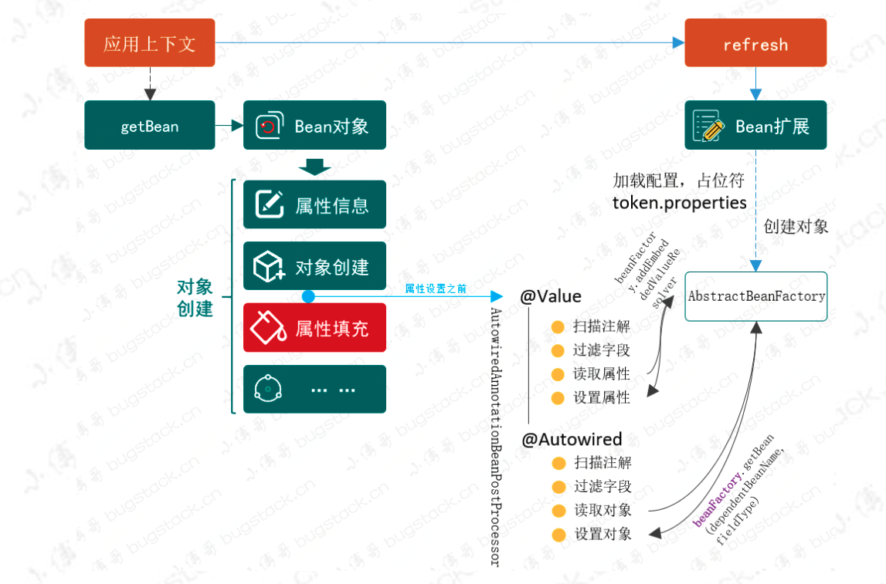

如果想要处理自动扫描注入（包括属性注入、对象注入），就需要在填充对象属性applyPropertyValues之前，把属性信息写入PropertyValues集合。这一步操作相当于解决了以前在spring.xml配置文件中注入配置属性的过程。在读取属性时，需要通过扫描Bean对象的属性字段，判断是否配置了@Value注解。并把扫描到的配置信息需要依赖BeanFactoryPostProcessor的实现类PropertyPlaceholderConfigurer，把值写入AbstractBeanFactory的embeddedValueResolvers集合中，这样才能在填充属性时利用beanFactory获取属性值。@Autowired注解对对象的注入，其实与属性注入的唯一区别是对象的获取：beanFactory.getBean(filedType)。在所有属性被注入PropertyValues结合之后进行属性填充，此时就会把获取的配置和对象填充到属性上，也就实现了自动注入的功能。

## 4. 注入属性信息实现


围绕InstantiationAwareBeanPostProcessor接口的类AutowiredAnnotationBeanProcessor类作为入口，在使用AbstractAutowireCapableBeanFactory类创建Bean对象的过程中，调用BeanPostProcessor扫描整个类的属性配置中含有自定义注解@Value、@Autowired、@Qualifier的属性值。这里稍微变动的是关于属性配置文件中获取占位符，又可以获取Bean对象。Bean对象可以被直接获取。如果想要获取占位符，则需要在AbstractBeanFactory中添加新的属性集合embeddedValueResolvers，并执行PropertyPlaceholderConfigurer#postProcessorBeanFactory操作将其填充到属性集合中。

**将读取到的属性填充到容器**

- 定义解析字符串接口

```java
public interface StringValueResolver {
    String resolveStringValue(String strVal);
}
```

StringValueResolver是一个解析字符串操作的接口，由PlaceholderResolvingStringValueResolver类实现并完成属性值的获取操作

- 填充字符串

```java
public class PropertyPlaceholderConfigurer  implements BeanFactoryPostProcessor {
    public static final String DEFAULT_PLACEHOLDER_PREFIX="${";
    public static final String DEFAULT_PLACEHOLDER_SUFFIX="}";
    private String location;

    protected String resolvePlaceholder(String placeholder, Properties props) {
        return props.getProperty(placeholder);
    }
    @Override
    public void postProcessBeanFactory(ConfigurableListableBeanFactory beanFactory) throws BeansException {
        //加载属性文件
        try{
            DefaultResourceLoader resourceLoader=new DefaultResourceLoader();
            //获取资源文件
            Resource resource=resourceLoader.getResource(location);
            Properties properties=new Properties();
            properties.load(resource.getInputStream());
            String[] beanDefinitionNames=beanFactory.getBeanDefinitionNames();
            for (String beanDefinitionName : beanDefinitionNames) {
                BeanDefinition beanDefinition=beanFactory.getBeanDefinition(beanDefinitionName);
                PropertyValues propertyValues=beanDefinition.getPropertyValues();
                for (PropertyValue propertyValue : propertyValues.getPropertyValues()) {
                    Object value=propertyValue.getValue();
                    if(!(value instanceof String))continue;
                    String strVal=(String)value;
                    StringBuilder buffer=new StringBuilder(strVal);
                    int startIdx=strVal.indexOf(DEFAULT_PLACEHOLDER_PREFIX);
                    int stopIdx=strVal.indexOf(DEFAULT_PLACEHOLDER_SUFFIX);
                    if(startIdx !=-1 && stopIdx!=-1 && startIdx<stopIdx){
                        String propKey=strVal.substring(startIdx +2,stopIdx);
                        String propVal=properties.getProperty(propKey);
                        buffer.replace(startIdx,startIdx+1,propVal);
                        propertyValues.addPropertyValue(new  PropertyValue(propertyValue.getName(), buffer.toString()));
                    }
                }
            }
            //向容器中添加字符串解析器，以供解析@Value注解使用
            StringValueResolver valueResolver=new PlaceholderResolvingStringValueResolver(properties);
            beanFactory.addEmbeddedValueResolver(valueResolver);
        }catch (IOException e){
            throw new BeansException("Could not load propertied",e);
        }
    }
    public void setLocation(String location){
        this.location=location;
    }
    private class PlaceholderResolvingStringValueResolver implements StringValueResolver{
        private final Properties properties;
        
        public PlaceholderResolvingStringValueResolver(Properties properties){
            this.properties=properties;
        }

        @Override
        public String resolveStringValue(String s) {
            return PropertyPlaceholderConfigurer.this.resolvePlaceholder(s,properties);
        }
    }
}
```

在解析属性配置PropertyPlaceholderConfigure类中，beanFactory.addEmbeddedValueResolver(valueResolver)这行代码的作用是将属性值写入AbstractBeanFactory类的embeddedValueResolvers集合。

**自定义注解**

自定义注解@Autowired、@Aualifier、@Value

```java
@Retention(RetentionPolicy.RUNTIME)
@Target({ElementType.CONSTRUCTOR,ElementType.FIELD,ElementType.METHOD})
public @interface Autowired {
}

@Target({ElementType.FIELD,ElementType.PARAMETER,ElementType.TYPE,ElementType.ANNOTATION_TYPE})
@Retention(RetentionPolicy.RUNTIME)
@Inherited
@Documented
public @interface Qualifier {
    String value()default "";
}

@Target({ElementType.FIELD,ElementType.METHOD,ElementType.PARAMETER})
@Retention(RetentionPolicy.RUNTIME)
@Documented
public @interface Value {
    String value();
}
```

这里定义了@Autowired、@Qualifier和@Value共3个注解。在一般情况下，@Qualifier注解与@Autowired注解配置使用

**扫描自定义注解**

```java
public class AutowiredAnnotationBeanPostProcessor implements InstantiationAwareBeanPostProcessor, BeanFactoryAware {
    private ConfigurableBeanFactory beanFactory;
    @Override
    public void setBeanFactory(BeanFactory beanFactory) throws BeansException {
        this.beanFactory=(ConfigurableBeanFactory) beanFactory;
    }

    @Override
    public PropertyValues postProcessProperties(PropertyValues pvs, Object bean, String beanName) throws BeansException {
        //1. 处理注解@Value
        Class<?> clazz= bean.getClass();
        clazz= ClassUtils.isCglibProxy(clazz) ? clazz.getSuperclass() :clazz;
        Field[] declaredFields=clazz.getDeclaredFields();
        for (Field field: declaredFields) {
            Value valueAnnotation=field.getAnnotation(Value.class);
            if(valueAnnotation!=null){
                String value= valueAnnotation.value();
                value=beanFactory.resolveEmbeddedValue(value);
                BeanUtil.setFieldValue(bean,field.getName(),value);
            }

        }
        //2. 处理注解@Autowired
        for(Field field:declaredFields){
            Autowired autowiredAnnotation=field.getAnnotation(Autowired.class);
            if (autowiredAnnotation!=null) {
                Class<?> fieldType=field.getType();
                String dependentBeanName=null;
                Qualifier qualifierAnnotation=field.getAnnotation(Qualifier.class);
                Object dependBean=null;
                if (qualifierAnnotation!=null) {
                    dependentBeanName=qualifierAnnotation.value();
                    dependBean=beanFactory.getBean(dependentBeanName,fieldType);
                }else {
                    dependBean=beanFactory.getBean(fieldType);
                }
                BeanUtil.setFieldValue(bean,field.getName(),dependBean);
            }
        }
        return pvs;
    }
}
```

AutowiredAnnotationBeanPostProcessor是在Bean对象实例化完成后，一个实现接口InstantiationAwareBeanPostProcessor用于设置属性操作前处理属性信息的类和操作的方法。只有实现了BeanPostProcessor接口，才能在Bean的生命周期中处理初始化信息。核心方法postPropertyValues主要用于处理类中含有@Value注解和@Autowired注解的属性，并获取和设置属性信息。这里需要注意的是，因为AbstractAuowireCapoableBeanFactory是使用CglibSubclassingInstantiationStrategy创建的类，所以在AutowiredAnnotationBeanPostProcessor#postPropertyValues中需要使用cglib创建对象，构造不能通过ClassUtils.isCglibProxyClass(clazz)这行代码获取类的信息

**在Bean的生命周期中调用属性注入**

```java
public abstract class AbstractAutowireCapableBeanFactory extends AbstractBeanFactory implements AutowireCapableBeanFactory {
    //这里使用cglib的代理方法创建bean实例
    private InstantiationStrategy instantiationStrategy=new CglibSubclassingInstantiationStrategy();
    private PropertyValues propertyValues;

    //用来床架bean的函数
    @Override
    protected Object createBean(String beanName, BeanDefinition beanDefinition, Object[] args) throws BeansException {
        Object bean=null;
        try{
            bean = resolveBeforeInstantiation(beanName, beanDefinition);
            if (null != bean) {
                return bean;
            }
            //实例化Bean对象
            bean=ctreatBeanInstance(beanDefinition,beanName,args);
            //在设置Bean对象的属性之前，运行BeanPostProcesppr接口修改属性值
            applyBeanPostProcessorsBeforeApplyingPropertyValues(beanName,bean,beanDefinition);
            //给bean对象填充属性
            applyPropertyValues(beanName,bean,beanDefinition);
            //执行Beand对象的初始化方法和BeanPostProcessor接口的前置方法和后置处理方法
            bean=initializeBean(beanName,bean,beanDefinition);
        }catch (Exception e){
            throw new BeansException("Instantiation of bean failed",e);
        }
        registerDisposableBeanIfNeccessary(beanName,bean,beanDefinition);
        //注册实现了DisposeableBean接口的Bean对象
        if(beanDefinition.isSingleton()){
            registerSinleton(beanName,bean);
        }
        return bean;
    }
    /**
     * 执行Bean实例化前的操作
     */
    protected Object resolveBeforeInstantiation(String beanName, BeanDefinition beanDefinition) throws BeansException {
        Object bean = applyBeanPostProcessorsBeforeInstantiation(beanDefinition.getBeanClass(), beanName);
        if (null != bean) {
            //  应用Bean的后置增强器
            bean = applyBeanPostProcessorsAfterInitialization(bean, beanName);
        }
        return bean;
    }
    /**
     * 执行Bean实例化前的操作
     */
    protected Object applyBeanPostProcessorsBeforeInstantiation(Class<?> beanClass, String beanName) throws BeansException {
        for (BeanPostProcessor beanPostProcessor : getBeanPostProcessors()) {
            if (beanPostProcessor instanceof InstantiationAwareBeanPostProcessor) {
                Object result = ((InstantiationAwareBeanPostProcessor) beanPostProcessor).postProcessBeforeInstantiation(beanClass, beanName);
                if (null != result) {
                    return result;
                }
            }
        }
        return null;
    }


    protected void registerDisposableBeanIfNeccessary(String beanName,Object bean, BeanDefinition beanDefinition){
        //非singleton类型的bean对象不必执行销毁方法
        if(!beanDefinition.isSingleton())return;;
        if(bean instanceof DisposeableBean || StrUtil.isNotEmpty(beanDefinition.getDestroyMethodName())){
            registerDisposableBean(beanName,new DisposableBeanAdapter(bean,beanName,beanDefinition));
        }
    }
    private Object initializeBean(String beanName,Object bean, BeanDefinition beanDefinition) throws BeansException {
        //如果该bean标记类Aware的接口
        if(bean instanceof Aware){
            if(bean instanceof BeanFactoryAware){
                ((BeanFactoryAware)bean).setBeanFactory(this);
            }
            if(bean instanceof BeanClassLoaderAware){
                ((BeanClassLoaderAware)bean).setBeanClassLoader(getBeanClassLoader());
            }
            if(bean instanceof BeanNameAware){
                ((BeanNameAware)bean).setBeanName(beanName);
            }
        }
        //1. 执行BeanPostProcessor Before前置处理
        Object wrappedBean=applyBeanPostProcessorsBeforeInitialization(bean,beanName);
        //2. 待完成的内容
        try{
            invokeInitMethods(beanName,wrappedBean,beanDefinition);
        }catch (Exception e){
            throw  new BeansException("Invocation of init method of bean ["+beanName+"] failed", e);
        }

        //3. 执行BeanPostProcessor After后置处理
        wrappedBean=applyBeanPostProcessorsAfterInitialization(bean,beanName);
        return wrappedBean;
    }
    private void invokeInitMethods(String beanName,Object bean, BeanDefinition beanDefinition) throws Exception, BeansException {
        //1. 实现InitializingBean接口
       if(bean instanceof InitializingBean){
           ((InitializingBean) bean).afterPropertiesSet();
       }
       //2. 配置信息init-method{判断是为了避免二次销毁}
        String initMethodName=beanDefinition.getInitMethodName();
       if(StrUtil.isNotEmpty(initMethodName)){
           Method iniMethod=beanDefinition.getBeanClass().getMethod(initMethodName);
           if(null==iniMethod){
               throw  new BeansException("Cou;d not find an init method named '"+initMethodName+"' on bean with name '"+beanName+"'");
           }
           iniMethod.invoke(bean);
       }

    }
    @Override
    public Object applyBeanPostProcessorsAfterInitialization(Object existingBean, String beanName) throws BeansException {
        Object result=existingBean;
        for(BeanPostProcessor processor :getBeanPostProcessors()){
            Object current=processor.postProcessBeforeInitialization(result,beanName);
            if(null==current) return result;
            result=current;
        }
        return result;
    }

    @Override
    public Object applyBeanPostProcessorsBeforeInitialization(Object existingBean, String beanName) throws BeansException {
        Object result=existingBean;
        for(BeanPostProcessor processor :getBeanPostProcessors()){
            Object current=processor.postProcessAfterInitialization(result,beanName);
            if(null==current) return result;
            result=current;
        }
        return result;
    }

    protected Object ctreatBeanInstance(BeanDefinition beanDefinition, String beanName, @Nullable Object[] args) throws BeansException {
        Constructor constructorToUser=null;
        Class<?> beanClass=beanDefinition.getBeanClass();
         Constructor<?>[] declaredConstructors=beanClass.getDeclaredConstructors();
        for (Constructor<?> declaredConstructor : declaredConstructors) {
            if(args!=null && declaredConstructor.getParameterTypes().length==args.length)
            {
                constructorToUser=declaredConstructor;
                break;
            }
        }
        return  getInstantiationStrategy().instatiate(beanDefinition,beanName,constructorToUser,args);
    }
    //该方法用于给Bean对象填充属性
    protected  void applyPropertyValues(String beanName, Object bean , BeanDefinition beanDefinition){
        try{
            //或的bean的属性集合
            PropertyValues propertyValues = beanDefinition.getPropertyValues();
            for (PropertyValue propertyValue : propertyValues.getPropertyValues()) {
                //取出属性名和属性值
                String name=propertyValue.getName();
                Object value=propertyValue.getValue();
                if(value instanceof BeanReference){
                    //例如A依赖B，获取B的实例化对象
                    BeanReference beanReference=(BeanReference) value;
                    value=getBean(beanReference.getBeanName());
                }
                //属性填充
                BeanUtil.setFieldValue(bean,name,value);
            }
        } catch (Exception | BeansException e) {
            throw new BeanException("Error setting property values："+beanName);
        }
    }
    public InstantiationStrategy getInstantiationStrategy(){
        return instantiationStrategy;
    }
    public void setInstantiationStrategy(InstantiationStrategy instantiationStrategy){
        this.instantiationStrategy=instantiationStrategy;
    }
    protected void applyBeanPostProcessorsBeforeApplyingPropertyValues(String beanName,Object bean ,BeanDefinition beanDefinition) throws BeansException {
        for (BeanPostProcessor beanPostProcessor : getBeanPostProcessors()) {
            if(beanPostProcessor instanceof  InstantiationAwareBeanPostProcessor){
                PropertyValues pvs=((InstantiationAwareBeanPostProcessor)beanPostProcessor).postProcessPropertyValues(beanDefinition.getPropertyValues(),bean,beanName);
                if (pvs!=null) {
                    for (PropertyValue propertyValue : pvs.getPropertyValues()) {
                        beanDefinition.getPropertyValues().addPropertyValue(propertyValue);
                    }
                }
            }
            
        }
    }
}
```

在AbstractAutowireCapableBeanFactory#createBean方法中新增了一个方法调用，就是在设置Bean属性之前，允许BeanProcessor修改属性值的操作applyBeanPostProcessorBeforeApplyingPropertyValues。在改方法中，首先获取已经注入的BeanPostProcessor集合，然后从集合中筛选出继承接口InstantiationAwareBeanPostProcessor的实现类。最后调用相应的postProcessPropertyValues方法及循环设置属性信息。

**注解使用测试**

- 事先准备

```java
@Component
public class UserDao {
    private static Map<String ,String > hashmap=new HashMap<>();
    static {
        hashmap.put("10001","张三,北京,东城");
        hashmap.put("10002","张四,北京,东城");
        hashmap.put("10003","张五,北京,东城");
        
    }
    public String queryUserName(String uid){
        return hashmap.get(uid);
    }
}
```

给UserDao配置了一个自动扫描注册Bean对象的注解@Component，接下来会将这个类注入到Userservice中

- 注解注入UserService

```java
@Component("userService")
public class UserService implements IUserService{
    @Value("${token}")
    private String token;
    @Autowired
    private UserDao userDao;

    @Override
    public String queryUserInfo() {
        try{
            Thread.sleep(new Random(1).nextInt(100));
        }catch (InterruptedException e){
            e.printStackTrace();
        }
        return userDao.queryUserName("10001")+","+token;
    }
}
```

这里包括了两种类型的注入，一种是占位符注入属性信息@Value("${token}")，另一种是注入对象信息@Autowired

- 配置文件

```java
<?xml version="1.0" encoding="UTF-8"?>
<beans xmlns="http://www.springframework.org/schema/beans"
       xmlns:xsi="http://www.w3.org/2001/XMLSchema-instance"
       xmlns:context="http://www.springframework.org/schema/context"
       xsi:schemaLocation="http://www.springframework.org/schema/beans
          http://www.springframework.org/schema/beans/spring-beans.xsd
   http://www.springframework.org/schema/context">
    <context:component-scan base-package="springframework.bean"></context:component-scan>

    <bean class="springframework.beans.factory.PropertyPlaceholderConfigurer">
        <property name="location" value="classpath:user.properties"></property>
    </bean>
</beans>
```

在Spring.xml配置文件中扫描属性信息和自动扫描包的路径范围

## 5. Spring相关源码解析

**StringValueResolver**

```java
@FunctionalInterface
public interface StringValueResolver {
   @Nullable
   String resolveStringValue(String strVal);

}
```

# 十五.  给代理对象设置属性注入

## 1. 本节重点

在处理代理对象的初始化阶段，将这个过程融入Bean的生命周期，并通过TargetSource#getTargetClass提供的代理对象判断和获取接口，用于反射注入的属性信息。

## 2. 代理对象创建过程问题

本节要结解决的问题是如何给代理对象中的属性填充相应的值，在将AOP动态代理融入Bean的生命周期时，代理对象的创建实在创建Bean对象之前完成的。也就是说，这个代理对象并没有创建在Bean的生命周期中。所以，本节要把代理对象的创建融入Bean的生命周期中。也就是说，需要把创建代理对象的逻辑迁移到Bean对象执行初始化方法之后，再执行代理对象的创建

## 3. 代理对象属性填充

InstantiationAwareBeanPostProcessor接口原本在Before中进行处理，现在需要到After中进行处理，整体设计如下图所示：

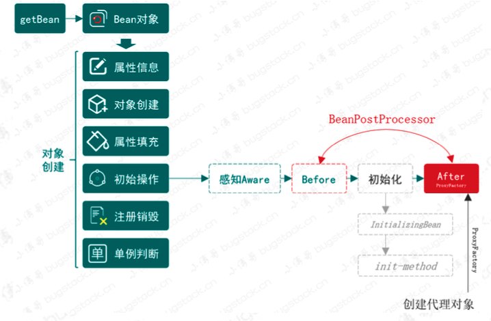

在创建Bean对象createBean的生命周期中，有一个阶段是在Bean对象的属性完成填充以后，执行Bean对象的初始化方法等，以及BeanPostProcessor的前置和后置处理，如感知Aware对象、处理init-method方法等。这个阶段中的BeanPostProcessor After就可以用于创建代理对象。在DefaultAdvisorAutoProxyCreator创建代理对象的过程中，需要把创建操作从postProcessorBeforeInstantiation方法迁移到postProcessAfterInitialization方法，这样才能满足Bean属性填充后的创建需求。

## 4. 代理对象属性填充实现


虽然本节要解决的事关于代理对象中属性填充问题，但实际的解决思路是在Bean的生命周期中合适的位置（初始化initializeBean）处理代理类的创建。因此，以上修改并不会涉及太多的内容，主要包括将DefaultAdvisorAutoProxyCreator类创建代理对象的操作放置在postProcessorAfterInitialization方法中，以及在对应的AbstractAutowireCapableBeanFactory类中完成初始化方法的调用操作。还有一点需要注意，因为目前在Spring框架中，AbstractAutowireCapableBeanFactory类是使用CglibSubClassingInstantiationStrategy来创建对象的，所以当判断对象是否获取接口的方法时，需要判断是否由Cglib来创建，否则不能正确获取接口，如ClassUtils.isCglibProxyClass(clazz)?clazz.getSuperclass():clazz

**判断Cglib对象**

```JAVA
public class TargetSource {

    private final Object target;
    public TargetSource(Object target )
    {
        this.target=target;
    }
    
    public Class<?>[] getTargetClass(){
        Class<?> clazz= this.target.getClass();
        clazz= ClassUtils.isCglibProxyClass(clazz)? clazz.getSuperclass() : clazz;
        return clazz.getInterfaces();
    }
}
```

TargetSource#getTargetClass用于获取target对象的接口信息，这个target可能是由JDK创建的，也可能是由Cglib创建的。为了正确的获取结果，需要通过ClassUtils.isCglibProxy(clazz)来判断Cglib对象是否为代理对象，便于找到正确的对象接口。

**迁移创建AOP代理方法**

```java
public class DefaultAdvisorAutoProxyCreator implements InstantiationAwareBeanPostProcessor, BeanFactoryAware {
    private DefaultListableBeanFactory beanFactory;

    @Override
    public Object postProcessBeforeInitialization(Object bean, String beanName) throws BeansException {
        return null;
    }

    @Override
    public Object postProcessAfterInitialization(Object bean, String beanName) throws BeansException {
        if(isInfrastructureClass(bean.getClass())) return bean;
        Collection<AspectJExpressionPointcutAdvisor> advisors=beanFactory.getBeansOfType(AspectJExpressionPointcutAdvisor.class).values();
        for(AspectJExpressionPointcutAdvisor advisor: advisors){
            ClassFilter classFilter=advisor.getPointcut().getClassFilter();
            //过滤匹配类
            if(!classFilter.matches(bean.getClass())) continue;
            AdvisedSupport advisedSupport=new AdvisedSupport();
            
            TargetSource targetSource=new TargetSource(bean);
            advisedSupport.setTargetSource(targetSource);
            advisedSupport.setMethodInterceptor((MethodInterceptor) advisor.getAdvice());
            advisedSupport.setMethodMatcher(advisor.getPointcut().getMathodMatcher());
            advisedSupport.setProxyTargetClass(false);
            
            return new ProxyFactory(advisedSupport).getProxy();
            
        }
        return bean;
    }

    private boolean isInfrastructureClass(Class<?> beanClass) {
        return Advice.class.isAssignableFrom(beanClass) || Pointcut.class.isAssignableFrom(beanClass) || Advisor.class.isAssignableFrom(beanClass);
    }


    @Override
    public void setBeanFactory(BeanFactory beanFactory)throws BeansException{
        this.beanFactory=(DefaultListableBeanFactory) beanFactory;
    }
}
```

DefaultAdvisorAutoProxyCreator类的主要目的是将创建AOP代理的操作从postProcessBeforeInstantiation方法迁移到postProcessAfterInitialization方法中。设置了一些必要的AOP参数后，返回代理对象new ProxyFactory(advisedSupport).getProxy。这个代理对象间接调用了TargetSource对getTargetClass的获取。

**在Bean的生命周期中初始化执行**

```java
public abstract class AbstractAutowireCapableBeanFactory extends AbstractBeanFactory implements AutowireCapableBeanFactory {
    //这里使用cglib的代理方法创建bean实例
    private InstantiationStrategy instantiationStrategy=new CglibSubclassingInstantiationStrategy();
    private PropertyValues propertyValues;

    //用来床架bean的函数
    @Override
    protected Object createBean(String beanName, BeanDefinition beanDefinition, Object[] args) throws BeansException {
        Object bean=null;
        try{
            bean = resolveBeforeInstantiation(beanName, beanDefinition);
            if (null != bean) {
                return bean;
            }
            bean=ctreatBeanInstance(beanDefinition,beanName,args);
            //在设置Bean对象的属性之前，运行BeanPostProcesppr接口修改属性值
            applyBeanPostProcessorsBeforeApplyingPropertyValues(beanName,bean,beanDefinition);
            //给bean对象填充属性
            applyPropertyValues(beanName,bean,beanDefinition);
            //执行Beand对象的初始化方法和BeanPostProcessor接口的前置方法和后置处理方法
            bean=initializeBean(beanName,bean,beanDefinition);
        }catch (Exception e){
            throw new BeansException("Instantiation of bean failed",e);
        }
        registerDisposableBeanIfNeccessary(beanName,bean,beanDefinition);
        //注册实现了DisposeableBean接口的Bean对象
        if(beanDefinition.isSingleton()){
            registerSinleton(beanName,bean);
        }
        return bean;
    }
    /**
     * 执行Bean实例化前的操作
     */
    protected Object resolveBeforeInstantiation(String beanName, BeanDefinition beanDefinition) throws BeansException {
        Object bean = applyBeanPostProcessorsBeforeInstantiation(beanDefinition.getBeanClass(), beanName);
        if (null != bean) {
            //  应用Bean的后置增强器
            bean = applyBeanPostProcessorsAfterInitialization(bean, beanName);
        }
        return bean;
    }
    /**
     * 执行Bean实例化前的操作
     */
    protected Object applyBeanPostProcessorsBeforeInstantiation(Class<?> beanClass, String beanName) throws BeansException {
        for (BeanPostProcessor beanPostProcessor : getBeanPostProcessors()) {
            if (beanPostProcessor instanceof InstantiationAwareBeanPostProcessor) {
                Object result = ((InstantiationAwareBeanPostProcessor) beanPostProcessor).postProcessBeforeInstantiation(beanClass, beanName);
                if (null != result) {
                    return result;
                }
            }
        }
        return null;
    }


    protected void registerDisposableBeanIfNeccessary(String beanName,Object bean, BeanDefinition beanDefinition){
        //非singleton类型的bean对象不必执行销毁方法
        if(!beanDefinition.isSingleton())return;;
        if(bean instanceof DisposeableBean || StrUtil.isNotEmpty(beanDefinition.getDestroyMethodName())){
            registerDisposableBean(beanName,new DisposableBeanAdapter(bean,beanName,beanDefinition));
        }
    }
    private Object initializeBean(String beanName,Object bean, BeanDefinition beanDefinition) throws BeansException {
        //如果该bean标记类Aware的接口
        if(bean instanceof Aware){
            if(bean instanceof BeanFactoryAware){
                ((BeanFactoryAware)bean).setBeanFactory(this);
            }
            if(bean instanceof BeanClassLoaderAware){
                ((BeanClassLoaderAware)bean).setBeanClassLoader(getBeanClassLoader());
            }
            if(bean instanceof BeanNameAware){
                ((BeanNameAware)bean).setBeanName(beanName);
            }
        }
        //1. 执行BeanPostProcessor Before前置处理
        Object wrappedBean=applyBeanPostProcessorsBeforeInitialization(bean,beanName);
        //2. 待完成的内容
        try{
            invokeInitMethods(beanName,wrappedBean,beanDefinition);
        }catch (Exception e){
            throw  new BeansException("Invocation of init method of bean ["+beanName+"] failed", e);
        }

        //3. 执行BeanPostProcessor After后置处理
        wrappedBean=applyBeanPostProcessorsAfterInitialization(bean,beanName);
        return wrappedBean;
    }
    private void invokeInitMethods(String beanName,Object bean, BeanDefinition beanDefinition) throws Exception, BeansException {
        //1. 实现InitializingBean接口
       if(bean instanceof InitializingBean){
           ((InitializingBean) bean).afterPropertiesSet();
       }
       //2. 配置信息init-method{判断是为了避免二次销毁}
        String initMethodName=beanDefinition.getInitMethodName();
       if(StrUtil.isNotEmpty(initMethodName)){
           Method iniMethod=beanDefinition.getBeanClass().getMethod(initMethodName);
           if(null==iniMethod){
               throw  new BeansException("Cou;d not find an init method named '"+initMethodName+"' on bean with name '"+beanName+"'");
           }
           iniMethod.invoke(bean);
       }

    }
    @Override
    public Object applyBeanPostProcessorsAfterInitialization(Object existingBean, String beanName) throws BeansException {
        Object result=existingBean;
        for(BeanPostProcessor processor :getBeanPostProcessors()){
            Object current=processor.postProcessBeforeInitialization(result,beanName);
            if(null==current) return result;
            result=current;
        }
        return result;
    }

    @Override
    public Object applyBeanPostProcessorsBeforeInitialization(Object existingBean, String beanName) throws BeansException {
        Object result=existingBean;
        for(BeanPostProcessor processor :getBeanPostProcessors()){
            Object current=processor.postProcessAfterInitialization(result,beanName);
            if(null==current) return result;
            result=current;
        }
        return result;
    }

    protected Object ctreatBeanInstance(BeanDefinition beanDefinition, String beanName, @Nullable Object[] args) throws BeansException {
        Constructor constructorToUser=null;
        Class<?> beanClass=beanDefinition.getBeanClass();
         Constructor<?>[] declaredConstructors=beanClass.getDeclaredConstructors();
        for (Constructor<?> declaredConstructor : declaredConstructors) {
            if(args!=null && declaredConstructor.getParameterTypes().length==args.length)
            {
                constructorToUser=declaredConstructor;
                break;
            }
        }
        return  getInstantiationStrategy().instatiate(beanDefinition,beanName,constructorToUser,args);
    }
    //该方法用于给Bean对象填充属性
    protected  void applyPropertyValues(String beanName, Object bean , BeanDefinition beanDefinition){
        try{
            //或的bean的属性集合
            PropertyValues propertyValues = beanDefinition.getPropertyValues();
            for (PropertyValue propertyValue : propertyValues.getPropertyValues()) {
                //取出属性名和属性值
                String name=propertyValue.getName();
                Object value=propertyValue.getValue();
                if(value instanceof BeanReference){
                    //例如A依赖B，获取B的实例化对象
                    BeanReference beanReference=(BeanReference) value;
                    value=getBean(beanReference.getBeanName());
                }
                //属性填充
                BeanUtil.setFieldValue(bean,name,value);
            }
        } catch (Exception | BeansException e) {
            throw new BeanException("Error setting property values："+beanName);
        }
    }
    public InstantiationStrategy getInstantiationStrategy(){
        return instantiationStrategy;
    }
    public void setInstantiationStrategy(InstantiationStrategy instantiationStrategy){
        this.instantiationStrategy=instantiationStrategy;
    }
    protected void applyBeanPostProcessorsBeforeApplyingPropertyValues(String beanName,Object bean ,BeanDefinition beanDefinition) throws BeansException {
        for (BeanPostProcessor beanPostProcessor : getBeanPostProcessors()) {
            if(beanPostProcessor instanceof  InstantiationAwareBeanPostProcessor){
                PropertyValues pvs=((InstantiationAwareBeanPostProcessor)beanPostProcessor).postProcessPropertyValues(beanDefinition.getPropertyValues(),bean,beanName);
                if (pvs!=null) {
                    for (PropertyValue propertyValue : pvs.getPropertyValues()) {
                        beanDefinition.getPropertyValues().addPropertyValue(propertyValue);
                    }
                }
            }

        }
    }
}
```

在AbstractAutowireCapableBeanFactory#creatBean方法中，重点在于initializeBean->applyBeanPostProcessorsAfterInitialization逻辑的调用，最终完成了AOP代理对象创建操作。

**代理对象属性注入测试**

- 事先准备

```java
public class UserService implements IUserService{
    private String token;

    @Override
    public String queryUserInfo() {
        try{
            Thread.sleep(new Random(1).nextInt(100));
        }catch (InterruptedException e){
            e.printStackTrace();
        }
        return "张三,100001,深圳,"+token;
    }
}
```

token是在Userservice中新增的属性信息，用于测试代理对的属性填充操作

- 属性配置文件

```xml
<?xml version="1.0" encoding="UTF-8"?>
<beans xmlns="http://www.springframework.org/schema/beans"
       xmlns:xsi="http://www.w3.org/2001/XMLSchema-instance"
       xmlns:context="http://www.springframework.org/schema/context"
       xsi:schemaLocation="http://www.springframework.org/schema/beans
          http://www.springframework.org/schema/beans/spring-beans.xsd
   http://www.springframework.org/schema/context">
    <bean id="userService" class="springframework.bean.UserService">
        <property name="token" value="123456"></property>
    </bean>

    <bean class="springframework.aop.framework.autoproxy.DefaultAdvisorAutoProxyCreator"></bean>

    <bean id="beforeAdvice" class="springframework.bean.UserServiceBeforeAdvice"></bean>

    <bean id="methodInterceptpr" class="springframework.aop.framework.adapter.MethodBeforeAdviceInterceptor">
        <property name="advice" ref="beforeAdvice"></property>
    </bean>

    <bean id="pointcutAdvisor" class="springframework.aop.aspectj.AspectJExpressionPointcutAdvisor">
        <property name="expression" value="execution(* springframework.bean.IUserService.*(..))"></property>
        <property name="advice" ref="methodInterceptpr"></property>
    </bean>
</beans>
```

对于AOP测试来说唯一新增的就是Property属性

## 5. Spring相关源码解析

**TargetSource**

```java
public interface TargetSource extends TargetClassAware {
	@Override
	@Nullable
	Class<?> getTargetClass();
	boolean isStatic();
	@Nullable
	Object getTarget() throws Exception;
	void releaseTarget(Object target) throws Exception;
}
```

# 十六.  通过三级缓存解决循环依赖

## 1. 本节重点

在学习开发Spring框架的过程中，会体会到我们在开发一些功能时，总是会先思考核心的链路是如何流转的，再不断扩展新的功能。这与日常的业务代码开发方法相似，通常在一个业务流程中，只有20%是核心流程，其余的80%流程都是为了保障核心流程顺利执行所做的保护流程和处理机制。通过一级缓冲学习循环依赖的解决方案的核心流程，并在Spring框架中添加三级缓存，处理代理对象依赖和填充半成品对象，解决Bean对象注入时的循环依赖问题。

## 2. 复杂对象的创建思考

目前的Spring框架时可以满足基本需求的，如果配置了A、B两个Bean对象互相依赖，那么会出现java.lang.StackOverflowError错误提示，为什么呢？因为A的创建需要依赖B的创建，而B的创建又依赖A的创建，这样就变成了死循环。这个循环依赖也是Spirng框架中非常经典的实现，包括以下3种情况。


循环以来主要分为自身依赖、循环依赖和多组依赖。无论循环依赖的数量多少，其本质都是一样的。即A的完整创建依赖于B，B的完整创建依赖A。但是A和B之间无法互相解耦，最终导致创建依赖失败，因此需要Spring框架提供除了构造函数和原型注入的setter循环依赖注入解决方案。

## 3. 循环依赖设计

按照Spring框架的设计，解决循环依赖需要使用三级缓存，它们分别存储了成品对象、半成品对象（未填充属性值）、代理对象，分别存储对象内容，用于解决循环依赖问题。我们需要知道一个核心问题：解决循环依赖必须使用三级缓存吗？可以使用一级缓冲和二级缓存吗？其实使用二级缓存或一级缓冲都能解决，只是需要注意以下几点：如果只使用一级缓冲处理，则流程无法拆分，复杂度也会增加，同时半成品对象可能有空指针异常。如果将半成品对象与成品对象分开，则处理起来更加美观、简单且容易扩展。另外Spirng两大特性不仅包括IOC还包括AOP，即基于字节码增强后的方法。而三级缓存最主要解决的循环依赖就是对AOP的处理。如果把AOP代理对象的创建提前，则使用二级缓存也可以解决。但是，这违背了Spring创建对象的原则—spring首先将所有普通Bean对象初始化完成，再处理代理对象的初始化。不过也可以尝试只使用一级缓冲来解决循环依赖问题，通过这种方式可以学习处理循环依赖问题的最核心原理。

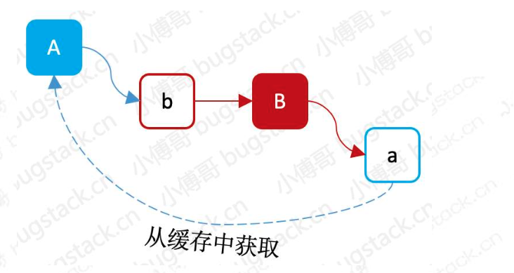

如果只使用一级缓冲解决循环依赖，则实现上可以通过在循环依赖A对象newInstance创建且未填充属性后，直接存储在缓冲中。首先当使用A对象的属性填充B对象时，如果在缓冲中不能获取B对象，则开始创建B对象，在创建完成后，把B对象填充到缓存中。然后对B对象的属性进行填充，这时可以从缓存中获取半成品的A对象，这是B对象的属性就填充完成了。最后，返回来继续完成A对象的属性填充，将其实例化后，填充了属性的B对象并赋值给A对象的b属性，这样就完成了一个循环依赖操作。代码如下：

```java
private final static Map<String, Object>singletonObjects=new ConcurrentHashMap<>(256);
private static <T> T getBean(Class<T> beanClass) throws Exception{
  String beanName=beanClass.getSimpleName().toLowerCase();
  //判断该bean是否已经初始化
  if(singeltonObjects.containsKey(beanName)){
    return (T)singletonObjects.get(beanName);
  }
  //将实例化对象注入缓存
  Object obj=beanClass.newInstance();
  singletonObjects.put(beanName,obj);
  //填充属性，补全对象
  Field[] fields=obj.getClass().getDeclaredFields();
  for(Field field: fields){
    field.setAccessible(true);
    Class<?> fieldClass=field.getType();
    Class<?> fieldBeanName=fieldClass.getSimpleName().toLowerCase();
    field.set(obj,singletonObjects.containsKey(fieldBeanName))?singletonObjects.get(fieldBeanName) : getBean(filedClass);
    field.setAccessible(false);
  }
  return (T) obj;
}
```

使用一级缓存存储对象的方式，其实实现过程很简单。只要创建完对象，就会立刻注入缓存中。这样就可以在创建其他对象时获取属性需要填充的对象。getBean时解决循环依赖问题的核心，当A创建后填充属性时依赖B，就需要创建B。在创建B开始填充属性时，发现B又依赖A，因为此时A这个半成品对象已经被缓存到singletonObjects中，所以B可以被正常创建，再通过递归操作创建A，先厘清循环依赖的处理过程，再理解循环依赖就没那么复杂了。接下来思考，如果除了简单的对象，还有代理对象和AOP应用，那么应如何处理这种依赖问题？整体设计结构如下：

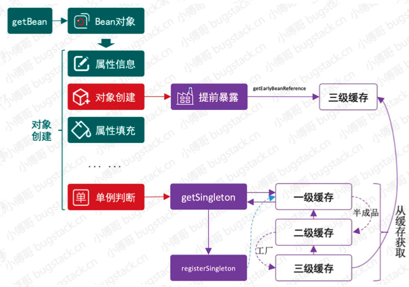

在目前的Spring框架中，扩展循环依赖并不会太复杂，主要是创建对象的提前暴露。如果是工厂对象，则使用getEarlyBeanReference逻辑提前将对象存储到三级缓存中。后续实际获取的工厂对象中的getObject，这才是最终获取的实际对象。在创建对象的AbstractAutowireCapableBeanFactory#doCreateBean方法中，提前暴露对象后，可以通过流程getSingleton从3个缓存中寻找对象。如果对象在一级缓存、二级缓存中，则可以直接获取该对象；如果对象在三级缓存中，则首先从三级缓存中获取对象，然后删除工厂对象，把实际对象存储在二级缓存中。关于单例对象的注册操作，就是把实际对象存储在一级缓存中，此时单例对象已经是一个成品对象了。

## 4. 循环依赖实现

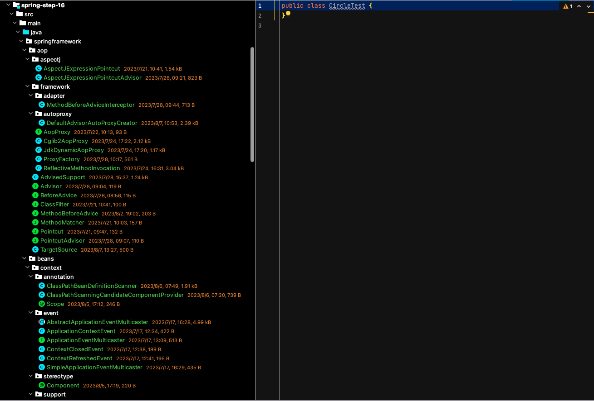


处理循环依赖核心流程类的关系的操作过程如下：

- 循环依赖的核心功能实现主要包括`DefaultSingletonBeanRegistry`提供的三级缓存—singletonObjects、earlySinletonObjects、singletonFactories，分别用于存储成品对象、半成品对象和工厂对象。同时包装3个缓存提供方法—getSingleton、registerSinleton、addSingletonFactory，这样用户就可以分别在不同时间段存储和获取对应的对象。
- `AbstractAutowireCapableBeanFactory`中的doCreateBean方法提供了关于提前暴露对象的操作，`addSingletonFactory(beanName,()->getEarlyBeanReference(beanName,beanDefinition,finalBean))`，以及后续获取对象和注册对象的操作exposedObject=getSingleton(beanName)、registerSingleton(beanName,exposedObject)，经过这样处理之后，就可以完成对复杂场景循环依赖的操作。
- 在DefaultAdvisorAutoProxyCreator提供的切面服务中，也需要实现InstantiationAwareBeanPostProcessor接口中新增的getEarlyBeanReference方法，便于把依赖的切面对象也存储到三级缓存中，处理对应的循环依赖。
- 在Spring框架中，使用BeanUtil.setFieldValue(bean, name,value)来设置对象属性，没有额外添加Cglib分支流程的代理判断，避免引入太多的代码。所以，需要将AbstractAutowireCapableBeanFactory实例化策略InstantiationStrategy修改为SimpleInstantiationStrategy JDK方式进行处理。

**设置三级缓存**

```java
public abstract  class DefaultSingletonBeanRegistry implements SingletonBeanRegistry {
    //一级缓存用来缓存普通对象
    private Map<String,Object> singletonObjects=new ConcurrentHashMap<>();
    //二级缓存，提前暴露对象，没有完全实例化的对象
    protected final Map<String,Object> earlySingletonObjects=new HashMap<>();
    //三级缓存，用来存储代理对象
    private final Map <String, ObjectFactory<?>> singletonFacories=new HashMap<>();
    //注册了销毁方法的Bean集合
    private final Map<String, Object> disposableBeans = new LinkedHashMap<>();

    @Override
    public Object getSingleton(String Name) {
        Object sinletonObject=singletonObjects.get(Name);
        if(null==sinletonObject){
            sinletonObject=earlySingletonObjects.get(Name);
            //判断三级缓存中是否有对象，如果有，则这个对象就是代理对象，因为只有代理对象才会存入三级缓存中
            //三级缓存中
            if(null==sinletonObject){
                ObjectFactory<?> singletonFactory=singletonFacories.get(Name);
                if(singletonFactory==null){
                    sinletonObject=singletonFactory.getObject();
                    //获得三级缓存中代理对象的真实对象，将其存储在二级缓存中
                    earlySingletonObjects.put(Name,sinletonObject);
                    singletonFacories.remove(Name);
                }
            }
        }
        return sinletonObject;
    }


    @Override
    public void registerSinleton(String beanName, Object singletonObject) {
        singletonObjects.put(beanName,singletonObject);
        earlySingletonObjects.remove(beanName);
        singletonFacories.remove(beanName);
    }
    public void addSingletonFactory(String beanName,ObjectFactory<?> sinletonFactory){
        if(!this.singletonObjects.containsKey(beanName)){
            this.singletonFacories.put(beanName,sinletonFactory);
            this.earlySingletonObjects.remove(beanName);
        }
    }
    public void registerDisposableBean(String beanName, DisposeableBean bean) {
            this.disposableBeans.put(beanName, bean);
    }
    public void destroySingleton(String beanName) throws Exception {
        removeSingleton(beanName);
        DisposeableBean disposableBean=(DisposeableBean) this.disposableBeans.remove(beanName);
        disposableBean.destroy();
    }
    protected void removeSingleton(String beanName) {
        synchronized (this.singletonObjects) {
            this.singletonObjects.remove(beanName);
        }
    }

    public void destroySingletons() throws Exception {
        String[] disposableBeanNames;
        disposableBeanNames = (this.disposableBeans.keySet()).toArray(new String[0]);
        for (int i = disposableBeanNames.length - 1; i >= 0; i--) {
            destroySingleton(disposableBeanNames[i]);
        }
    }
}

```

在用于提供单例对象注册操作的DefaultSingletonBeanRegistry类中，共有3个缓存对象的属性—singletonObjects、earlySingletonObjects、singletonFactories，分别用于存储不同类型的对象（单例对象、早期的半成品单例对象、单例工厂对象）。在这个3个缓存中提供了注册、获取和添加不同对象的方法—registerSingleton、getSingleton和addSingletonFactory。其中，registerSingleton方法和addSingletonFactory方法都比较简单，getSingleton方法用于一层一层处理不同时期的单例对象，直到拿到有效的对象。

**提前暴露对象**

```java
public abstract class AbstractAutowireCapableBeanFactory extends AbstractBeanFactory implements AutowireCapableBeanFactory {
    //这里使用cglib的代理方法创建bean实例
    private InstantiationStrategy instantiationStrategy = new CglibSubclassingInstantiationStrategy();
    private PropertyValues propertyValues;

    //用来床架bean的函数
    @Override
    protected Object createBean(String beanName, BeanDefinition beanDefinition, Object[] args) throws BeansException {
        Object bean = null;
        try {
            bean = resolveBeforeInstantiation(beanName, beanDefinition);
            if (null != bean) {
                return bean;
            }
            bean = ctreatBeanInstance(beanDefinition, beanName, args);
            //在设置Bean对象的属性之前，运行BeanPostProcesppr接口修改属性值
            applyBeanPostProcessorsBeforeApplyingPropertyValues(beanName, bean, beanDefinition);
            //给bean对象填充属性
            applyPropertyValues(beanName, bean, beanDefinition);
            //执行Beand对象的初始化方法和BeanPostProcessor接口的前置方法和后置处理方法
            bean = initializeBean(beanName, bean, beanDefinition);
        } catch (Exception e) {
            throw new BeansException("Instantiation of bean failed", e);
        }
        //注册了实现了DisposeableBean接口的Bean对象
        registerDisposableBeanIfNeccessary(beanName, bean, beanDefinition);

        if (beanDefinition.isSingleton()) {
            registerSinleton(beanName, bean);
        }
        return bean;
    }

    protected Object doCreateBean(String beanName, BeanDefinition beanDefinition, Object[] args) {
        Object bean = null;
        try {
            //实例化Bean对象
            bean = ctreatBeanInstance(beanDefinition, beanName, args);
            //处理循环依赖，将实例化后的Bean对象提前存储到缓存中暴露出来
            if (beanDefinition.isSingleton()) {
                Object finalBean = bean;
                addSingletonFactory(beanName, () -> getEarlyBeanReference(beanName, beanDefinition, finalBean));
            }
            // 在设置 Bean 属性之前，允许 BeanPostProcessor 修改属性值
            applyBeanPostProcessorsBeforeApplyingPropertyValues(beanName, bean, beanDefinition);
            // 给 Bean 填充属性
            applyPropertyValues(beanName, bean, beanDefinition);
            // 执行 Bean 的初始化方法和 BeanPostProcessor 的前置和后置处理方法
            bean = initializeBean(beanName, bean, beanDefinition);
        } catch (BeansException e) {
            throw new BeanException("Instantiation of Bean faild", e);
        }
        registerDisposableBeanIfNeccessary(beanName, bean, beanDefinition);
        // 判断 SCOPE_SINGLETON、SCOPE_PROTOTYPE
        Object exposedObject = bean;
        if (beanDefinition.isSingleton()) {
            // 获取代理对象
            exposedObject = getSingleton(beanName);
            registerSinleton(beanName, exposedObject);
        }
        return exposedObject;
    }
    
    
    protected Object getEarlyBeanReference(String beanName, BeanDefinition beanDefinition, Object bean) {
        Object exposedObject = bean;
        for (BeanPostProcessor beanPostProcessor : getBeanPostProcessors()) {
            if (beanPostProcessor instanceof InstantiationAwareBeanPostProcessor) {
                exposedObject=((InstantiationAwareBeanPostProcessor) beanPostProcessor).getEarlyBeanReference(exposedObject, beanName);
                if (null == exposedObject) return exposedObject;
            } }
        return exposedObject;
    }

    /**
     * 执行Bean实例化前的操作
     */
    protected Object resolveBeforeInstantiation(String beanName, BeanDefinition beanDefinition) throws BeansException {
        Object bean = applyBeanPostProcessorsBeforeInstantiation(beanDefinition.getBeanClass(), beanName);
        if (null != bean) {
            //  应用Bean的后置增强器
            bean = applyBeanPostProcessorsAfterInitialization(bean, beanName);
        }
        return bean;
    }
    /**
     * 执行Bean实例化前的操作
     */
    protected Object applyBeanPostProcessorsBeforeInstantiation(Class<?> beanClass, String beanName) throws BeansException {
        for (BeanPostProcessor beanPostProcessor : getBeanPostProcessors()) {
            if (beanPostProcessor instanceof InstantiationAwareBeanPostProcessor) {
                Object result = ((InstantiationAwareBeanPostProcessor) beanPostProcessor).postProcessBeforeInstantiation(beanClass, beanName);
                if (null != result) {
                    return result;
                }
            }
        }
        return null;
    }


    protected void registerDisposableBeanIfNeccessary(String beanName,Object bean, BeanDefinition beanDefinition){
        //非singleton类型的bean对象不必执行销毁方法
        if(!beanDefinition.isSingleton())return;;
        if(bean instanceof DisposeableBean || StrUtil.isNotEmpty(beanDefinition.getDestroyMethodName())){
            registerDisposableBean(beanName,new DisposableBeanAdapter(bean,beanName,beanDefinition));
        }
    }
    private Object initializeBean(String beanName,Object bean, BeanDefinition beanDefinition) throws BeansException {
        //如果该bean标记类Aware的接口
        if(bean instanceof Aware){
            if(bean instanceof BeanFactoryAware){
                ((BeanFactoryAware)bean).setBeanFactory(this);
            }
            if(bean instanceof BeanClassLoaderAware){
                ((BeanClassLoaderAware)bean).setBeanClassLoader(getBeanClassLoader());
            }
            if(bean instanceof BeanNameAware){
                ((BeanNameAware)bean).setBeanName(beanName);
            }
        }
        //1. 执行BeanPostProcessor Before前置处理
        Object wrappedBean=applyBeanPostProcessorsBeforeInitialization(bean,beanName);
        //2. 待完成的内容
        try{
            invokeInitMethods(beanName,wrappedBean,beanDefinition);
        }catch (Exception e){
            throw  new BeansException("Invocation of init method of bean ["+beanName+"] failed", e);
        }

        //3. 执行BeanPostProcessor After后置处理
        wrappedBean=applyBeanPostProcessorsAfterInitialization(bean,beanName);
        return wrappedBean;
    }
    private void invokeInitMethods(String beanName,Object bean, BeanDefinition beanDefinition) throws Exception, BeansException {
        //1. 实现InitializingBean接口
       if(bean instanceof InitializingBean){
           ((InitializingBean) bean).afterPropertiesSet();
       }
       //2. 配置信息init-method{判断是为了避免二次销毁}
        String initMethodName=beanDefinition.getInitMethodName();
       if(StrUtil.isNotEmpty(initMethodName)){
           Method iniMethod=beanDefinition.getBeanClass().getMethod(initMethodName);
           if(null==iniMethod){
               throw  new BeansException("Cou;d not find an init method named '"+initMethodName+"' on bean with name '"+beanName+"'");
           }
           iniMethod.invoke(bean);
       }

    }
    @Override
    public Object applyBeanPostProcessorsAfterInitialization(Object existingBean, String beanName) throws BeansException {
        Object result=existingBean;
        for(BeanPostProcessor processor :getBeanPostProcessors()){
            Object current=processor.postProcessBeforeInitialization(result,beanName);
            if(null==current) return result;
            result=current;
        }
        return result;
    }

    @Override
    public Object applyBeanPostProcessorsBeforeInitialization(Object existingBean, String beanName) throws BeansException {
        Object result=existingBean;
        for(BeanPostProcessor processor :getBeanPostProcessors()){
            Object current=processor.postProcessAfterInitialization(result,beanName);
            if(null==current) return result;
            result=current;
        }
        return result;
    }

    protected Object ctreatBeanInstance(BeanDefinition beanDefinition, String beanName, @Nullable Object[] args) throws BeansException {
        Constructor constructorToUser=null;
        Class<?> beanClass=beanDefinition.getBeanClass();
         Constructor<?>[] declaredConstructors=beanClass.getDeclaredConstructors();
        for (Constructor<?> declaredConstructor : declaredConstructors) {
            if(args!=null && declaredConstructor.getParameterTypes().length==args.length)
            {
                constructorToUser=declaredConstructor;
                break;
            }
        }
        return  getInstantiationStrategy().instatiate(beanDefinition,beanName,constructorToUser,args);
    }
    //该方法用于给Bean对象填充属性
    protected  void applyPropertyValues(String beanName, Object bean , BeanDefinition beanDefinition){
        try{
            //或的bean的属性集合
            PropertyValues propertyValues = beanDefinition.getPropertyValues();
            for (PropertyValue propertyValue : propertyValues.getPropertyValues()) {
                //取出属性名和属性值
                String name=propertyValue.getName();
                Object value=propertyValue.getValue();
                if(value instanceof BeanReference){
                    //例如A依赖B，获取B的实例化对象
                    BeanReference beanReference=(BeanReference) value;
                    value=getBean(beanReference.getBeanName());
                }
                //属性填充
                BeanUtil.setFieldValue(bean,name,value);
            }
        } catch (Exception | BeansException e) {
            throw new BeanException("Error setting property values："+beanName);
        }
    }
    public InstantiationStrategy getInstantiationStrategy(){
        return instantiationStrategy;
    }
    public void setInstantiationStrategy(InstantiationStrategy instantiationStrategy){
        this.instantiationStrategy=instantiationStrategy;
    }
    protected void applyBeanPostProcessorsBeforeApplyingPropertyValues(String beanName,Object bean ,BeanDefinition beanDefinition) throws BeansException {
        for (BeanPostProcessor beanPostProcessor : getBeanPostProcessors()) {
            if(beanPostProcessor instanceof  InstantiationAwareBeanPostProcessor){
                PropertyValues pvs=((InstantiationAwareBeanPostProcessor)beanPostProcessor).postProcessPropertyValues(beanDefinition.getPropertyValues(),bean,beanName);
                if (pvs!=null) {
                    for (PropertyValue propertyValue : pvs.getPropertyValues()) {
                        beanDefinition.getPropertyValues().addPropertyValue(propertyValue);
                    }
                }
            }

        }
    }
}
```

在AbstractAutowireCapableBeanFactory#doCreateBean的方法中，主要使用addSingletonFactory方法提前暴露对象、使用getSingleton方法获取了单例对象、使用registerSingleton方法注册了对象。getEarlyBeanReference就是定义在AOP切面中的代理对象。

**循环依赖测试**

- 实现准备

```java
//老公类
public class Husband {
    private Wife wife;
    public String queryWife(){
        return "Husband.wife";
    }
}
//媳妇类
public class Wife {
    private Husband husband;
    private IMother mother;
    
    public String queryHusband(){
        return "Wife.Husband、Mother.callMother："+mother.callMother(); 
    }
}
//婆婆类，代理了媳妇的妈妈的职责的类
public class HusbandMother implements FactoryBean<IMother> {

    @Override
    public IMother getObject() throws Exception {
        return (IMother) Proxy.newProxyInstance(Thread.currentThread().getContextClassLoader(),new Class[]{IMother.class},
                (Proxy,method,args)->"婚后媳妇的妈妈的职责被婆婆代理了！"+method.getName());
    }

    @Override
    public Class<?> getObjectType() {
        return null;
    }

    @Override
    public boolean isSingleton() {
        return false;
    }
}
//切面类
public class SpouseAdvice implements MethodBeforeAdvice {
    @Override
    public void before(Method method, Object[] args, Object target) throws Throwable {
        System.out.println("关怀小两口（切面）："+method);
    }
}
```

- 属性配置文件

```xml
<?xml version="1.0" encoding="UTF-8"?>
<beans xmlns="http://www.springframework.org/schema/beans"
       xmlns:xsi="http://www.w3.org/2001/XMLSchema-instance"
       xmlns:context="http://www.springframework.org/schema/context"
       xsi:schemaLocation="http://www.springframework.org/schema/beans
          http://www.springframework.org/schema/beans/spring-beans.xsd
   http://www.springframework.org/schema/context">
   <bean id="husband" class="springframework.bean.Husband">
       <property name="wife" ref="wife"></property>
   </bean>
    
    <bean id="husbandMother" class="springframework.bean.HusbandMother">
        <property name="husband"  ref="husband"></property>
        <property name="mother" ref="husbandMother"></property>
    </bean>
    <bean class="springframework.aop.framework.autoproxy.DefaultAdvisorAutoProxyCreator"></bean>
    <bean id="beforeAdvice" class="springframework.bean.SpouseAdvice"></bean>
    <bean id="methodInterceptor" class="springframework.aop.framework.adapter.MethodBeforeAdviceInterceptor">
        <property name="advice" ref="beforeAdvice"></property>
    </bean>
    
    <bean id="pointcutAdvisor" class="springframework.aop.aspectj.AspectJExpressionPointcutAdvisor">
        <property name="expression" value="execution(* springframework.bean.Wife.*(..))"></property>
        <property name="advice" ref="methodInterceptor"></property>
    </bean>
</beans>
```

- 单元测试

```java
public class ApiTest {
    @Test
    public void test() throws BeansException {
        ClassPathXmlApplicationContext applicationContext=new ClassPathXmlApplicationContext("classpath:spring.xml");
        Husband husband= applicationContext.getBean("husband",Husband.class);
        Wife wife=applicationContext.getBean("wife" ,Wife.class);
        System.out.println("老公的媳妇："+husband.queryWife());
        System.out.println("媳妇的老公："+wife.queryHusband());
    }
}
```


## 5. Spring相关源码解析

**DefaultSingletonBeanRegistry**

```java
public class DefaultSingletonBeanRegistry extends SimpleAliasRegistry implements SingletonBeanRegistry {
	//允许保留的警告的最多数量
	private static final int SUPPRESSED_EXCEPTIONS_LIMIT = 100;
	//下面的几个map就是用来存储Bean的容器了，singletonObjects这个是一个ConcurrentHashMap，它是线程安全的，初始容量为256，用于存储已经完全初始化并可以被使用的单例对象。键是bean的名称，值是对应的bean实例
	private final Map<String, Object> singletonObjects = new ConcurrentHashMap<>(256);
    //这个Map存储了对象工厂（ObjectFactory）,这些工厂负责产生单例对象。当一个单例bean被创建但未初始化时，它将会被存储在这个Map中
	private final Map<String, ObjectFactory<?>> singletonFactories = new HashMap<>(16);
    //这个Map存储了早期的单例对象，即已经实例化但还未完全初始化（例如，还没有进行属性注入）的bean。这些早期的bean主要用于解决循环依赖的问题（两个或者更多的bean彼此依赖，形成了一个依赖的循环）
	private final Map<String, Object> earlySingletonObjects = new ConcurrentHashMap<>(16);
    //这是一个Set，存储了所有已经注册的单例bean的名字，按照注册的顺序排列
	private final Set<String> registeredSingletons = new LinkedHashSet<>(256);
	//这是一个Set，存储了当前正在创建的bean的名字，这主要用于检测bean的循环依赖
	private final Set<String> singletonsCurrentlyInCreation =
			Collections.newSetFromMap(new ConcurrentHashMap<>(16));
	//这是一个Set，存储了在创建检查中被排除的bean的名字。这些bean不会被用于循环依赖检查
	private final Set<String> inCreationCheckExclusions =
			Collections.newSetFromMap(new ConcurrentHashMap<>(16));
	//这是一个Exception的Set，用于收集在创建单例过程中被忽略的异常
	@Nullable
	private Set<Exception> suppressedExceptions;
	//这是一个布尔值，用于标识当前是否正在销毁单例beans
	private boolean singletonsCurrentlyInDestruction = false;
    //这是一个Map，用于存储所有的DisposableBean实例。DisposableBean是Spring中的一个接口，实现这个接口的bean在容器销毁时会调用其destroy方法，进行清理工作
	private final Map<String, Object> disposableBeans = new LinkedHashMap<>();
    //这是一个Map，存储了包含关系的beans。键是包含其他beans的bean的名称，值是被包含的beans的名称的Set
	private final Map<String, Set<String>> containedBeanMap = new ConcurrentHashMap<>(16);
    //这是一个Map，存储了依赖关系的beans。键是依赖其他beans的bean的名称，值是被依赖的beans的名称的Set
	private final Map<String, Set<String>> dependentBeanMap = new ConcurrentHashMap<>(64);
	//这是一个Map，存储了依赖关系的beans。键是被依赖的bean的名称，值是依赖这个bean的beans的名称的Set
	private final Map<String, Set<String>> dependenciesForBeanMap = new ConcurrentHashMap<>(64);
	//这个方法用于向注册表中注册一个新的单例 bean。参数 beanName 是 bean 的名称
	@Override
	public void registerSingleton(String beanName, Object singletonObject) throws IllegalStateException {
		//判断参数是否为空
		Assert.notNull(beanName, "Bean name must not be null");
		Assert.notNull(singletonObject, "Singleton object must not be null");
		//因为是单例，所以操作其时不能有别的线程，所以这里需要加锁
		synchronized (this.singletonObjects) {
			//这句代码和下面的判断主要是为了判断当前bean的名称是否已经存在了，如果已经存在了就会抛出IllegalStateException异常
			Object oldObject = this.singletonObjects.get(beanName);
			if (oldObject != null) {
				throw new IllegalStateException("Could not register object [" + singletonObject +
						"] under bean name '" + beanName + "': there is already object [" + oldObject + "] bound");
			}
			//调用addSingleton方法，添加新的bean实例
			addSingleton(beanName, singletonObject);
		}
	}
	//该方法用于添加新的单例bean
	protected void addSingleton(String beanName, Object singletonObject) {
		synchronized (this.singletonObjects) {
			//向singletonObjects这个map中添加新的单例的键值对
			this.singletonObjects.put(beanName, singletonObject);
			//singletonFactories保存一个单例bean被创建但未初始，加入到singletonObjects意味着这个单例bean被创建了，所以需要从工厂中移除
			this.singletonFactories.remove(beanName);
			//和上面同样的道理
			this.earlySingletonObjects.remove(beanName);
			//registeredSingletons存储已经被实例化的单例bean的名称，这里将新创建的单例bean的名称保存到set集合中
			this.registeredSingletons.add(beanName);
		}
	}
    //这个方法的作用是添加一个单例工厂
	protected void addSingletonFactory(String beanName, ObjectFactory<?> singletonFactory) {
		Assert.notNull(singletonFactory, "Singleton factory must not be null");
		//
		synchronized (this.singletonObjects) {
			//它首先检查singletonObjects这个map中是否已经包含了给定名称的bean。如果已经包含了，那么这个方法就什么都不做，直接返回。
			if (!this.singletonObjects.containsKey(beanName)) {
				//把给定的singletonFactory添加到singletonFactories这个map中。在这个map中，键是bean的名称，值是对应的ObjectFactory
				this.singletonFactories.put(beanName, singletonFactory);
				//从earlySingletonObjects这个map中移除给定名称的bean。earlySingletonObjects这个map存储了早期的单例对象，即已经实例化但还未完全初始化的bean。这些早期的bean主要用于解决循环依赖的问题
				this.earlySingletonObjects.remove(beanName);
				//把给定的bean的名称添加到registeredSingletons这个set中。registeredSingletons这个set存储了所有已经注册的单例bean的名称
				this.registeredSingletons.add(beanName);
			}
		}
	}
}
```


# 十七.  通过三级缓存解决循环依赖

## 1. 本节重点

类型转换也被称为数据转换，如从String到Integer、从String到Date、从Double到Long等，但是这些操作不需要在已经使用Spring框架的情况下进行手动处理，要把这些功能扩展到Spring框架中。本节提供Java泛型的类型转换工厂及工厂所需的类型转换服务，并把类型转换服务通过FactoryBean注册到Spring Bean容器中，为对象中的属性转换提供相应的统一处理方案。

## 2. 类型转换设计

如果只是把一个简单的类型转换操作抽象成框架，则仅需要一个标准的接口。谁实现这个接口，谁就具备类型转换的功能。有了这样的接口后，还需要注册、工厂等，才可以把类型转换抽象成一个组件服务。

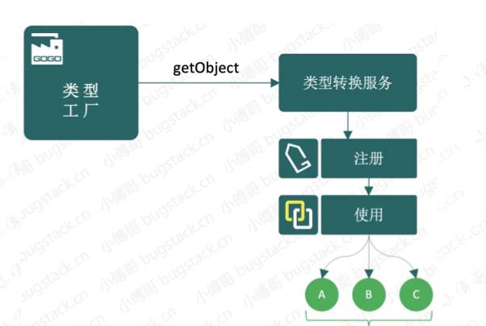

首先从工厂出发，需要实现一个ConversionServiceFactoryBean接口，对类型转换服务进行操作。如果想要实现类型转换，则需要定义Converter转换类型、ConverterRegistry注册类型转换功能。另外，由于类型转换的操作较多，所以需要定义一个类型转换工厂接口ConverterFactory，由各个具体的转换操作来实现。

## 3. 类型转换实现

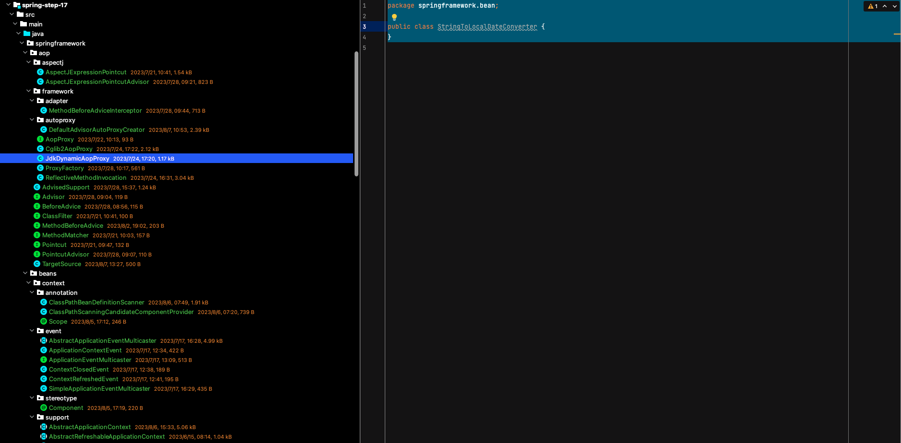

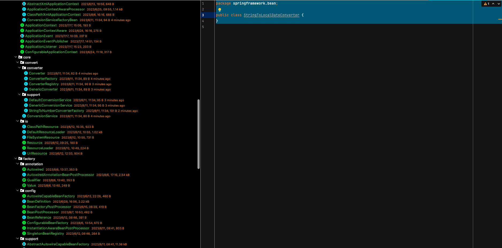

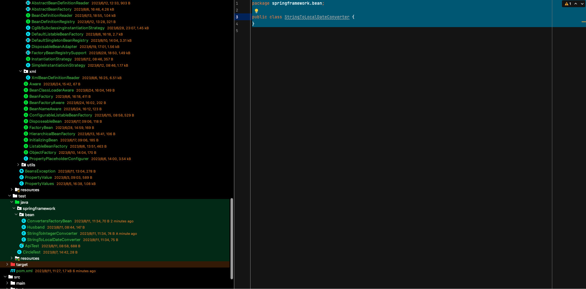

首先，通过添加类型转换接口、类型转换工厂和类型转换的具体操作服务，选择需要被转换的类型，如将字符串类型转换为数值类型。然后通过与Spiring Bean工厂的整合把类型转换服务包装起来，便于配置Bean对象的属性信息applyPropetyValues，在填充属性时可以进行自动类型转换处理。

**定义类型转换接口**

- 类型转换处理接口

```java
public interface Converter<S,T> {
    T convert(S source);
}
```

- 类型转换工厂

```java
public interface ConvertersFactory<S,R> {
    <T extends R> Converter<S,T> getConverter(Class<T> targetType);
}
```

- 类型转换注册接口

```java
public interface ConverterRegistry {
    void addConverter(Converter<?,?> converter);
    void addConverter(GenericConverter converter);
}
```

Converter、ConverterFactory、ConverterRegistry都是用于定义类型转换操作的接口，后续所有的实现都需要围绕这些接口来实现。

**实现类型转换服务**

```java
public class DefaultConversionService extends GenericConversionService {
    public DefaultConversionService(){
        addDeaultConverters(this);
    }
    public static void addDeaultConverters(ConverterRegistry converterRegistry){
        //添加各类的类型转换工厂
        converterRegistry.addConverterFactory((ConverterFactory<?, ?>) new StringToNumberConverterFactory());
    }
}
```

DefaultConversionService是继承GenericConversionService的实现类，而GenericConversionService实现类ConversionService和ConverterRegistry两个接口，以便canConvert进行判断和转换接口convert操作

**创建类型转换工厂**

```java
public class ConversionServiceFactoryBean implements FactoryBean<ConversionService>, InitializingBean {
    private Set<?> converters;
    
    @Nullable
    private DefaultConversionService conversionService;
    
    @Override
    public ConversionService getObject() throws Exception {
        return conversionService;
    }

    @Override
    public Class<?> getObjectType() {
        return null;
    }

    @Override
    public boolean isSingleton() {
        return true;
    }

    @Override
    public void afterPropertiesSet() throws Exception {
        this.conversionService= new DefaultConversionService();
        registerConverters(converters,conversionService);
        
    }
    private void registerConverters(Set<?> converters, ConverterRegistry registry){
        if(converters!=null){
            for (Object converter : converters) {
                if(converter instanceof GenericConverter){
                    registry.addConverter((GenericConverter) converter);
                }else if(converter instanceof Converter<?,?>){
                    registry.addConverter((Converter<?, ?>) converter);
                }else if(converter instanceof ConvertersFactory<?,?>){
                    registry.addConverterFactory((ConverterFactory<?, ?>) converter);
                }else {
                    throw new IllegalArgumentException("Each converter object must implement one of the Converter.ConverterFactory,or GenericConverter interafaces")
                }
            }
        }
    }
    public void setConverters(Set<?> converters){
        this.converters=converters;
    }
}
```

有了FactoryBean得实现，就可以完成工程对象的操作，还可以提供转换对象的服务GenericConversionService，另外，在afterPropertiesSet中调用了注册转换操作的类，这个类最终会被配置到Spring.xml配置文件中，在启动过程中会被加载。

**使用类型转换服务**

```java
//该方法用于给Bean对象填充属性
    protected  void applyPropertyValues(String beanName, Object bean , BeanDefinition beanDefinition){
        try{
            //或的bean的属性集合
            PropertyValues propertyValues = beanDefinition.getPropertyValues();
            for (PropertyValue propertyValue : propertyValues.getPropertyValues()) {
                //取出属性名和属性值
                String name=propertyValue.getName();
                Object value=propertyValue.getValue();
                if(value instanceof BeanReference){
                    //例如A依赖B，获取B的实例化对象
                    BeanReference beanReference=(BeanReference) value;
                    value=getBean(beanReference.getBeanName());
                }else {
                    Class<?> sourceType=value.getClass();
                    Class<?> targetType=(Class<?>) TypeUtil.getFieldType(bean.getClass(),name);
                    ConversionService conversionService=getConversionService();
                    if(conversionService!=null){
                        if(conversionService.canConvert(sourceType,targetType)){
                            value=conversionService.convert(value,targetType);
                        }
                    }
                }
                //属性填充
                BeanUtil.setFieldValue(bean,name,value);
            }
        } catch (Exception | BeansException e) {
            throw new BeanException("Error setting property values："+beanName);
        }
    }
    
```

在AbstractAutowireCapableBeanFactory#applyPropertyValues填充属性的操作中，使用了类型转换的功能。在AutowireAnnotationBeanPostProcessor#postProcessPropertyValues中，也有同样的属性类型转换操作。

## 5. Spring相关源码解析

**Converter**

在Spring框架中，`Converter` 类是用于实现数据类型转换的关键接口之一。它允许开发人员自定义将一个数据类型转换为另一个数据类型的逻辑，从而实现不同数据类型之间的无缝转换，以满足应用程序中的数据处理和传递需求。通过实现和注册自定义的 `Converter`，可以在Spring应用程序中轻松地进行各种数据类型转换，如字符串到数字、实体到DTO、日期格式转换等，从而提高代码的灵活性、可读性和可维护性。

```java
@FunctionalInterface
public interface Converter<S, T> {
	@Nullable
	T convert(S source);
	default <U> Converter<S, U> andThen(Converter<? super T, ? extends U> after) {
		Assert.notNull(after, "After Converter must not be null");
		return (S s) -> {
			T initialResult = convert(s);
			return (initialResult != null ? after.convert(initialResult) : null);
		};
	}

}
```

**ConvertersFactory**

在Spring框架中，`ConverterFactory` 不是核心概念之一，但是可能与一些扩展和第三方库有关。一般情况下，`ConverterFactory` 是一个接口，用于创建类型转换器工厂的实现。类型转换器工厂（`ConverterFactory`）的作用是创建和管理不同类型之间的转换器实例。它可以用于在不同数据类型之间执行自定义的转换逻辑，比如字符串到日期的转换、实体类到DTO的转换等。通过实现 `ConverterFactory` 接口，您可以创建一个可以生产各种类型转换器的工厂，并将其注册到Spring容器中，从而在应用程序中实现自定义的数据类型转换策略。总结而言，`ConverterFactory` 在Spring框架中可能是一个用于创建和配置类型转换器的接口，它可以帮助应用程序满足不同数据类型之间的转换需求。但请注意，这个概念不是Spring核心的一部分，而是可能由一些扩展或自定义组件引入的。

```java
public interface ConverterFactory<S, R> {
	<T extends R> Converter<S, T> getConverter(Class<T> targetType);

}

```

**ConverterRegistry**

`ConverterRegistry` 在Spring框架中充当着类型转换器的注册中心，允许开发人员自定义和注册各种数据类型之间的转换器，从而实现灵活、可定制的数据类型转换策略。通过将转换器注册到`ConverterRegistry`，应用程序可以高效地处理不同类型的数据转换需求，提升代码的可维护性和扩展性，同时实现业务逻辑与数据转换的解耦。

```java
public interface ConverterRegistry {
	void addConverter(Converter<?, ?> converter);
	<S, T> void addConverter(Class<S> sourceType, Class<T> targetType, Converter<? super S, ? extends T> converter);
	void addConverter(GenericConverter converter);
	void addConverterFactory(ConverterFactory<?, ?> factory);
	void removeConvertible(Class<?> sourceType, Class<?> targetType);

}
```

**DefaultConversionService**

`DefaultConversionService` 是Spring框架中默认的类型转换服务实现，用于执行各种数据类型之间的转换操作。它内置了常见类型的转换器，同时也支持自定义转换器的注册，为应用程序提供了方便、灵活的类型转换机制，从而实现数据在不同类型之间的无缝转换，提高了代码的可维护性和可扩展性。

```java
public class DefaultConversionService extends GenericConversionService {

	@Nullable
	private static volatile DefaultConversionService sharedInstance;
	public DefaultConversionService() {
		addDefaultConverters(this);
	}
	public static ConversionService getSharedInstance() {
		DefaultConversionService cs = sharedInstance;
		if (cs == null) {
			synchronized (DefaultConversionService.class) {
				cs = sharedInstance;
				if (cs == null) {
					cs = new DefaultConversionService();
					sharedInstance = cs;
				}
			}
		}
		return cs;
	}
	public static void addDefaultConverters(ConverterRegistry converterRegistry) {
		addScalarConverters(converterRegistry);
		addCollectionConverters(converterRegistry);

		converterRegistry.addConverter(new ByteBufferConverter((ConversionService) converterRegistry));
		converterRegistry.addConverter(new StringToTimeZoneConverter());
		converterRegistry.addConverter(new ZoneIdToTimeZoneConverter());
		converterRegistry.addConverter(new ZonedDateTimeToCalendarConverter());

		converterRegistry.addConverter(new ObjectToObjectConverter());
		converterRegistry.addConverter(new IdToEntityConverter((ConversionService) converterRegistry));
		converterRegistry.addConverter(new FallbackObjectToStringConverter());
		converterRegistry.addConverter(new ObjectToOptionalConverter((ConversionService) converterRegistry));
	}
	public static void addCollectionConverters(ConverterRegistry converterRegistry) {
		ConversionService conversionService = (ConversionService) converterRegistry;

		converterRegistry.addConverter(new ArrayToCollectionConverter(conversionService));
		converterRegistry.addConverter(new CollectionToArrayConverter(conversionService));

		converterRegistry.addConverter(new ArrayToArrayConverter(conversionService));
		converterRegistry.addConverter(new CollectionToCollectionConverter(conversionService));
		converterRegistry.addConverter(new MapToMapConverter(conversionService));

		converterRegistry.addConverter(new ArrayToStringConverter(conversionService));
		converterRegistry.addConverter(new StringToArrayConverter(conversionService));

		converterRegistry.addConverter(new ArrayToObjectConverter(conversionService));
		converterRegistry.addConverter(new ObjectToArrayConverter(conversionService));

		converterRegistry.addConverter(new CollectionToStringConverter(conversionService));
		converterRegistry.addConverter(new StringToCollectionConverter(conversionService));

		converterRegistry.addConverter(new CollectionToObjectConverter(conversionService));
		converterRegistry.addConverter(new ObjectToCollectionConverter(conversionService));

		converterRegistry.addConverter(new StreamConverter(conversionService));
	}

	private static void addScalarConverters(ConverterRegistry converterRegistry) {
		converterRegistry.addConverterFactory(new NumberToNumberConverterFactory());

		converterRegistry.addConverterFactory(new StringToNumberConverterFactory());
		converterRegistry.addConverter(Number.class, String.class, new ObjectToStringConverter());

		converterRegistry.addConverter(new StringToCharacterConverter());
		converterRegistry.addConverter(Character.class, String.class, new ObjectToStringConverter());

		converterRegistry.addConverter(new NumberToCharacterConverter());
		converterRegistry.addConverterFactory(new CharacterToNumberFactory());

		converterRegistry.addConverter(new StringToBooleanConverter());
		converterRegistry.addConverter(Boolean.class, String.class, new ObjectToStringConverter());

		converterRegistry.addConverterFactory(new StringToEnumConverterFactory());
		converterRegistry.addConverter(new EnumToStringConverter((ConversionService) converterRegistry));

		converterRegistry.addConverterFactory(new IntegerToEnumConverterFactory());
		converterRegistry.addConverter(new EnumToIntegerConverter((ConversionService) converterRegistry));

		converterRegistry.addConverter(new StringToLocaleConverter());
		converterRegistry.addConverter(Locale.class, String.class, new ObjectToStringConverter());

		converterRegistry.addConverter(new StringToCharsetConverter());
		converterRegistry.addConverter(Charset.class, String.class, new ObjectToStringConverter());

		converterRegistry.addConverter(new StringToCurrencyConverter());
		converterRegistry.addConverter(Currency.class, String.class, new ObjectToStringConverter());

		converterRegistry.addConverter(new StringToPropertiesConverter());
		converterRegistry.addConverter(new PropertiesToStringConverter());

		converterRegistry.addConverter(new StringToUUIDConverter());
		converterRegistry.addConverter(UUID.class, String.class, new ObjectToStringConverter());
	}

}
```

**ConversionServiceFactoryBean**

```java
public class ConversionServiceFactoryBean implements FactoryBean<ConversionService>, InitializingBean {

	@Nullable
	private Set<?> converters;

	@Nullable
	private GenericConversionService conversionService;


	/**
	 * Configure the set of custom converter objects that should be added:
	 * implementing {@link org.springframework.core.convert.converter.Converter},
	 * {@link org.springframework.core.convert.converter.ConverterFactory},
	 * or {@link org.springframework.core.convert.converter.GenericConverter}.
	 */
	public void setConverters(Set<?> converters) {
		this.converters = converters;
	}

	@Override
	public void afterPropertiesSet() {
		this.conversionService = createConversionService();
		ConversionServiceFactory.registerConverters(this.converters, this.conversionService);
	}

	/**
	 * Create the ConversionService instance returned by this factory bean.
	 * <p>Creates a simple {@link GenericConversionService} instance by default.
	 * Subclasses may override to customize the ConversionService instance that
	 * gets created.
	 */
	protected GenericConversionService createConversionService() {
		return new DefaultConversionService();
	}


	// implementing FactoryBean

	@Override
	@Nullable
	public ConversionService getObject() {
		return this.conversionService;
	}

	@Override
	public Class<? extends ConversionService> getObjectType() {
		return GenericConversionService.class;
	}

	@Override
	public boolean isSingleton() {
		return true;
	}

}
```


